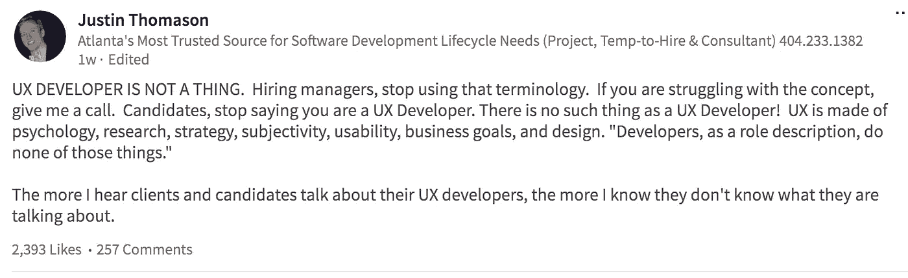

# 你敢阻止 UX 的开发商吗

> 原文：<https://medium.com/hackernoon/dont-you-dare-discourage-developers-from-ux-d1b32fb52cac>

嗨，我是狄龙。我的朋友赖安和我经营着 T2 排名科学。我们销售搜索引擎优化软件，我们正在招聘一个特殊的角色:一名 [UX 开发人员](https://hackernoon.com/tagged/ux-developer)。

最近，我在 LinkedIn 上看到了一个招聘人员解雇 UX 开发人员的金块:

“UX DEVELOPER IS NOT A THING” — A recruiter, 2017

呃，怎么了？如果你允许我花一分钟时间来阐述几个要点:

**1。我们团队中没有人可以不考虑我们的客户。**

我们所有人都在思考心理学、研究、策略、主观性、可用性、商业目标和[设计](https://hackernoon.com/tagged/design)。我们所有人。因为我们都爱我们的客户，我们希望向他们提供巨大的价值和令人愉快的体验。

执行良好的 UX 是一个团队的努力。我们团队中没有一个开发人员会忽视 UX 的担忧，因为“哦，我只是一个开发人员，我不应该考虑 UX。”

**2。我们能够也将会创造新的角色来保持竞争力。**

不可否认，UX 开发者的角色是最近才出现的。但为什么对填补这个看似不寻常的角色嗤之以鼻？以下是一些 5 年前非常少见的角色，尤其是与今天相比:

*   数据科学家
*   技术产品经理
*   内容营销经理
*   现场可靠性工程师

商业环境在不断变化，我们的招聘需求也在不断变化。我们创造新的标题来反映新的时代。所有上述角色，包括 UX 开发人员，都是因为帮助我们保持竞争力而出现的。

你敢阻止 UX 的开发商。

如果你不关心你的客户，那就解雇 UX 开发商吧。如果你不想在今天的软件环境中保持竞争力，那就解雇 UX 的开发者吧。

一些开发者的论点是关于用户周期、跨不同设备的功能、可靠性和安全性、美学和性能。其他开发人员的争论是关于 git 合并与 git rebase 或单元测试。虽然后者偶尔也有可取之处，但我总是对前者更感兴趣。

> [黑客中午](http://bit.ly/Hackernoon)是黑客如何开始他们的下午。我们是 [@AMI](http://bit.ly/atAMIatAMI) 家庭的一员。我们现在[接受投稿](http://bit.ly/hackernoonsubmission)，并乐意[讨论广告&赞助](mailto:partners@amipublications.com)机会。
> 
> 如果你喜欢这个故事，我们推荐你阅读我们的[最新科技故事](http://bit.ly/hackernoonlatestt)和[趋势科技故事](https://hackernoon.com/trending)。直到下一次，不要把世界的现实想当然！

