# Doom3 就是“保持简单”奏效的证明。

> 原文：<https://medium.com/hackernoon/doom3-is-the-proof-that-keep-it-simple-works-3884d2484084>

如果你在网上搜索最好的 C++源代码，Doom3 源代码被提到很多次，还有像这样的评价。

> 我花了一点时间浏览 Doom3 源代码。这可能是我见过的最干净、最漂亮的代码。

《毁灭战士 3》是一款由 [id 软件](http://en.wikipedia.org/wiki/Id_Software)开发，由[动视](http://en.wikipedia.org/wiki/Activision)发行的视频游戏。这款游戏是 id 软件的商业成功；售出了超过 350 万份游戏拷贝。

2011 年 11 月 23 日，id Software 保持了传统，发布了他们之前引擎的[源代码](https://github.com/dhewm/dhewm3)。这份源代码被许多开发者审阅过，下面是 fabien ( [原始来源](http://fabiensanglard.net/doom3_bfg/))反馈的例子:

> 《毁灭战士 3·BFG》是用 C++写的，这是一种如此庞大的语言，它可以用来生成伟大的代码，但也有令人厌恶的东西，会让你的眼睛流血。幸运的是，id 软件满足于一个接近“有类的 C”的 C++子集，它几乎没有阻力地流向大脑:

*   没有例外。
*   没有引用(使用指针)。
*   最少使用模板。
*   到处都是 Const。
*   班级。
*   多态性。
*   遗产。

许多 C++专家不再推荐“带类的 C”方法。然而，Doom3 是在 2000 年到 2004 年之间开发的，这可以解释为什么没有使用现代 C++机制。

让我们使用 [CppDepend](http://www.cppdepend.com/) 深入它的源代码，并发现它的特别之处。

Doom3 使用几个项目进行模块化，下面是它的项目列表，以及关于它们类型的一些统计数据:

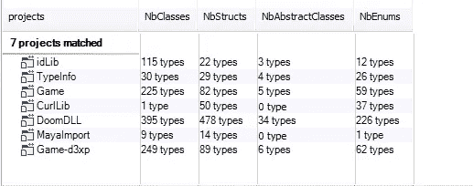

这是显示它们之间关系的依赖关系图:

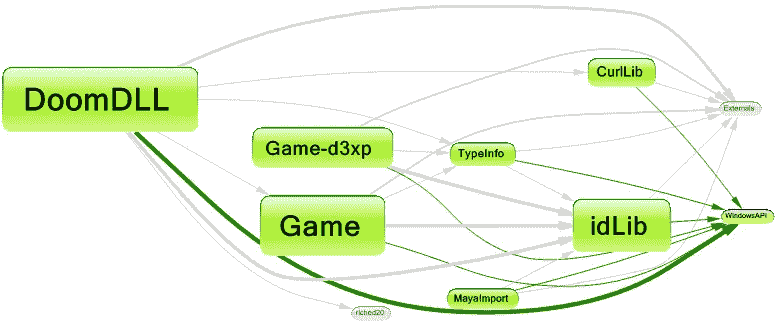

Doom3 定义了许多全局函数。但是，大部分处理都是在类中实现的。

数据模型是使用结构定义的。为了有一个在源代码中使用结构的具体概念，上面的度量视图将它们显示为蓝色矩形。

在 Metric 视图中，代码库通过树形图表示。Treemapping 是一种通过使用嵌套矩形来显示树结构数据的方法。使用的树结构是通常的代码层次结构:

*   项目包含命名空间。
*   命名空间包含类型。
*   类型包含方法和字段。

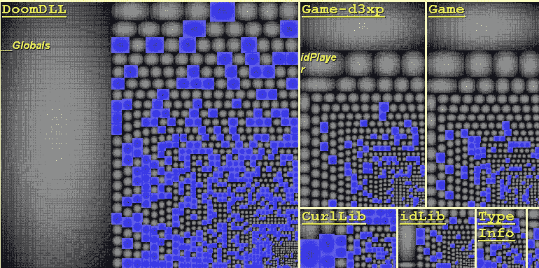

正如我们所观察到的，许多结构都被定义了，例如超过 40%的 DoomDLL 类型都是结构。它们被系统地用于定义数据模型。许多项目都采用这种做法，这种方法在多线程应用程序中有一个很大的缺点。事实上，具有公共字段的结构并不是不可变的。

支持使用不可变对象的一个重要理由是:它极大地简化了并发编程。想一想，为什么编写合适的多线程编程是一项艰巨的任务？因为很难同步线程对资源(对象或其他 OS 资源)的访问。为什么很难同步这些访问？因为很难保证多线程对多个对象进行的多次写访问和读访问之间不会出现争用情况。如果没有更多的写访问呢？换句话说，如果线程访问的对象的状态不变，那会怎样？再也不需要同步了！

让我们搜索至少有一个基类的类:

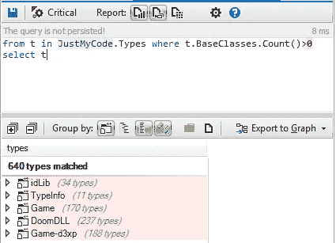

几乎 40%的结构和类都有一个基类。一般来说，在 OOP 中，继承的一个好处是多态性，这里蓝色的是源代码中定义的虚拟方法:

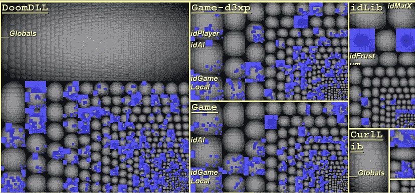

超过 30%的方法是虚拟的。它们中很少是虚拟纯的，下面是定义的所有抽象类的列表:

只有 52 个被定义为抽象类，其中 35 个被定义为纯接口，即它们所有的虚方法都是纯的。

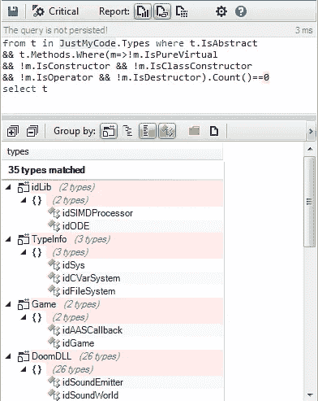

让我们寻找使用 RTTI 的方法

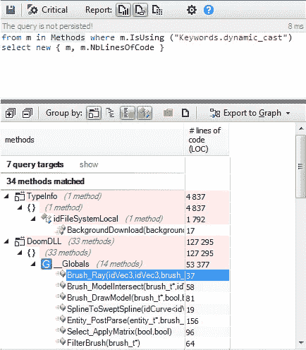

只有极少数方法使用 RTTI。

简单来说，只使用 OOP 的基本概念，不使用高级设计模式，不过度使用接口和抽象类，有限使用 RTTI，数据被定义为结构。

到目前为止，这段代码与许多其他使用“带类的 C”的代码没有什么特别的区别，并受到许多 C++开发人员的批评。

这里是他们的开发者的一些有趣的选择，帮助我们理解它的秘密:

1-提供一个带有有用服务的公共基类。

许多类继承自 idClass:

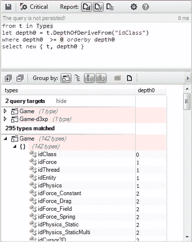

idClass 提供以下服务:

1.  实例创建。
2.  类型信息管理。
3.  事件管理。

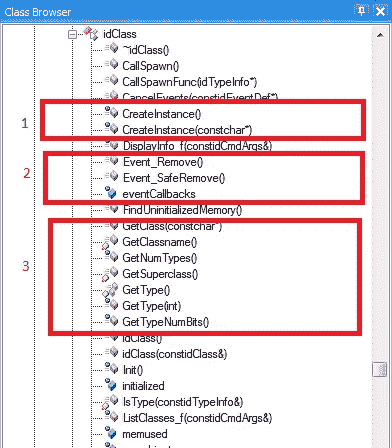

**2-让琴弦操作变得简单**

一般来说，字符串是项目中最常用的类型，许多处理都是使用它们完成的，我们需要函数来操作它们。

Doom3 定义了 idstr 类，它包含了几乎所有操作字符串的有用方法，不需要像其他框架提供的许多 string 类那样定义自己的方法。

**3-源代码与 GUI 框架(MFC)高度解耦**

在许多使用 MFC 的项目中，代码与它们的类型高度耦合，您可以在代码的任何地方找到来自 MFC 的类型。

在 Doom3 中，代码与 MFC 高度解耦，只有 GUI 类与它直接相关。如以下 CQLinq 查询所示:

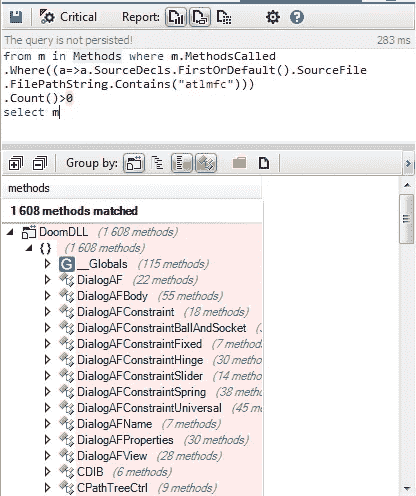

这个选择对生产率有很大的影响。事实上，只有 Gui 开发人员必须关心 MFC 框架，对于其他开发人员来说，在 MFC 上浪费时间并不是强制性的。

4-它提供了一个非常好的实用程序库(idlib)

在几乎所有项目中，最常用的类型是实用程序类，如以下查询的结果所示:

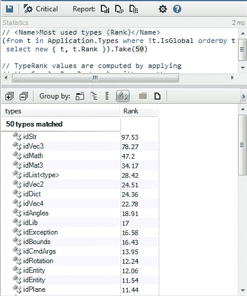

正如我们所观察到的，使用最多的是公用设施。如果 C++开发人员没有为实用程序使用一个好的框架，他们会把大部分开发时间花在与技术层斗争上。

idlib 提供了有用的类，包括处理字符串、容器和内存所需的所有方法。这方便了开发人员的工作，让他们更专注于游戏逻辑。

**5-实现非常容易理解**

Doom3 实现了一个硬编码的编译器，正如 C++开发人员所知，开发解析器和编译器并不是一件容易的事情。然而，Doom3 的实现非常容易理解，它的代码非常简洁。

下面是编译器使用的类的依赖图:

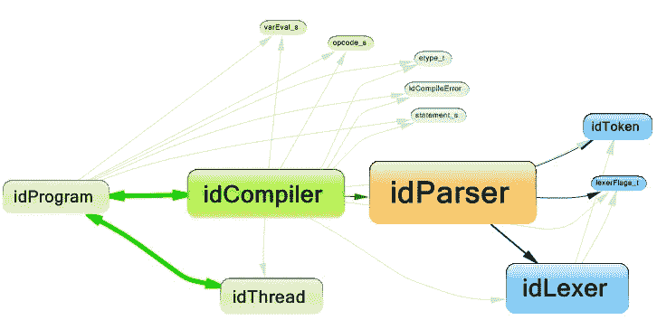

这是编译器源代码中的一段代码:

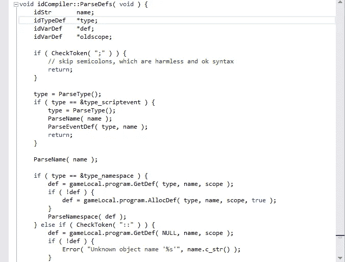

我们已经研究了许多解析器和编译器的源代码。但这是我们第一次发现一个源代码非常容易理解的编译器，对整个 Doom3 源代码都一样。这是魔法。当我们探索 Doom3 源代码时，我们不能说:哇，真漂亮！

**总结**

即使 Doom3 的设计选择非常基本，但它的设计者做出许多决定，让开发者更多地关注游戏逻辑，并促进所有技术层的东西。这大大提高了生产率。

然而，当使用“带类的 C”时，你必须确切地知道你在做什么。你必须像 Doom3 开发者一样成为专家。不建议初学者冒险忽略现代 C++的建议。