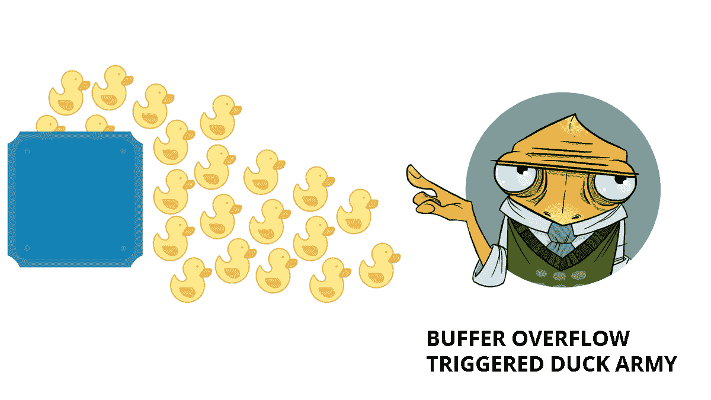
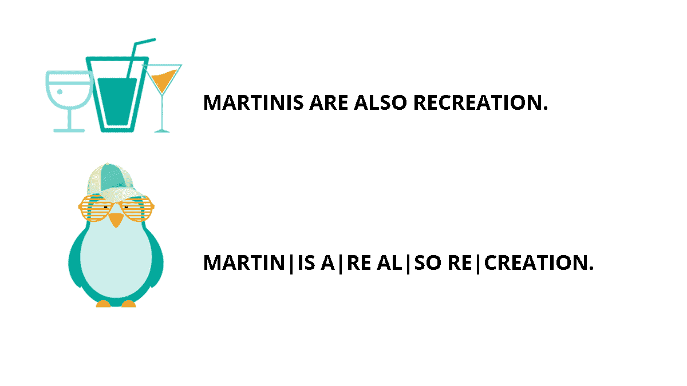

# 编写安全密码的注意事项

> 原文：<https://medium.com/hackernoon/dosanddontsofcryptocode-bd36cf28910a>

对于第一次尝试的人来说，编写加密软件或给应用程序添加加密是一项充满陷阱的任务。对于那些已经在处理密码问题上有经验的人来说，简单的粗心或自信会导致灾难性的结果。

*在本文中，我们整理了一份清单，列出了开发人员在软件中实现加密时最常见或最危险的错误、需要注意的事项以及避免这些错误的措施(最佳加密实践)。其中一些甚至符合每个应用程序都有的更广泛的风险面，而不仅仅是操纵加密材料和敏感数据的应用程序。*

# 处理加密的开发人员会犯的最大错误

这里列出的最常见的错误(我们在[哥萨克实验室](https://www.cossacklabs.com/)持有的观点)与加密过程和加密没有直接联系，但是犯这些错误会使加密变得毫无用处，导致漏洞，使系统被利用，并可能导致故障或 DoS。一点点的专注会有很大的帮助，下面的实践应该作为一个清单，列出在你的软件中不应该做什么，如果你做了会导致什么。

## 缓冲拷贝而不检查输入大小(经典缓冲区溢出)

当你试图塞进比容器所能容纳的更多的数据时，你将会造成混乱。复制不可信的输入而不检查其大小是导致缓冲区溢出的典型错误示例。

缓冲区溢出通常可用于执行任意代码，这通常超出了程序的隐式安全策略的范围。这通常可以用来破坏任何其他安全服务。缓冲区溢出会导致崩溃，并为恶意的外部操作(如 DoS)打开程序或使程序陷入无限循环。

*预防/缓解*:

*   仔细检查缓冲区大小是否符合您指定的大小。
*   在使用接受一定数量字节进行复制的函数(比如 strncpy())时，要记住如果目的缓冲区大小等于源缓冲区大小，就不能空终止字符串；
*   在循环中访问缓冲区时检查缓冲区边界。还要确保您的写入没有超出分配的空间；
*   对于在客户端执行的任何安全检查，确保这些检查在服务器端重复，以避免 [CWE-602](https://cwe.mitre.org/data/definitions/602.html) 。攻击者可以通过在执行检查后修改值或者通过更改客户端以完全删除客户端检查来绕过客户端检查。

## 使用不正确的长度值访问缓冲区

可能导致缓冲区溢出的简单错误及其后果的另一个例子。当软件使用顺序操作来读取或写入缓冲区时，会发生这种情况，但使用了不正确的长度值，导致它访问缓冲区边界之外的内存。当长度值超过目标的大小时，可能会发生缓冲区溢出。

*预防/缓解*:

使用来自**经典缓冲区溢出**漏洞的预防/缓解规则。

## 使用潜在危险的功能

程序员的工具箱里塞满了这种应该小心处理的数字“电动工具”，包括对如何使用它们做出假设的库或 API 函数，如果它们被滥用，就不能保证安全。当潜在的危险函数没有被正确使用时，事情会变得非常混乱。例如，以下功能在使用不当时会变得很危险:

1)使用类似 AES 的分组密码的具有 CBC 模式的[非随机 IV，](https://cwe.mitre.org/data/definitions/329.html)

2)使用[熵不足/小/相同/可预测的 PRNG 种子](https://cwe.mitre.org/data/definitions/331.html)，

3)使用[密码弱 PRNG](https://cwe.mitre.org/data/definitions/338.html) 。

*预防/缓解*:

确定禁止的 API 函数列表，禁止开发人员(或您自己)使用这些函数(有时您必须想出更安全的替代方法)。在某些情况下，可以指示自动代码分析工具或编译器发现被禁止的函数的使用，例如微软 SDL 的[“banned . h”include 文件](https://blogs.microsoft.com/microsoftsecure/2012/08/30/microsofts-free-security-tools-banned-h/)。

## 滚动你自己的密码

开发自己的加密方案，希望让攻击者难以破解，这可能很有诱惑力。然而，这种本土的加密技术对潜在的攻击者来说是一个“受欢迎”的信号。

*预防/缓解*:

选择加密专家批准和推荐的经过严格审查的算法，并选择经过严格测试的实现(源代码应该可供分析)。我们可能有偏见，但建议使用 [Themis](https://github.com/cossacklabs/themis) 进行加密，因为它是一个经过充分测试的模块化 Apache 2 许可开源加密库，目前使用 [OpenSSL](https://www.openssl.org/) 作为其加密原语的来源。

## 错误地计算缓冲区大小

在内存管理是程序员的责任的语言中(比如 C ),犯错误的机会很多。如果缓冲区大小计算不正确，缓冲区可能太小，无法包含程序员想要写入的数据，即使输入经过了正确的验证。任何数量的问题都可能导致不正确的计算，但最终您将一头撞上缓冲区溢出。

*预防/缓解*:

*   如果分配缓冲区是为了转换、转化或编码输入，请确保分配足够的内存来处理最大可能的编码。例如，在一个为 HTML 实体编码将“&”字符转换为“&”的例程中，您将需要一个至少是输入缓冲区 5 倍大的输出缓冲区；
*   请密切注意字节大小差异、精度、有符号/无符号区别、截断、转换和类型之间的转换、“非数字”计算，以及您的语言如何处理对于其底层表示来说过大或过小的数字。记住 32 位、64 位和其他可能影响数字表示的潜在差异；
*   当处理包含大小字段后跟原始数据的结构化传入数据时，请确保识别并解决大小字段和实际数据大小之间的任何不一致。
*   当分配使用 sentinel 标记数据结构结尾的内存时(例如字符串中的空字节)，请确保在计算必须分配的内存总量时也包括 sentinel；
*   在适当的数据类型上使用 sizeof()以避免 [CWE-467](http://cwe.mitre.org/data/definitions/467.html) (“在指针类型上使用 sizeof()的错误”)；
*   仔细检查编译器警告并消除潜在的安全隐患，例如内存操作中的有符号/无符号不匹配或使用未初始化的变量。即使这一弱点很少被利用，一次失败也可能导致整个系统受损。

## 数组索引验证不正确

另一个常见错误是允许产品在计算或使用数组索引时使用不可信的输入。当该产品不验证(或不正确地验证)索引来验证索引是否引用了数组中的有效位置时，会导致令人不快的后果。

*   使用数组边界之外的索引很可能会导致相关内存和指令的损坏，如果值在有效内存区域之外，就会导致崩溃。
*   如果是数据损坏，系统将继续使用不正确的值运行。
*   在数组边界之外使用索引还会触发越界读取或写入操作，或者对错误对象的操作。这可能会导致敏感数据暴露或被修改。
*   如果攻击者能够有效地控制内存，并且能够控制精确的索引，那么即使不使用大量输入，也有可能执行任意代码(就像标准缓冲区溢出一样)。
*   单个故障导致数组索引溢出( [CWE-788](http://cwe.mitre.org/data/definitions/788.html) )或下溢( [CWE-786](http://cwe.mitre.org/data/definitions/786.html) )。后果将取决于越界执行的操作类型，但它们可能会暴露敏感信息、导致系统崩溃或可能导致执行任意代码。

*预防/缓解*:

*   使用输入验证框架，如 Struts 或 OWASP ESAPI 验证 API(即，ESAPI 使您能够使用 ESAPI::get validator()-> getvalid input(…))。如果你使用 Struts，要注意 CWE-101 中的弱点。
*   当调用跨越语言边界的代码(即从解释语言到本机代码)时，在验证所有输入时要特别小心，因为这可能会在这些边界之间产生意外的交互。
*   确保你没有违背你所使用的语言的任何期望。例如，即使 Java 可能不容易受到缓冲区溢出的影响，但在对本机代码的调用中提供大参数仍可能触发溢出。

## 不受控制的格式字符串

所有成功的关系都依赖于清晰的沟通——软件也是如此。格式字符串通常用于发送/接收格式良好的数据。通过控制格式字符串，攻击者可以以意想不到的方式控制输入或输出，有时甚至执行代码。

*预防/缓解*:

*   确保所有格式字符串函数都传递了一个用户无法控制的静态字符串，并且总是向该函数发送适当数量的参数。如果可能的话，在格式字符串中使用不支持%n 运算符的函数。
*   注意编译器和连接器的警告——它们可能会提醒你不正确的用法。

## 整数溢出或回绕

整数不是查克·诺里斯，所以他们有他们的极限。而且机器不能数到无穷大，即使有时感觉它们需要那么长时间来完成一项重要的任务。当程序员忘记计算机不像人一样做数学时，坏事就会发生——这包括从错误的价格计算、无限循环到崩溃等任何事情。

*预防/缓解*:

*   对任何数字输入执行输入验证，确保它在预期的范围内。
*   实施规则，确保输入满足预期范围的最小和最大要求。
*   尽可能使用无符号整数。这使得对整数溢出进行完整性检查变得更加容易。如果您绝对必须使用有符号整数，请确保您的范围检查包括最小值和最大值。
*   缓冲区大小错误计算的预防/缓解规则也适用于此。

## 忽略编译器警告

在数百名贡献者的帮助下，流行的编译器已经开发了几十年(即 [gcc](https://gcc.gnu.org/) 的第一次发布可以追溯到 1987 年 3 月)。这意味着在大多数情况下，安全问题可以通过编译器警告来捕获。但是他们经常被忽视。

*预防/缓解*:

*   使用编译器可用的最高警告级别编译代码，并通过修改代码来消除警告。
*   使用静态和动态分析工具来检测和消除额外的安全缺陷。

# 要遵循的常识性加密实践

本文的前一章介绍了与加密无关的错误，这些错误会使代码容易受到各种攻击，从而使代码中的任何进一步加密变得无用。本章涵盖了在您的代码中正确和安全地实现加密工具和方法的最佳通用实践。

## 避免使用密码作为加密密钥

使用密码作为加密密钥使得它们极易受到[密钥搜索攻击](https://en.wikipedia.org/wiki/Key-recovery_attack)。大多数用户选择的密码缺乏足够的熵来抵御这种攻击。

**解决方案:**使用真正随机的加密/解密密钥，而不是根据密码/口令确定生成的密钥。我们推荐使用 PBKDF2(我们在 [Themis](https://www.cossacklabs.com/themis/) 中包含了它),它使用迭代散列(沿着 H(H(H(…)的路线)。h(密码)…))))来减慢字典搜索的速度。

使用足够多的迭代次数，使这个过程花费 100 毫秒，在用户的机器上生成密钥。

## 在哈希之前连接多个字符串时要小心；请使用每个字符串的哈希的组合

串联使得两个字符串之间的空格指示不明确。例如:

内置| |安全=内置| |不安全

车| |技能=车| |杀

换句话说，散列 H(S||T)并不唯一地标识字符串 S 和 T。因此，攻击者可能能够在不改变散列的情况下改变两个字符串之间的划分。

例如，如果 Alice 想要发送两个字符串“builtin”和“securely ”,攻击者可以将它们更改为字符串“built”和“insecurely ”,而不会使哈希无效。当将数字签名或消息认证码应用于字符串连接时，也会出现类似的问题。

不要使用简单的连接，而要使用可明确解码的编码。例如，不计算 H(S||T)，而是计算 H(length(S)||S||T)，其中 length(S)是一个 32 位值，以字节表示 S 的长度。另一种解决方案是使用 H(H(S)||H(T))，甚至 H(H(S)||T)。

## 尽量避免在不同的操作中使用相同的密钥(如加密、认证、签名等)。)

将一个密钥用于多种目的可能会导致各种微妙的攻击。选择一个单一用途的钥匙，并把它只用于一个目的。如果您需要执行这两个功能，请生成两个密钥对，一个用于签名，一个用于加密/解密。类似地，对于对称加密，您应该使用一个密钥进行加密，另一个独立的密钥进行消息身份验证。不要为了两个目的重复使用同一个密钥。

## 不要复制私钥，不要以纯文本的形式存储它们，也不要在你的软件产品中硬编码它们

使用我们的 [Themis GitHub Wiki](https://github.com/cossacklabs/themis/wiki/Key-management) 中描述的关键管理原则和指南。

## 保留全面的日志和审计跟踪

分布式体系结构的每个组件中的大量审计日志记录是密钥管理的重要部分。对敏感数据的每次访问都必须记录有关功能、用户(个人或应用程序)、使用的加密资源、访问的数据以及访问时间的详细信息。

## 遵循常识性的非加密数据安全规则和最佳实践，防止未经授权访问您的设备上的敏感数据

这一点非常重要，即使它离开了严格的密码平面。我们要重申的是，使用强加密技术确实可以保证安全，抵御所有已知的理论攻击，但它不能保证复杂计算机系统的高度安全，抵御现实世界中所有可能的威胁。

关于非加密数据安全规则的其他教育和有趣的阅读，也可以参见我们的[关于非加密安全实践的媒体文章](/@cossacklabs/before-you-resort-to-a-foil-hat-bcfa5ae783ea)。

这是我们对这个问题的看法。如果您有什么要补充的，以扩大错误或最佳实践的清单，请通过[*@ CossackLabs*](https://twitter.com/cossacklabs)*或* [*电子邮件*](mailto:info@cossacklabs.com) *联系我们。*