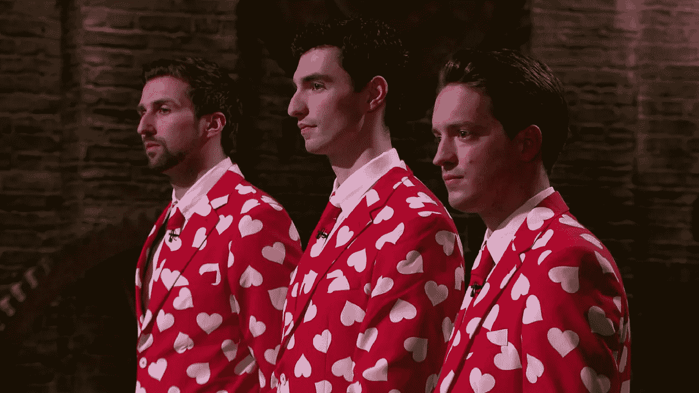

# 双:从破产到龙穴超级巨星

> 原文：<https://medium.com/hackernoon/double-from-broke-to-dragons-den-superstars-339693c90c9d>

## 校友系列

2015 年 1 月至 3 月，我们在伦敦开展了第二个创业孵化器项目。

团队之一 Double 是我们校友系列的第一个，在这里我们可以找到那些已经通过我们孵化器项目的创业公司。

创始人 Gary MacDonough、Ben Greenock 和 Loren Gould 参加了 BBC Dragons Den，在那里他们召集了一个投资者小组，以继续并加速他们的双人约会应用 double 的发展。

> “当我们去拍摄《龙穴》的时候，我们的银行账户上只有 236 英镑，还欠了大约 7000 英镑，”联合创始人加里说我们也不拿薪水，所以生活变得相当困难。很长一段时间，本甚至以真正的哈利波特风格住在我的楼梯下！"

我们采访了他们，讨论他们的背景故事，他们在梦魇、龙穴和下一步的时间！

**创始团队在开始 Double 之前是什么背景？**

加里总是为自己做各种各样的事情。他于 2014 年 9 月开始全职工作。

本在苏格兰的一家美容公司工作，一月份他辞掉了工作，开始全职工作。他搬到伦敦，在加里的楼梯下住了 6 个月。

Loren 曾在 M&C 盛世工作，并于 5 月份辞职(他有 3 个月的通知期)。我们去龙穴的前一天，他辞职了。

**什么是双？**

Double 是一个基于位置的约会应用程序，用于双人约会。你和一个朋友签约，然后和附近的其他人配对。

**灵感是什么？**

我们的朋友经常使用 Tinder，但从未真正约会过。一天晚上，我的朋友艾米找到了一个帅哥，兴奋地和他聊了起来。当我问她是否愿意和他见面时，她惊呼这会“太尴尬，而且可能不安全”。她转向我的另一个在场的朋友萨拉说:“要是你也能来就好了！”那是一个灵光乍现的时刻。

我记得第一次见到这个团队，从一开始就很明显他们是多么的有进取心。在翻倍之前，这三位创始人曾有过一次出售难看的圣诞套衫的冒险经历。他们用从那次冒险中赚来的 3 万英镑投资于不那么季节性的东西。

自从《梦魇 2》以来，你的主要成就是什么？

*   发布 Android 应用的精简版。
*   在爱丁堡开设第二个办事处。
*   邀请 Bebo 的创始人 Michael Birch 作为投资者和顾问。
*   从应用程序中获得双重约会！

**你在 IncuBus class 2 上最有用的时光是什么？**

伦敦科技界的介绍和交流。因为我们刚搬到伦敦，不认识任何人，这是非常有价值的。例如，龙穴的机会可以追溯到在 IncuBus 主办的[硅酒约](http://3-beards.com/silicondrinkabout/london)的会议。

**迄今为止，你遇到的最大挑战是什么？**

寻找技术合作创始人…如果你听说了谁，请告诉我们:)

**你打算怎么找到那个人？**

更多的社交和参加活动。迄今为止认识你们的最好方式。听起来显而易见，但事实如此。

龙穴体验是什么样的？

球场本身当然不是我们做过的最难的。我们准备和练习了很多。我们还有来自[metaspech](http://www.metaspeech.com/)的专业投球建议(强烈推荐)。

最困难的部分是不得不在早上 6 点到达现场，然后不知道我们什么时候开始投球…最后我们等了 12 个小时，我们的投球持续了 2 个小时！到最后我的腿都没感觉了哈哈。

那个机会是怎么来的？

我们在卡姆登的 IncuBus 主办的 Silicon Drinkabout 上遇到了一个叫 Michael Raven 的人，他把我们介绍给了 BBC。巧合的是，几天前我妈妈鼓励我申请……我填了申请表，但从未真正提交，但当机会出现时，我们已经准备好了。

你可以在下面观看他们穿着他们的爱情套装投掷龙。你会看到三人组出价 75，000 英镑，获得了这家初创公司 15%的股份(谈判价格从 20%下调到了 15%)。在拒绝了 dragons Deborah Meaden 和 Touker Souleyman 的邀请后，他们接受了 Nick Jenkins 的邀请。

**现在你已经成功地在龙穴筹集了资金，资金将会流向哪里？**

*   改进 iOS 和 Android 版本。
*   引入货币化功能。
*   在纽约发布！！！

Bebo 创始人兼 Double 投资人迈克尔·伯奇说:

> “双家伙有一个了不起的团队和伟大的产品执行。和他们一起工作也很有趣！”

Double 可以从[苹果应用商店& Google Play](http://dblapp.co/download) 下载

欲了解更多关于 Double 的信息，请访问:[www.joindouble.com](http://www.joindouble.com/)

*帖子最初出现在* [*砧木伦敦博客*](http://www.incubuslondon.com/blog/2015/12/27/double-alumni-series) *上，是我们校友系列*的一部分

> [黑客中午](http://bit.ly/Hackernoon)是黑客如何开始他们的下午。我们是 [@AMI](http://bit.ly/atAMIatAMI) 家庭的一员。我们现在[接受投稿](http://bit.ly/hackernoonsubmission)，并乐意[讨论广告&赞助](mailto:partners@amipublications.com)机会。
> 
> 如果你喜欢这个故事，我们推荐你阅读我们的[最新科技故事](http://bit.ly/hackernoonlatestt)和[趋势科技故事](https://hackernoon.com/trending)。直到下一次，不要把世界的现实想当然！

