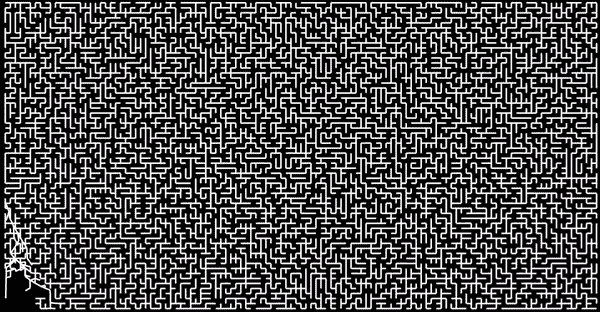

# 🔮🐰甜甜圈经济学；算法和管理；面部毛发&可怕的产品++ 109

> 原文：<https://medium.com/hackernoon/doughnut-economics-algorithms-management-decentralisation-robot-wars-burger-king-facial-62efdd99fba7>

🚀第 109 期 ***指数视图*** 。[每周注册领取。](http://azeem.io/s)

抛弃物理学的 21 世纪经济学；亚马逊的领导地位。剑桥分析；算法管理和体面的失败；AVs 和保险困境；优步损失；电力市场天翻地覆；人心长在菠菜叶上；水在沸点时凝固。

# 近期发展部

💭杰夫·贝索斯致亚马逊股东的[信。](https://www.sec.gov/Archives/edgar/data/1018724/000119312517120198/d373368dex991.htm)“第二天是停滞期。其次是不相关。随之而来的是极度痛苦的衰落。其次是死亡。这就是为什么它总是第一天。”**引人注目**

🔫布莱恩·伯格斯坦认为，我们需要脸书的替代品。HBR 的 Shakya Christa kis 认为:“[使用脸书教与整体幸福感呈负相关。)](https://hbr.org/2017/04/a-new-more-rigorous-study-confirms-the-more-you-use-facebook-the-worse-you-feel)

[🍩凯特·拉沃斯谈甜甜圈经济学。传统经济学建立在一个谬误的基础上，这是这种虚假物理学最有害的遗产。相反，我们需要动态的系统方法。**优秀**(参见 EV#19 关于](https://www.theguardian.com/global-development-professionals-network/2017/apr/06/kate-raworth-doughnut-economics-new-economics)[生物启发经济学](https://www.getrevue.co/profile/azeem/issues/unethical-advertising-building-serendipity-bioeconomics-fun-with-deep-learning-issue-19-4838))。)

📣EV reader，Fred Wilson: [我们需要更加分散的、自我组织的系统。](http://avc.com/2017/04/decentralized-self-organizing-systems/)

[🖇️为什么人们可能更喜欢不平等的社会。“人们厌恶不公平[这往往]导致他们喜欢不平等的分配。(我们)不应关注(财富分配)是否被视为公平。”**有趣的**(长篇学术论文。)](https://www.nature.com/articles/s41562-017-0082)

🚨奔驰[承诺自动驾驶出租车](https://www.wired.com/2017/04/mercedes-promises-self-driving-taxis-just-three-years/?utm_campaign=Weekly%20Newsletters&utm_source=hs_email&utm_medium=email&utm_content=50359526&_hsenc=p2ANqtz-8UiQXhZWT-vnJDsSltI4cUihD4RzcGDzJBNTOr9uaVLnzksuzm3xdR8Bm2oy_pYMtjlQwOTKj--JIFodzfjEOs2KwIXw&_hsmi=50359526)但是谁来为[自动驾驶汽车](http://www.npr.org/sections/alltechconsidered/2017/04/03/522222975/self-driving-cars-raise-questions-about-who-carries-insurance?utm_medium=RSS&utm_campaign=alltechconsidered&utm_campaign=Weekly%20Newsletters&utm_source=hs_email&utm_medium=email&utm_content=50359526&_hsenc=p2ANqtz-9ZPW32CSOgs0KhjwWuRfQRzuxXTr0dOvcsh55nF4CTWdUzkdUw0T5fFOmK-s0qvIVu8budWl9BmLB8uoBueVLoS1cDmQ&_hsmi=50359526)上保险？特斯拉[已经将保险作为汽车购买价格的一个选项](https://www.thezebra.com/insurance-news/4098/tesla-opting-insure-cars/)。

🗳️·保罗-奥利维耶·德哈伊关于剑桥分析、个人数据和竞选活动的[报告是**必读的**。](https://docs.google.com/presentation/d/1k2Z1S_dglicLvQ6xCPErlv6AxWohm0TiiGwPCsQoe1Y/mobilepresent?slide=id.p)

# 算法管理系

联合航空公司故事中的一个元素引起了我的兴趣:公司如何开始如此严重地依赖流程，以至于它成为消除员工判断力、常识或善良的借口。我们知道，在最近的事件中，联合航空公司没有严格遵循其流程，但该事件表明了流程削弱体面的根本问题。这是算法管理风险的一个小例子。

[约翰·罗布在这篇](http://globalguerrillas.typepad.com/globalguerrillas/2017/04/algorithmic-dystopia.html) **出色的**文章中总结道:

> 整个过程是不可避免的。这也不是唯一的情况。随着算法和权威主义的发展，我们将在未来看到更多这样的事情

对此，我要补充的是，虽然乘客的待遇在内心产生了共鸣，但作为消费者和公民，我们都受到黑箱程序(也就是算法)的支配。当我们与企业和政府打交道，并通过决策树得到反馈时。处理保险索赔时。当我们被远程护士分类时。当我们投诉的时候。这些通常是僵化的黑箱系统。

在许多情况下，操作这些过程的人的判断力有限。多年来，在优化或标准化的名义下，这种自由裁量权已经被削弱了。在许多情况下，这一过程为我们带来了效率、更少的错误和更高的质量。

但在某些情况下(尤其是对于准垄断者)，这是一种不可救药的僵化和不透明的暗箱文化。在许多行业中，人们已经脱离了圈子，只是简单地按照剧本行事。我们都听说过代理人说“系统不允许我这么做。”

自动化系统会让这变得更普遍还是更不普遍？令人欣慰的是，它们可能没有目前的工艺那么脆弱。机器学习系统可以从经验中快速学习，最终比“一次设计，永远实现”的过程手册更有效地优化。如果机器显示可怕的结果，人类监督者可能有权力推翻这种真正的自动化系统。

风险是相反的情况会发生，因为公司会方便地实施设计不良的产品，对消费者几乎没有补偿或商业影响。

丹汉有一个有趣的推特风暴，展示了这场管理灾难。

我很乐意通过推特听到你对这个[的想法。](https://twitter.com/intent/tweet?button_hashtag=EV109) ( [使用标签#ev109](https://twitter.com/intent/tweet?button_hashtag=EV109) 。)

其他地方:

*   恩里克·丹斯(Enrique Dans):未来就是这样:不断发展的更好的技术能够帮助人们与它们一起工作。
*   采访一名美国研究生，他整个夏天都在中国工厂制造 iPhones。**引人入胜。**(分工好像完善了。#邪恶的咯咯声。)
*   美国工厂里的机器人大战。
*   我们需要新的经济工具来衡量自动化对经济的影响。(尽管作者在这篇文章中提到了计量经济学的成功，复杂性经济学家和系统思想家可能会对此提出质疑。请参阅本时事通讯顶部的“甜甜圈经济学”。)

# 人工智能系

尽情享受自动完成绘图的乐趣[谷歌自动绘图](https://aiexperiments.withgoogle.com/autodraw)。(参见使用机器学习完成面部图像的[迈尔斯·布伦戴奇](https://twitter.com/Miles_Brundage/status/852702824383352832)。)

威尔·奈特讲述了让人工智能变得可解释的[挑战，以及我们在这方面取得的进展](https://www.technologyreview.com/s/604087/the-dark-secret-at-the-heart-of-ai/)。**优秀阅读**

[神经网络变得简单。](https://techcrunch.com/2017/04/13/neural-networks-made-easy/)好听，非技术介绍。

[决斗神经网络](https://www.wired.com/2017/04/googles-dueling-neural-networks-spar-get-smarter-no-humans-required/)的简单有趣的历史。

内特·苏亚雷斯谈[确保比人类聪明的智力有积极的结果](https://intelligence.org/2017/04/12/ensuring/)。(长读。)

[AI 从文本中学习性别偏见。](http://spectrum.ieee.org/tech-talk/robotics/artificial-intelligence/ai-learns-gender-and-racial-biases-from-language)我们已经在 EV 中多次强调了这一风险。点击阅读[原创研究。](http://science.sciencemag.org/content/356/6334/183)

人工智能加速器和孵化器项目概述。

# 在晚宴上显得聪明的小点心

⛑优步:200 亿美元的销售额亏损 28 亿美元，会计挑战依然存在。 (Airbnb [已与 250 个美国司法管辖区](https://www.airbnbcitizen.com/airbnb-tax-facts/)达成税务协议。)

苹果和谷歌如何瞄准糖尿病和癌症。

[长在菠菜叶子上的人心](http://www.kurzweilai.net/scientists-grow-heart-tissue-on-spinach-leaves)。(感谢儿子找到这个。)

🗑你是 Trump 桌游、Coca-Cola BlāK 或 Peek 的粉丝吗？它们被陈列在失败博物馆里。

神经科学家正在[重新思考记忆的规则](https://www.sciencedaily.com/releases/2017/04/170406143936.htm)。

[108 年大学毕业的](https://www.reddit.com/r/dataisbeautiful/comments/64q73v/university_graduate_facial_hair_styles_18982008_oc/)面部发型。👨‍🎓胡须，ahoy。

🌞太阳能和风能现在是全球最便宜的能源。

男法官打断女法官的频率是他们打断对方的三倍。

🍼婴儿[甚至在六个月大的时候就表现出种族偏见](https://scienmag.com/infants-show-racial-bias-toward-members-of-own-race-and-against-those-of-other-races/)。

对多样性的恐惧让更多的人投票给特朗普。

指数基金在 92%的情况下击败了主动经理。

[💧🔥科学家使水在沸点凝固](http://bigthink.com/scotty-hendricks/ice-when-there-should-be-fire)。

# 🚀第 109 期 ***指数视图*** 。每周注册领取。

> [黑客中午](http://bit.ly/Hackernoon)是黑客如何开始他们的下午。我们是这个家庭的一员。我们现在[接受投稿](http://bit.ly/hackernoonsubmission)并乐意[讨论广告&赞助](mailto:partners@amipublications.com)机会。
> 
> 如果你喜欢这个故事，我们推荐你阅读我们的[最新科技故事](http://bit.ly/hackernoonlatestt)和[趋势科技故事](https://hackernoon.com/trending)。直到下一次，不要把世界的现实想当然！

