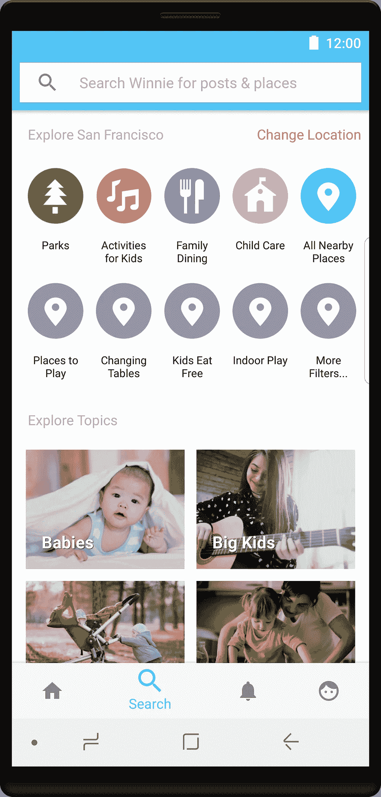
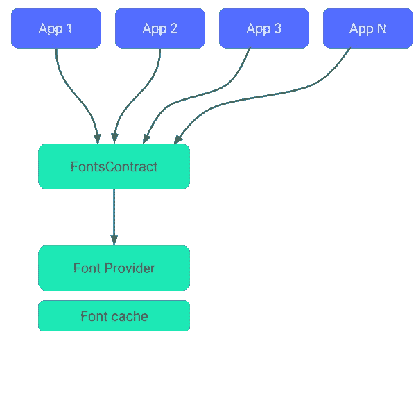
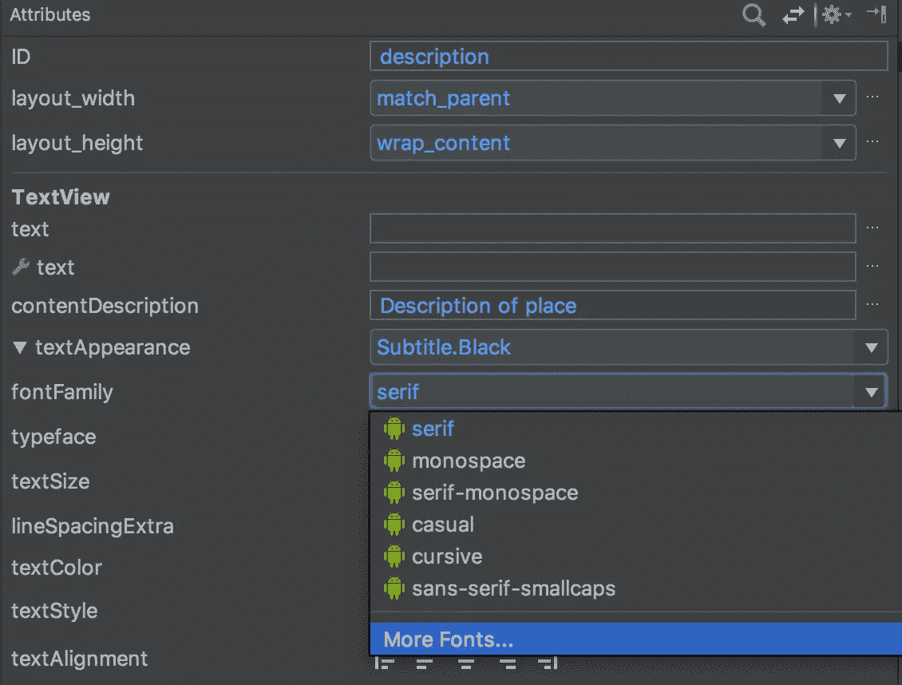

# Android 可下载字体

> 原文：<https://medium.com/hackernoon/downloadable-fonts-for-android-2041235f91e6>

## **使用支持库探索可下载字体& Android Studio**

我最近很高兴地使用了新支持的[可下载字体](https://developer.android.com/guide/topics/ui/look-and-feel/downloadable-fonts.html)功能，这是在 [Android](https://hackernoon.com/tagged/android) Oreo 中引入的，当时我将 [Winnie 的](https://winnie.com)字体从 Roboto 改为 Lato。

随着 XML 中的[字体，支持库 26 引入了对可下载字体的支持，向后兼容到 API 14。历史上，使用自定义字体通常需要使用第三方库，所以很高兴看到 Android 框架本身提供了更多支持。](https://developer.android.com/guide/topics/ui/look-and-feel/fonts-in-xml.html#using-support-lib)



Roboto to the left, Lato to the right.

# **什么是可下载字体，为什么使用它？**

可下载字体允许应用程序从字体提供商应用程序请求字体，而不是将字体文件包含在 apk 中或自己下载。字体提供商应用程序检索字体并将其缓存在本地，以便其他应用程序可以请求和共享字体。多酷啊！



Image credit: [https://developer.android.com/guide/topics/ui/look-and-feel/downloadable-fonts.html](https://developer.android.com/guide/topics/ui/look-and-feel/downloadable-fonts.html)

Google Play 服务(在版本 11 以上的设备上)就是一个这样的字体提供者，我用它作为 Lato 的[谷歌字体](https://fonts.google.com/)。如果您要使用 Google Play 服务中没有的自定义字体，目前还没有关于如何实现您自己的字体提供程序的文档，但是您可以使用 XML 字体，这仍然比以前有所改进！

如上图所示，使用可下载字体的应用程序使用[Font contract](https://developer.android.com/reference/android/provider/FontsContract.html)API 发出 [FontRequest](https://developer.android.com/reference/android/support/v4/provider/FontRequest.html) ，该 API 从字体提供商处检索[字样](https://hackernoon.com/tagged/typeface)。如果字体缓存中已经存在字体，则字体提供商不需要下载字体。

如果通过 XML 使用可下载的字体，开发人员不需要直接使用这些 API，这将在下一节详细介绍。

**使用可下载字体的优势:**

*   缩小 APK 大小——这会显著影响您的应用程序安装[！](/googleplaydev/shrinking-apks-growing-installs-5d3fcba23ce2)
*   由于应用程序可以共享来自同一提供商的字体，这导致宝贵的内存、磁盘空间和蜂窝数据的使用量减少。你能猜出现在你手机里有多少 Roboto 字体文件吗？🙀(是的，有些应用程序的 apk 中有这些内容)。

# 太好了，我们开始吧！

在你的应用中实现可下载字体有三种方式——使用 Android Studio 和 Google Play 服务，以编程方式或通过支持库**。**我使用 Android Studio 生成所需的文件，并使用支持库中的 Fonts in XML 特性来应用下载的字体。

我决定通过 XML 来实现，因为这样你就可以在你的应用清单文件中声明所需的字体，这允许框架提前**下载它们**。如果以编程方式进行，您只能在应用程序启动后请求字体，这可能会导致首次布局时间延迟。此外，通过 XML 做起来工作量更少！

1.如果你想使用 Android Studio 来生成所需的文件，那么你需要 3.0+版本。将以下内容(版本 26 以上)添加到您的模块的 build.gradle 中:

```
implementation "com.android.support:support-compat:27.0.2"
```

2.在应用程序中选择要应用字体的文本视图，然后单击图形布局中属性下的 fontFamily 属性。



选择底部的“更多字体…”将打开下面的对话框。


3.确保选择了“创建可下载字体”。这会导致下载三个文件— lato.xml、font_certs.xml 和 preloaded_fonts.xml。

**lato.xml** 

```
<?xml version="1.0" encoding="utf-8"?>
<font-family xmlns:app="http://schemas.android.com/apk/res-auto"
        app:fontProviderAuthority="com.google.android.gms.fonts"
        app:fontProviderPackage="com.google.android.gms"
        app:fontProviderQuery="Lato"
        app:fontProviderCerts="@array/com_google_android_gms_fonts_certs">
</font-family>
```

**font_certs.xml** 系统使用这些证书来验证字体提供者的身份，以避免从未知来源获取字体。如果使用上面的步骤，Android Studio 应该已经在下面的 font_certs.xml 中为 dev 和 prod 自动生成了字符串证书。

```
<?xml version="1.0" encoding="utf-8"?>
<resources>
    <array name="com_google_android_gms_fonts_certs">
        <item>@array/com_google_android_gms_fonts_certs_dev</item>
        <item>@array/com_google_android_gms_fonts_certs_prod</item>
    </array>
    <string-array name="com_google_android_gms_fonts_certs_dev">
        <item>
         <!-- string cert -->
        </item>
    </string-array>
    <string-array name="com_google_android_gms_fonts_certs_prod">
        <item>
         <!-- string cert-->   
        </item>
    </string-array>
</resources>
```

**preloaded-fonts.xml** 

```
<?xml version="1.0" encoding="utf-8"?>
<resources>
    <array name="preloaded_fonts" translatable="false">
        <item>@font/lato</item>
        <item>@font/lato_bold</item>
    </array>
</resources>
```

4.确保将这一行添加到应用程序的清单文件中，Android Studio 应该已经自动完成了:

```
<meta-data
    android:name="preloaded_fonts"
    android:resource="@array/preloaded_fonts"/>
```

**5。太好了，现在您可以在 XML 中应用字体了！**

```
<style name="AppTheme" parent="Theme.AppCompat.Light.NoActionBar">
    <item name="colorPrimary">@color/colorPrimary</item>
    ....
    **<item name="android:fontFamily">@font/lato</item>**
</style>
```

我所要做的就是在应用程序的主题中设置**字体系列，让整个应用程序的文本视图变为 Lato，包括粗体或斜体部分。但是，如果您想要配置权重，可以按照相同的步骤使用 Android Studio 获得 Lato Bold，并在 lato_bold.xml 中手动更改权重，然后可以在 xml 布局中应用该权重:**

```
app:fontProviderQuery="name=Lato&amp;weight=700" //can modify the weight here
```

整件事感觉像魔术一样！但是…

# 逮到你了

当使用支持库 26 时，我注意到整个应用程序的工具栏仍然在 Roboto 中，导致了一个可怕的 Roboto-Lato 组合！即使在 XML 中显式设置工具栏的 fontFamily 也不起作用。这是因为工具栏[不像 TextView 那样实现 fontFamily 属性](/google-design/the-android-developers-guide-to-better-typography-97e11bb0e261)。

将字体系列包含在 XML 样式中，并将其设置为工具栏的应用程序:titleTextAppearance 成功了——工具栏标题现在是 Lato！好消息是，这似乎是 [**在支持库 27**](https://issuetracker.google.com/issues/68308866) 中修复的，所以应该不需要这个变通办法。

还有几个地方没有应用 Lato 一个是我使用粗体样式动态创建文本视图，另一个是底部导航视图，我使用了第三方库。我最初认为这可以达到目的:

```
val typeface = ResourcesCompat.*getFont*(this, R.font.*lato*)//for the third-party bottom navigation view
bottomNavigationView.setDefaultTypeface(typeface)//for the bolded text view
textView.setTypeface(textView.getTypeface(), Typeface.*BOLD*)
```

我使用了[resources compat . get font()](https://developer.android.com/reference/android/support/v4/content/res/ResourcesCompat.html#getFont(android.content.Context, int))方法来加载字体并在两个视图上设置它，瞧，再也没有 Roboto 了！然而，在使用这种方法为底部导航设置字体时，我看到了一个 **ResourcesNotFound 异常**。

本质上，如果在调用该方法时字体还没有加载，或者用户没有所需版本的 Google Play 服务，就会抛出这个异常。如果无法通过 XML 设置样式，避免这种情况的最安全方法是以编程方式加载字体。[这里的](https://developer.android.com/guide/topics/ui/look-and-feel/downloadable-fonts.html#via-support-lib)是关于如何做的官方文档。

在 27.0.2 中还有 [**这个崩溃**](https://issuetracker.google.com/issues/69085400) 与**fontscontractcompt，它已经在支持库的未来版本中得到修复，在 26.1.0 中似乎不是问题**

**值得注意的其他要求和限制:**

*   **你的 compileSDK 至少应该是 SDK 26，如果要用 Android Studio 生成字体文件，应该是**3.0 版+** 。如果以编程方式或使用 XML 中的字体来应用可下载的字体，则必须至少使用 Support Library 26。**
*   **使用 Google Play 服务作为字体提供者可以在安装了**版本 11** 及更高版本的设备上工作，否则它将使用默认的系统字体。**
*   **如前所述，如果您使用的是 Google Play 服务中没有的自定义字体，您可能无法使用可下载的字体。在这种情况下，你可能不得不**编写你自己的自定义 FontProvider** ，它还没有文档。**

**我(惊讶地)喜欢将我们的[应用](https://winnie.com/android)从 Roboto 转换到 Lato，这要感谢 XML 字体&可下载字体，希望你也喜欢这些功能！我很乐意在评论中或者在[推特](https://twitter.com/anitas3791)上听到你的声音，别忘了👏帖子:)。**