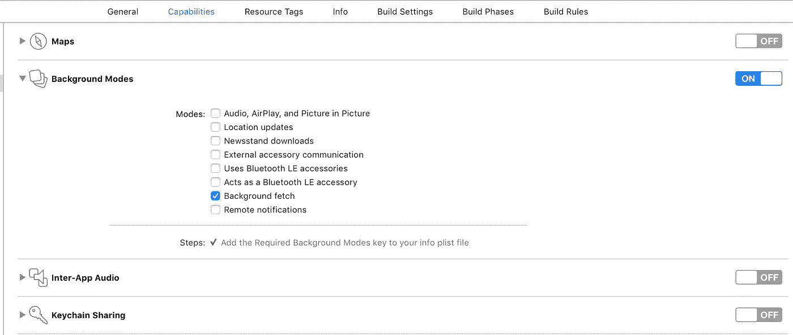

# 下载 iOS 用户界面

> 原文：<https://medium.com/hackernoon/downloading-an-ios-layout-a9b0ede80809>

这篇文章的目的是展示如何用基本代码更新或完全重新设计一个 iOS UI，而不需要提交你的应用程序进行审核。

在这个例子中，我将使用库 [Everlayout](https://github.com/acrocat/EverLayout) 和 [Alamofire](https://github.com/Alamofire/Alamofire) 。关于 Everlayout 的更多信息，请阅读我的另一篇文章'[用 EverLayout](https://hackernoon.com/building-and-distributing-ios-layouts-with-everlayout-c9ea41750f6) 构建和分发 iOS 布局。

# 为什么？

每个 iOS 开发者都曾在某个时候成为审查时间延长或 iTunes 应用审查团队审查力度加大的受害者。大多数人也感到恐慌，意识到他们新批准的发行被打破或有瑕疵。我感觉把 UI 更新推送到你已经发布的 iOS 应用的好处，绕过了审核过程，说明了自己。但是具体来说，我认为这种实践在三种情况下是有趣的:

*   热修复有缺陷/损坏的布局
*   几乎没有麻烦的实验性 A/B 测试(“为 10%的用户放大这个按钮，看看转化率是否有所增加。”)
*   具有大量动态内容的服务(比如目录或新闻阅读器)可能希望通过改变布局来吸引对新内容的额外关注。

虽然肯定有实际的好处，但我也认为这只是很酷！

# 最终结果

用 Swift 编写的原生 iOS 应用程序，当暂停时，它会更新其外观，并在返回前台时立即反映这些变化，甚至无需重新启动应用程序。

# 方法

这里实际上有几件事情需要考虑。我将简要地提到一些将决定采取正确方法的方面，但是我给出的例子将足够基本，足以证明这是多么有趣。

## 考虑因素:

1.  UI 更新有多重要
2.  启动应用程序和应用程序激活之间的时间
3.  用户是否有网络连接
4.  用户是否启用了后台应用刷新
5.  你的应用程序使用多少布局以及它们的更新频率

为了我的演示，我将一切视为理所当然，并假设用户有后台应用程序刷新、网络，并且该应用程序只使用一个布局文件(相比之下，我的新闻阅读器应用程序' [Headline](https://itunes.apple.com/us/app/headline-a-different-way-to-read-the-news/id1178454884?ls=1&mt=8) '使用 17 个布局文件，因此需要一个更好的解决方案)。)

## 我的方法:

1.  创建新的 Xcode 项目，将 Everlayout 和 Alamofire 作为依赖项。
2.  在应用程序的功能中启用后台刷新。
3.  设置一个基本的 ExpressJS 服务器来交付 JSON 布局文件。
4.  让我们的 ViewController 在加载时加载捆绑的布局 JSON 文件。
5.  配置应用程序从我们的服务器获取并保存布局更新，以便在应用程序返回前台时应用。

## 创建新项目

如果你正在阅读这篇文章，那么我希望你知道如何设置一个新的 Xcode 项目并安装依赖项。

关于 [Everlayout](https://github.com/acrocat/EverLayout) 和 [Alamofire](https://github.com/Alamofire/Alamofire) 的信息。

## 启用后台刷新

为了在应用暂停时更新布局，我们需要启用“后台获取”功能。要启用它，请打开您的项目设置>功能并切换“后台模式”。从显示的模式中，启用“后台获取”。

## ExpressJS 服务器

实际上， ***任何能够提供 JSON 文件的*** 服务器都适用于此。事实是，我使用了一个 ExpressJS 服务器，因为我已经有一个在运行了！如果您不熟悉 Node 或 ExpressJS，这里就不多说了。但是不要担心，只要您可以通过网络向您的应用程序提供 JSON 文件，就可以了。

下面是我的路线，例如:

我发送给应用程序的 JSON 是一个新 UI 的描述，它将被输入到 Everlayout 中。这些布局非常灵活，可以完全改变应用程序的外观。

您可以在这里想象，服务器可能会预先确定关于客户端的事情，并以更符合其需求或特定测试组的布局来响应，而不只是返回新的布局。

## 视图控制器

由于我们的应用程序只有一个 ViewController，我将使用这个文件来加载和构建布局，并向我们的服务器请求更新。

当我们最初启动时，最新的布局文件将是我们与应用程序捆绑在一起的文件。更新后，我们将加载存储在我们的主目录布局。

## 获取更新

最后，我们需要前往 AppDelegate，告诉我们的应用程序在后台运行时获取布局更新。

# 结论

能够更新一个应用程序[设计](https://hackernoon.com/tagged/design)甚至不需要重启应用程序是非常酷的！

> [黑客中午](http://bit.ly/Hackernoon)是黑客如何开始他们的下午。我们是 [@AMI](http://bit.ly/atAMIatAMI) 家庭的一员。我们现在[接受投稿](http://bit.ly/hackernoonsubmission)，并乐意[讨论广告&赞助](mailto:partners@amipublications.com)机会。
> 
> 如果你喜欢这个故事，我们推荐你阅读我们的[最新科技故事](http://bit.ly/hackernoonlatestt)和[趋势科技故事](https://hackernoon.com/trending)。直到下一次，不要把世界的现实想当然！

