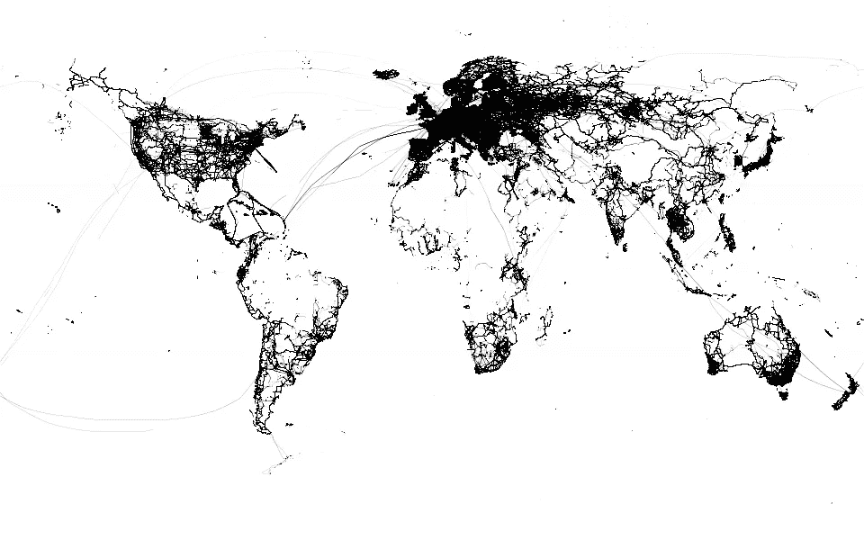

# 10 秒钟内抽取 27 亿个点数

> 原文：<https://medium.com/hackernoon/drawing-2-7-billion-points-in-10s-ecc8c85ca8fa>



当我在阅读这篇关于在 [macbook](https://hackernoon.com/tagged/macbook) 上一分钟可视化 27 亿个点的博文时，我很好奇这在 [Julia](https://hackernoon.com/tagged/julia) 上会有多快。

不仅仅是为了好玩，也是为了把它集成到我的绘图库中( [MakiE](https://github.com/SimonDanisch/MakiE.jl) )。因为我很高兴自己能够如此快速地创建一个非常快速的解决方案，所以我决定分享我的经验！

首先，你可以从 http://planet.osm.org/gps/[下载数据](http://planet.osm.org/gps/)

## 解析 CSV

我假设有人想要对数据进行大量操作，所以最明智的做法是将 55gb 的 CSV 文件转换为 22gb 的二进制 blob 文件，这样可以将[内存映射到](https://en.wikipedia.org/wiki/Memory-mapped_file)，并且不需要解析！

没有任何现成的工具可以做到这一点，但是有了 [TextParser](https://github.com/JuliaComputing/TextParse.jl) 的帮助。jl 我能够快速完成一个定制解决方案——这也展示了如何很好地扩展现有的 Julia 库。

第一个问题是，TextParser 需要一个字符串来解析 CSV。因为我不能将整个 55gb 的数据集加载到 RAM 中，所以我们的第一个技巧是在 Julia 中创建一个内存映射字符串类型:

```
struct MMapString{T} 
    # using Type parameter to not write out the result type of mmap
    # but I also don't want to loose performance
    x::T 
end# Constructor from a path
MMapString(path::String) = MMapString(Mmap.mmap(open(path), Vector{UInt8}))
# we only need to overload the iteration protocol for TextParse to work!
Base.getindex(x::MMapString, i) = Char(x.x[i])
Base.next(x::MMapString, i) = Char(x.x[i]), i + 1
Base.done(x::MMapString, i) = i > length(x.x)
Base.start(x::MMapString, i) = 1
Base.length(x::MMapString) = length(x.x)
```

这是满足大多数库的基本接口所需要的，期望一个字符串类型。现在，我们可以编写一个函数来读取 55gb 的数据集，逐行解析并将其写入二进制 blob。

出现的一个问题是，写入 IO 文件流的函数分配了相当多的空间。 *Base.write* 为其参数创建一个可变容器(Ref)以安全地将其传递给 c。即使是直接采用指针的 *Base.unsafe_write* 仍然有一个分配 128 字节的检查。
准备好 *unsafe_unsafe_write* ，short *uuwrite* 。这为我们节省了 40 秒，并减少了 3.5 gb 的内存分配(最终速度提高了约 1.2 倍)！这实际上是一个很好的例子，说明朱莉娅目前是如何失败的，以及人们如何仍能挽回这种表现。
我们直接调用 C 库，使用几乎被否决的语法(`&`)从堆栈分配参数中获取指针。
在 Julia 0.7 中，这可能不成问题，我们应该能够使用` *write* `,因为编译器在堆栈分配和消除可变容器方面做得更好了。

顺便说一下，我是用显示分配的 **@time write(io，1f0)** 来解决这个问题的，然后用 **@which write(io，1f0)** (或者用 **@edit** 直接跳到编辑器)来解决函数在 Julia 中定义的位置以及分配的来源。

```
using TextParse
using TextParse: Record, Field, Numeric, tryparsenextfunction uuwrite(io, ptr::T) where T
    Int(ccall(
       :ios_write, 
       Csize_t, (Ptr{Void}, Ptr{T}, Csize_t), 
       io.ios, &ptr, sizeof(T))
    )
endfunction save2bin(path, n = typemax(Int))
    str = MMapString(path)
    # Descriptor of 'num,num\n' which is the format in the csv
    rec = Record((
            Field(Numeric(Float32), delim = ','), 
            Field(Numeric(Float32), eoldelim = true)
    ))
    # skip the header! Nice is, that Julia's findfirst works with 
    # any iterator
    pos = findfirst(str, '\n') + 1 
    io = open(homedir()*"/gpspoints.bin", "w")
    i = 0
    while !done(str, pos) && i <= n
        # tryparsenext takes roughly 35ns so it's fairly optimal  
        p_or_null, pos = tryparsenext(
            rec, str, pos, length(str)
        )
        isnull(p_or_null) && continue # continue when parsing fails
        p = get(p_or_null)
        uuwrite(io, p)
        i += 1
    end
    close(io)
    i
end
tic()
[@time](http://twitter.com/time) save2bin(homedir() * "/Downloads/gps-points.csv");
toc()
```

这将重写文件，并在 190 秒内将其保存为二进制文件，对于这样一个简单的实现和只需要做一次的操作来说，这已经不错了。

## 绘制图像

现在我们可以将该文件内存映射为一个保存原始 gps 坐标的*向量{NTuple{2，Float32}}* 。然后，我们可以直接循环遍历这些点，并在 2D 数组中累加每个位置。

```
"""
Transforms from longitude/latitude to pixel on screen, with `dims` refering to 
the dimensions of the screen in pixel
"""
[@inline](http://twitter.com/inline) function gps2pixel(point, dims)
    lon, lat = point[1], point[2]
    x = ((dims[1] / 180.0) * (90.0 + (lon / 10^7)))
    y = ((dims[2] / 360.0) * (180.0 - (lat / 10^7)))
    (x, y)
endfunction to_image_inner!(img, points, start, stop)
    dims = size(img)
    for i = start:stop
        # don't check bounds when indexing into an array
        [@inbounds](http://twitter.com/inbounds) begin 
            p0 = gps2pixel(points[i], dims)
            idx = Int.(round.(p0))
            xidx, yidx = dims[1] - idx[1], dims[2] - idx[2]
            if checkbounds(Bool, img, xidx, yidx)
                # we should give each point a radius and then add
                # the coverage to each pixel for a smoother image
                # But this does well enough for this short example:
                img[xidx, yidx] += 0.001f0 # accumulate
            end
        end
    end
end
function to_image!(img, points, range)
    N = length(range)
    # Number of threads Julia has available
    # Use the environment variable JULIA_NUM_THREADS=8 to start
    # Julia with 8 threads
    NT = Threads.nthreads() 
    slices = floor(Int, N / NT)
    offset = minimum(range)
    Threads.[@threads](http://twitter.com/threads) for i = 1:NT
        # [@threads](http://twitter.com/threads) creates a closure, which sometimes 
        # confuses type inference leading to slow code.
        # this is why it's a good practice to move the loop body 
        # behind a function barrier
        # ([https://docs.julialang.org/en/latest/manual/performance-tips/#kernal-functions-1](https://docs.julialang.org/en/latest/manual/performance-tips/#kernal-functions-1))
        to_image_inner!(
            img, points, 
            offset + ((i-1) * slices + 1), offset + (i * slices)
        )
    end
    return img
end
```

我们可以用下面的方法使用上面的函数来得到一个简单的灰度图像:

```
img = zeros(Float32, 600, 960)
io = open(homedir() * "/gpspoints.bin")
points = Mmap.mmap(io, Vector{NTuple{2, Float32}})
tic()
to_image!(img, points, 1:length(points))
toc()
using FileIO, Colors # save it with FileIO as a Gray image
FileIO.save("gps.png", Gray.(clamp.(1f0 .- img, 0, 1)))
```


瞧啊。

在一台普通的台式电脑上画 22gb 的点需要 10 秒钟。

需要指出的一点是您可以在示例中看到的伟大的点调用语法:

```
Gray.(clamp.(1f0 .- img, 0, 1)))
```

这实际上是一个奇妙的机制[在融合所有操作的同时对数组中的每个元素应用一个函数](https://julialang.org/blog/2017/01/moredots)。所以上面会变成单 for loop
over *img* ，箝位，反转，转换成颜色一气呵成！

我们也可以使用我新的[交互绘图库](https://github.com/SimonDanisch/MakiE.jl)来创建一个很好的进度动画:

```
using MakiEresolution = (600, 960)
scene = Scene(resolution = reverse(resolution))
img = zeros(Float32, resolution)
imviz = heatmap(img, colornorm = (0, 1))
center!(scene)
# slice `points` into multiple batches which we will update
slice = 10^7
range = slice:slice:length(points)
stop = 1
vio = VideoStream(scene, homedir()*"/Desktop/", "gps")
while true
    start = stop
    stop = min(stop + slice, length(points))
    to_image!(img, points, start:stop)
    imviz[:heatmap] = img # update heatmap plot
    recordframe!(vio) # add frame to stream
    stop == length(points) && break
end
finish(vio, "gif") # finish streaming and export as gif!
```


当然，我们可以应用各种各样的改进，但我很高兴这是第一个结果。也不清楚这个解决方案与最初提到的博客帖子有多大的可比性，因为我还没有在我的电脑上运行过。如果你想在你的机器上试试这个，看看完整的[代码](https://gist.github.com/SimonDanisch/923de18c470162155416b3019ef9295d)！