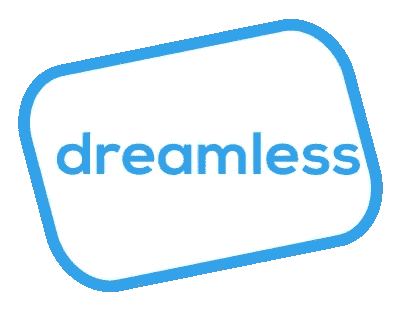
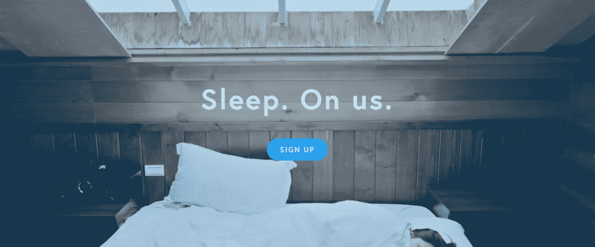
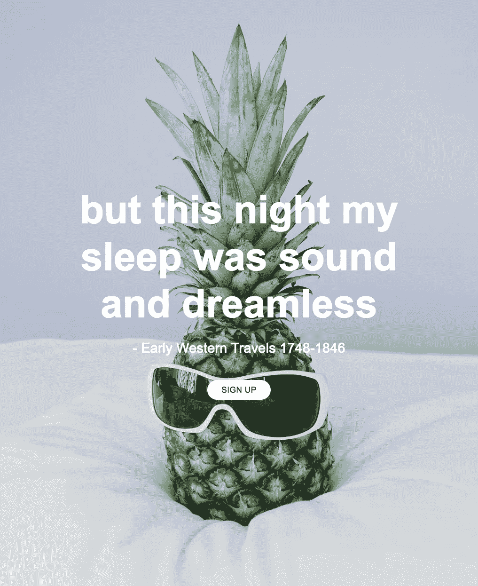
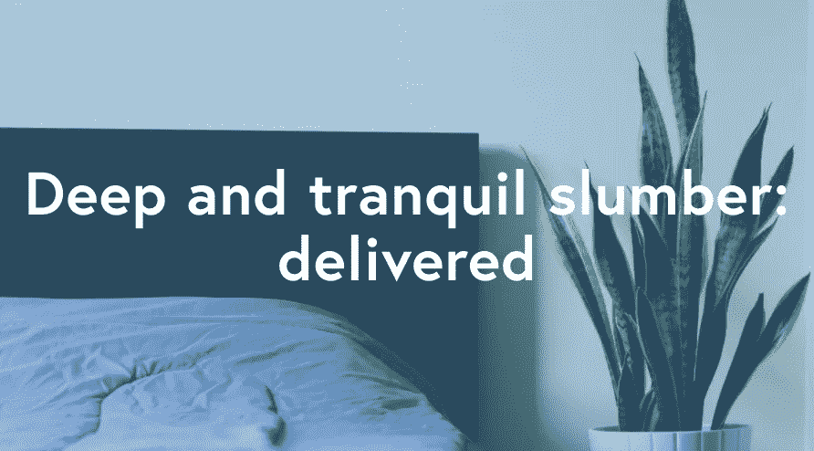

# 两周内创建一家企业

> 原文：<https://medium.com/hackernoon/dreamless-launch-and-maker-story-b97f78a5c250>

***注:*** [***无梦***](https://igg.me/at/dreamless/x/16712127) ***是枕头订阅服务。现在就在 Indiegogo******上直播*** [***。如果你能考虑支持它，或者分享它，我会很高兴。你可以从活动页面分享，或者，我们有一个***](https://igg.me/at/dreamless/x/16712127) [***小工具***](http://share.dreamless.io/) ***让分享无梦超级简单。***

## 我如何让无梦

这篇文章旨在为任何想从我的工作中学习的人提供服务。它一点也不复杂，但我想它可能有用。

我想出了[无梦](https://hackernoon.com/tagged/dreamless)的名字。木卫一当场就决定跟它滚。我查了一下 instantdomainsearch.com，发现它在 [Namecheap](https://hackernoon.com/tagged/namecheap) 上售价 33 美元，于是就抢到了这个域名。

我从一项名为 [Logojoy](https://www.logojoy.com/) 的服务中获得了徽标的灵感，它们会自动生成徽标。服务随着时间的推移而学习，所以每次我回去输出都更好。太棒了。不幸的是，这一次我对 Logojoy 的产品并不完全满意(抱歉伙计们)。在我妻子[惠特尼·贝尔](/@mrs.whitney.bell)的帮助下，我最终在 Adobe Illustrator 中完成了无梦标志。

由于之前的一个项目失败了，我的一些朋友在 Squarespace 账户上有剩余时间，所以我问我是否可以改变它的用途。他们同意了。我从 [Unsplash](https://unsplash.com/) 获得了该网站的所有图片。

这个分享工具最初是由 Soma Water 的人创建的，当时他们发起了 Kickstarter 活动。我让一个名叫[内森·亚当斯](https://nathanjamesadams.com/)的开发人员为我改编了这个共享工具。内特是一个优秀、快速的员工。我在 dreamless.io 的一个子域上托管了一个改编过的 GitHub 页面共享工具。

我有一个叔叔在一家名为 [Cozy Earth](http://www.cozyearth.com/) 的高端竹制床上用品制造商工作，我从那边的一个联系人那里得到了一些关于床上用品行业的好建议。最初，我打算提供枕头和床单，但在与 Cozy Earth 交谈后，我决定在最初的测试中只提供枕头。我在舒适地球的联系人也给我指出了枕头供应商。

最后，我的好朋友[丹·赫斯](/@danmanhess)和[乔·加布里埃尔](/@joegabriel)制作了视频。那两个人做得很好。

io 是一个 MVP，旨在测试至少有 200 人希望每 6 个月收到枕头的假设。在分享我如何创建这个 MVP 的过程中，我希望我能够帮助其他人了解一种新的资源来验证他们自己的想法。再说一次，我意识到这没什么特别的，但它仍然在这里。

## 背景

我有一个习惯，叫醒我的妻子告诉她商业想法。大约两年前，我叫醒她，告诉她应该有人提供枕头订阅服务，因为我们总是把枕头放得太久。

我认为对于像我这样的人来说，这是一个非常好的主意，但是我不确定是否还有人想要这样的服务。我搁置了这个想法。

最近，我一直睡在一个需要更换的枕头上。我可以很容易地去买新枕头，但不知何故，我还没有抽出时间来。所以订阅的想法又回到了我的脑海中，现在我知道我能够摆脱它的唯一方法就是测试它。要么市场会说‘不，谢谢’，要么他们会想‘嗯，我想定期有一个毛绒绒的新枕头送到我家门口会很好。’

## 你可能有的问题

你可能想知道如果你注册了会收到什么样的枕头。它们是标准的多填充物枕头。它们很舒服，也不贵:每只 19 美元。因为我们每 6 个月寄一张新的，所以你将永远睡在一张蓬松、饱满的床上。

你可能想知道为什么你想要订阅。有几个原因。枕头变得很脏:随着时间的推移，它们会收集皮肤碎屑和随之而来的油脂。当大多数人更换枕头时，它们的重量会是新枕头的两倍。拥有一个订阅意味着你不必考虑它:你将永远有丰满，干净，新鲜，白色，新的枕头。

> [黑客中午](http://bit.ly/Hackernoon)是黑客如何开始他们的下午。我们是 [@AMI](http://bit.ly/atAMIatAMI) 家庭的一员。我们现在[接受投稿](http://bit.ly/hackernoonsubmission)，并乐意[讨论广告&赞助](mailto:partners@amipublications.com)机会。
> 
> 如果你喜欢这个故事，我们推荐你阅读我们的[最新科技故事](http://bit.ly/hackernoonlatestt)和[趋势科技故事](https://hackernoon.com/trending)。直到下一次，不要把世界的现实想当然！

