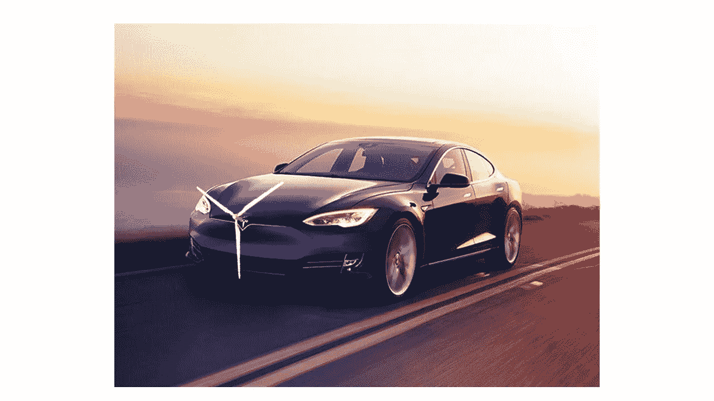
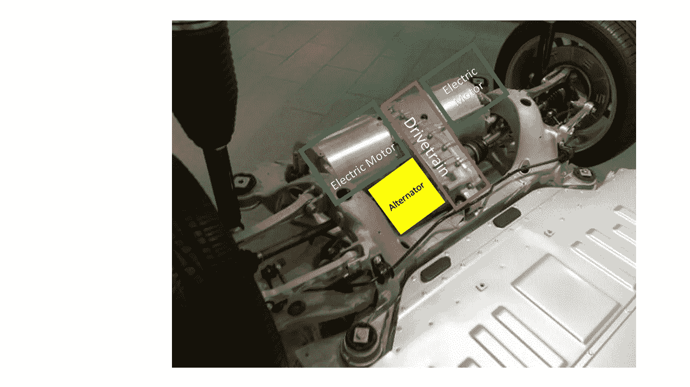
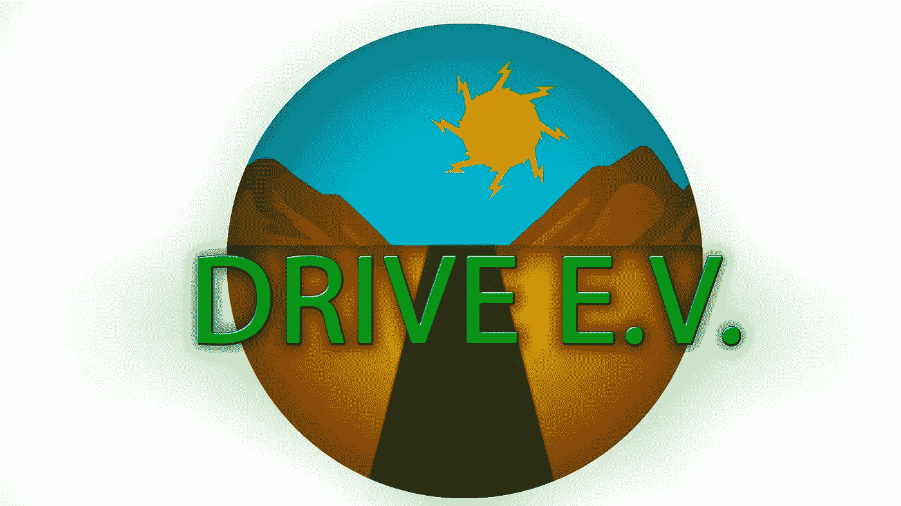

# 驾驶电动汽车——公司和我们的使命

> 原文：<https://medium.com/hackernoon/drive-e-v-the-company-and-our-mission-e5aa8cea0eb0>

Drive E.V .是一家公司，它是我在皮奥里亚 MET 职业学院(Peoria MET Professional Academy)攻读工程学[时的成果。我有机会找到一个我想解决的问题，并有一整个学期的时间去解决它。我想做什么的想法是在 2016 年夏天的某个时候产生的，远在我有机会参与我的项目之前。](https://goo.gl/GX0Df3)

当我想到在特斯拉汽车上安装小型风力涡轮机来发电给电池充电时，我的想法是随机产生的。它引发了整个世界的想法和有趣的思想。因为增加电动汽车的行驶里程很重要，所以创造一种这样的产品是有需求的。所以当它从一个风力涡轮机开始，它已经发展成如此多。

My Idea didn’t look like this but, I wanted to show a representation of the general idea

Drive E.V .作为一家“努力寻找未来可持续能源解决方案”的公司，我不想把自己局限于一种产品，而是致力于围绕电动汽车的整个业务，以某种方式改进它们，以促进它们的销售。

目前，我们正在研究使用一个连接到 Model S 传动系统的交流发电机，它可以恢复失去的能量并给电池充电。就像普通的汽油发动机一样，交流发电机利用凸轮轴的旋转带动交流发电机旋转，给汽车电池充电，让你的灯亮着，让你听收音机。我们的产品叫做“再生运动”。它再生电力的基础上，旋转的传动系统旋转的交流发电机产生电力。

Visual of the “Regenerative Motion” in a Tesla Model S

为了证明我的想法可行，我用上面显示的设置模拟了一辆电动遥控汽车。使用风扇电机，将其反转并重新连接到电池，以展示概念验证。能够证明我的想法是可行的，能够产生电能给电池充电，并增加里程，我就可以获得特斯拉的关注，并与他们分享我的想法。

我的目标是继续推动电动汽车和“再生运动”,以帮助进一步开发电动汽车并改进其技术。

罗伯特·库恩—驾驶电动汽车

Twitter @Robbyk_met &@Drive_EV

Drive E.V. Logo ™️️

> [黑客中午](http://bit.ly/Hackernoon)是黑客如何开始他们的下午。我们是 [@AMI](http://bit.ly/atAMIatAMI) 家庭的一员。我们现在[接受投稿](http://bit.ly/hackernoonsubmission)并乐意[讨论广告&赞助](mailto:partners@amipublications.com)机会。
> 
> 如果你喜欢这个故事，我们推荐你阅读我们的[最新科技故事](http://bit.ly/hackernoonlatestt)和[趋势科技故事](https://hackernoon.com/trending)。直到下一次，不要把世界的现实想当然！

