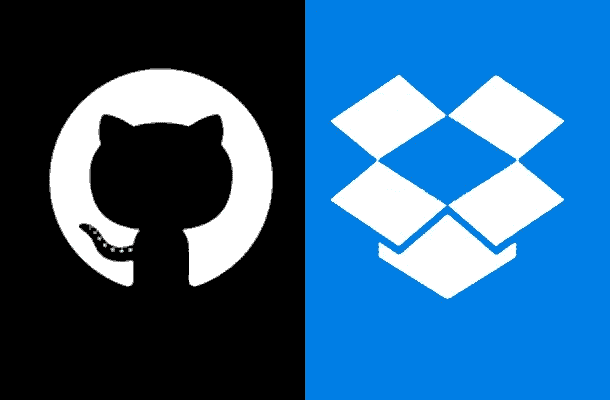
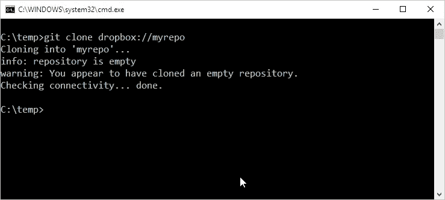
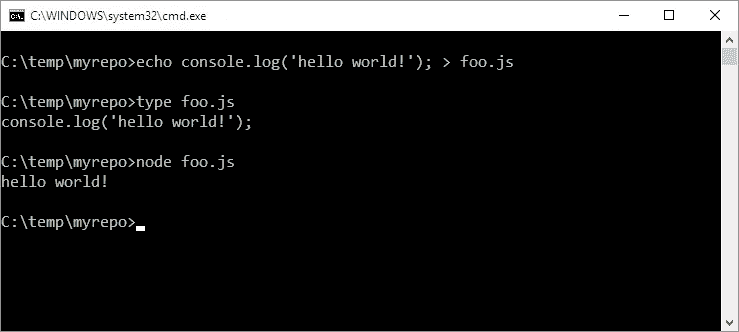
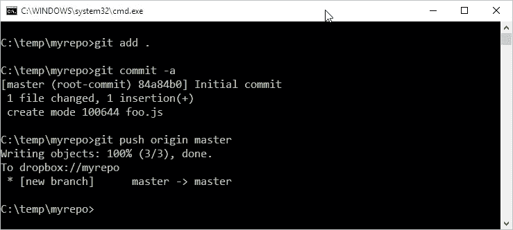
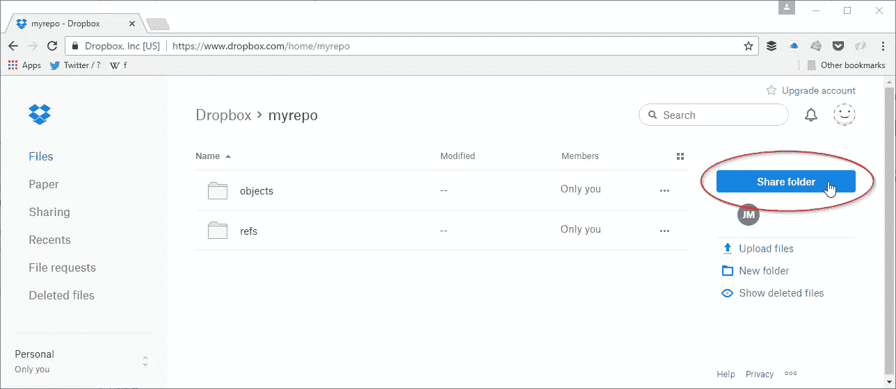

# Dropbox 作为 GitHub 的替代品

> 原文：<https://medium.com/hackernoon/dropbox-as-a-github-alternative-4de87be0d360>

想要私有的好处，[分布式版本控制](https://en.wikipedia.org/wiki/Distributed_version_control)却不想支付 [GitHub 的订阅费](https://github.com/pricing)？或者干脆不信任已经检查过密码、令牌和秘密的 GitHub？

您可以使用 Git 和 Dropbox 为自己打造一个快速而肮脏的解决方案。

# 你需要什么

*   [Git](https://git-scm.com/downloads)
*   [收纳箱](https://www.dropbox.com/)
*   [git-remote-dropbox](https://github.com/anishathalye/git-remote-dropbox)

# 第一步。克隆一个空存储库

*   为您的新回购决定一个文件夹名称
*   通过`git clone dropbox://<reponame>`克隆它
*   这将在您的本地创建一个新的空目录，包含所有必要的。吉特·古宾斯

# 第二步。写点代码！

*   忙起来，写点代码！保存到您的新本地回购。
*   或者如果你觉得懒，就从别的地方复制粘贴代码。

# 第三步。添加、提交和推送

*   通过`git add`发布源代码
*   通过`git commit`提交到您的本地存储库
*   通过`git push`按下遥控器

# 第四步。分享和协作

*   想和某人合作吗？只需使用 Dropbox 内置的共享功能。
*   您添加的任何人都可以使用`clone`、`add`、`commit`和`push`。简单如！

最初发表于[jamesfmackenzie.com](http://www.jamesfmackenzie.com/2017/03/28/dropbox-as-a-github-alternative/)

> 黑客中午是黑客如何开始他们的下午。我们是这个家庭的一员。我们现在[接受投稿](http://bit.ly/hackernoonsubmission)并乐意[讨论广告&赞助](mailto:partners@amipublications.com)机会。
> 
> 如果你喜欢这个故事，我们推荐你阅读我们的[最新科技故事](http://bit.ly/hackernoonlatestt)和[趋势科技故事](https://hackernoon.com/trending)。直到下一次，不要把世界的现实想当然！

