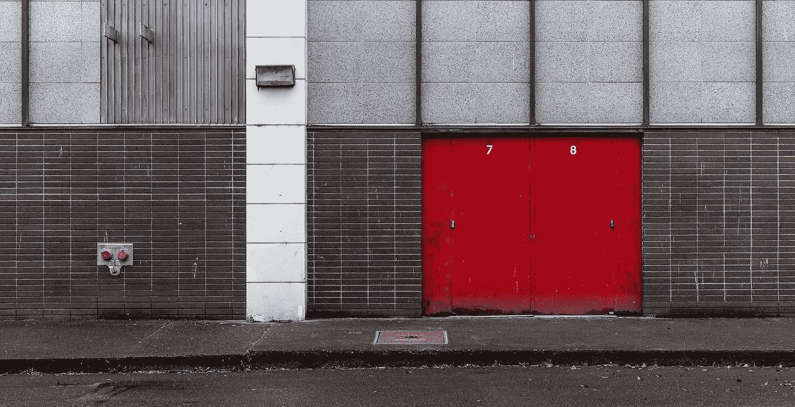

# 下降收纳箱

> 原文：<https://medium.com/hackernoon/dropping-dropbox-8e4775154d0a>



A backdoor to a building in Portland, Oregon — James Duncan Davidson

今天早些时候，我看到了史蒂夫·斯特雷扎发的一条非常令人担忧的推文，内容是关于 [Dropbox 如何在 OS X/macOS](http://applehelpwriter.com/2016/07/28/revealing-dropboxs-dirty-little-security-hack/) 中做一些有趣的事情。提醒你，不是为了邪恶的目的。几乎可以肯定不是。此外，[看起来并不像一些报道所说的那样，他们正在存储你的密码](https://twitter.com/rosyna/status/774608730860036096)的副本——而且哪个会是真的*、* ***真的*** *坏的*。不，他们只是以一种让他们保留根权限的方式安装了一些东西，这样当他们以后想修改时就不用再来烦你了。

> 换句话说，他们有效地为你的系统开了后门，这样他们就不必再询问是否可以在以后添加或更改东西。

毕竟，每次他们请求许可时，不仅会惹恼用户，还会让他们考虑说不，这对于一个由每日、每周和每月活跃使用量的全能上帝驱动的[公司](https://hackernoon.com/tagged/company)来说总是不好的。

尽管用户体验的论点是保持事情简单，这样用户就不必做更多的决定，但是 [Dropbox](https://hackernoon.com/tagged/dropbox) 这样做有两个大问题:

1.  这是对信任的侵犯。 Dropbox 并没有在没有问我的情况下，要求能够再次以新颖的方式修改我的系统。
2.  这是坏演员利用的额外攻击媒介。这些已经够多了。

此外。作为无限项目的一部分，Dropbox 正在将功能移植到内核扩展中。这是很酷的东西——见鬼，我现在就想要！—除了他们会在没有询问或告诉你的情况下安装 kext。不管您是否希望在您的系统中运行一个封闭源代码的内核扩展——您很可能会获得基于无限云的文件系统的好处——偷偷放一个进来是很糟糕的。

> 这就像不是给你的水管工一把钥匙，让他在你的厨房工作一周，而是给他们永久的使用权，这样他们可以在以后喜欢的时候增加一些厕所和另一个厨房，即使你没有要求。

那么，他们是怎么做到的呢？[菲尔·斯托克斯展示了它是如何做到的](http://applehelpwriter.com/2016/08/29/discovering-how-dropbox-hacks-your-mac/)。

到底合法不合法？【Dropbox 的 Ben 在黑客新闻上给出了他们的理由。

# 你应该为此把 Dropbox 扔给他们吗？

也许吧。也许不是。我不是那个告诉你 Dropbox 的效用是否值得冒险的人。长期以来，Dropbox 一直非常有用。话说回来，还有其他选择。在这件事上你需要自己拿主意。

就我个人而言，我打算尝试一下没有 Dropbox 的生活。我会为基于云的文件共享保留它，但至少会花几个星期没有漂亮的神奇自动同步位。之后，我会重新评估。

# 想摆脱 Dropbox，怎么做？

[戒掉并删除它曾经奏效，并被很好地记录下来](https://howtouninstallonmac.net/how-to-uninstall-dropbox-on-mac-os-x/)，但它不再奏效了。相反，你会得到一个可爱的对话框，告诉你它不能被删除，因为它的一些扩展正在使用中。 [Dropbox 的帮助中心提供了必要的额外步骤](https://www.dropbox.com/en/help/41):在退出和卸载 Dropbox 之前，你必须先取消链接你的 Dropbox 账户。这意味着:

*   在 Dropbox 偏好设置中取消帐户链接
*   退出 Dropbox

但是等等！在你走得更远之前，你也想摆脱帮手。要做到这一点，您需要转到命令行，非常小心地执行下面的代码:

```
**$** sudo rm -rf /Library/DropboxHelperTools
```

你对那个 sudo 很小心，对吗？很好。现在，您可能安装了内核扩展，也可能没有安装。我没有，我是这样检查的:

```
**$** ls /Library/Extensions/Dropbox.kext
ls: /Library/Extensions/Dropbox.kext: No such file or directory
```

如果你已经安装了 kext，你可以用核弹攻击它——同样，小心 sudo——就像这样:

```
**$** sudo rm -rf /Library/Extensions/Dropbox.kext
```

接下来，您还需要清理系统偏好设置中的一些内容:

*   从您的用户帐户中删除 Dropbox 登录项目
*   从辅助功能隐私列表中删除收存箱

现在，你可以删除 Dropbox 应用程序并清理垃圾了。然后重启检查。那*应该*去做。

当然，这可能不是唯一的方法，但这是我最终想出的从我的系统中删除 Dropbox 的方法。您的里程可能会有所不同。祝好运和成功。

[](http://bit.ly/HackernoonFB)[](https://goo.gl/k7XYbx)[](https://goo.gl/4ofytp)

> [黑客中午](http://bit.ly/Hackernoon)是黑客如何开始他们的下午。我们是 [@AMI](http://bit.ly/atAMIatAMI) 家庭的一员。我们现在[接受投稿](http://bit.ly/hackernoonsubmission)，并乐意[讨论广告&赞助](mailto:partners@amipublications.com)机会。
> 
> 如果你喜欢这个故事，我们推荐你阅读我们的[最新科技故事](http://bit.ly/hackernoonlatestt)和[趋势科技故事](https://hackernoon.com/trending)。直到下一次，不要把世界的现实想当然！

[](https://goo.gl/Ahtev1)