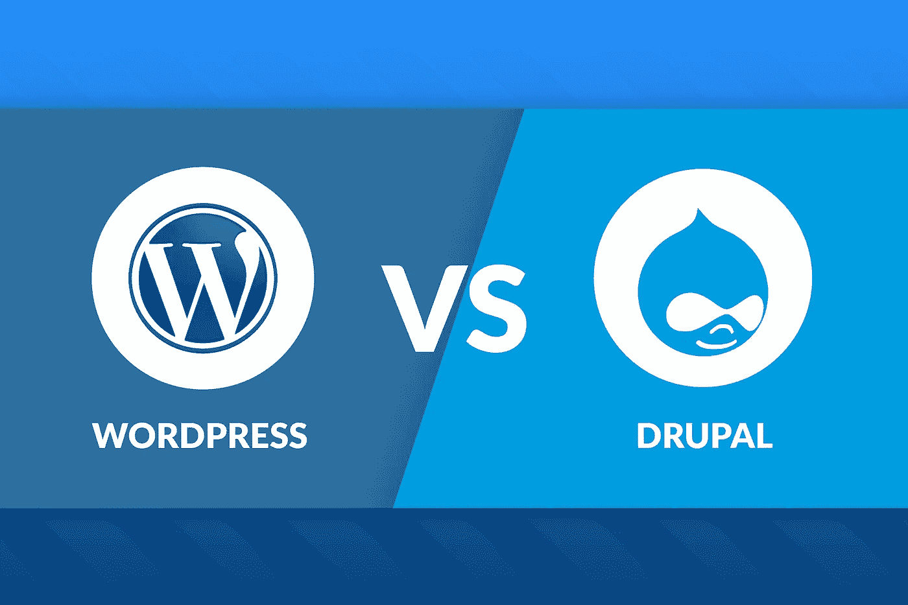

# Drupal 是打倒 WordPress 巨人的大卫吗？

> 原文：<https://medium.com/hackernoon/drupal-vs-wordpress-d2f47b109ff9>

巨人之战的时间到了！在内容管理系统的世界里，Wordpress、Drupal 和 Joomla 这三个软件脱颖而出。在这篇文章中，我将比较 Wordpress 和 Drupal，看看谁胜过谁！

就安装和网站数量而言，Wordpress 是一个真正的庞然大物。但是这些数字能说明全部情况吗？Drupal 会是每个人最终都会爱上的神童吗？

让我们来讨论这两个 CMS 的特点，并试图找出赢家！

## **易用性**

说到易用性，请记住，这完全取决于用户的技术技能。Wordpress 最初是一个简单的博客平台，随着用户群的增长，它逐渐发展成为一个真正的 CMS。因此，它是针对那些网站开发新手的。因此，这是一个简单的解决方案，用户可以拿起并开始创建网站。

说到 Drupal，CMS 要复杂得多，通常需要用户具备 PHP、HTML、CSS 和 jQuery 的基础知识。它比 Wordpress 有更陡峭的学习曲线，因为 CMS 的主要受众是企业用户，他们需要一个强大的解决方案来运行高性能的数据库和网站。

## **可扩展性**

在任何与可伸缩性相关的争论中，Drupal 都是明显的赢家。当网站规模和用户生成的请求增加时，Drupal 的表现明显好于 Wordpress。这种高性能的主要原因是一个简单的事实，即 Drupal 核心是为提供高性能而构建的。

## 可定制性

尽管 Wordpress 和 Drupal 都是可定制的，但由于它们庞大的插件和主题库，Drupal 允许用户修改其核心代码以获得极大的灵活性。由于 WordPress 更面向外行用户，它限制了对核心的几个关键区域的访问。所有这些都意味着 Drupal 用户可以根据自己的需求定制平台。另一方面，WordPress 用户不得不使用可用的定制选项。

## 搜索引擎友好

[Drupal 比 Wordpress 更加 SEO 友好](https://www.cloudways.com/blog/drupal-8-seo-tips/),因为它的本地缓存功能可以缩短页面加载时间(这是搜索引擎优化的一个关键因素)。Drupal 也可以有效地管理大量的内容，通常比 WordPress 支持更多的内容类型。在 SEO 领域，内容是王道，Drupal 比 WordPress 有独特的 SEO 优势，因为它有更好的内容管理选项。

## 安全性

安全性是 Drupal 相对于所有其他 CMS 的明显优势。Drupal 是为企业级用户构建的，其核心中内置了企业级安全性。相比之下，大多数 WordPress 的安全特性是通过第三方插件实现的。这意味着一个开箱即用的 WordPress 安装非常容易受到攻击。谈到安全性，Drupal 显然是赢家。

## 升级

虽然 Wordpress 和 Drupal 都定期更新，但是应用更新的过程有很大的不同。虽然 Wordpress 网站的更新和升级是无缝的，但是 Drupal 的更新确实需要一些手工操作。这是因为 Wordpress 更新包括数据库更新和代码更新，而 Drupal 只包含数据库更新而不包含代码。

## 费用

这个因素你现在应该很清楚了。简单地说，Drupal 的运行和维护成本比 WordPress 更高，学习曲线也比 Wordpress 更陡。实际上，这意味着雇佣一个 Drupal 开发者的成本要比 WordPress 高得多。

## 判决

最后，Drupal 和 Wordpress 都是很棒的内容管理系统。对于刚刚开始创建网站和博客的人来说，Wordpress 通常是最好的选择。然而，当谈到让一个网站高度定制化时，Drupal 是无与伦比的。当你知道你的网站将会发展壮大时，Drupal 也会起到带头作用。

那是我对此事的意见。在下面的主题上发表你的评论吧！