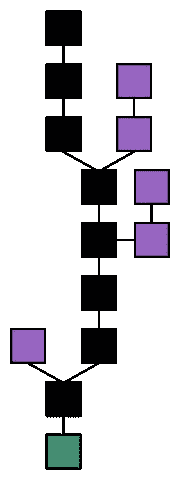
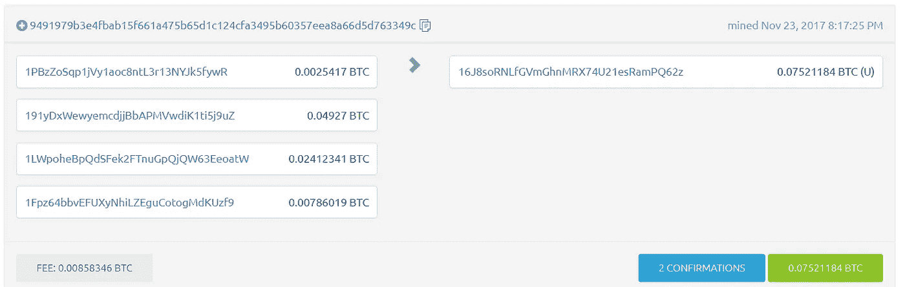
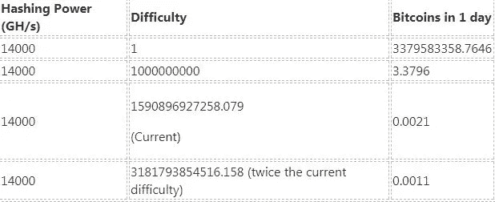
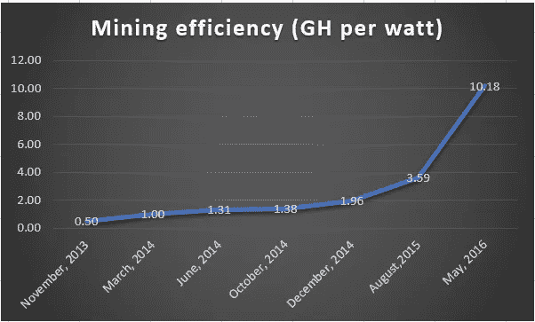

# 比特币能源使用傻瓜指南

> 原文：<https://medium.com/hackernoon/dummies-guide-to-bitcoin-energy-use-5f38e91c3253>

过去几个月，人们越来越关注比特币的用电量。最近的例子有——[副文](https://motherboard.vice.com/en_us/article/ywbbpm/bitcoin-mining-electricity-consumption-ethereum-energy-climate-change)、 [IEEE](https://spectrum.ieee.org/energy/policy/the-ridiculous-amount-of-energy-it-takes-to-run-bitcoin) 、[比特币 vs Visa 用电谬误](https://hackernoon.com/the-bitcoin-vs-visa-electricity-consumption-fallacy-8cf194987a50)。

这篇文章试图解释比特币的能源使用。它还试图增加一些对能源问题的看法。

警告:这篇文章有点技术性。

# 资金流动

“这是数字货币”是对比特币最简单的解释。

数字货币有一个固有的问题。我们举个例子。一种叫做“MyDitigalCoin”的数字货币:

如果我需要更多的数字硬币，我可以复制一个。

Tada！我现在有两枚硬币。叫做*双花*。

解决方法是记录[所有权](https://blockchaintechblog.com/2017/08/05/blockchain-part-1-ownership/)信息。

**Ledger**

可以使用该记录来验证所有权和数量。你现在可以拒绝每一个“复制”硬币。这个记录叫做*分类账*。

银行使用分类账来存储你的所有权和支出。银行保管和维护私人分类账。政府当局充当银行的监督机构。

加密货币的账本对所有人开放。任何人都可以检查和编辑分类账。因此得名“公共账本”。

*公共分类账*有两个问题:

1.  编辑分类账需要一个可信的当事人。
2.  可信方的身份验证应该是快速的。

输入…

## 工作证明

我们之前在本博客[这里](https://blockchaintechblog.com/2017/08/15/guide-understanding-blockchain-part-3-1/)和[这里](https://blockchaintechblog.com/2017/08/15/guide-understanding-blockchain-part-3-2/)讨论过“工作证明”。

工作证明要求挖掘器生成一个令牌(nonce)。随机数验证在不到一秒的时间内完成。

通过验证后，矿工可以编辑分类帐并获得奖励硬币。

但是，有一个问题。

## 延迟和“区块链”

在互联网上，行动和反应之间总是有延迟。这个时间延迟叫做 [*潜伏期*](https://en.wikipedia.org/wiki/Latency_(engineering)) 。

在比特币中，是区块创建(动作)和被所有同行接受(反应)的时间差。这个块被其他对等体接受的过程被称为*块传播。*

由于这种延迟，区块链总是有多个版本。维基百科词条上的[区块链](https://en.wikipedia.org/wiki/Blockchain)有一个图表:

绿盒子是我们的创世积木。黑盒是整个网络接受的块。这条黑色区块链被称为*主链。*

紫色和黑色区块同时开采。紫色方框是有效的块，但不被整个网络接受。这些被称为*孤立块。*

这种延迟会导致两个问题。

首先，我们不知道接受的事务是在*孤儿*还是*主链*块中。这会造成*双重支出。*

视觉上，想象一个交易包含在紫色块#1 中，但不包含在黑色块# 1 中。这可能是由于延迟或有人恶意改变结构。不管是哪种情况，紫色# 1 的硬币都可以重新使用，并包含在黑色#2 中。

第二，*孤*和*主*区块都需要相同的开采工作量。所以，*孤儿块*本质上是在浪费计算资源。此外，网络需要决定有效的块，并从那里开始构建。这叫做*区块重组。*

想想第二个和第三个紫色块。那是由两个街区组成的链条。因此，加密货币网络需要协同工作，并发现该链是否无效。

根据[本网站](http://bitcoinstats.com/network/propagation/)，比特币的:

1.  95%的交易需要 22 秒
2.  95%的数据块耗时约 13 秒

有一个 13 秒的窗口，两个不同的人可以找到一个块。结合 10 分钟的[块生成时间](https://blockchaintechblog.com/2017/08/30/blockchain-explorer-difficulty/)，这是一个*孤立块*的近 2%的机会。这种情况在 2013 年甚至更糟。块传播时间为 125 秒，或者说有 20%的几率出现*孤立块。*

## 确认书和到期日

交易问题的解决方案是测量*重复消费的概率。*所有加密货币都使用相同的指标— *确认。*

一旦交易被包括在块中，*确认数*变为 1。随着每添加一个额外的块，一个块成为*孤儿*的概率变得越来越小。

所有加密货币在交易页面上都有“确认”部分。比特币示例:

 [## 比特币区块浏览器

### 比特币区块浏览器是一个网络工具，提供了比特币区块、地址和…

blockexplorer.com](https://blockexplorer.com/tx/9491979b3e4fbab15f661a475b65d1c124cfa3495b60357eea8a66d5d763349c) 

这里，确认的数量是 2。在事务块之上还有 1 个附加块。所以，最新的块号/锁时间是 495750 **。**现在，大宗确认书将超过 1000 份。

块奖励，新铸造的硬币，需要 100 个确认。这就是所谓的*区块成熟度*。新硬币只有在到期后才能使用。

## 重新审视积木的产生和难度

比特币使用 [*区块生成时间和难度调整解决了区块延迟问题。*](https://blockchaintechblog.com/2017/08/30/blockchain-explorer-difficulty/)

首先，选择*块生成时间*是一种平衡行为。这需要是:

1.  高延迟块并最小化孤立块的概率。
2.  低以允许更快的交易。
3.  低允许更快的确认。*确认*从交易块开始计数。

比特币*区块生成时间*为 10 分钟。*确认*的推荐数量为 6 块。因此，一个小时后，比特币交易几乎不会出现双倍消费。

第二，*困难重定目标*将网络保持在生成时间边界内。*难度*增加，如果*块生成*太快。采矿变得更加困难。反过来也是如此。如果方块花费太多时间，难度会降低。

难度和幂或散列之间有一个简单的关系——更高的难度需要更多的散列。

在比特币中，*难度*每 2 周变化一次。此外，它的变化不能超过当前*难度*的 4 倍。

## **比特币难度简史**

比特币刚开始的时候，难度是 1。11 个月后的 2009 年 12 月，难度首次跃升至 1.125。随着发现比特币的人越来越多，难度慢慢增加。

当 Laszlo Hanecz 能够使用他的 GPU 找到挖掘硬币的方法时，一个分水岭时刻发生了。下面是纳撒尼尔·波普的[数字黄金中的一段:](https://www.amazon.com/gp/product/006236250X/ref=as_li_tl?ie=UTF8&camp=1789&creative=9325&creativeASIN=006236250X&linkCode=as2&tag=gargs123-20&linkId=c6cffb9be9a60926e469edfd00644146)

> 在每天发布的大约 140 个区块中，拉兹洛的 CPU 每天最多赢得一个 50 比特币的区块。一旦拉兹洛接上了他的 GPU 卡，他就开始每小时赢一两个街区，偶尔还会赢更多。5 月 17 日，他赢得了 28 个街区；这些胜利给了他 1400 枚新硬币。
> 
> 随着比特币变得越来越成功，Satoshi 知道有人最终会发现这个机会，当 Laszlo 给他发电子邮件介绍他的项目时，他并不感到惊讶。但在回应拉兹洛时，聪显然被撕裂了。如果一个人拿走了所有的硬币，那么新人们加入的动力就会减少。
> 
> *“我不想听起来像个社会主义者，”聪回信道。“我不在乎财富是否集中，但就目前而言，把钱给 100%的人比给 20%的人能获得更大的增长。”*
> 
> *因此，Satoshi 要求 Laszlo 简化“高能散列”，这个术语是指将输入插入散列函数并观察它输出什么的过程。*
> 
> 但是 Satoshi 也认识到，只要像 Laszlo 这样有能力的人希望看到比特币成功，网络上更多的计算能力就会使网络变得更强大。

随着人们竞相寻找更多的积木，难度稳步增加。在接下来四年里，这个数字从 100 万增加到了 300 万。

许多人对投资 ASICs 所需的 R&D 资金不感兴趣。但在 2013 年，比特币价格触及 100 美元，人们突然对专业的比特币矿工产生了兴趣。

这些矿商在 2013 年底开始发货。虽然 ASICs 承诺提高采矿效率，但这是有代价的。比特币 2 个月难度翻倍。这是真正的“公地悲剧”。

到 2013 年结束时*难度*增加了 1000 倍，达到 1gb 哈希。今天*难度*增加了 1500 倍，达到 1.5 Terra hashes。

## 能源使用

现在，让我们看看散列和能量使用之间的关系。

著名的比特币矿工之一是[比特大陆蚂蚁矿工 S9 比特币矿工](https://www.amazon.com/gp/product/B075MH4HSL/ref=as_li_tl?ie=UTF8&camp=1789&creative=9325&creativeASIN=B075MH4HSL&linkCode=as2&tag=gargs123-20&linkId=b2c91347616d4d301074aca868f724fb)。

这台机器每秒可以处理 13.5 万亿次散列或 13，500 万亿次散列。这里有一个不同难度等级的硬币表:

让我们看看经济学是如何运作的:

假设机器成本为 0。

这台机器需要 1323 瓦的电力。在美国，平均电费是每小时 0.12 千瓦。因此，每天的电费是 3.81 美元。

一枚比特币价值 13000 美元。按每天 0.0021 BTC 计算，收入为 27.3 美元/天。

除去电费，每天的利润是 22.82 美元。

这相当于每月约 600 美元的收入。

这种计算过于简单，尤其是假设机器成本为零。如果人们愿意，我会进入经济学领域。

自今年年初以来，难度增加了 5 倍多。所以，一月份开采 1 BTC 的人现在只能开采 0.2 BTC。价格猛涨。人们想挖掘更多的硬币。

因此，人们正在给比特币网络增加更多的哈希功能。这导致比特币的能源使用量呈爆炸式增长。

## **比特币和能源问题**

这些文章在某种程度上是正确的。如果价格持续上涨，那么人们肯定会花费越来越多的购买力来赚取硬币。但是，这些讨论大多忽略了一个重要的指标——*开采效率。**挖掘效率*的度量是 1g 哈希所需的瓦特数。(1gb 哈希=1000000000 个哈希)

*旗舰产品比特大陆 S 系列矿工的采矿效率*图表:

采矿效率在过去的 4 年里提高了 10 倍。

采矿利润的可变性主要来自电力成本。随着价格的上涨(以及对用电的大量批评)，将会有更多的研究致力于降低电力成本。当然，人们可能会试图通过赚取更多的硬币来平衡这一点。但是，总有一天我们会达到平衡。因此，这么快预测失败是没有根据的。

另一个验证模型也在研究中。

## 利害关系证明

这个挖掘算法是 2011 年在 [bitcointalk 上首次提出的。给出的描述是(重点是我的):](https://bitcointalk.org/index.php?topic=27787.0)

"*我所说的利益证明是指，你对已接受的交易历史的“投票”不是由你带入网络的计算资源份额来加权，* ***而是由你使用自己的私钥可以证明自己拥有的比特币数量来加权。***

因此，矿工验证使用她拥有的硬币，而不是散列和花费能量。这证明了她在硬币生态系统中的利益。这个想法是，如果她有一个股份，那么她将不会倾向于伤害硬币。PoS 的首次实施发生在 [Peercoin](https://en.wikipedia.org/wiki/Peercoin) 。

PoS 有几个问题。首先，有人可以获得硬币只是为了制造问题。于是，就有了一个*钱币年龄*的标准。出于赌注的考虑，硬币需要超过特定的天数。例如，peercoin 认为硬币在过去 30 天内没有被使用，购买或出售。

第二个问题是“无关紧要”的问题。正如我们上面讨论的，由于延迟，我们一次有多个区块链。在 PoW 中，计算起到了阻止人们改变历史的威慑作用。

在 PoS 机中，有人可以用超过*区块链*的价格下注他们的硬币。这可能会造成有多个历史记录的情况。所以，区块链重组相当频繁。

为了避免这种情况，PoS 硬币使用检查点系统。一到达检查站，区块链就结冰了。在此检查点之外不能有任何更改。

要理解这一点，请看*延迟*部分的图表。假设规则是—4 个街区后的检查点。因此，在 4 个块之后，第一个紫色块不再有效。

第三个问题是赌注机制。只有那些已经拥有硬币的人才被允许采矿。这使得加密货币有些集中化。

**结论**

一个去中心化的货币，每个人都可以进去，都有公平的发言权，又不消耗太多资源，这是一个超级有趣的问题。比特币在这方面做得还算不错。*采矿效率*研究将引领比特币更好的能源未来。

*原载于* [*区块链博客*](https://blockchaintechblog.com/2017/12/11/dummies-guide-bitcoin-energy-usage/) *。*