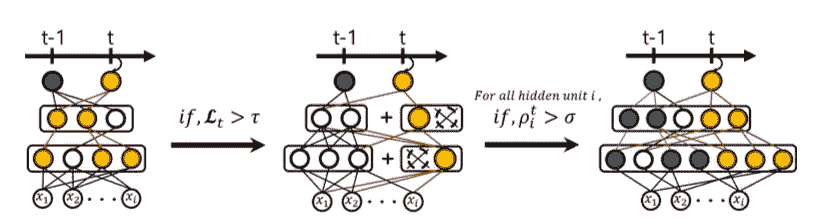
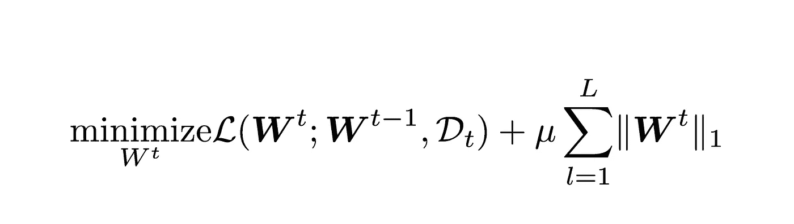
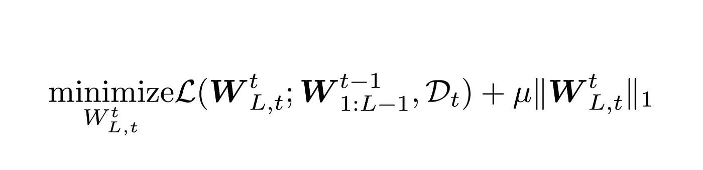
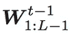
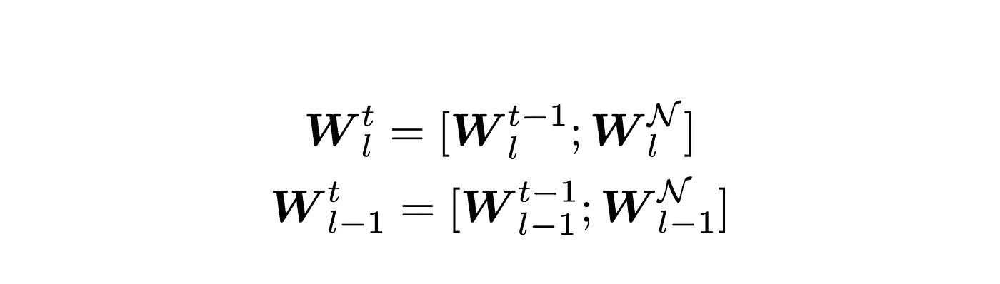
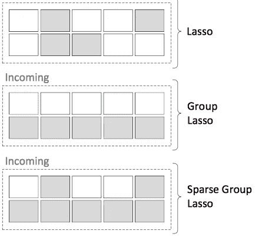
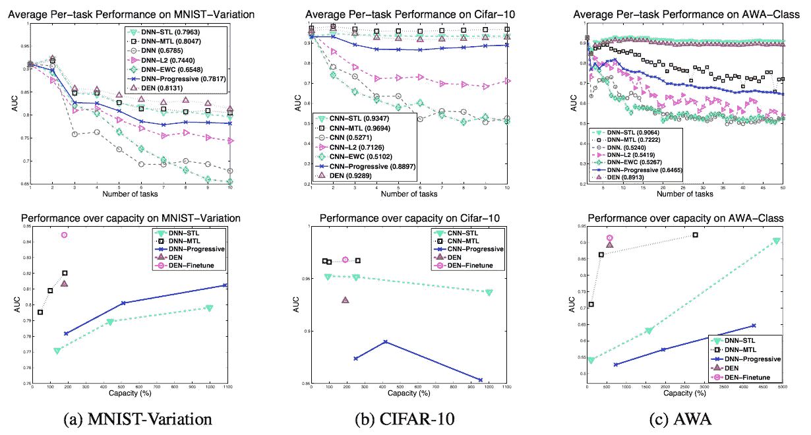

# 动态可扩展神经网络—解释

> 原文：<https://medium.com/hackernoon/dynamically-expandable-neural-networks-ce75ff2b69cf>

A Machine, Learning. by [Robert Aguilera](http://robertaguileradesign.com)

神经网络可以相当容易地学习复杂的表示。但是，在一些任务中，新数据(或数据类别)会不断变化。例如，你可以训练一个[网络](https://hackernoon.com/tagged/network)来识别 8 种不同类型的猫的图片。但是将来，你可能会想把它改成 12 个品种。如果网络必须让[随着时间的推移不断学习](https://hackernoon.com/tagged/learning)新数据，这被称为持续学习问题。本文讨论了一种非常新的技术，这种技术试图以重新训练整个模型的一小部分成本不断适应新数据。

> 本文基于[的动态扩展网络终身学习](https://arxiv.org/pdf/1708.01547v2.pdf)

# 这篇文章的结构

本文沿用原论文。我添加我自己的比特和解释材料来简化它。

> 本文需要一些关于神经网络的知识，包括权重、正则化、神经元等。

# 什么是持续学习

持续学习只是意味着能够随着时间的推移不断学习。数据随着时间的推移按顺序到达，算法必须学会能够预测新数据。通常，使用像迁移学习这样的技术，其中模型根据以前的数据进行训练，并且使用来自该模型的一些特征来学习新数据。这通常是为了减少从零开始训练模型所需的时间。当新数据稀疏时也使用它。

# 问题是

执行这种学习的最简单方法是基于更新的数据不断地微调模型。然而，如果**新任务**与旧任务**非常不同**，模型将无法在该新任务中很好地执行，因为旧任务的功能是无用的，例如，如果一个模型是在一百万张动物图像上训练的，那么如果它在汽车图像上进行微调，它可能不会很好地工作。在试图检测汽车时，从动物身上学到的特征不会很有用。

另一个问题是在**微调**后，模型可能开始执行**原**任务**差**(本例中预测动物)。例如，斑马身上的条纹与条纹 t 恤或栅栏有着非常不同的含义。微调这样的模型会降低其识别斑马的性能。

# 介绍动态可扩展网络

在很高的层面上，扩展网络的想法是非常符合逻辑的。训练一个模型，如果它不能很好地预测，增加它的学习能力。如果一个新的任务与现有的任务有很大的不同，从旧的模型中提取任何有用的信息并训练一个新的模型。作者使用这些逻辑思想和发展的技术，使这样的建设成为可能。

作者介绍了 3 种不同的技术来实现这样一个框架。将详细讨论每种方法，但在很高的层次上，它们是:

1.  **选择性再训练**——找到与新任务相关的神经元并保留下来。
2.  **动态网络扩展** —如果模型无法从步骤 1 *中学习(即损失高于阈值)*，则通过添加更多神经元来增加模型的容量。
3.  **网络分割/复制** —如果一些新型号的单位已经开始发生巨大变化，复制这些权重，并重新训练这些副本，同时保持旧权重固定。

**Figure 1.0 Left**: Selective training. **Center**: Dynamic Expansion. **Right**: Network Split.

在上图中，数字 ***t*** 表示任务号。因此， ***t-1*** 表示前一个任务， ***t*** 表示当前任务。

# **选择性再培训**

训练一个新模型的最简单的方法是在每次新任务到来时训练整个模型。然而，因为深度神经网络可以变得非常大，所以这种方法将变得非常昂贵。

为了防止这样的问题，作者提出了一种新的技术。在第一个任务中，用 **L1 正则化**训练模型。这确保了网络中的稀疏性，即只有一些神经元连接到其他神经元。我们一会儿就会明白为什么这是有用的。

**Equation 1.0** Loss function for initial task.

**W^t** 表示模型在时间 t 的权重。在这种情况下，t =1。 **D_t** 表示在时间 **t** 的训练数据。方程的右半部分，从 **μ** 开始，简单来说就是 **L1** 正则项， **μ** 是正则化强度。 **L** 表示网络从第一层到最后一层的层数。这种调节试图使模型的权重接近(或等于)零。你可以在这里 阅读关于 l1 和 l2 正规化 [***。***](http://cs231n.github.io/neural-networks-2/#reg)

当需要学习下一个任务时，在模型的最后一层安装一个稀疏线性分类器，然后使用以下方法训练网络:

**Equation 1.1** Training the network for the next task

***符号:***

**Equation 1.2**

这意味着除最后一层之外的所有层的权重。所有这些层(从第一层到最后一层)都是固定的，而只有新添加的层使用相同的 l1 正则化进行优化，以促进稀疏连接。

建立这种稀疏连接有助于识别模型其余部分中受影响的神经元！使用**广度优先搜索**完成查找，这是一种非常流行的搜索算法。然后，只更新那些权重，节省了大量的计算时间，没有连接的权重不会被触及。这也有助于防止消极学习，即旧任务的表现下降。

# 动态网络扩展

选择性再训练适用于与旧任务高度相关的任务。但是当更新的任务有相当不同的分布时，它将开始失败。作者使用另一种技术来确保通过增加网络容量来表示更新的数据。他们通过增加额外的神经元来做到这一点。这里将详细讨论他们的方法。

假设你希望通过 *k* 个神经元来扩展网络的第 L *层*层。该层(和前一层)新加权矩阵将看起来具有维度:

**Equation 3.0**

𝒩是加上 k 个神经元后的神经元总数。

通常我们不希望增加 ***k*** 神经元。相反，我们希望网络能够计算出要添加的神经元的正确数量。幸运的是，已经有一种技术使用[套索](https://en.wikipedia.org/wiki/Lasso_%28statistics%29)来调整网络，使其具有稀疏的权重(然后可以删除)。该技术在论文[深度神经网络的组稀疏正则化](https://arxiv.org/pdf/1607.00485.pdf)中有详细描述。

我不会在这里进入细节，但在一个层上使用它会产生这样的结果(套索组是使用的技术):

**Figure 2.0** Comparision between regularisation methods. Grayed cells represent removed connections.

作者使用了一个层基础(只在新增加的 k 个神经元上)而不是整个网络。该技术用于尽可能多地取消连接，只保留最相关的连接。这些神经元随后被移除，使模型变得紧凑。

# **网络拆分/复制**

迁移学习中有一个常见的问题，称为*语义漂移*，或*灾难性遗忘*，模型缓慢地移动其权重，以至于忘记了原始任务。

虽然可以添加 L2 正则化，确保权重不会发生显著变化，但如果新任务差异很大，这也无济于事(在某个点之后，模型将无法学习)。

相反，如果神经元移动超过一定范围，最好复制神经元。如果神经元的值改变超过某个值，则制作该神经元的副本，并且发生分裂，并且该复制单元作为副本被添加到同一层。

具体地，对于隐藏单元 *i，*如果新权重和旧权重之间的 l2 距离(ρ_i)是> 𝜎，则进行拆分。𝜎是一个超参数。分裂之后，整个网络将需要再次训练，但是收敛很快，因为初始化不是随机的，而是具有合理的最优值。

# 培训和评估

## 数据集

使用了三个数据集。它们是:

1.  **MNIST——变异**。这个数据集由 62，000 张从 0 到 9 的手写数字图像组成。数字是旋转的，背景中有噪声(不像 MNIST)。
2.  **CIFAR-10** 。这个数据集由 60，000 张普通物体的图像组成，包括车辆和动物。
3.  **AWA 级。这个数据集由 50 种动物的 30，475 张图片组成。**

## **车型**

为了比较性能，使用了各种模型。它们是:

1.  **DDN-STL。**深度神经网络，针对每项任务分别进行训练。
2.  **DNN-MTL** 一个训练有素的 DNN。
3.  **DNN-L2。**经过 L2 正规化训练的 DNN，介于当前任务和先前任务的权重之间。
4.  **DNN-EWC。**使用弹性重量巩固训练的 DNN。我们在这篇文章中没有详细介绍，但是你可以在这里阅读。
5.  **DNN——进步派。**我们没有在这篇文章中讨论这些，但是你可以在这里[读到它们](https://arxiv.org/pdf/1606.04671.pdf)。
6.  **狼窝。**动态可扩展网络(本文提到的技术)

**Figure 4.0 Top Row**: Average performance per task. **Bottom Row** Performance over network capacity.

很明显，den 保持了它们的准确性，同时也确保了它们不会浪费参数。

# 结论

我们经历了一个明智地使用参数的最新技术，保持了准确性，并且与原始再训练相比使用了不到 15%的参数。

虽然深度学习对于大型数据集来说肯定是一个很好的工具，但它们在空间使用方面很昂贵，使用这样的技术有助于减轻这些成本。

# 行动呼吁

如果你喜欢这篇文章，请鼓掌👏🏻👏🏻你想待多久就待多久。它帮助我知道这个帖子是有用的。

我用简单的术语解释了深度学习的最新研究，希望每个人都能理解，所以如果你对这个话题感兴趣，请关注我。

> 再次为罗伯特制作特色艺术品大声欢呼。你可以在 http://robertaguileradesign.com 的[查看他的作品。](http://robertaguileradesign.com)