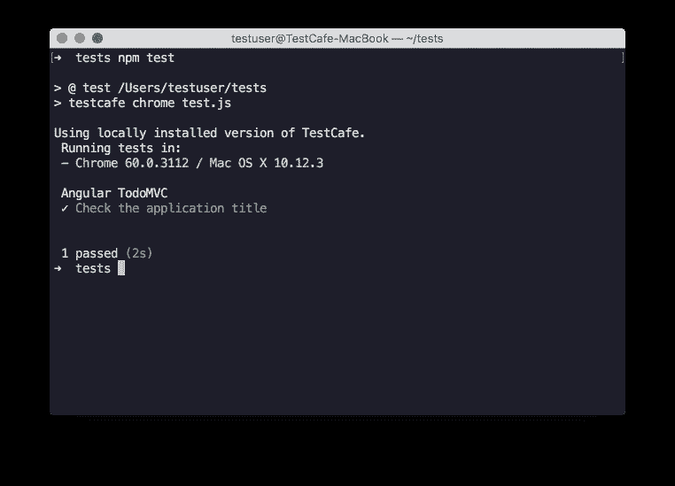
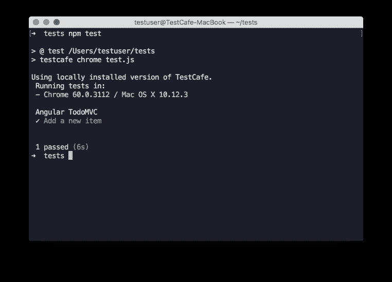
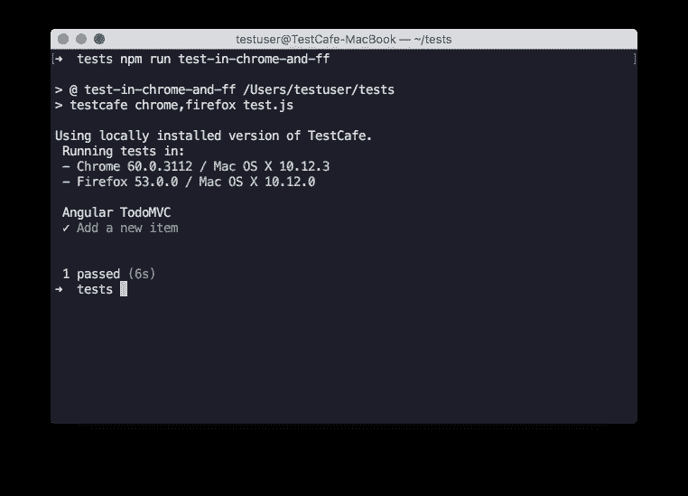
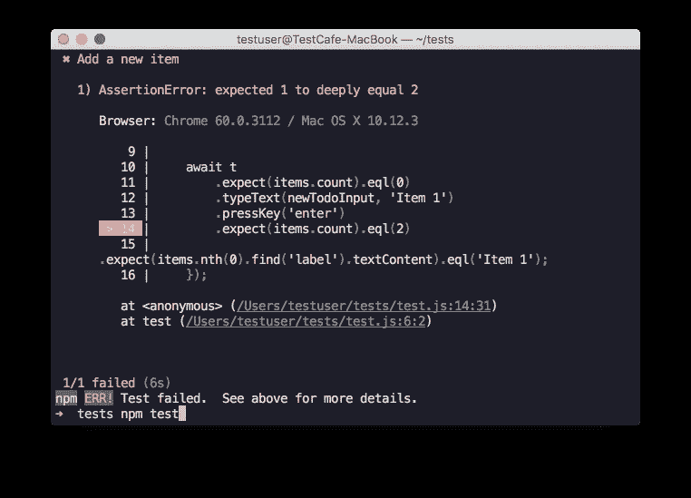

# E2E 用 TestCafe 测试 AngularJS 应用程序

> 原文：<https://medium.com/hackernoon/e2e-testing-angularjs-applications-with-testcafe-96108abe4bec>

如果你用 [AngularJS](https://angularjs.org/) 写字，那么你首先想到的很可能是用量角器测试。但这是唯一的选择吗？如果你对其他选择感到好奇，请继续阅读。

在本教程中，我将展示如何使用 [TestCafe](https://devexpress.github.io/testcafe/) 测试 [AngularJS](https://hackernoon.com/tagged/angularjs) 应用。

# 设置

TestCafe 是一个 [Node.js](https://hackernoon.com/tagged/nodejs) 解决方案。所以你需要安装一个 [Node.js](https://nodejs.org) 版本 4.x 及更高版本。

现在让我们从 npm 安装 TestCafe 和`testcafe-angular-selectors` [插件](https://github.com/DevExpress/testcafe-angular-selectors):

```
npm install testcafe
npm install testcafe-angular-selectors
```

就这样，其他所有东西都从盒子里出来了。TestCafe 不使用 WebDriver。如果你想知道如何以及为什么，看看常见问题解答。

# 进行第一次测试

让我们做一个简单的测试并运行它。在本教程中，我们将使用 [TodoMVC](http://todomvc.com/examples/angularjs/#/) 应用程序。

创建一个`test.js`文件，并将下面的代码复制到其中。

在这个测试中，我们已经检查了应用程序标题等于`todos`。这里`test`代表一个单独的测试用例。而`fixture`就是这些测试中的一套。要了解更多关于测试结构的信息，请查阅[文档](https://devexpress.github.io/testcafe/documentation/test-api/test-code-structure.html)。

要运行测试，在与`test.js`相同的文件夹中创建`package.js`文件。将以下代码复制到这个新文件中:

现在，我们可以使用以下命令运行测试:

```
npm test
```



Results of the first test run

测试通过了。默认情况下，TestCafe 在您启动测试的 shell 中显示报告。这些报告用[规范](https://github.com/DevExpress/testcafe-reporter-spec)表示，这是一种人类可读的报告格式。如果你想使用其他格式(例如 json、xUnit、Slack messages)，你可以尝试一个[现有插件](https://devexpress.github.io/testcafe/documentation/using-testcafe/common-concepts/reporters.html)或者在[官方教程](https://devexpress.github.io/testcafe/documentation/extending-testcafe/reporter-plugin/)的帮助下创建自己的插件。

# 使用角度选择器

让我们修改测试来与页面元素交互。

我们添加了新的选择器:`byModel`和`byRepeater`。它们来自我们之前安装的插件`testcafe-angular-selectors` [。`byModel`通过 ng-model 表达式查找元素。而`byRepeater`通过 ng-repeat 表达式找到元素。](https://github.com/DevExpress/testcafe-angular-selectors)

如您所见，我们首先检查 todo 项的数量是否等于 0。然后我们键入`Item 1`并按回车键。接下来，我们添加两个断言:一个检查现在是否有 1 个元素，另一个检查这个元素的文本是否等于`Item 1`。

让我们用`npm test`命令再次运行测试，看看它是否通过了。



Results of the second test run

# 在各种浏览器中运行测试

TestCafe 支持最新版本的流行浏览器。使用[插件](https://devexpress.github.io/testcafe/documentation/using-testcafe/common-concepts/browser-support.html#browsers-in-cloud-testing-services)，你可以在云浏览器提供商中运行你的测试。在文档中阅读更多关于[浏览器支持的信息。](https://devexpress.github.io/testcafe/documentation/using-testcafe/common-concepts/browser-support.html)

TestCafe 本身会检测你在本地机器上安装了哪些浏览器。要在几个浏览器中运行测试，请用逗号分隔它们。给`package.json`增加一条命令:

现在开始测试:

```
npm run test-in-chrome-and-ff
```



Results for the tests launched in Chrome and Firefox

或者使用单词`all`在 TestCafe 已经找到的所有浏览器中运行测试。将以下行添加到`package.json`文件中:

```
"testcafe-in-all-browsers": "testcafe all test.js"
```

测试在您指定的所有浏览器中同时执行。您还可以在同一个浏览器的几个实例中同时运行测试。这使得测试批次完成得更快。更多信息见[文档](https://devexpress.github.io/testcafe/blog/testcafe-v0-17-0-released.html#concurrent-test-execution-1165)。

# 查看失败测试的报告

让我们修改测试来查看失败测试的报告。更改最后一个断言，使测试失败:

再次启动测试以查看错误报告。



TestCafe highlights the line where the assertion has failed

对于每个失败的测试，TestCafe 报告浏览器、调用点和其他细节，让您可以快速找到失败的原因。为了修复测试，我们应该在最后一个断言中用 1 替换 2。

# 扩展 TestCafe 功能

你可以访问 GitHub 了解更多关于 [TestCafe 生态系统](https://github.com/DevExpress/testcafe#testcafe-ecosystem)的信息。如果您需要测试代码中的更多功能，您可以使用任何 node.js 模块。TestCafe 还为使用便携式和远程浏览器的[提供了扩展功能](https://devexpress.github.io/testcafe/documentation/extending-testcafe/browser-provider-plugin/)和定制测试报告的[。](https://devexpress.github.io/testcafe/documentation/extending-testcafe/reporter-plugin/)

如果你想制作自己的插件，查看文档中的[提示。你也可以向 TestCafe 开发者发送一个快速通知，与社区分享你的插件(通过](https://devexpress.github.io/testcafe/documentation/extending-testcafe/) [GitHub issue](https://github.com/DevExpress/testcafe/issues) 或 [Twitter](https://twitter.com/DXTestCafe) )。

# 结论

现在您已经看到了如何在 AngularJS 应用程序中使用 TestCafe 进行 e2e 测试。您可以自己尝试一下，看看它是否符合您的测试需求。别忘了在 twitter 上用`#TestCafe`标签分享你的想法。

' testcafe-angular-selectors '插件扩展了[内置的 testcafe 元素选择器](https://devexpress.github.io/testcafe/documentation/test-api/selecting-page-elements/selectors.html)。这个插件增加了方法(`byModel`、`byBinding`、T19)等。)允许您通过 AngularJS 绑定来查找元素。Angular (v2.x)的插件也即将推出。它将提供组件选择器，允许通过 Angular 的组件标签名称访问元素。

要了解新闻和更新，请在 Twitter 上关注[test cafe](https://twitter.com/DXTestCafe)。如果你有任何问题，可以在[论坛](https://testcafe-discuss.devexpress.com/)或者浏览 [GitHub 问题页面](https://github.com/DevExpress/testcafe/issues)提问。