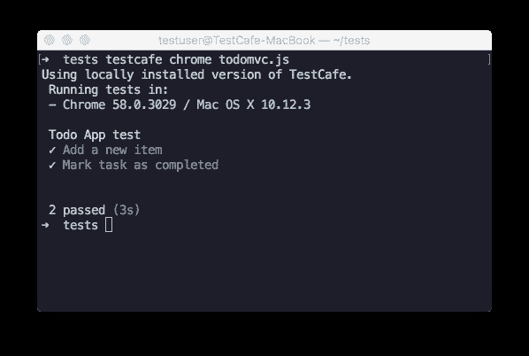

# E2E 用 TestCafe 测试 React 应用程序

> 原文：<https://medium.com/hackernoon/e2e-testing-react-applications-with-testcafe-8edb605ec66c>

# 介绍

诞生于 T4 脸书 T5 实验室的 React T7 在开发复杂用户界面的 web 应用程序的开发人员中非常受欢迎。React 被广泛应用于需要易于扩展、简单维护和快速性能的单页面应用程序项目中，已经成为 JavaScript 开发者社区事实上的标准。像脸书、网飞、Airbnb 和许多其他公司使用 React 作为主要框架来构建他们服务的用户界面。

React 对应用程序结构使用基于组件的方法，让用户通过组合拥有自己的行为、状态和视图的组件来构建应用程序 UI。这样，React 为 HTML 元素增加了另一个抽象层。为了使 React 开发人员在编写 e2e 测试时能够保持基于组件的范式，我们 TestCafe 团队制作了`testcafe-react-selectors`——一个引入本地方法来测试 React 应用的插件。

在本文中，我们将使用 [TestCafe](https://devexpress.github.io/testcafe/) 来测试 React TodoMVC 应用程序。

# Todo MVC 应用程序

要部署 TodoMVC 应用程序进行测试，请在[https://github.com/reactjs/redux](https://github.com/reactjs/redux)克隆 Redux 存储库，并打开 Todo MVC 示例目录(/examples/todomvc)。安装依赖项并从该目录运行`npm start`以开发模式构建应用程序。

```
git clone https://github.com/reactjs/redux
cd redux/examples/todomvc

npm install
npm start
```

该应用程序将被部署在 [http://localhost:3000](http://localhost:3000/) 。

它具有以下组件结构。

# TestCafe 设置

首先，从 npm 安装 TestCafe。

```
npm install -g testcafe
```

然后安装`testcafe-react-selectors`模块。

```
npm install -g testcafe-react-selectors
```

对于`testcafe-react-selectors`文档，请访问其[库](https://github.com/DevExpress/testcafe-react-selectors)。

# 页面对象

让我们创建一个与上面的 JSX 标记相对应的页面对象。我们将使用 ES6 类语法来定义您将在测试中与之交互的组件结构。

创建一个`page-object.js`文件并导入`testcafe-react-selectors`模块。在该文件中，创建一个表示 TodoMVC 应用程序页面的类。使用 ReactSelector 构造函数为所需的页面元素创建选择器。

我们为输入新任务的字段和当前任务列表创建了选择器。

# 测试 TodoMVC 应用程序

创建一个 fixture 文件`todomvc.js`并将[指定为起始页。要使用应用程序页面，请使用 page 对象导入一个模块，并创建一个 page 类实例。](http://localhost:3000/)

`ReactSelector`是围绕`[Selector](http://devexpress.github.io/testcafe/documentation/test-api/selecting-page-elements/selectors.html)`对象的包装器，所以在处理结果元素时，我们可以使用 TestCafe 选择器的全部功能。

让我们编写一个测试，向 Todo 列表添加一个新元素

要了解更多关于 TestCafe 断言的信息，请参见[断言 API](http://devexpress.github.io/testcafe/documentation/test-api/assertions/assertion-api.html) 。

# 组件状态和属性

`testcafe-react-selectors`允许你使用`getReact`方法获得一个 React 组件的状态和属性。此方法返回包含组件状态和属性的对象。或者，您可以传递一个选择要返回的特定属性的函数。考虑下面的例子:我们需要将一个任务标记为完成，并测试相应的组件是否已经改变了它的属性。

# 运行测试

使用以下命令从控制台运行测试:

```
testcafe chrome todomvc.js
```

TestCafe 将在 Google Chrome 中运行测试，并输出以下报告:



要在多个浏览器中并行测试，您可以使用逗号分隔的列表，如`chrome,firefox,edge`或`all`别名，在所有本地安装的浏览器中运行测试。

```
testcafe all todomvc.js
```

您还可以定义将运行 TestCafe 测试的`npm test`命令。注意，您需要一个本地安装的 TestCafe 模块来从 npm 脚本启动测试。为了引入`npm test`命令，将下面的代码添加到项目的`package.json`文件中。

你可以在这里找到更多关于 TestCafe 命令行界面[的信息。](https://devexpress.github.io/testcafe/documentation/using-testcafe/command-line-interface.html)

# 扩展 TestCafe 功能

点击了解更多关于 TestCafe 生态系统[的信息。如果您需要测试代码中的更多功能，您可以使用任何 node.js 模块。TestCafe 还提供了使用](https://github.com/DevExpress/testcafe#testcafe-ecosystem)[便携式和远程浏览器](https://devexpress.github.io/testcafe/documentation/extending-testcafe/browser-provider-plugin/)和[定制测试运行报告格式](https://devexpress.github.io/testcafe/documentation/extending-testcafe/reporter-plugin/)的扩展功能。

# 社区

如果你有关于 TestCafe 的问题——欢迎在我们的[论坛](https://testcafe-discuss.devexpress.com/)或 [GitHub 页面](https://github.com/DevExpress/testcafe)提问！

[](http://bit.ly/HackernoonFB)[](https://goo.gl/k7XYbx)[](https://goo.gl/4ofytp)

> [黑客中午](http://bit.ly/Hackernoon)是黑客如何开始他们的下午。我们是阿妹家庭的一员。我们现在[接受投稿](http://bit.ly/hackernoonsubmission)并乐意[讨论广告&赞助](mailto:partners@amipublications.com)机会。
> 
> 如果你喜欢这个故事，我们推荐你阅读我们的[最新科技故事](http://bit.ly/hackernoonlatestt)和[趋势科技故事](https://hackernoon.com/trending)。直到下一次，不要把世界的现实想当然！

