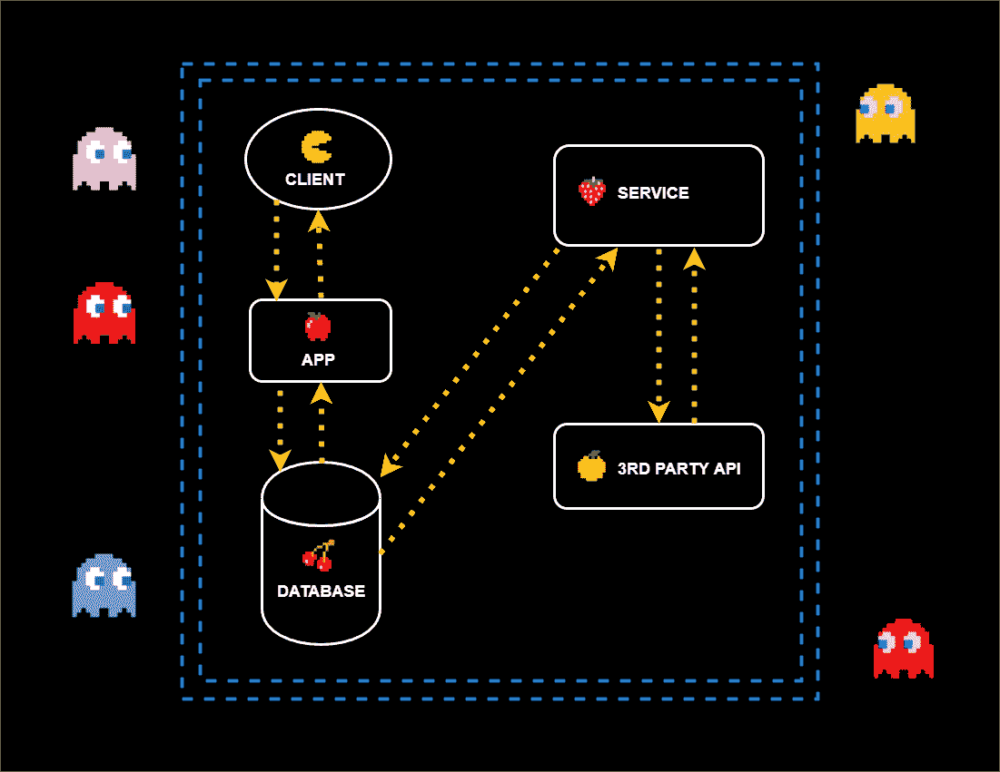
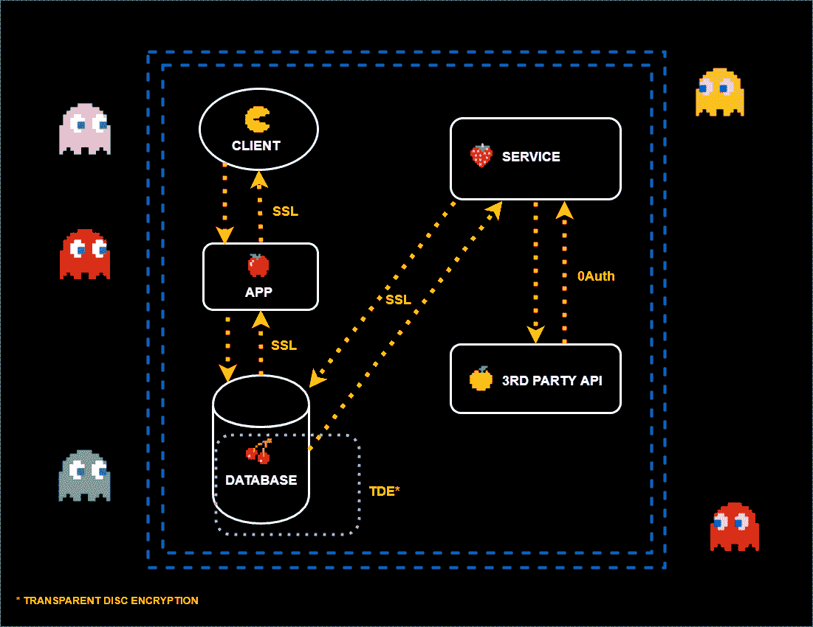
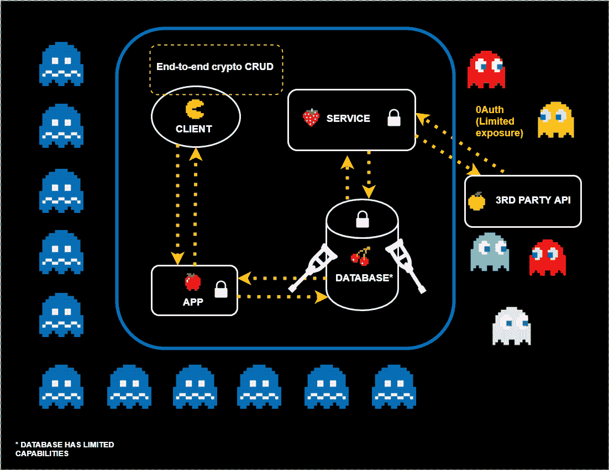
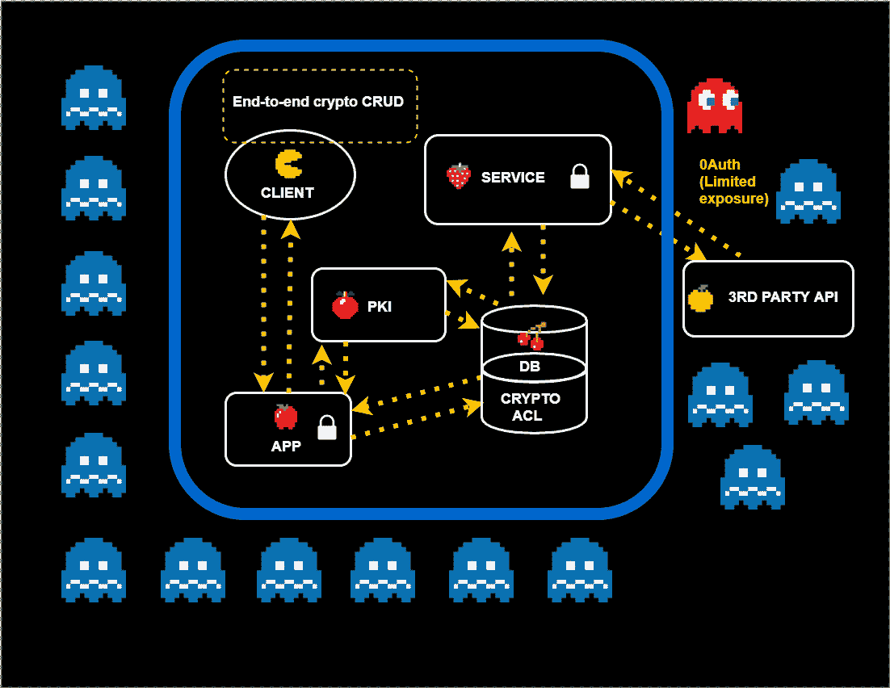

# 利用端到端加密构建应用后端

> 原文：<https://medium.com/hackernoon/e2ee-app-backends-286cc94b8a7>

*仔细看看端对端加密的有据可查但很少实施的特性。*

## 介绍

安全架构和信任模型经常被定义和重新定义。带有可疑代码运行时、虚拟资产和远程秘密存储的 Web 不断引入新的有趣风险和安全挑战。

回过头来看，可以肯定地说，在构建安全系统的领域中，最容易被忽视的一个想法是，实际理解不是工作流应该适合可用的算法，而是应该将算法结合到能够保护现实世界场景的系统中。迄今为止，密码学的最大影响和极端抽象算法应用的进步已经在旨在解决现实世界问题的领域中实现，即[端到端](/@cossacklabs/eli5-end-to-end-encryption-ae46821db74f)安全消息传递。

随着硬件发展的步伐不断加快，加密的性能损失变得不那么重要，用户和他们的安全问题最终是否应该真正解决他们所追求的问题，而不是它的一个子集？

资源和方法都在那里。理想情况下，我们希望安全系统能够以 1:1 的比例将真实世界的用例映射到安全工具上。

## **何苦呢？**

出发点很简单——没有加密防御，只有一堆访问控制。

*Scheme #1: Unprotected infrastructure.*

构建基于加密的安全性有两种方法:端到端加密(E2EE)方法和非端到端方法(我们称之为非 E2EE 方法，因为缺少一个更简短的术语)。第一种在历史上更侧重于用户之间的通信，因为直观上更容易证明建立一个复杂的密码系统来复制现实世界中存在的通信秘密是正确的。端到端加密提供了实际客户端之间的核心安全保证(“CIA 三元组”)，并将除了直接参与对话的实际实体之外的所有人拒之门外。

在使用非 E2EE 的情况下，只有数据生命周期的一部分受到加密解决方案的保护，并防范该部分中可见的风险。数据未加密的缝隙/点通常是风险变成威胁、威胁变成违规的地方。

*Scheme #2: Segment-in-a-chain encryption. SSL and data-at-rest protection for the database (with possible “breach points” marked).*

现在，让我们以一个典型的客户端-服务器比喻为例，跟踪其安全性从非 E2EE 到适当的端到端加密的演变。

*Scheme #3: In-app end-to-end encryption, which still leaves a lot to imagination (there are unfilled resource gaps and the capabilities of a database are also limited).*

这种安全性发展的第一步是在应用程序中实际使用数据的地方进行加密和解密。但这只是挑战的开始。

为了在应用程序的不同实例之间共享数据，我们需要共享访问键。

*   为了控制对加密数据的访问权限，我们:

—要么需要在服务器存储实体上构建一个访问控制实体，需要能够识别传入的用户和查询，并决定他们是否有资格执行特权。

—将通过集成基于属性的加密等技术，以加密方式实施访问权限控制。

*   沿着这条线有太多的东西等待被打破，即:

—认证过程，

—访问控制记录，

—访问控制执行流程。

如果没有加密，所有这些都可以通过来自访问控制威胁边界之外的攻击完全绕过。

难怪人们坚持使用更简单的数据保护手段——实施加密似乎是一项严肃的任务。

## 我们需要什么？

在客户机-服务器关系的典型模式下，对数据实施访问控制的加密方法会很方便。

为什么我们需要数据库中的访问控制？有了明确的访问控制系统，我们就可以对存储的数据进行读取和搜索。让我们评估一下可能的已知选项:

*   [**CryptDB**](https://css.csail.mit.edu/cryptdb/) 允许对数据进行加密，并在事后通过具有有限安全性的已知技术的组合对其执行查询。
*   [**同态加密**](https://www.microsoft.com/en-us/research/project/homomorphic-encryption/) 允许您以一种特殊的方式加密数据，其中服务器能够对加密的数据运行某些数学运算，这可以启用查询和索引的构造。
*   [**zero db**](https://opensource.zerodb.com/)***等*允许你在服务器上存储加密的数据，并在每次有人想用它做什么的时候传输数据的子集。**

**这里好像少了点什么。所有这些方法都专注于解决一个问题——如何让人们安全地阅读和搜索(因为搜索是阅读的子集，如果你想一想的话)数据。但是典型的数据库访问模式包括更多，不是吗？**

## **至少，我们想要垃圾。**

**如果我们能够以加密的方式提供(并支持)所需的流程——同时在客户端执行所有的基本数据操作——我们不仅可以为数据块提供端到端的保护，还可以为整个数据周转过程提供保护。然后我们可以用这些方法中的一种，在它的基础上建立可搜索的加密。**

**如果我们能够为整个 CRUD 权限集提供访问控制的完整性和可证明的实施，我们将拥有一个强度与客户端的强度相同的系统(无论如何，它会逐渐公开明文)。由于对敏感数据的攻击首先针对云/存储，这大大降低了泄漏发生的几率。**

****

# **解决问题的方法**

****1。基于属性的加密****

**基于属性的加密是一种公钥加密算法，其中用于数据解密的私钥取决于某些用户属性，如位置、居住地或帐户类型。**

**属性加密的概念最早于 2005 年由[的 Amit Sahai](https://en.wikipedia.org/wiki/Amit_Sahai) 和[的 Brent Waters](https://scholar.google.com/citations?user=VEKxHOAAAAAJ) 在[“基于模糊身份的加密”](http://eprint.iacr.org/2004/086.pdf)中发表，随后由 Vipul Goyal、Omkant Pandey、Amit Sahai 和 Brent Waters 在一篇论文中进一步发展——基于属性的加密，用于加密数据的细粒度访问控制。**

**基于属性的加密支持以加密形式存储某些数据属性，并具有细粒度的访问控制。这种加密的目的是仅在存储或导出敏感数据时保护敏感数据(在第三方数据库中)。属性加密是在数据库级别配置的。属性加密后，它会在每个数据库条目中加密。对于对数据库的搜索请求，加密的属性被解密。**

**基于属性的加密的问题是，由于它只为存储的属性提供保护，因此需要为属性的传输实施额外的安全措施。**

**另一个问题是，我们不能现实地期望为整个基础设施建立一个单一的授权中心，在实践中更有可能使用多授权的基于属性的加密——这可能会使系统受到共谋攻击，并使用户的隐私更容易受到攻击。**

**此外，虽然基于属性的加密提高了数据安全性，但它会显著影响性能。当您使用基于属性的加密时，您不能仅使用二进制副本从一台服务器初始化另一台服务器，这意味着基础架构中的每台服务器都必须是唯一的。**

****2。基于访问控制的密码系统****

**密码术本质上限制了对数据的读取访问。然而，在更复杂的情况下，问题远远超出了简单的读取过程。提供读取访问可以通过处理秘密密钥或者通过在等式中添加非对称加密来实现，以便只有具有合适的私有密钥的接收者才能访问它。**

**问题是，第一种解决方案很有效，但容易泄漏，第二种解决方案效率较低，也很难维护。**

**但是如果我们把它们结合起来呢？让我们为存储的每条记录准备一个对称密钥和认证标签。通过控制密钥，我们控制了阅读，但我们不想冒匿名泄露的风险。我们能做的是将这个密钥包装在一个非对称密码中，让其他人读取。**

**要验证写入/更新，我们可以执行以下操作:**

*   **允许客户端计算更新标签，**
*   **比较更新标签以证明更新程序是正确的。**

**为了验证创建过程，我们只需要一个父/子关系和父实体的写/更新特权。**

**删除过程的验证将与父+子的更新相同(零填充数据，从父移除链接)。**

**另一组重要的考虑因素是在哪里存储加密 ACL 以及在哪里存储和如何分发密钥的问题。遵循最大划分的思想，需要将键与数据隔离，需要将访问键与存储键隔离；密钥发现必须与密钥存储分开，并且所有这些元素必须依赖于它们自己的安全机制。**

****

**Scheme #4: Implementing practical end-to-end encryption with access control in place.**

****3。搜索****

**这仍然留下了执行搜索的问题。虽然对可搜索加密进行了许多先进的现代研究，但这些方法中的大多数都有实际的缺点。我们在上面概述了一些方法，但是还有一个方法:将搜索过程限制在非敏感数据上，或者对标记化的数据执行搜索，保留明文。**

**在许多情况下，这就足够了。**

****4。密钥管理****

**旋转、撤销密钥和用户特权一直是密码学研究的一个挑战。成功的密钥管理对于基础设施的整体安全性来说是至关重要的，但是授权机制的正确和安全运行所必需的操作数量(具有需要正确生成、保护、存储、处理、安全删除等的密钥。)把它变成一项远非琐碎的任务。在云环境中，事情变得更加复杂。尽管存在一些实用的解决方案和实现，但它们主要针对非 E2EE 方法。**

# **那么，我们该怎么办呢？**

**我们应该构建自己的系统，还是推动加密行业减少敏感数据保护的其他领域的威胁？**

**虽然端到端的人际通信方式进展缓慢且不可阻挡，但端对端加密是保护权限和写操作的有效解决方案的想法仍然是一个奇怪且陌生的想法。但这没必要——事实上，目前有一种已知且行之有效的(尽管有点深奥)方法可以让您的外围环境变得更安全，这种想法应该积极改为——有一种已知、行之有效且实用的方法来保护受信任的外围环境——所以让我们尽可能多地使用它。**

**尽管仍有一些主要与性能和带宽相关的问题有待解决，或者说——更正确的说法是——有待优化，但这正是大型系统发展的下一个逻辑步骤，以及加密访问控制的实施。是的，一开始可能会有点混乱，但这毕竟是进化在起作用。**

***如果你有故事要分享* — *我们很想听听你的故事！请通过*[*【info@cossacklabs.com】*](http://info@cossacklabs.com/)或[*@ cossacklabs*](https://twitter.com/cossacklabs)*与我们联系。***