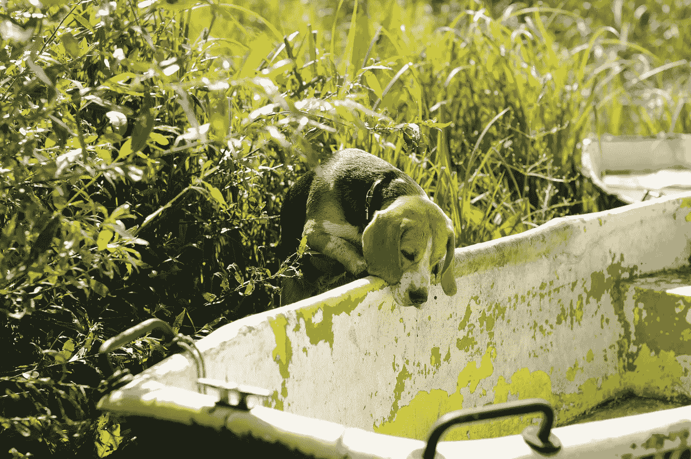

# 初创企业首席技术官生存指南

> 原文：<https://medium.com/hackernoon/early-startup-cto-survival-guide-a67ebad2a166>

## 科技购物清单

比方说，你和你的伙伴们已经准备好接受 Medium 并推出你的私人平台— **Medium for Pet's blogs** 。
你认为它有市场，你准备继续前进！


Photo by [Krista Mangulsone](https://unsplash.com/photos/9gz3wfHr65U?utm_source=unsplash&utm_medium=referral&utm_content=creditCopyText) on [Unsplash](https://unsplash.com/?utm_source=unsplash&utm_medium=referral&utm_content=creditCopyText)

让我们回顾一下我们的 web 应用程序的需求:

1.  宠物必须能够注册并写下它们的故事。
2.  既然很多宠物已经有了自己的 Twitter，我们应该让
    它们注册自己的账户。
3.  宠物需要能够标记他们的文章，并附上大量的图片。
4.  宠物媒体应该有一个主页，上面会有所有有趣的文章。
5.  访问者应该能够阅读和喜欢文章，以及向他人推荐。
6.  访问者应该能够搜索文章。
7.  访问者应该能够订阅接收关于新文章的电子邮件通知。

这看起来像一份不错的购物清单。我们开始吧！

首先，我们需要一个好的 web 框架。根据你的经验和知识，可能是 [**Ruby on Rails**](http://rubyonrails.org/) 、[**Express**](https://expressjs.com/)**(node . js)**或 [**Laravel**](https://laravel.com/) 。
你挑选的框架需要帮助你快速开发原型。大多数 web 框架都有一些包/组件系统，可以帮助你扩展它的功能。

## 签约雇用

让我们首先解决支持社交账户的宠物认证系统。由于我们正在构建一个[最小可行产品](http://theleanstartup.com/principles)来发布并验证我们的假设，我们将寻求类似 [Aut](https://auth0.com/) h0 O [kta 的解决方案。实际上，我们将把用户管理、认证和安全外包给第三方，以加快开发速度。](https://developer.okta.com/)

在未来的某个时候，我们可以考虑转向我们的私人自制解决方案。如果我们想控制用户体验的每一个方面，这可能是很重要的。

Laravel 社交认证功能可通过[社交名媛](https://github.com/laravel/socialite)套装获得。Rails 有[omni auth](https://github.com/omniauth/omniauth)node . js 有 [Passport.js](http://www.passportjs.org/) 。所有这些选项都很容易实现。

## 创造

登录后，我们的宠物作者应该能够访问他们可以开始创建内容的区域。此时，我们需要决定我们的存储技术。像 **MySQL** 和 **Postgres** 这样的数据库管理系统是存储我们文章的理想选择。MongoDB 也可以很好地工作，特别是如果你选择 Node.js 作为你的后端技术。

为了让我们的宠物作家的生活更舒适，我们必须选择一个所见即所得的编辑器。有很多选项，比如 TinyMCE、Frola、Summernote，但是我们将选择 [Redactor](https://imperavi.com/redactor/) ，因为它非常灵活，并且可以通过简单的 API 进行扩展。


Photo by [rawpixel.com](https://unsplash.com/photos/EF8Jr-uPS2Y?utm_source=unsplash&utm_medium=referral&utm_content=creditCopyText) on [Unsplash](https://unsplash.com/?utm_source=unsplash&utm_medium=referral&utm_content=creditCopyText)

另一个重要的特性是能够将图片与我们的文章联系起来。在这种情况下，当我们谈论存储时，我们有几个选择。我们可以将图片保存在应用程序所在的文件系统中。虽然这将是一个超级简单的解决方案，但我们不要自欺欺人，我们的应用程序将会取得巨大的成功，我们必须在我们的脑海中不断扩展。我们必须将我们的图像存储视为[附加资源](https://12factor.net/backing-services)，并保持我们的应用程序[无状态](https://12factor.net/processes)。拥有一个无状态应用程序将允许我们运行它的多个实例，这样我们就有机会在需要时扩展容量。
储存图像有很多选项。其中最明显的是亚马逊对象商店——S3。我们所有的网络框架都支持上传图片到 S3。例如，Laravel 使用的 Flysystem composer 包不仅支持 AWS，还支持其他提供商——Azure、Digital Ocean、Rackspace。对于我们的项目，我们将选择 [Cloudinary](https://cloudinary.com/) ，这是一个端到端的媒体管理解决方案。他们通过支持 Cloudflare、CloudFront 的 CDN 网关提供图像存储、优化、处理和交付…同样，我们正在构建 MVP，因此让我们保持简单，目前尽可能外包。

## 前端

在事物的前端，我们也应该从简单开始。我们将使用 Twitter Bootstrap & jQuery。随着我们的项目在功能和交互性方面的发展，我们可以考虑其他更强大的选项，如 React & Vue.js.
在开始时，最重要的是建立高效和紧密的前端构建系统，以帮助我们进行资产编译和优化。为此，我们可以使用我们的 web 框架中可用的内容。Laravel 有[组合](https://laravel.com/docs/master/mix)，Rails 有[链轮](http://guides.rubyonrails.org/asset_pipeline.html)。

## 搜索

正如我们之前提到的，我们希望给我们的访问者一个搜索文章的选项。尽管我们选择的数据库 MySQL 支持全文搜索，但它不是一个最佳的解决方案，也不是未来/特性的证明。我们需要的是一个类似于 **Elasticsearch** 的东西，一个带有 RESTful API 的搜索引擎。
由于我们现在不想管理 Elasticsearch 集群，我们应该看看一些托管/管理的解决方案。Elastic(项目背后的公司)和 AWS 都提供了不同选项的解决方案。



Photo by [Agnieszka Boeske](https://unsplash.com/photos/WYoeCS2vefc?utm_source=unsplash&utm_medium=referral&utm_content=creditCopyText) on [Unsplash](https://unsplash.com/?utm_source=unsplash&utm_medium=referral&utm_content=creditCopyText)

为了使事情变得非常简单，我们将选择“类似专家系统”的解决方案。它将为我们提供类似的功能，但大大降低复杂性。 [Algolia](https://www.algolia.com/) 是基于 API 的托管/管理解决方案，提供几乎所有功能系统，如 Elasticsearch 产品。

```
# indexing docs with Algolia could not be simpler
const myIndex = apiClient.initIndex('articles');
myIndex
  .addObject({
    author: 'karate_the_dog',
    title: 'Running around'
  })
  .then(content => console.log(content))
  .catch(err => console.error(err));
```

他们还为所有流行的语言和框架提供了插件库。Laravel 通过 [Scout 包](https://laravel.com/docs/master/scout)原生支持。

## 签署

我们的读者希望随时了解最新情况。关于宠物日常生活的迷人故事，不容错过。我们的读者应该能够订阅她最喜欢的作者，并在每次发表新文章时收到电子邮件通知。


Photo by [Samuel Zeller](https://unsplash.com/photos/G_xJrvHN9nk?utm_source=unsplash&utm_medium=referral&utm_content=creditCopyText) on [Unsplash](https://unsplash.com/?utm_source=unsplash&utm_medium=referral&utm_content=creditCopyText)

我们如何处理电子邮件？我们没有！如果只有一件事，你不应该关心在这一点上，将管理电子邮件服务器。有许多服务可以帮助你解决电子邮件问题。在这个领域，我们有两种类型的服务:交易电子邮件服务和时事通讯服务。这两者之间的差异非常显著。事务性电子邮件服务通过其 API 提供可靠的电子邮件消息发送。他们还提供简单的统计数据。简讯服务给你更多。他们为管理订阅和电子邮件活动提供了端到端的解决方案。同样，我们试图构建的是一个简单的功能，我们希望在这个阶段保持简单，所以我们将选择加入像 [Mailgun](https://www.mailgun.com/) 这样的交易电子邮件服务。

```
curl -s --user 'api:key-3ax6xnjp29jd6fds4gc373sgvjxteol0' \
    [https://api.mailgun.net/v3/samples.mailgun.org/messages](https://api.mailgun.net/v3/samples.mailgun.org/messages) \
    -F from='Karate the Dog <[excited@samples.mailgun.org](mailto:excited@samples.mailgun.org)>' \
    -F [to='devs@mailgun.net](mailto:to='devs@mailgun.net)' \
    -F subject='Hello' \
    -F text='My new article is out!'
```

选择这个选项，我们必须准备好处理一个被称为*响应电子邮件模板*的难题。但幸运的是，那里没有什么好的选择。Laravel 开箱即用，支持事务性消息的响应性电子邮件模板。如果你正在使用一个不同的框架，Mailgun 会用他们的解决方案【https://github.com/mailgun/transactional-email-templates】覆盖你。

## 检验

我们做到了！我们拥有开始构建我们的应用程序所需的所有技术！将所有不重要的技术外包给第三方，我们可以专注于重要的事情——让我们的初创公司与众不同的东西。将上面提到的所有服务视为附加资源，可以让我们快速扩展我们的应用程序。不仅如此，我们的应用核心和业务模型与基础设施是分离的。向前看，我们将有一条非常清晰的道路可以让我们的创业成功(至少在技术方面)。

[**下一次**](https://hackernoon.com/early-stage-startup-cto-survival-guide-part-2-90d49ee87696) 我们将看看一些关于我们应用程序的**质量**和**安全性**的最佳实践。我们将挑选**托管**和**开发**环境，并讨论**部署**策略。当然，最后，我们要谈谈这个叫做**移动**的小东西！

现在启动你的编辑器，让我们开始写代码吧！

**我们旅程的第二部分:** [协作与质量](https://hackernoon.com/early-stage-startup-cto-survival-guide-part-2-90d49ee87696)。

*感谢阅读！如果你喜欢这个故事，请* ***点击*** 👏 ***按钮*** ***分享*** *帮助别人找到！欢迎留言*💬*下图。
有反馈吗？让我们成为朋友* [*在推特上*](https://twitter.com/gil__x) *。*