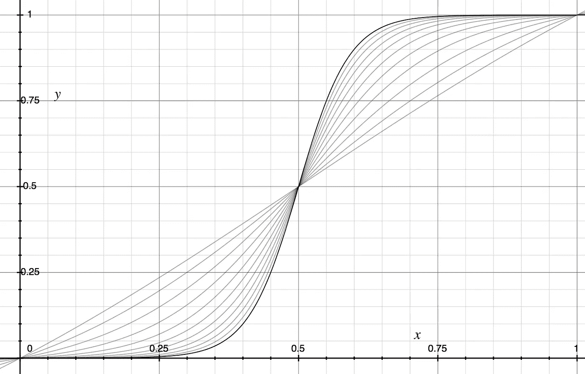
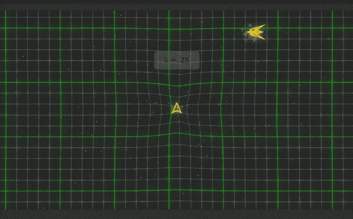
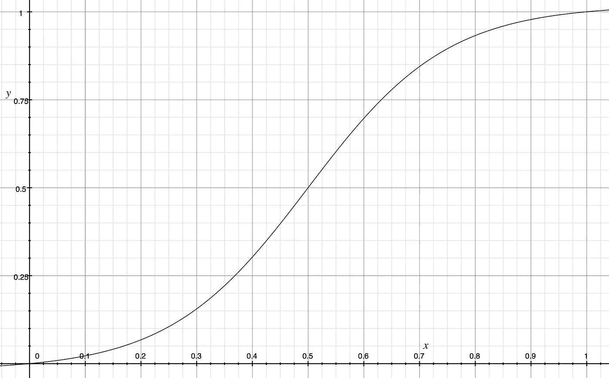
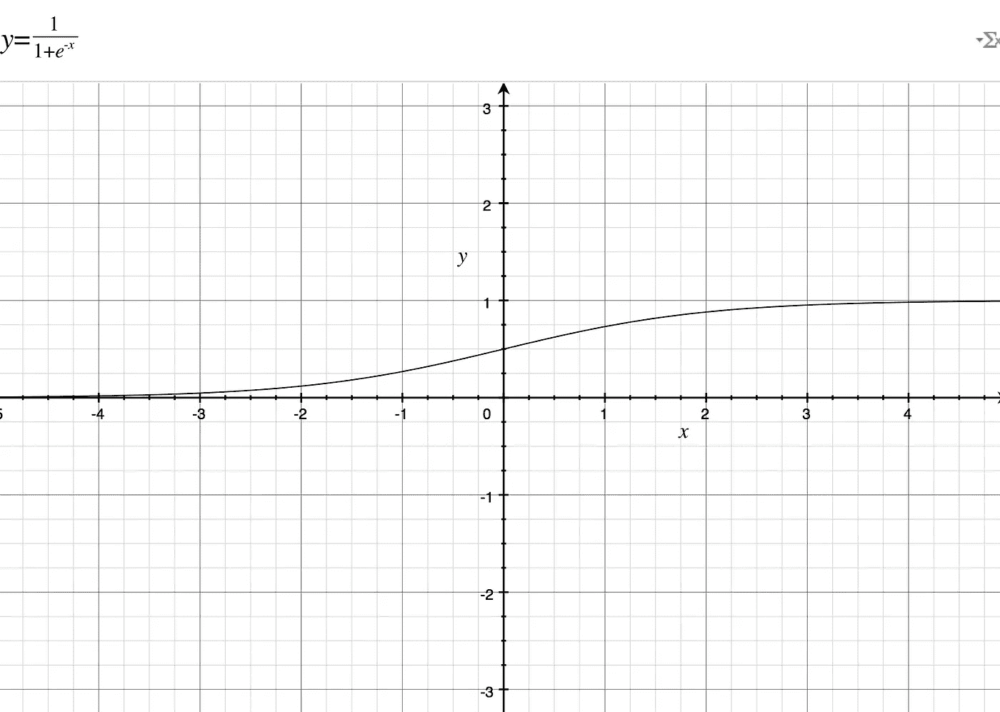
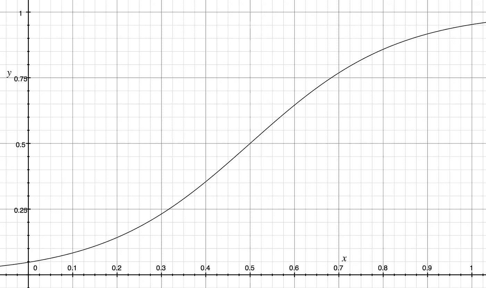
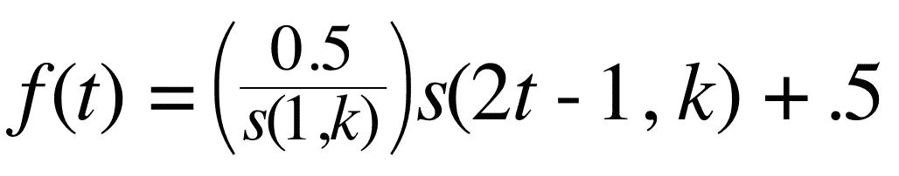
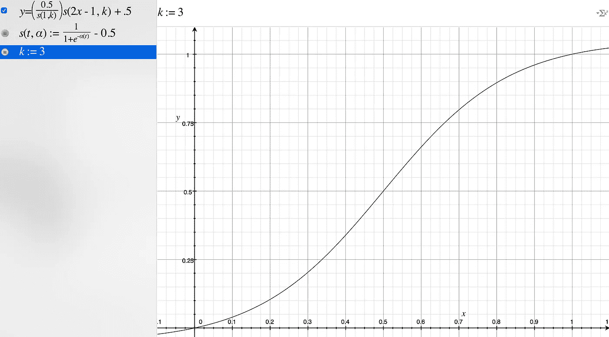
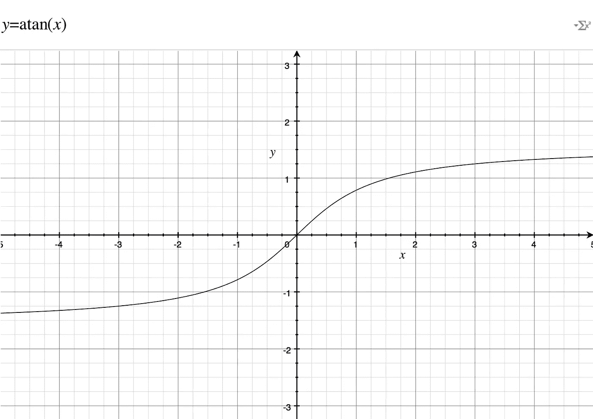
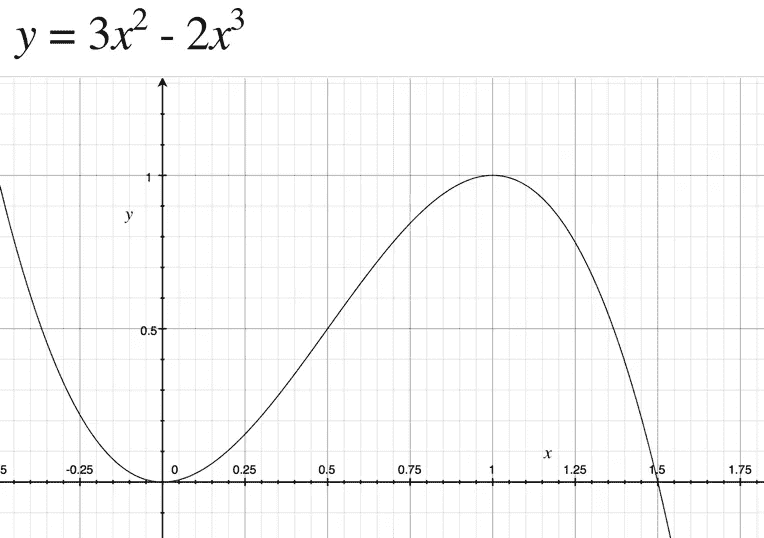

# 放松，放松:乙状结肠工厂

> 原文：<https://medium.com/hackernoon/ease-in-out-the-sigmoid-factory-c5116d8abce9>

## 使用可定制的渐入渐出动画制作您的 web 应用程序。



Ease-in-out: 11 Different versions plotted

动画被指定为渐出是很常见的。目睹一个物体加速、巡航和缓慢停止是一种非常愉快的感觉。大多数季节指定少量缓动曲线之一:easeInOutQuad、easeInOutSine、easeInOutCubic 等。然而，该曲线的锐度是不可配置的。在这里，我展示了如何创建一个可配置的渐出函数，它将为你想要的任何属性制作动画。

# 如何使用它

缓动函数采用单个参数 *k* ，指定曲线的陡度。 *k* 越大，曲线越陡，中间部分相对于起点和终点的速度越高。

*sigmoidFactory* 将产生一个函数，该函数采用一个参数 *t* 来表示动画完成的百分比，该百分比是一个介于 0 和 1 之间的数字。值得注意的是，这个系统只产生你可以在动画框架中使用的数字(你可能需要构建)。一个示例框架包含在[jsdild](https://jsfiddle.net/5zzh8Ljg/4/)中。

下面是一个用法示例:

```
var easing = sigmoidFactory(7);easing(0); // nearly 0 (5.551115123125783e-17)
easing(1); // 1
easing(0.5); // 0.5
easing(0.25); // 0.028453023879735584
easing(0.75); // 0.9715469761202644
```

你可以使用这个 [OS X Grapher 文件](https://drive.google.com/file/d/0BzMVmsOw9DxnVldNZENxb094STQ/view?usp=sharing&resourcekey=0-ydmBx4jcAXvWG-TfW8_qhQ)可视化地设计你的缓动曲线。修改 *k* 来调整陡度。



A demonstration of four different *k values implemented in the engine of mobile game* [*Epsilon Jump*](http://www.energizelabs.com/projects/epsilonjump/) *(*[*iOS*](https://itunes.apple.com/us/app/epsilon-jump/id1196043518?mt=8)*,* [*Android*](https://play.google.com/store/apps/details?id=com.NZLabs.EpsilonJump&hl=en)*) graciously provided by* Rienzi Gokea.

# 该理论

*本节不需要使用。请继续阅读，了解代码背后的技术，以便您能够开发自己的缓动曲线。*



首先，我们需要一个类似于 [easeInOut](http://easings.net/#easeInOutCubic) 的函数。我想到了两个符合要求的: [sigmoid](https://en.wikipedia.org/wiki/Sigmoid_function) (图 1，我们将使用它)和 [arctangent](http://mathworld.wolfram.com/InverseTangent.html) [1】(我们将不使用它)。



Figure 1\. The Sigmoid Function

然而，这两条曲线都有一些缺陷，我们必须加以弥补。我们希望我们的动画从 0 开始，到 1 结束。两个函数都从动画[的中间位置](https://hackernoon.com/tagged/animation)的 0 开始，并逐渐接近它们的最终值(对于 sigmoid 为 0 和 1，对于反正切为-π/2 到π/2)。

我们需要对我们选择的函数进行一些修正，以使它可以投入使用。

1.  将中心点沿 x 轴移动到 0.5。
2.  用仪器测量陡度旋钮。
3.  强制函数在 0 处越过 0，在 1 处越过 1。

我选择了 sigmoid 曲线作为我们的修正，因为它基于 *e* 这通常比反正切更容易分析，尽管在这种情况下它几乎同样容易处理。那个练习将留给读者。


Equation 1\. The Sigmoid Function

移动乙状结肠很容易。使用一个代数操作，如果我们的缓和函数是 *f(t)* ，那么移动中心点 0.5 是由 *f(t-0.5)* 完成的。

同样，如果我们将 *t* 乘以一个选定的旋钮， *f(kt)* ，如果 *k* > 1，我们可以使函数“加速并凝聚”，或者如果 *k* < 1，我们可以使其“缓慢并散开”。


Equation 2\. Sigmoid augmented with a knob *k and centered at t = 0.5.*

在等式中。2、我们将 *t* 的操作移到函数中，以使函数更易于使用。这解决了我们的前两个问题，但看看下面的图表。已经用 *k* = 6 绘制了 2。



Figure 2\. Eqn. 2 plotted with k = 6\. Note that the ends are significantly above 0 and below 1.

这是非常接近的！但是，动画的开头和结尾分别在 0 以上和 1 以下。这将导致动画在结尾呈现“跳跃”。如果 k 设置得足够高(大约 11 或 12 以上)，你甚至不会注意到这个问题。然而，这限制了我们的表达范围，因为我们不能使用任何浅曲线，但它可能对你来说已经足够好了，如果你愿意，你可以在这里停下来。

虽然你的第一直觉，也是我的直觉，可能是通过做一些技巧，比如乘以 *t* 或者使用一些疯狂的条件语句或反射，来找到一些方法使 sigmoid 通过零，但是有一种更简单的方法，那就是黑客。请注意，sigmoid 两端的误差是对称的，与 0 的距离等于与 1 的距离。如果我们可以缩放结果，使 0 通过 0，1 通过 1，会怎么样？

让这一策略发挥作用有几个步骤，但简单地说，你从一个以 0 为中心的基本 sigmoid(所以范围是-1/2 到 1/2)开始，乘以校正因子(0.5 / f(1))，然后找出如何将它向上(+0.5)和向右(t-0.5)。然后将函数的范围缩小 2 倍(在-1 时达到-0.5，在 1 时达到+0.5)。


Equation 3\. Evolved from Eqn. 2, this is our instrumented sigmoid centered at 0.



Equation 4\. The fully developed ease in out equation. s(t, α) comes from Eqn. 3\. The first term is the correction factor, the second term is our sigmoid, and the third term moves the curve into position.



Figure 3\. Equation 4 graphed at k = 3.

你可以在这里找到 [grapher 文件。](https://drive.google.com/file/d/0BzMVmsOw9DxnVldNZENxb094STQ/view?usp=sharing&resourcekey=0-ydmBx4jcAXvWG-TfW8_qhQ)

如果你喜欢这篇文章，请在 Medium 上关注我。你可能还喜欢[](/@willsilversmith/the-bounce-factory-3498de1e5262#.5t0mzua5k)**[*弹簧厂*](/@willsilversmith/the-spring-factory-4c3d988e7129) *，以及其他关于* [*解析动画*](https://medium.com/analytic-animations) *。***

# **尾注**

1.  **这是反正切的图片:**

****

**Inverse (Arc)tangent**

**2.在 Reddit 的一次讨论中，我注意到了 [smoothstep](https://en.wikipedia.org/wiki/Smoothstep) 功能。它在 1 和 0 处有 0 的导数，通常用于着色器中。**

****

**Figure 4\. Smoothstep**

# **参考**

1.  **[http://easings.net/](http://easings.net/)—许多常用缓和曲线的集合。**
2.  **[渐入渐出图](https://drive.google.com/file/d/0BzMVmsOw9DxnVldNZENxb094STQ/view?usp=sharing&resourcekey=0-ydmBx4jcAXvWG-TfW8_qhQ)——我开发的 Grapher 文件，用于设计我的渐入渐出功能。**