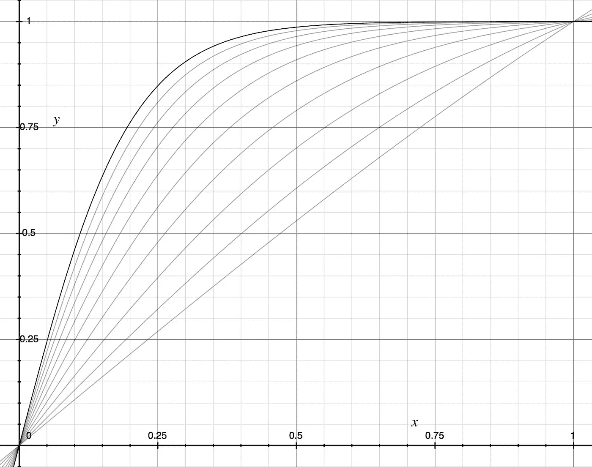
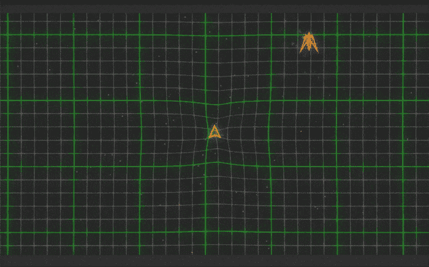
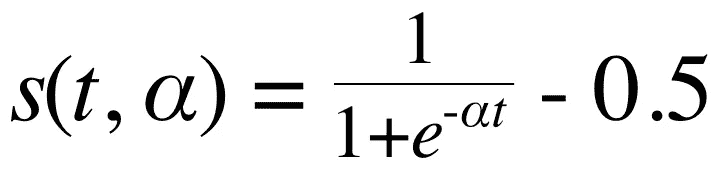
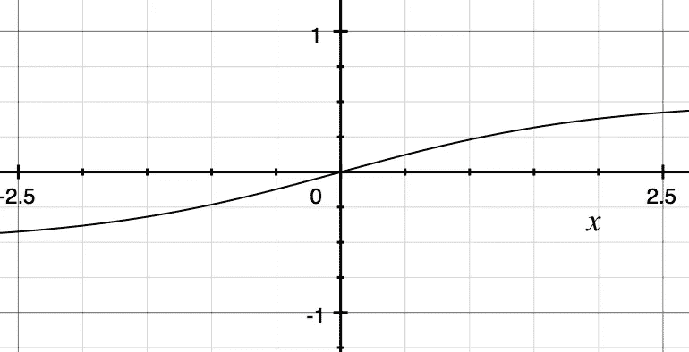
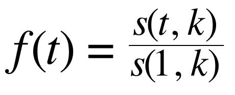
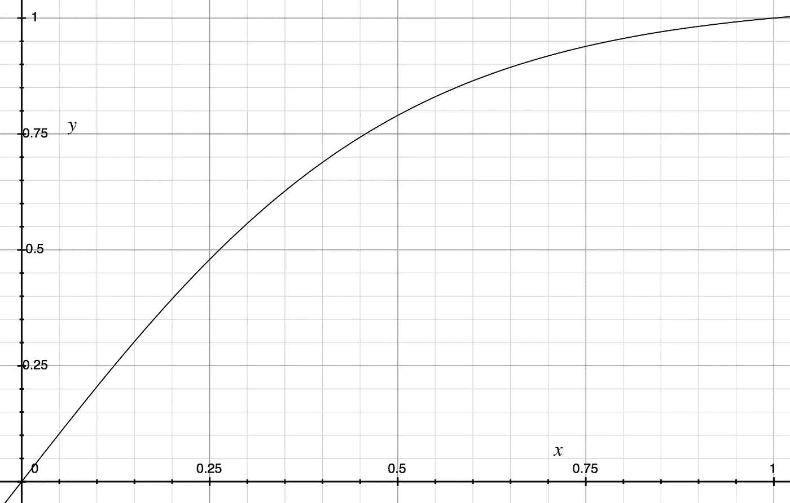
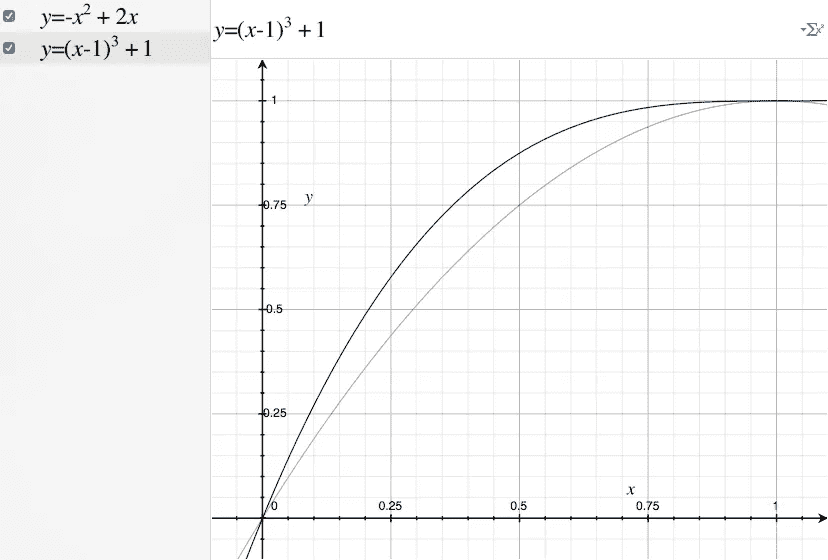

# 放松:半乙状结肠

> 原文：<https://medium.com/hackernoon/ease-out-the-half-sigmoid-7240df433d98>

使用可定制的缓出动画制作您的 web 应用程序。



Ease-out: 9 different versions plotted.

渐出动画非常适合创建感觉像是立即响应但仍然缓慢停止的动画。大多数季节指定少量缓动曲线之一:easeOutQuad、easeOutSine、easeOutCubic 等。然而，该曲线的锐度是不可配置的。在这里，我展示了如何创建一个可配置的渐出函数，它将为你想要的任何属性制作动画。

# 如何使用它

缓动函数采用单个参数 *k* ，指定曲线的陡度。 *k* 越大，曲线越陡，中间部分相对于起点和终点的速度越高。

*easeOutFactory* 将产生一个函数，该函数采用一个参数 *t* 来表示动画完成的百分比，该百分比是一个介于 0 和 1 之间的数字。值得注意的是，这个系统只产生你可以在动画框架中使用的数字(你可能需要构建)。示例[框架](https://hackernoon.com/tagged/framework)包含在 [jsFiddle](https://jsfiddle.net/k6xp3poo/1/) 中。

下面是一个用法示例:

```
// LISTING 1 (Javascript)
// easeOutFactory produces a function representing an ease-out.var easing = easeOutFactory(4); // choose k = 4, see Fig. 2easing(0.00); // 0
easing(0.10); // 0.2047403251776069
easing(0.25); // 0.4793609299265755 
easing(0.50); // 0.7900128291929867
easing(0.75); // 0.9389236079466523
easing(0.90); // 0.9821358147987899
easing(1.00); // 1
```

你可以使用这个 [OS X Grapher 文件](https://drive.google.com/file/d/0BzMVmsOw9Dxna2JsbDQ5RGFiQWM/view?usp=sharing&resourcekey=0-sjMI2OMESzdfGwpBiCU2jA)来[设计](https://hackernoon.com/tagged/design)你的缓动曲线。修改 *k* 来调整陡度。



A demonstration of four different *k values implemented in the engine of mobile game* [*Epsilon Jump*](http://www.energizelabs.com/projects/epsilonjump/) *(*[*iOS*](https://itunes.apple.com/us/app/epsilon-jump/id1196043518?mt=8)*,* [*Android*](https://play.google.com/store/apps/details?id=com.NZLabs.EpsilonJump&hl=en)*) graciously provided by* Rienzi Gokea.

# 该理论

*本节不需要使用。请继续阅读，了解代码背后的技术，以便您能够开发自己的缓动曲线。*

基本的想法是采用[中开发的缓入缓出曲线:Sigmoid 工厂](/analytic-animations/ease-in-out-the-sigmoid-factory-c5116d8abce9#.i3od5bxuz)并使用它的右半部分来获得我们的可调缓出。

在 sigmoid 工厂结束时，我们开发了这个方程来描述以原点为中心的 Sigmoid:



Equation 1: An instrumented sigmoid centered at x = 0\. α is our knob to tune the steepness, and *t is our animation progression from 0 to 1.*



Figure 1: The centered sigmoid function from Eqn. 2.

对于我们的动画，我们将函数的有用区域限制在时间轴( *x* )和距离轴( *y* )上的 0 和 1 之间。请注意，在图 1 中的 *x* = 1 处，绘制的函数明显小于 1。我们可以应用我们在 Sigmoid 工厂中使用的缩放技巧，将它提高到 1。也就是说，我们通过函数在 *x* = 1 的值来归一化函数。

因为我们没有移动函数，只是缩放它，所以计算起来比以前简单多了。



Equation 2: The ease out equation. s(t, k) is as specified in Eqn. 1\. t is time, k is a steepness constant.



Figure 2: The Ease Out Function from Eqn. 2 plotted as k = 4.

你可以在这里找到 grapher 文件。

我将把轻松作为一个练习留给读者。**提示:**想想如何翻转事物。😘

## 相对于传统的放松

与 easeOutQuad 和 easeOutCubic 相比，这种方法有一点不足。



Figure 3: easeOutCubic (black) and easeOutQuad (gray)

你会注意到，在 *x* = 1 时，这两种情况的垂直速度都为零。也就是说，他们的 d *y* /d *x* 在 1 是 0。这里描述的可调节的 s 形缓和从大约 *k* = 6 或 7 开始变得非常接近零。如果您使用的是低于此范围的 k，使用传统的缓动可能会更好一些。

```
Table 1: Approximate Corresponding EasesEASING           EQN            K APPROX. 
[easeOutSine](http://easings.net/#easeOutSine)      sin(2πt/4)     3.25        
[easeOutQuad](http://easings.net/#easeOutQuad)      -t^2 + 2t      3.50        
[easeOutCubic](http://easings.net/#easeOutCubic)     (t-1)^3 + 1    5.50        
[easeOutQuint](http://easings.net/#easeOutQuint)     (t-1)^5 + 1    8.00
```

如果你喜欢这篇文章，请在 Medium 上关注我。你可能还会喜欢[](/analytic-animations/ease-in-out-the-sigmoid-factory-c5116d8abce9#.i3od5bxuz)**[*这个弹跳厂*](/@willsilversmith/the-bounce-factory-3498de1e5262#.5t0mzua5k) *和* [*这个弹簧厂*](/@willsilversmith/the-spring-factory-4c3d988e7129) *。***

# **参考**

1.  **[渐入渐出:Sigmoid 工厂](/analytic-animations/ease-in-out-the-sigmoid-factory-c5116d8abce9#.i3od5bxuz)——本文中使用的渐入渐出曲线的理论就是在这里开发的。**
2.  **[http://easings.net/](http://easings.net/)-许多常用缓和曲线的集合。**
3.  **[缓出 Grapher 文件](https://drive.google.com/file/d/0BzMVmsOw9Dxna2JsbDQ5RGFiQWM/view?usp=sharing&resourcekey=0-sjMI2OMESzdfGwpBiCU2jA) —我开发的用于设计缓出功能的 Grapher 文件。**