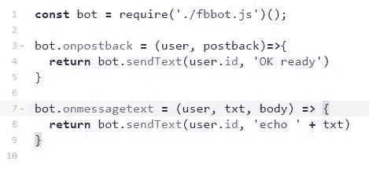

# 使用管道的简单脸书机器人

> 原文：<https://medium.com/hackernoon/easier-facebook-bots-using-pipelines-503da0cd461a>

我最近试用了 Fb 机器人，其实挺好玩的。

他们通过某种程度上直截了当的发布过程，让普通开发人员很容易就能创建出机器人。

最简单地说，你需要知道的是:

你需要一个服务器来处理人们输入 FB Messenger 的信息

然后你只需将这些消息发送回 Fb，Fb 再将消息发送给用户。

用 HTTP 术语来说，每次用户发送一条消息，Fb 就把它发送到你的服务器，然后你把响应发送回 Fb，Fb 再把它转发给用户。

管道很好地处理了这种请求/响应模式——著名的是 Express 使用 app.use(function)。让我们构建一个机器人，用. use()函数简化我们的消息处理。

这里，我们将使用一个模块 fbmbot，它将隐藏所有的 express 服务器细节，并公开函数来处理来自 Fb 的消息。它给你这些函数使用，并隐藏了 Express 服务器和 HTTP 通信。

[](https://github.com/digplan/fbmbot) [## digplan/fbmbot

### fbmbot -更简单的 Facebook Messenger 机器人

github.com](https://github.com/digplan/fbmbot) 

```
var bot = require('fbmbot')();

bot.onmessagetext = (user, txt, body) => {
  bot.sendText(user.id, 'Hi')  // (fbid, txt, [wait seconds, metadata]
}
bot.onpostback = (user, postback) => {
  ...
}

bot.setupGetStartedButton()  one-time
bot.sendTypingOn(user.id)
bot.sendQuickReply(user.id, [])
bot.sendPromptLocation(user.id)
bot.queryUser(user.id, callback)
bot.sendMessage(user.id, {})
bot.users // [users since bot was restarted]
bot.app  // express app
```

我会用优秀的 Gomix @gomixme 游乐场做 bot。我们可以简单地使用这个模块来处理请求，我们的机器人是这样创建的:



Fb 有“回发”的概念，即当某人点击一个按钮时。这将在用户开始新对话时运行。

onmessage text 将处理初始消息之后的新消息。

现在，我们来介绍一个处理管道，ala Express。使用()

在这里，我们创建了自己的“用户管理器”，它将通过 id 查询一个用户信息，并将其保存在 users={}中。如果需要在服务器重启时保存，我们可以将它保存在某个地方。即时用户管理器！

请记住，这些过程顺序相反。第一个 bot.use()检查并查看我们是否有用户信息。然后，它发送回带有用户名的响应。

这些管道允许以可组合的方式制作你的机器人。

> [黑客中午](http://bit.ly/Hackernoon)是黑客如何开始他们的下午。我们是 [@AMI](http://bit.ly/atAMIatAMI) 家庭的一员。我们现在[接受投稿](http://bit.ly/hackernoonsubmission)并乐意[讨论广告&赞助](mailto:partners@amipublications.com)机会。
> 
> 要了解更多信息，[请阅读我们的“关于”页面](https://goo.gl/4ofytp)、[在脸书上点赞/给我们发消息](http://bit.ly/HackernoonFB)，或者简单地说， [tweet/DM @HackerNoon。](https://goo.gl/k7XYbx)
> 
> 如果你喜欢这个故事，我们推荐你阅读我们的[最新科技故事](http://bit.ly/hackernoonlatestt)和[趋势科技故事](https://hackernoon.com/trending)。直到下一次，不要把世界的现实想当然！