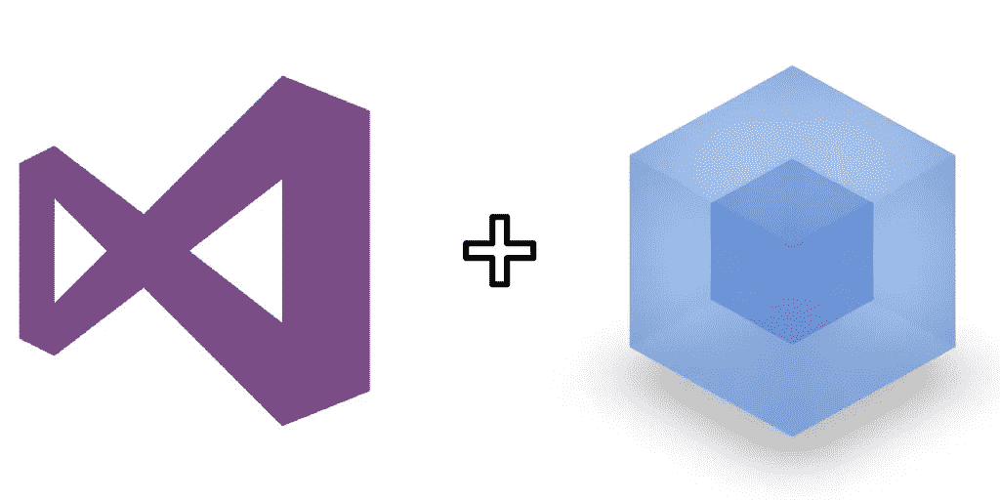

# 轻松设置单个页面。在 Visual Studio 2015 中使用 Webpack 和 React 的. NET 核心应用程序

> 原文：<https://medium.com/hackernoon/easily-set-up-a-single-page-net-core-application-with-webpack-and-react-in-visual-studio-2015-a70ddf23aec6>

在 2017 年，为现代 web 应用程序设置一个环境可能是令人发指的。随着预编译语言和大量包管理器的出现，为你的项目建立一个坚实的基础可能需要几个小时。尝试将它与服务器端框架集成，如。NET 核心，使用 Visual Studio 作为您的 IDE 和 boom 您已经失去了日子。

幸运的是，多亏了一些 githubbers 在 [aspnet-starter-kit](https://github.com/kriasoft/aspnet-starter-kit) 上的工作，你也可以为一个单独的页面设置一个非常简单的设置。NET 核心应用程序，拥有所有最近流行的前端产品，如 React、Redux 和 Webpack。

请注意，aspnet-starter-kit 是为 Visual Studio 代码构建的。所以，我已经分叉了这个伟大的资源库，并进行了一些小的调整，我给你带来了 Visual Studio 2015 版:[aspnet-starter-kit-vs-2015](https://github.com/codingupastorm/aspnet-starter-kit-vs-2015)！

你需要做的是:

1.  确保您正在运行 [Visual Studio 2015 更新 3](https://www.visualstudio.com/en-us/news/releasenotes/vs2015-update3-vs)
2.  确保你有[。安装了 NET Core SDK](https://www.visualstudio.com/en-us/news/releasenotes/vs2015-update3-vs)
3.  确保 Visual Studio[配置为使用节点 6 或更高版本](https://ryanhayes.net/synchronize-node-js-install-version-with-visual-studio-2015/)
4.  在 Visual Studio 中安装 NPM 任务运行器和 Webpack 任务运行器。在菜单中，转到[工具](https://hackernoon.com/tagged/tools)…扩展和更新，并在线搜索每一项
5.  现在您已经准备好开始了！克隆[aspnet-starter-kit-vs-2015](https://github.com/codingupastorm/aspnet-starter-kit-vs-2015)
6.  在 Visual Studio 中打开项目之前，通过命令行导航到存储库，运行 *npm install* 并等待它完成恢复包
7.  现在，您可以在 Visual Studio 中打开项目，并打开任务运行器资源管理器(视图…其他窗口)。在任务运行器资源管理器的 Webpack 下，双击运行—开发。您应该会在终端中看到几条绿线
8.  你可以走了！在 Visual Studio 中点击 play，希望一切都能启动。

可以对存储库进行大量的改进——我想设置代码的热重新加载，并从。NET Core app。希望我们可以下次再做。

> [黑客中午](http://bit.ly/Hackernoon)是黑客如何开始他们的下午。我们是 [@AMI](http://bit.ly/atAMIatAMI) 家庭的一员。我们现在[接受投稿](http://bit.ly/hackernoonsubmission)，并乐意[讨论广告&赞助](mailto:partners@amipublications.com)机会。
> 
> 如果你喜欢这个故事，我们推荐你阅读我们的[最新科技故事](http://bit.ly/hackernoonlatestt)和[趋势科技故事](https://hackernoon.com/trending)。直到下一次，不要把世界的现实想当然！

