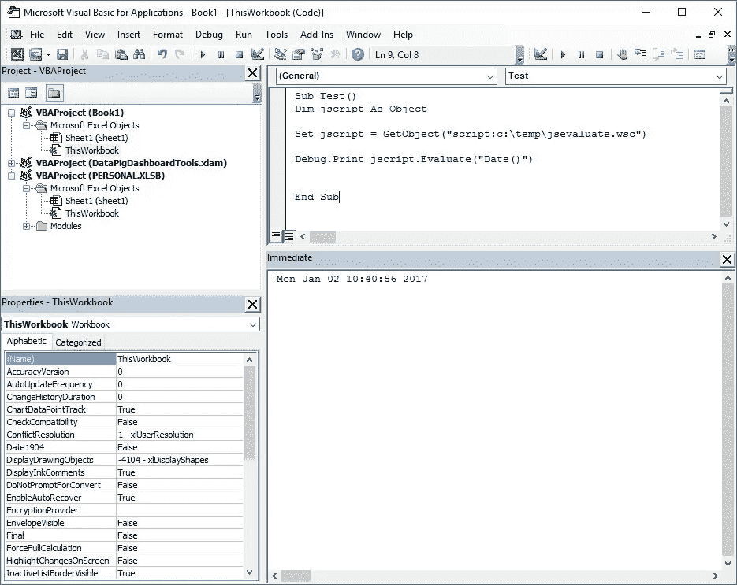
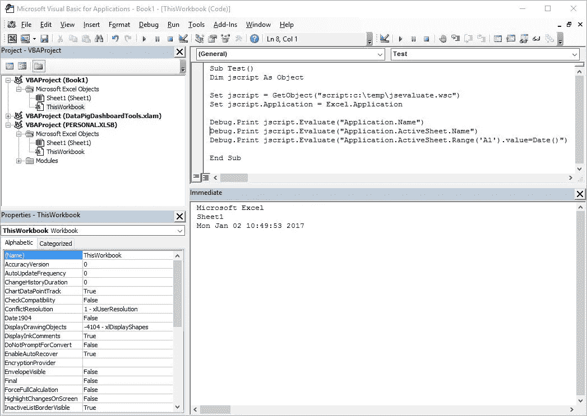
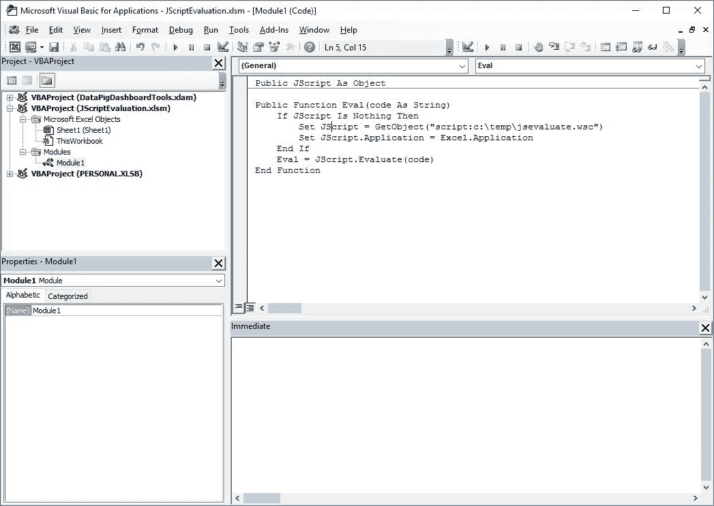
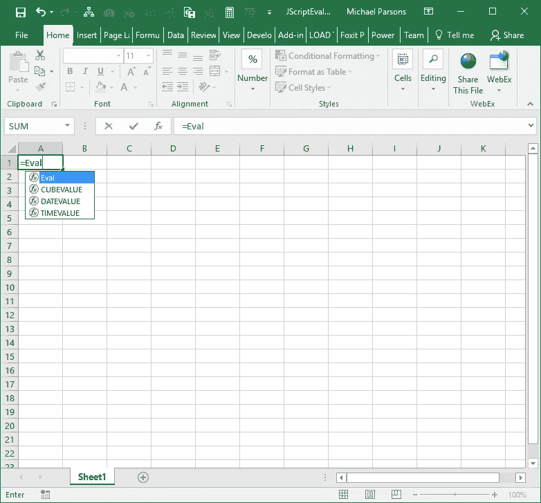
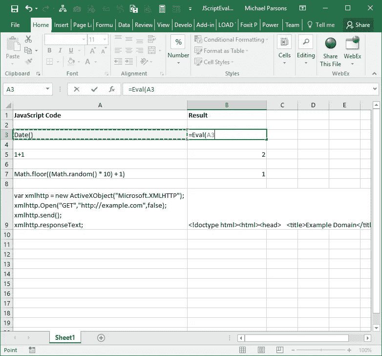

# Windows 上的简单 JavaScript 评估

> 原文：<https://medium.com/hackernoon/easy-javascript-evaluation-on-windows-2b5af3af82d1>

在硬盘上创建一个包含以下内容的文本文件(JSEvaluate.wsc ):

```
<component>
<public>
<method name="Evaluate">
 <PARAMETER name="code"/>
</method>
<property name="Application"/>
<property name="Global"/>
</public>
<script language='JScript'>Global = this;function Evaluate(code) {
 var result;
 try {
  result=Global.eval(code);} catch(e) {result=e.message;}

 return result;
}</script>
</component>
```

现在你有了一个可嵌入的 JavaScript 引擎，你可以从任何窗口的应用程序调用它。

要测试，打开 Excel/Word/Outlook/PowerPoint 等。

在我们的例子中，我们将使用 Excel。一旦加载了 Excel，按 ALT+F11 打开 VBA 开发[工具](https://hackernoon.com/tagged/tools):



如上面的屏幕截图所示，访问新的 JavaScript 引擎就像通过调用 COM GetObject 函数实例化一个新对象一样简单。几乎所有 Window 的编程语言都以这样或那样的形式存在这种能力。

既然我们已经能够动态地计算 JavaScript 表达式，我们可能希望与主机应用程序更紧密地集成，这样我们就可以通过脚本扩展它的特性。下面的代码片段说明了这是多么简单:



更进一步，我们可以创建一个新的 Excel 函数

```
=Eval()
```

它提供了在本机 Excel 宏中执行 JavaScript 代码的能力。这可以通过在新的 VBA 模块中包含以下代码来实现，该模块可以是现有工作簿的一部分，也可以是 PERSONAL.XSLB 的一部分。在您的 VBA 代码中插入一个新模块，并添加以下代码:

```
Public JScript As ObjectPublic Function Eval(code As String)
    If JScript is Nothing Then
        Set JScript = GetObject("script:c:\temp\jsevaluate.wsc")
        Set JScript.Application = Excel.Application
    End If
    Eval = JScript.Evaluate(code)
End Function
```

在开发环境中应该是这样的:



您现在有了一个新的 Excel 函数(Eval ),可以在任何 Excel 公式中使用:



此外，由于 JavaScript 引擎可以在 Excel 应用程序的全局上下文中访问它，所以您可以做一些非常复杂的事情，而这些事情很难在本地 Excel 公式中完成。事实上，您可以用 JavaScript 编写整个程序，并通过 Excel 公式进行访问。在下面的示例中，我们在列 A 中编写 JavaScript 代码片段，并在列 B 中使用我们的 Eval 公式对它们进行评估:



最后，在我们的 JavaScript 引擎范围内，通过 COM 对象调用任何可用的本地函数的能力非常强大。这在上面的例子中通过

```
=Eval(A9)
```

它调用外部网站来检索一些信息。

期待大家的评论。

干杯。

[](http://bit.ly/HackernoonFB)[](https://goo.gl/k7XYbx)[](https://goo.gl/4ofytp)

> [黑客中午](http://bit.ly/Hackernoon)是黑客如何开始他们的下午。我们是 [@AMI](http://bit.ly/atAMIatAMI) 家庭的一员。我们现在[接受投稿](http://bit.ly/hackernoonsubmission)并乐意[讨论广告&赞助](mailto:partners@amipublications.com)机会。
> 
> 如果你喜欢这个故事，我们推荐你阅读我们的[最新科技故事](http://bit.ly/hackernoonlatestt)和[趋势科技故事](https://hackernoon.com/trending)。直到下一次，不要把世界的现实想当然！

