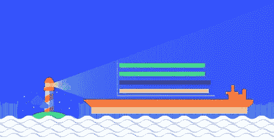
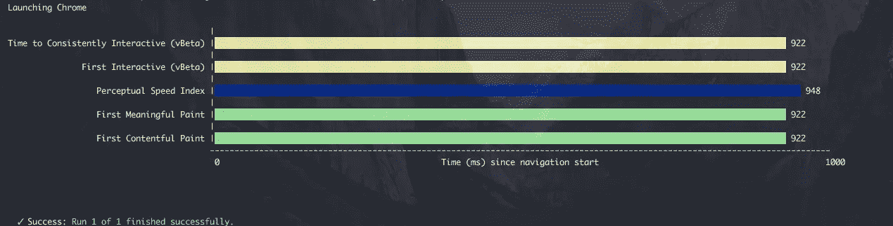
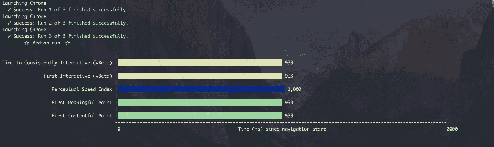
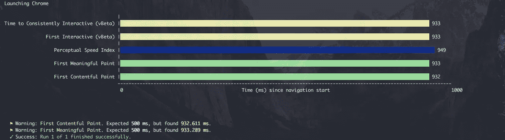
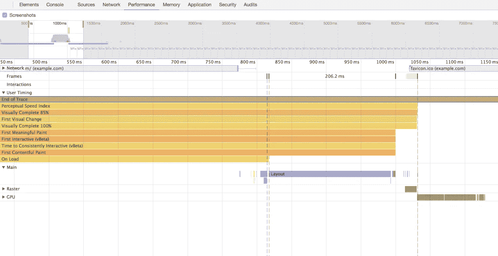
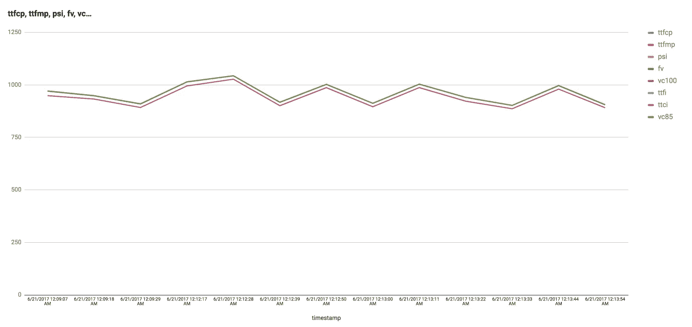
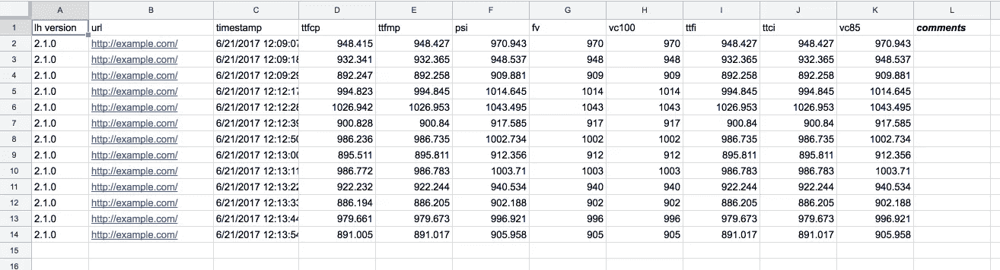

# 简易渐进式网络指标

> 原文：<https://medium.com/hackernoon/easy-progressive-web-metrics-9afa5ed857c2>



Lighthouse for Progressive Web Metrics

改善你的网页加载不是一件小事。这需要很多时间，需要很多知识。为了使它更容易，我们有 [*pwmetrics*](https://github.com/paulirish/pwmetrics) 库，它应该可以帮助你。

你总是怎么测量的？让我猜猜——你打开 chrome，时间轴标签等等，到目前为止。

我们为你提供什么？控制台中的命令— `pwmetrics`。

`pwmetrics`使用 [Lighthouse](https://github.com/GoogleChrome/lighthouse) API 获取度量值，如`[First Contentful Paint](https://docs.google.com/document/d/1kKGZO3qlBBVOSZTf-T8BOMETzk3bY15SC-jsMJWv4IE/mobilebasic?pref=2&pli=1)`、`[First Meaningful Paint](https://developers.google.com/web/tools/lighthouse/audits/first-meaningful-paint)`、`[First Interactive](https://docs.google.com/document/d/1GGiI9-7KeY3TPqS3YT271upUVimo-XiL5mwWorDUD4c/edit#heading=h.k1h25blerz3i),`、`Perceptual Speed Index ([more about it](https://www.instartlogic.com/blog/perceptual-speed-index-psi-measuring-above-fold-visual-performance-web-pages))`、`First Visual Changing`、`Visually Complete 100%` 和`Visually Complete 85%`。

这些值可以用`json`格式获得

`pwmetrics https://example.com --json`。

```
{
  "runs": [
    {
      "timings": [{
        "title": "First Contentful Paint",
        "id": "ttfcp",
        "timestamp": 82750857804,
        "timing": 838.263,
        "color": "green"
      }, {
        "title": "First Meaningful Paint",
        "id": "ttfmp",
        "timestamp": 82750857814,
        "timing": 838.273,
        "color": "green"
      }, {
        "title": "Perceptual Speed Index",
        "id": "psi",
        "timestamp": 82750873600,
        "timing": 854.059,
        "color": "blue"
      }, {
        "title": "First Visual Change",
        "id": "fv",
        "timestamp": 82750873541,
        "timing": 854,
        "color": "blue"
      }, {
        "title": "Visually Complete 85%",
        "id": "vc85",
        "timestamp": 82750873600,
        "timing": 854.059,
        "color": "blue"
      }, {
        "title": "Visually Complete 100%",
        "id": "vc100",
        "timestamp": 82750873541,
        "timing": 854,
        "color": "blue"
      }, {
        "title": "First Interactive (vBeta)",
        "id": "ttfi",
        "timestamp": 82750859471,
        "timing": 839.93,
        "color": "yellow"
      }, {
        "title": "Time to Consistently Interactive (vBeta)",
        "id": "ttci",
        "timestamp": 82750859471,
        "timing": 839.93,
        "color": "yellow"
      }],
      "timestamps": [{"title": "Navigation Start", "id": "navstart", "timestamp": 82750019541}],
      "generatedTime": "2017-05-17T11:50:08.096Z",
      "lighthouseVersion": "2.1.0",
      "initialUrl": "http://example.com",
      "url": "http://example.com/"
    }
  ]
}
```

或者你可以使用

`pwmetrics [http://example.com](http://example.com)`

查看带有`First Contentful Paint`、`First Meaningful Paint`、`Perceptual Speed Index`、`Time to Interactive`值的花式图表。



Results of run “`pwmetrics [http://example.com](http://example.com)" command`

> *注:结果用* Nexus 5X *设备仿真、* `*5x*` *CPU 节流、* `*1.6 Mbps*` *下载速度和* `*750 Kbps*` *上传速度测量。*

要获得近似结果，请使用中值运行选项。

`pwmetrics http://example.com --runs=3`

它将获得 3 个不同的指标，并近似它们。



> *注意:至于* `*pwmetrics*` *依赖于* `*Lighthouse*` *你可以使用 CLI 将所有标志传递给它。
> 可用的灯塔旗帜——这里描述的是*[](https://github.com/GoogleChrome/lighthouse#lighthouse-cli-options)**。**
> 
> *例 *:* `*pwmetrics --disableDeviceEmulation "chrome://history/" --save-assets*`*

# *CI 用法*

*让我们更进一步，决定在 CI 中使用它。你真的不想接受降低你的网站/应用性能的新变化。我们也处理好了。*

*奔跑*

*`pwmetrics --expectations`*

*在运行之前，你需要在你的`package.json`或者你自己的文件中设置一些配置吗？*

> *除了`package.json`之外，还可以使用配置文件。更多信息请参见[文档](https://github.com/paulirish/pwmetrics#defining-config)*
> 
> *`pwmetrics --config=./path-to-file.js`*

*`package.json`*

```
*"pwmetrics": {
  "url": "http://example.com/",
  "expectations": {
    "ttfmp": {
      "warn": ">=500",
      "error": ">=1000"
    },
    "ttfcp": {
      "warn": ">=500",
      "error": ">=1000"
    }
  }
}*
```

*其工作成果*

**

> *你也可以看看我们制作的[配方](https://github.com/paulirish/pwmetrics/tree/master/recipes)，用于将它与构建[工具](https://hackernoon.com/tagged/tools)集成。*

# *在 DevTools 时间线查看器中显示结果*

*这是一个独立的项目，帮助开发者在彼此之间分享他们的踪迹。*

*它如何协同工作:*

*`pwmetrics --view --config=./pwmetrics-config.js`*

> *阅读[文档](https://github.com/paulirish/pwmetrics#upload-lighthouse-traces-to-google-drive)如何配置。*

**

*[https://goo.gl/4opmye](https://goo.gl/4opmye)*

> *这是什么背景？我们只需获取轨迹，将它们上传到你的 Google Drive，然后打开带有这些轨迹的时间轴查看器。*

*好的。你可能会这么想。但不是。我们准备了一个更酷的功能。*

# *分析目的*

*当您可以将度量结果提交到服务/文档/表单中，制作一些图形并与他人分享这些结果时，这真的很有帮助。*

*它在这里*

*`pwmetrics --submit`*

> *阅读[更多](https://github.com/paulirish/pwmetrics#defining-submit)来配置 config。*

*该命令将把所有收到的指标提交到 [Google Sheets](https://www.google.com/sheets/about/) 中。*

> **注意:目前我们只支持谷歌表单，但也欢迎新的贡献，使其与其他服务一起工作:)**

**举例*:*

*`pwmetrics --submit --config=./pwmetrics-config.js`*

**结果*:*

****

*参见[谷歌工作表](https://docs.google.com/spreadsheets/d/1a8fjSJJ9bP2FpVHbe9jElkGJB5khtsqVfhwDhE13twQ/edit?ts=58d27b40&pli=1#gid=0)。*

*尽情享受吧！:)*

*感谢[@ Paul _ Irish](https://twitter.com/paul_irish)‏[@ samccone](https://twitter.com/samccone)[@ Pedro 93 _](https://twitter.com/pedro93_)！*

*UPD:文章因第 3 版发布而更新。*

*[](http://bit.ly/HackernoonFB)**[](https://goo.gl/k7XYbx)**[](https://goo.gl/4ofytp)*

> *[黑客中午](http://bit.ly/Hackernoon)是黑客如何开始他们的下午。我们是 [@AMI](http://bit.ly/atAMIatAMI) 家庭的一员。我们现在[接受投稿](http://bit.ly/hackernoonsubmission)并乐意[讨论广告&赞助](mailto:partners@amipublications.com)机会。*
> 
> *如果你喜欢这个故事，我们推荐你阅读我们的[最新科技故事](http://bit.ly/hackernoonlatestt)和[趋势科技故事](https://hackernoon.com/trending)。直到下一次，不要把世界的现实想当然！*

**