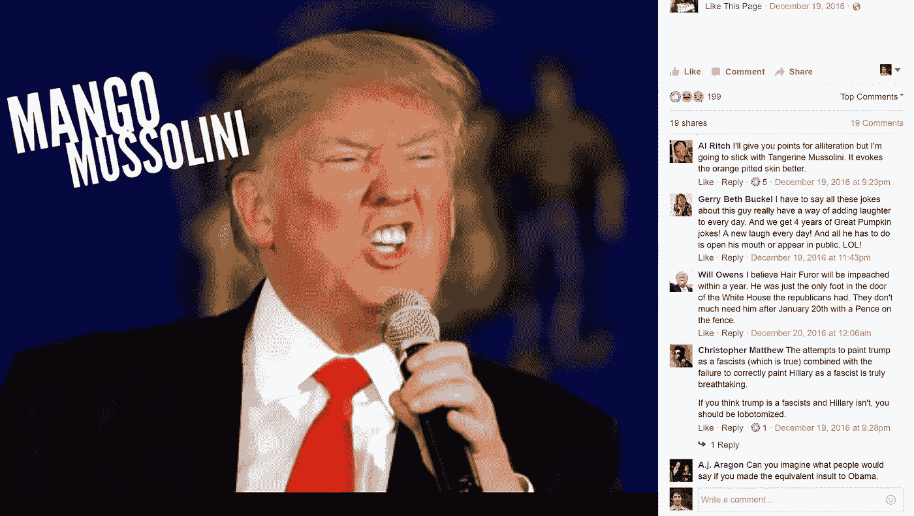
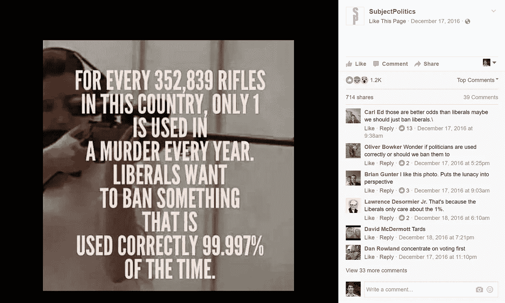
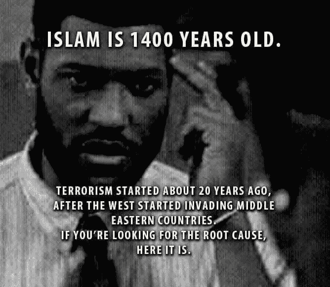
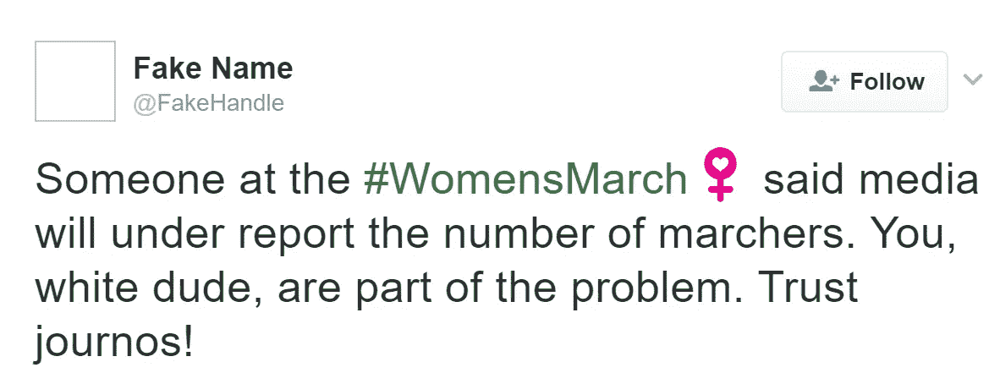
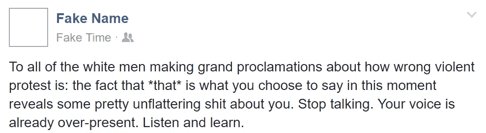

# 回音室伤害了美国

> 原文：<https://medium.com/hackernoon/echo-chambers-hurt-america-8c5d0307a628>

看看下面两张图片，特意选择来代表政治光谱的不同部分:

from the Opinionated Democrat Facebook page

from the SubjectPolitics Facebook page

像这样的帖子在脸书和其他社交媒体社区泛滥成灾。美国曾经有看各大新闻网传递信息的共同经历。现在，我们的科技景观提供了一种逃避与不同意见的人打交道的不适的方式。脸书复杂的新闻反馈算法将你看到的内容调整到你反应最积极的内容，这对大多数人来说是他们同意的事情。Reddit 有 100 个“我们都想同样的事情”子主题，每个都有一个“让我们来对话”子主题。 [Gab](https://www.nytimes.com/2016/11/30/arts/the-far-right-has-a-new-digital-safe-space.html) 是一个社交[网络](https://hackernoon.com/tagged/network)完全致力于政治光谱上的特定点。(我链接到《纽约时报》的一篇关于 Gab 的文章，而不是网站本身，因为不登录你看不到太多。)

回音室还是有价值的。我喜欢喜剧和讽刺几乎无处不在的想法，一些想法通过幽默最好地展示了荒谬。人们可以拿尖锐的政治迷因开玩笑，却不认为迷因代表了诚实的讨论。

特别是，我并不觉得[r/无神论](https://www.reddit.com/r/atheism/)有趣，因为我最后一次检查时，它是表达同一组观点的人的回音室。然而，我可以理解一个被困在极端宗教环境中的人的观点，他们感到孤独，因为他们不知道在他们的圣经地带的小镇上还有谁不信教。这些人可能只是需要发泄，r/无神论给了他们一个发泄的空间。政治光谱中的其他信仰体系也可能有类似的压迫性，并创造出一个安全的发泄空间。

但是，根据我的观察，大多数参与回音室的人都不是这样。它主要是关于加强一个人的社区的信仰，而不是逃避压迫性的正统观念。一个人发布了一个关于他们政治对手的尖刻的模因，他们的一群朋友都喜欢它。这种感觉很好，所以第二天，其他人发布了一个类似的迷因，一群人也喜欢这样。这一过程一直持续到群体身份与一套政治信仰彻底融合。政治变成了一项团队运动，人们自觉或不自觉地更关心与朋友的信仰相一致，并把自己与“他人”区分开来，而不是某项政策的细节。如果你主要通过脸书与政治互动，这几乎是不可避免的。政策细节不适合脸书邮报，但该平台经过优化，让你知道你的朋友对事情的看法。

此外，尽管这些事情中的许多都很有趣，人们也有权和朋友开玩笑，但严肃的政治评论往往夹杂着滑稽的模因。或者人们会说一些表明他们认为迷因准确描述了问题的话。这些迷因只是一个问题，因为它们被误认为是批判性思维。

我对此感到担忧，因为我看到了一个基本假设的动摇，即尽管有不同的观点，我们都是美国人，我们都在一起。我认识加利福尼亚、纽约、华盛顿州、俄克拉荷马州、怀俄明州和田纳西州的人。我看到这些群体出现分歧，越来越不愿意努力去理解对方的观点，或者试图与对方找到共同点。如果其他人是坏人，他们总是在所有事情上都是错的，你为什么要这样做呢？

在辩论中，特朗普说，如果我们没有安全的边界，我们就不可能有一个国家。这可能是真的，但我认为更紧迫和根本的问题是，如果我们没有任何共同的现实或真诚合作的意愿，我们就不可能有一个国家。没有这些东西，我们就无法共同努力改革移民制度、简化税法、控制赤字、设计智能社会安全网、改革刑事司法和打击警察暴力，或者以一致的方式面对外国威胁，以及其他重大挑战。如果我们唯一能取得进展的时候是钟摆摆动到足以让一个政党完全控制政府的时候，那么美国将不可避免地失去相关性，美国人民将遭受痛苦。如果在个人层面上，我们忽视与我们意见不同的人和地方，我们就破坏了美国的核心优势:思想、地区和文化的多样性。美国作为一个整体比阿西拉走廊或铁锈地带本身提供了更多。

我不是唯一一个对此感到担忧的人。奥巴马在他的告别演说中说:

> 所以不管我们占据哪个位置；我们都必须更加努力；我们都必须从这样一个前提出发，即我们的每一个公民都像我们一样热爱这个国家；他们和我们一样重视努力工作和家庭；他们的孩子和我们的孩子一样好奇、充满希望、值得爱。
> 
> 这并不容易做到。**对我们中的许多人来说，退回到自己的泡泡中变得更加安全，**无论是在我们的街区，还是在大学校园，还是在宗教场所，还是在**尤其是我们的社交媒体反馈**，周围都是和我们长相相似、政治观点相同的人，**从不挑战我们的假设。随着赤裸裸的党派之争的兴起，经济和地区分层的加剧，我们的媒体分裂成一个迎合各种口味的渠道，所有这一切都使得这种大排序看起来很自然，甚至是不可避免的。**
> 
> 越来越多的时候，我们在自己的泡泡中变得如此安全，以至于我们开始只接受符合我们观点的信息，不管它是真是假，而不是把我们的观点建立在现有的证据之上。
> 
> 这一趋势是对我们民主的第三个威胁。瞧，政治是一场思想的战争。我们的民主就是这样设计的。在健康的辩论过程中，我们优先考虑不同的目标，以及实现这些目标的不同方式。但是，如果没有一些共同的事实基线，如果不愿意接受新的信息，不愿意承认你的对手可能提出了一个公平的观点，不承认科学和理性的重要性，那么我们将继续谈论对方。

我同意奥巴马的观点，这种趋势是对民主的威胁。这就是为什么我如此关注此事，并愿意冒着疏远他人的风险指出我认为有害的行为。

自由主义者会很快宣称科学和理性更站在他们一边。毫无疑问，保守主义运动的一些成员，比如福音派，明确否认科学是与世界互动的基础。但是自由主义者也展示了他们合理的非理性。以下面这个迷因为例:

from the “American, Muslim” Facebook page

恐怖主义和几十年来人们转向恐怖主义的原因是一个极其复杂的话题。任何声称能够将其归结为一个可以用三十个字表达的“根本原因”的人，也不能声称自己是在运用理性。在这篇文章中，我不打算就恐怖主义的起因展开辩论，但希望我们能同意这是一种严重的简单化。

这篇文章接下来的两个部分将关注自由主义者如何通过参与回音室来破坏他们的目标。这并不是说保守的回音室没有那么糟糕；我个人更熟悉自由主义者。此外，鉴于目前的政治形势，自由派的议程比保守派的风险大得多，所以我认为让自由派听到我的信息更重要。

## 回音室帮助特朗普

2016 年 4 月，Emmett Rensin 用美国自由主义的自鸣得意风格准确地描绘了选举中的一个关键动态:

> 正是(自由派的)主导态度，让被剥夺者投入了一位与他们一样愤怒的候选人的怀抱。正是这种态度可能会让他入主白宫。
> 
> 自鸣得意的工资就是川普。

如果你是摇摆州的美国中部白人，在社交媒体上看到以下帖子，你会有什么感受？

如果我是一个倾向于防御的白人，我会很容易地驳回这些观点，因为我觉得它们在攻击我，这样我就不用去理会这些人到底在说什么。

如果特朗普的竞选纲领是反对政治正确，并通过他所说的每一件令人震惊的事情来加强这一纲领，那么[白人男性以 62%比 31%的比例投票给特朗普，白人女性以 52%比 43%的比例投票给特朗普](http://www.cnn.com/election/results/exit-polls)，这有什么奇怪的吗？

我不打算在这里讨论“白色脆弱性”，但即使这是一个真实的影响，人们也不需要脆弱到被我在上面发布的推文攻击。称呼某人为“白人老兄”与更广泛的观点(这是合理的)完全无关，而且显然是用作贬义词。对白人的行为进行合理的论证，让白人无缘无故地感到不安，然后指责他们，这是一回事。攻击白人是另一回事，对争论没有任何帮助。

## 回音室助长内讧

我在网上看到的交易所是这样的:

> 我对就职典礼感到难过。
> 
> **B:如果你是一个特权较少的人，你会更难过，而且你在你的原始帖子中没有这样说，你是麻木不仁的。**

或者:

> 答:
> 
> 乙:
> 
> c:我同意你的目标，但我认为这种模因是一种适得其反的赢得人心的方式。
> 
> **甲、乙等朋友:<对丙的无礼>**

最仁慈的是，上面的粗线实现了什么？

1.  通过展示他们的正义来支持海报的社会地位
2.  通过排挤他人来加强团队的完整性
3.  通过给旁观者一个“喜欢”海报评论的机会来加强团队的团结

它们还有什么其他作用？

1.  将反对者(以及同情反对者的第三方观察者)推向反对阵营
2.  通过排斥他人来强化团队，团队会变得更加怀疑他人，也不太可能将他人视为诚信经营的人
3.  花费精力试图改变那些已经同意与众不同的人的想法

简而言之，虽然回音室对一个人的朋友群体有好处，但它破坏了与不同想法的人妥协的长期能力。此外，即使从只重视推进自身议程的角度来看，惩罚那些坚持稍微不同版本的叙事的人也是浪费精力，而不是与世界观完全不同的人交往。我看到所有投票给希拉里的人之间有很多争吵，当他们的目标通过与投票给特朗普并计划在 2020 年再次这样做的人接触而得到更好的实现时。如果一个人关心进步的目标，那么这是一个寻找共同价值观的时候，而不是挑剔那些价值观略有不同的人。当妇女华盛顿大游行的参与者基本上在大多数问题上意见一致，然后[人们因为“被语气刺痛”而取消华盛顿之行](https://www.nytimes.com/2017/01/09/us/womens-march-on-washington-opens-contentious-dialogues-about-race.html)时，这场运动就变得不那么有效了。

冒着说得太细的风险，**人们需要决定什么更重要:在脸书问题上正确，还是让川普在 2020 年不入主白宫。**

## 结论

我不想教导人们如何说话。我们生活在一个自由的社会，你想说什么就说什么。但是美国现在很脆弱，如果你继续使用回音室，我敦促你考虑你的言行的后果。

我将以奥巴马告别演说中的另一段话来结束我的演讲:

> 如果你厌倦了在网上和陌生人聊天，试着在现实生活中和他们中的一个聊天。

## *相关补充阅读*

[《纽约时报》:“如何逃离你的政治泡沫，获得更清晰的视角”](https://www.nytimes.com/2017/03/03/arts/the-battle-over-your-political-bubble.html?_r=0)

> [黑客中午](http://bit.ly/Hackernoon)是黑客如何开始他们的下午。我们是 [@AMI](http://bit.ly/atAMIatAMI) 家庭的一员。我们现在[接受投稿](http://bit.ly/hackernoonsubmission)并乐意[讨论广告&赞助](mailto:partners@amipublications.com)机会。
> 
> 如果你喜欢这个故事，我们推荐你阅读我们的[最新科技故事](http://bit.ly/hackernoonlatestt)和[趋势科技故事](https://hackernoon.com/trending)。直到下一次，不要把世界的现实想当然！

