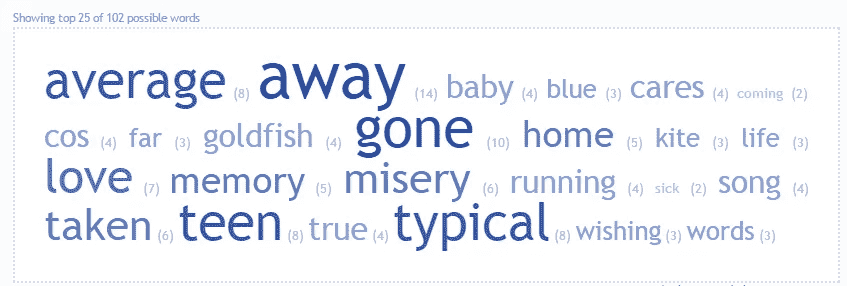
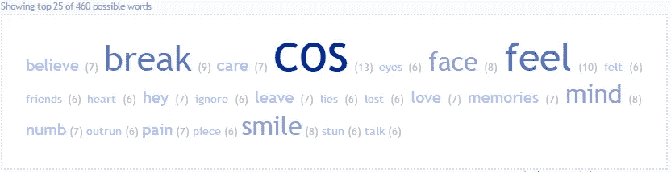
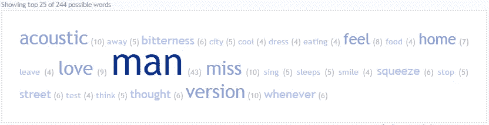
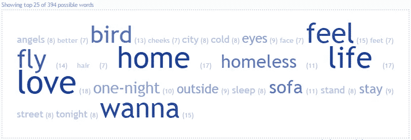
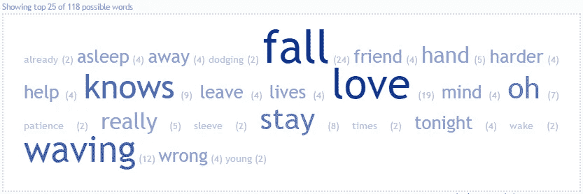
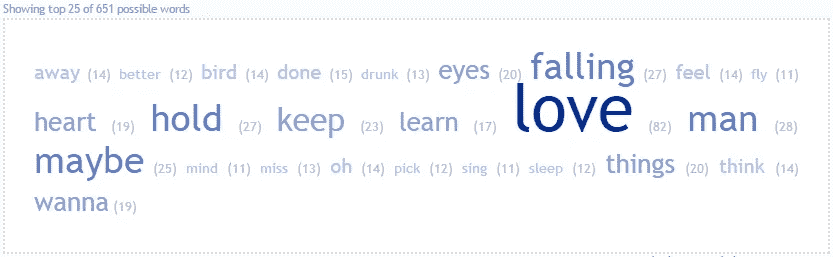
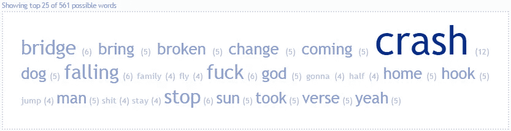
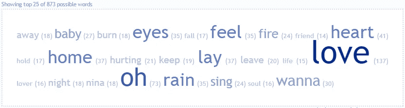
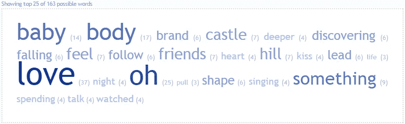

# 艾德·希兰的歌曲创作分析

> 原文：<https://medium.com/hackernoon/ed-sheerans-songwriting-analysis-45a85e75fb14>

我在听这首歌《我看见了火》，我想知道艾德·希兰的作曲技巧，于是我开始分析他所有专辑的歌词。

我为艾德制作的每张专辑都做了一个单词云，下面是调查结果。

EP: **《橙屋》** (2005)

[艾德的喜怒无常歌谣](http://www.azlyrics.com/lyrics/edsheeran/moodyballadofed.html)、[苦难](http://www.azlyrics.com/lyrics/edsheeran/misery.html)、[典型一般](http://www.azlyrics.com/lyrics/edsheeran/typicalaverage.html)、[沉迷](http://www.azlyrics.com/lyrics/edsheeran/addicted.html)、[我爱你](http://www.azlyrics.com/lyrics/edsheeran/iloveyou.html)

专辑:**《艾德·希兰》** (2006)

[张开你的耳朵](http://www.azlyrics.com/lyrics/edsheeran/openyourears.html)、[超越苍白](http://www.azlyrics.com/lyrics/edsheeran/beyondthepale.html)、【记忆中的 、、[失眠者的摇篮曲](http://www.azlyrics.com/lyrics/edsheeran/insomniacslullaby.html)、[艾德的安静歌谣](http://www.azlyrics.com/lyrics/edsheeran/quietballadofed.html)、[没有运气](http://www.azlyrics.com/lyrics/edsheeran/noluck.html)、[史蒂文森](http://www.azlyrics.com/lyrics/edsheeran/stevensong.html)、[比利·罗斯金](http://www.azlyrics.com/lyrics/edsheeran/billyruskin.html)、[火花](http://www.azlyrics.com/lyrics/edsheeran/spark.html)、[停顿](http://www.azlyrics.com/lyrics/edsheeran/pause.html)、[大海](http://www.azlyrics.com/lyrics/edsheeran/thesea.html)、[归途](http://www.azlyrics.com/lyrics/edsheeran/wayhome.html)

专辑:**“要一些吗？”** (2007 年)

[你破我](http://www.azlyrics.com/lyrics/edsheeran/youbreakme.html)，[我很高兴我不是你](http://www.azlyrics.com/lyrics/edsheeran/imgladimnotyou.html)，[你需要剪头发](http://www.azlyrics.com/lyrics/edsheeran/youneedtocutyourhair.html)，[莎拉](http://www.azlyrics.com/lyrics/edsheeran/sara.html)，[动起来，上](http://www.azlyrics.com/lyrics/edsheeran/moveon.html)，[黄页](http://www.azlyrics.com/lyrics/edsheeran/yellowpages.html)，[微笑](http://www.azlyrics.com/lyrics/edsheeran/smile.html)，[明信片](http://www.azlyrics.com/lyrics/edsheeran/postcards.html)，[两个矬子和一个低音](http://www.azlyrics.com/lyrics/edsheeran/twoblokesandadoublebass.html)，[西部海岸，克莱尔](http://www.azlyrics.com/lyrics/edsheeran/thewestcoastofclare.html)，[我](http://www.azlyrics.com/lyrics/edsheeran/icantspell.html)

《你需要我》 (2009)

[你需要我，我不需要你](http://www.azlyrics.com/lyrics/edsheeran/youneedmeidontneedyou.html)，[所以](http://www.azlyrics.com/lyrics/edsheeran/so.html)，[就像你](http://www.azlyrics.com/lyrics/edsheeran/belikeyou.html)，[城市](http://www.azlyrics.com/lyrics/edsheeran/thecity.html)，[晒伤](http://www.azlyrics.com/lyrics/edsheeran/sunburn.html)

EP: **《零钱》** (2010)

[A 队](http://www.azlyrics.com/lyrics/edsheeran/theateam.html)、[流浪汉](http://www.azlyrics.com/lyrics/edsheeran/homeless.html)、[小鸟](http://www.azlyrics.com/lyrics/edsheeran/littlebird.html)、[沙发](http://www.azlyrics.com/lyrics/edsheeran/sofa.html)、[一夜情](http://www.azlyrics.com/lyrics/edsheeran/onenight.html)、[萤火虫](http://www.azlyrics.com/lyrics/edsheeran/firefly.html)、[城市(在粘粘工作室现场)](http://www.azlyrics.com/lyrics/edsheeran/thecityliveatstickystudios.html)

EP: **《我和艾米写的歌》** (2010)

[冷咖啡](http://www.azlyrics.com/lyrics/edsheeran/coldcoffee.html)，[跌倒](http://www.azlyrics.com/lyrics/edsheeran/fall.html)，[火警](http://www.azlyrics.com/lyrics/edsheeran/firealarms.html)，[她](http://www.azlyrics.com/lyrics/edsheeran/she.html)，[我们在哪着陆](http://www.azlyrics.com/lyrics/edsheeran/whereweland.html)

EP:**“№5 合作项目”** (2011)

[最近](http://www.azlyrics.com/lyrics/edsheeran/lately.html)，[你](http://www.azlyrics.com/lyrics/edsheeran/you.html)，[家人](http://www.azlyrics.com/lyrics/edsheeran/family.html)，[电台](http://www.azlyrics.com/lyrics/edsheeran/radio.html)，[小淑女](http://www.azlyrics.com/lyrics/edsheeran/littlelady.html)，[淹没我](http://www.azlyrics.com/lyrics/edsheeran/drownmeout.html)，[噩梦](http://www.azlyrics.com/lyrics/edsheeran/nightmares.html)，[再见](http://www.azlyrics.com/lyrics/edsheeran/goodbyetoyou.html)

专辑:**“+”**(2011)

[A 队](http://www.azlyrics.com/lyrics/edsheeran/theateam.html)，[醉酒](http://www.azlyrics.com/lyrics/edsheeran/drunk.html)， [UNI](http://www.azlyrics.com/lyrics/edsheeran/uni.html) ，[8 级](http://www.azlyrics.com/lyrics/edsheeran/grade8.html)，[叫醒我](http://www.azlyrics.com/lyrics/edsheeran/wakemeup.html)，[小撞](http://www.azlyrics.com/lyrics/edsheeran/smallbump.html)，[本](http://www.azlyrics.com/lyrics/edsheeran/this.html)，[城里](http://www.azlyrics.com/lyrics/edsheeran/thecity187471.html)，[乐高屋](http://www.azlyrics.com/lyrics/edsheeran/legohouse.html)，[你需要我我不需要你](http://www.azlyrics.com/lyrics/edsheeran/youneedmeidontneedyou187473.html)，[亲亲我](http://www.azlyrics.com/lyrics/edsheeran/kissme.html)，[给我爱](http://www.azlyrics.com/lyrics/edsheeran/givemelove.html) [小鸟](http://www.azlyrics.com/lyrics/edsheeran/littlebird.html)【豪华版奖励赛道】，[淘金](http://www.azlyrics.com/lyrics/edsheeran/goldrush.html)【豪华版奖励赛道】，[晒伤](http://www.azlyrics.com/lyrics/edsheeran/sunburn187479.html)【豪华版奖励赛道】

EP: **《贫民窟的桥》** (2012)
*(与 Yelawolf 同台演出)*

[伦敦桥](http://www.azlyrics.com/lyrics/edsheeran/londonbridge.html)，[你不知道(看在他妈的份上)](http://www.azlyrics.com/lyrics/edsheeran/youdontknowforfuckssake.html)，[面相](http://www.azlyrics.com/lyrics/edsheeran/faces.html)，[语气](http://www.azlyrics.com/lyrics/edsheeran/tone.html)

专辑:**《X》**(2014)

[一个人](http://www.azlyrics.com/lyrics/edsheeran/one.html)，[我很乱](http://www.azlyrics.com/lyrics/edsheeran/imamess.html)，[唱歌](http://www.azlyrics.com/lyrics/edsheeran/sing.html)，[不要](http://www.azlyrics.com/lyrics/edsheeran/dont.html)，[妮娜](http://www.azlyrics.com/lyrics/edsheeran/nina.html)，[拍照](http://www.azlyrics.com/lyrics/edsheeran/photograph.html)，[血流](http://www.azlyrics.com/lyrics/edsheeran/bloodstream.html)，[特内里费海](http://www.azlyrics.com/lyrics/edsheeran/tenerifesea.html)，[逃跑](http://www.azlyrics.com/lyrics/edsheeran/runaway.html)，[男人](http://www.azlyrics.com/lyrics/edsheeran/theman.html)，[大声思考](http://www.azlyrics.com/lyrics/edsheeran/thinkingoutloud.html)，[欲火焚身](http://www.azlyrics.com/lyrics/edsheeran/afirelove.html)， [甚至我爸有时候也会做](http://www.azlyrics.com/lyrics/edsheeran/evenmydaddoessometimes.html)【豪华版有奖曲目】[我见火](http://www.azlyrics.com/lyrics/edsheeran/iseefire.html)【豪华版有奖曲目】[众星云集](http://www.azlyrics.com/lyrics/edsheeran/allofthestars.html)【豪华版有奖曲目】[英伦玫瑰](http://www.azlyrics.com/lyrics/edsheeran/englishrose.html)【X—温布利版有奖曲目】[一触即发](http://www.azlyrics.com/lyrics/edsheeran/touchandgo.html)【X—温布利版有奖曲目】[纽约](http://www.azlyrics.com/lyrics/edsheeran/newyork.html)【X—温布利版有奖曲目】[制作](http://www.azlyrics.com/lyrics/edsheeran/makeitrain.html)

专辑:**【小】** (2017)

[山上的城堡](http://www.azlyrics.com/lyrics/edsheeran/castleonthehill.html)，[你的模样](http://www.azlyrics.com/lyrics/edsheeran/shapeofyou521232.html)，[你会有怎样的感受(赞歌)](http://www.azlyrics.com/lyrics/edsheeran/howwouldyoufeelpaean.html)

从云这个词，很容易理解我们这位火热的头发艺术家从 2010 年开始写更多关于‘爱’的东西，《我和艾米写的歌》[专辑](https://hackernoon.com/tagged/album)。

参考资料:

 [## TagCrowd.com

### 从任何文本创建您自己的词云，以可视化词频。

tagcrowd.com](http://tagcrowd.com/) 

[http://www.azlyrics.com/e/edsheeran.html](http://www.azlyrics.com/e/edsheeran.html)

如果你做到了这一点，你就成功了！！祝您愉快！

***Prady |***[***@ pradyumna _ d***](https://twitter.com/pradyumna_d)***| "使用***[***bear tax***](https://bear.tax)***提交您的加密货币税！"。***