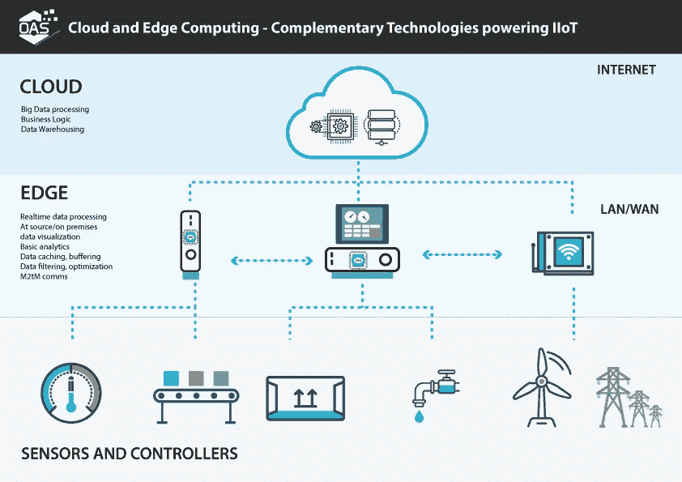
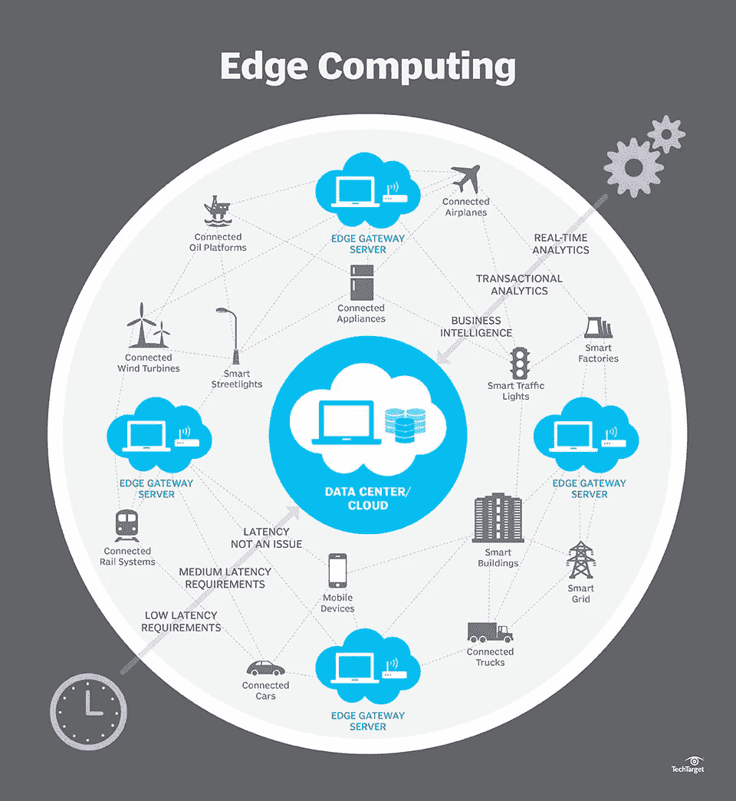
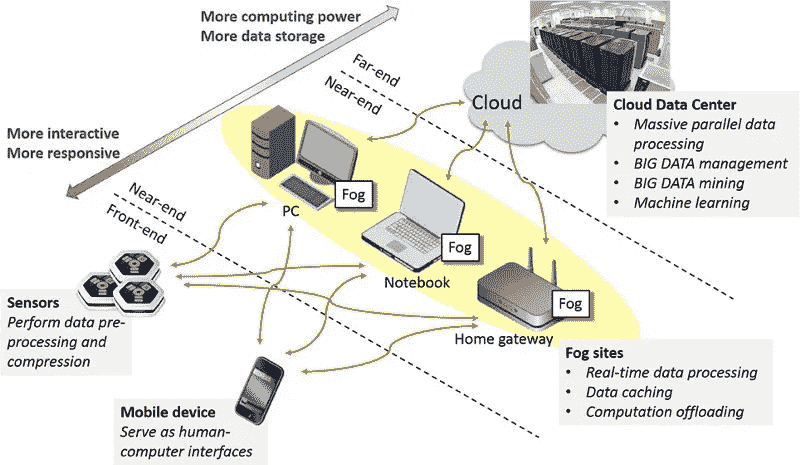
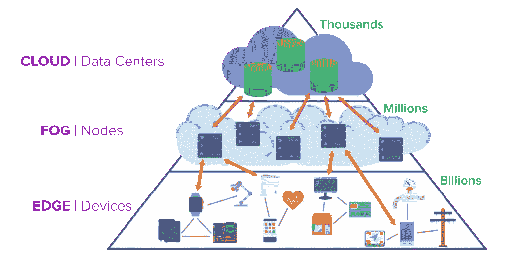

# 边缘计算——网络的新前沿

> 原文：<https://medium.com/hackernoon/edge-computing-a-beginners-guide-8976b6886481>

## 了解边缘计算的基础知识，以及它如何改变实时环境

[Machine Pulse](http://www.machinepulse.com/)

# 边缘

“边缘”是指靠近数据源的计算基础设施。它是分布式 It 架构和基础设施，在网络外围处理数据，尽可能靠近原始来源。

> **边缘计算**是一种优化云**计算**系统的方法，通过在网络的**边缘**执行数据处理，靠近数据源。

OAS

# 生活在边缘

一系列网关服务器位于您的主云环境之外，允许更加本地化的数据处理。

边缘计算的例子在我们的日常生活中随处可见，只是我们可能没有注意到它们。

## 工业物联网(IIoT)

*   风力涡轮机
*   磁共振扫描仪
*   海底防喷器
*   SCADA 系统等工业控制器
*   自动化工业机器
*   智能电网技术
*   智能路灯

## 物联网

*   机动车辆(轿车和卡车)
*   移动设备
*   红绿灯
*   恒温控制器
*   家用电器

TechTarget

# 边缘计算的优势

边缘计算允许清晰界定计算资源的范围，以实现最佳处理。

1.  **时间敏感数据**可以在起始点由本地化处理器(一种具有自身计算能力的设备)进行处理。
2.  **中间服务器**可用于处理地理位置靠近源的数据(这假设中间延迟是可以接受的，尽管实时决策应尽可能靠近源)。
3.  **云服务器**可用于处理对时间不太敏感的数据或长期存储数据。借助物联网，您将在分析仪表盘中看到这一清单。
4.  **边缘应用服务**显著减少了必须移动的数据量、随之而来的流量以及数据必须传输的距离，从而降低了传输成本、缩短了延迟并提高了服务质量(QoS) ( [来源](https://en.wikipedia.org/wiki/Edge_computing))。
5.  **边缘计算通过降低对核心计算环境的依赖性，消除了一个主要瓶颈**和潜在故障点。
6.  随着加密数据通过受保护的防火墙和其他安全点时受到检查，安全性得到了提高，在这些地方，病毒、被破坏的数据和活跃的黑客可以在早期被捕获([来源](https://en.wikipedia.org/wiki/Edge_computing))。
7.  **edge 根据需要对 CPU 能力进行逻辑分组，从而提高了可扩展性，节省了实时数据传输的成本。**

# 为什么是边缘

**传输大量数据**非常昂贵，而且耗费网络资源。边缘计算允许您在源附近处理数据，并且仅通过网络将相关数据发送到中间数据处理器。

例如，智能冰箱不需要不断地将内部温度数据发送回云分析仪表板。相反，它可以被配置为仅当温度变化超过特定点时才发送数据；或者，可以对其进行轮询，以便仅在加载仪表板时发送数据。同样，物联网安全摄像头可能只需要在检测到运动或明确切换实时数据馈送时将数据发送回您的设备。

# 设备关系管理(DRM)

为了管理边缘设备，设备关系管理(DRM)指的是通过互联网监控和维护复杂、智能和互连的设备。DRM 是专为与物联网设备中的微处理器和本地软件接口而设计的。

> 设备关系管理(DRM)是一种企业软件，支持通过互联网对智能设备进行监控、管理和服务。
> 
> - [TechTarget](http://searchnetworking.techtarget.com/definition/device-relationship-management)

# 雾

边缘和云之间是**雾**层，它有助于桥接边缘设备和云数据中心之间的连接。根据 22 号光电眼的马特·牛顿所说:

> **雾计算**将智能下推到网络架构的局域网级别，在雾节点或物联网网关中处理数据。
> 
> **边缘计算**将边缘网关或设备的智能、处理能力和通信能力直接推向可编程自动化控制器(PACs)等设备。

Energomonitor

# 边缘和实时

传感器和远程部署的设备需要实时处理。集中式云系统通常太慢，尤其是当决策需要在几微秒内做出时。对于连通性差的地区或位置的物联网设备来说尤其如此。

然而，有时实时功能需要云处理。例如，让我们说远程龙卷风天气监测器消耗的数据需要实时发送到大型超级计算机。

这就是[实时基础设施](https://becominghuman.ai/getting-started-with-building-realtime-api-infrastructure-a19601fc794e)发挥作用来帮助实现那些数据事务的地方。

PubNub.com