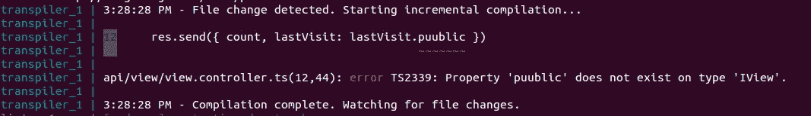
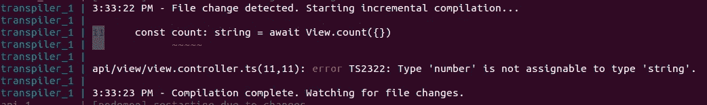
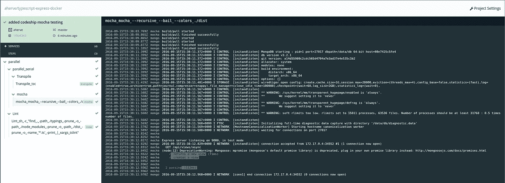

# 使用 Docker、Typescript、codeship 和 mongoose 的 Edge node-express api

> 原文：<https://medium.com/hackernoon/edge-node-express-api-using-docker-typescript-codeship-mongoose-37397cd07955>

我最近一直忙于重构我们为[本帖](https://medium.com/u/4fb3c47e7f1c#.cw5d4e9eo)的精神:我们一键安装整个环境。不要担心 mongodb、npm 或其他任何东西，只需运行 *docker-compose up* 就可以开始工作了。

*   整个项目使用[打字稿](https://hackernoon.com/tagged/typescript)。而类型脚本验证简直太棒了。尝试在您的代码中添加一些拼写错误，并看到控制台立即警告您:

typo: public exists but not puublic

Typescript knows that View.count() will return a number. You can't expect the result to be a string.

在我看来，一旦你尝试了 typescript，就再也回不到 javascript 了。它只是使开发和维护速度提高了几倍，同时确保防止许多运行时错误。

*   别再惹巴贝尔了。既不运行 mocha，你的本地或远程服务器。Typescript 将所有内容编译成优秀的旧 es2015 代码，您可以在任何地方使用
*   没有更多的回调地狱:

Await/Async usage

Promise style usage

*   mocha 单元测试在每次变更时启动。它们是用很酷的类似 ES7 的语法编写的，但是是针对 transpiled js 代码运行的。我特别喜欢这个 *await* 语法:

*   持续测试:非常简单:我们使用 docker 来构建我们的应用程序并运行本地服务器。Codeship 可以运行完全相同的容器来运行测试，因此不同环境之间没有差异。几乎没有额外的工作要做，您可以随时浏览结果:

希望你喜欢:)

> [黑客中午](http://bit.ly/Hackernoon)是黑客如何开始他们的下午。我们是 AMI 家庭的一员。我们现在[接受投稿](http://bit.ly/hackernoonsubmission)并乐意[讨论广告&赞助](mailto:partners@amipublications.com)机会。
> 
> 如果你喜欢这个故事，我们推荐你阅读我们的[最新科技故事](http://bit.ly/hackernoonlatestt)和[趋势科技故事](https://hackernoon.com/trending)。直到下一次，不要把世界的现实想当然！

