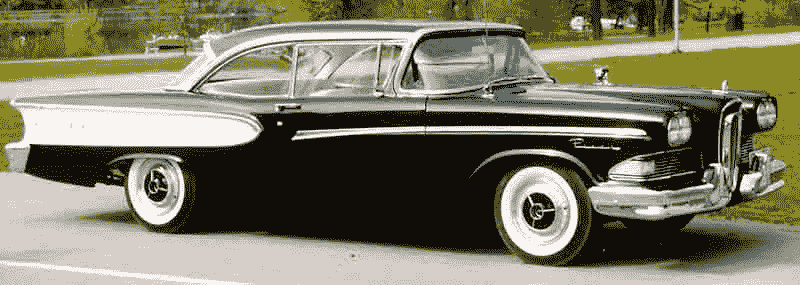
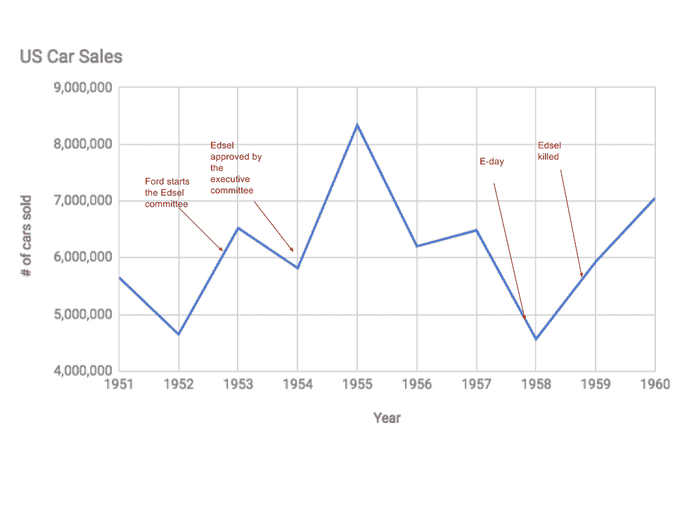
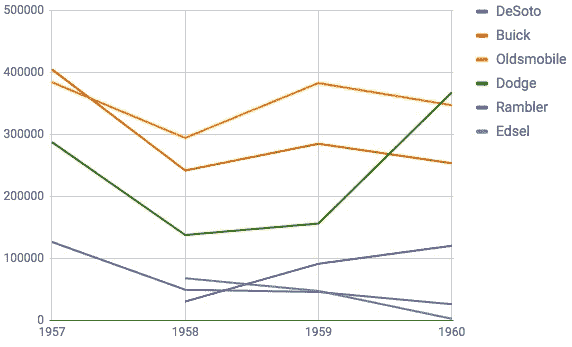
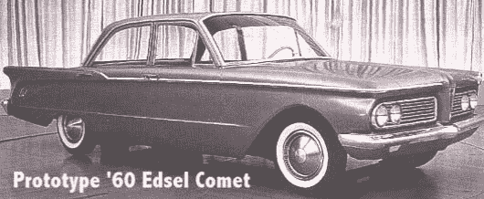

# 埃德塞尔瀑布

> 原文：<https://medium.com/hackernoon/edsels-waterfall-2997e57c453b>

我最近读了比尔·盖茨极力推荐的《商业冒险》。书中有一章谈到了[埃德塞尔](https://en.wikipedia.org/wiki/Edsel)，福特在 20 世纪 50 年代末的失败部门。这个故事如此引人入胜，以至于我决定进一步挖掘。埃德塞尔的开发和营销成了失败的同义词，并在[被广泛讨论。维基百科的文章](https://www.google.ch/search?q=edsel+case+study&oq=edsel+case+study&gs_l=psy-ab.3..35i39k1.8627.9770.0.9873.10.8.0.0.0.0.277.893.0j1j3.4.0....0...1.1.64.psy-ab..6.4.892...0i22i30k1.0.6Jsxpi2hY-o)在列出所有理论方面做得相当不错，所以我就不赘述了。

我在这里提出的假设是，Edsel 的失败是瀑布式产品开发模型[弱点的一个主要例子。](https://en.wikipedia.org/wiki/Waterfall_model)

1958 Edsel Pacer. Source: [Wikipedia](https://en.wikipedia.org/wiki/File:Edsel_Pacer_2-Door_HT_1958.jpg).

# 福特为什么想成立一个新部门？

尽管在 Mercury 和 Lincoln 分别拥有中档和高端品牌，但在 20 世纪 50 年代初，福特主要在低端市场运营。1952 年进行的一项研究得出结论，福特 75%以上的产品都属于经济型市场(Dicke，2010，第 487 页)。在大萧条期间和之后，这是一个很好的位置，但随着二战后 GDP 水平的上升，很大一部分人口预计将进入中等收入范围。

日益壮大的中产阶级意味着越来越多的人将很快在中档市场购买汽车，福特有证据表明，福特车主会购买其他品牌的汽车，主要是通用汽车制造的汽车——正如福特副总裁刘易斯·克鲁索在 50 年代所说的那样，“我们一直在为通用汽车增加客户”。(布鲁克斯，2014 年，第 32 页)。作为福特唯一的中档品牌，水星被视为一个肌肉车品牌，不属于中档细分市场(Brooks，2014 年，第 41 页)。

# 哪里出了问题？

福特在 1952 年末开始考虑 Edsel，他们花了将近两年的时间来确定他们想要制造什么样的汽车，又花了两年半的时间来实际制造它。这意味着**从计划开始到发布日**有五年的延迟，内部称为“E 日”。在此期间，美国经济经历了两次衰退(1953 年和 1958 年)，这对汽车市场以及用户需求、欲望和要求都产生了巨大影响。

US car sales in the 1950s. Source: [Wikipedia](https://en.wikipedia.org/wiki/American_automobile_industry_in_the_1950s)

消费者偏好转向更小、更经济的汽车，即所谓的“紧凑型车”。在埃德塞尔推出之时，市场上唯一的此类汽车是[漫步者](https://en.wikipedia.org/wiki/Rambler_American)，它在 1957-1959 年间售出了 242，734 辆，而在 1958-1959 年间仅售出 118，287 辆。事实上，在 20 世纪 50 年代末，埃德塞尔的所有竞争对手都表现令人失望。克莱斯勒甚至干掉了 Edsel 的直接竞争对手 DeSoto。Edsel 的唯一竞争对手是道奇，它的成功主要来自道奇进入经济型市场的 [Dart](https://en.wikipedia.org/wiki/Dodge_Dart#1960) 的销售。

Edsel’s competitors at the end of the 1950s. Source: [Wikipedia](https://en.wikipedia.org/wiki/U.S._Automobile_Production_Figures).

# 福特学到什么了吗？

他们做到了。1960 年的埃德塞尔阵容已经有了一个紧凑型车的计划，但当埃德塞尔被杀害，他们决定出售汽车作为[彗星](https://en.wikipedia.org/wiki/Mercury_Comet#1960.E2.80.931963)并在 1962 年转移到水星品牌。

Edsel Comet prototype. Source: [Edsel.net](http://edsel.net/prototype.html)

他们似乎也改变了开发和推出新产品的方式，福特野马就是一个例子，它是他们有史以来最成功的产品之一。在制造野马的时候，福特没有采用“大爆炸”战略，而是采用了一种更敏捷的方法，类似于精益创业公司的构建-学习-测量周期。

Mustang 最初是一辆概念车([Mustang I](https://en.wikipedia.org/wiki/Ford_Mustang_I)——他们最小的可行产品)，于 1962 年在美国大奖赛上首次向公众展示，并继续在贸易展上展示。福特甚至参观了这些大学，以衡量目标受众的兴趣。基于这些反馈，他们做了 13 种不同的变体，并最终在 1963 年满足于野马 II。他们做了另一个巡回演出，并最终在 1964 年推出了生产版本。野马于[仅 18 个月](https://en.wikipedia.org/wiki/Donald_N._Frey)建成。他们在 60 年代制造汽车时尽可能地接近“尽早发布，经常发布”。

# 结论

Mustang 的开发与 Edsel 长达两年的营销活动形成了鲜明对比，随后是大爆炸式的发布，最终以失败告终。对于 Edsel，他们采用了一种经典的瀑布式产品开发方法，这乍一看是有道理的——当需求固定并且产品得到很好的理解时，瀑布被认为是合适的。

福特当然知道如何大规模生产汽车，他们在 1953 年设定的要求是基于合理的推理和研究。问题是他们在制造汽车的时候没有学习，因此，当汽车上市时，他们对汽车市场的最初假设不再正确。幸运的是，他们对野马采取了不同的方法，并获得了丰厚的回报。

你可以从“组织中的创新周期”的角度[在这里](http://www.adaptivecycle.nl/images/Minicase_Ford_Edsel.pdf)找到 Edsel 案例的相似之处。

# 参考

*   Brooks，J .:*商业冒险:华尔街的十二个经典故事*，开放道路综合媒体，纽约，2014
*   T .迪克:*《埃德塞尔:作为失败象征的四十年》*，《大众文化杂志》，第 43 卷，第 3 期，2010 年，第 486–502 页。
*   S:[*wilder，微型案例研究，福特埃德塞尔*](http://www.adaptivecycle.nl/images/Minicase_Ford_Edsel.pdf) ，阿姆斯特丹大学，2014 年
*   [https://en . Wikipedia . org/wiki/American _ automobile _ industry _ in _ the _ 50 年代](https://en.wikipedia.org/wiki/American_automobile_industry_in_the_1950s)
*   [https://en.wikipedia.org/wiki/Dodge_Dart#1960](https://en.wikipedia.org/wiki/Dodge_Dart#1960)
*   [https://en.wikipedia.org/wiki/Donald_N._Frey](https://en.wikipedia.org/wiki/Donald_N._Frey)
*   [https://en.wikipedia.org/wiki/Edsel](https://en.wikipedia.org/wiki/Edsel)
*   [https://en.wikipedia.org/wiki/Ford_Mustang](https://en.wikipedia.org/wiki/Ford_Mustang)
*   [https://en.wikipedia.org/wiki/Rambler_American](https://en.wikipedia.org/wiki/Rambler_American)
*   [https://en . Wikipedia . org/wiki/u . s _ Automobile _ Production _ Figures](https://en.wikipedia.org/wiki/U.S._Automobile_Production_Figures)
*   [https://en.wikipedia.org/wiki/Waterfall_model](https://en.wikipedia.org/wiki/Waterfall_model)