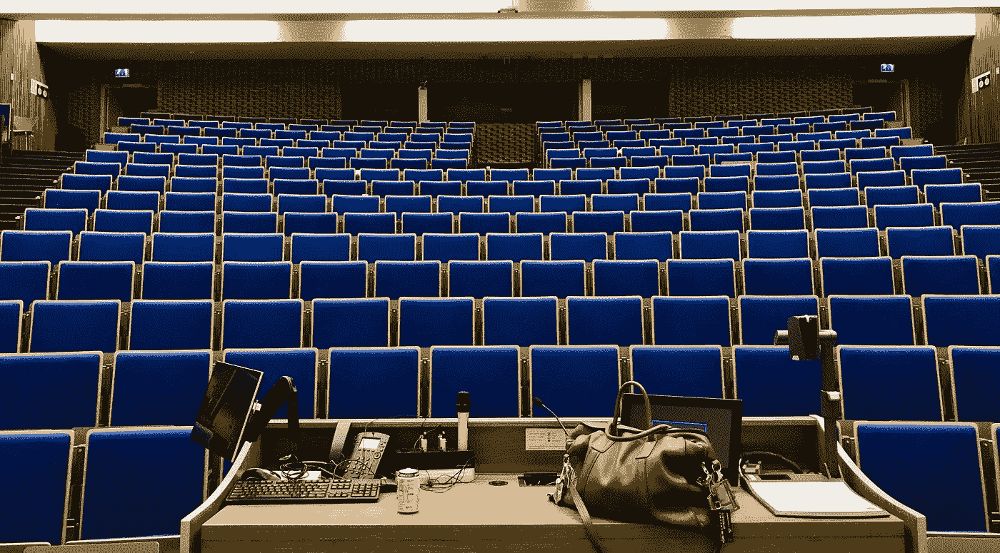

# 教育中断(终于)！

> 原文：<https://medium.com/hackernoon/education-disrupted-finally-cecc1ba64506>

## *新技术如何改变教学&学习*

改变我们教和学的方式是困难的。

但是，上周我意识到教育是如何被新技术彻底颠覆的。

并不是我所有的同事都同意。我不得不承认，如果你是一名活跃的教师或者对教育感兴趣，你可能会认为教育在过去的几十年里没有什么变化。

当然，我们都在更多地利用数字技术。但是许多人认为教学的“本质”(传递知识、信息和技能)并没有显著改变。

这是一个错误。事情已经不同了。

在数字时代，教育不仅仅是让学生获取知识。相反，未来的教室专注于提供一种体验，培养在人工智能、互联机器和自动化的世界中生活和工作的能力。这样的经历只有激发好奇心，释放创造力，并要求团队合作，才能“成功”。

毫无疑问，接受和拥抱这种变化可能会有点可怕。但是，这也让我感到兴奋和鼓舞。

以下是上周事件的三点启示

# 新思潮

首先，我妻子在当地报纸上发现了一篇关于教育改革必要性的专栏文章。

这篇文章是关于该地区有多少学校没有对新的破坏性技术给予足够的重视。至少，新的和颠覆性的技术没有以“正确的方式”融入课程。

关键点？学校仍在为学生适应旧世界做准备。

这不仅伤害了学生。这对每个人都不好。我们需要更好地理解新技术及其可能的应用。这是确保我们为年轻人的未来做好准备的唯一途径。

当然，新技术已经被引入学校课程。

> 然而，典型的方法是保守的，侧重于解释而不是使用技术。

相反，学校需要更多地关注提供一个平台，让学生理解、尝试，然后用技术共同创造。在小团队中“亲自动手”是激励年轻一代并向他们展示创新的重要性和乐趣的最佳方式。

一份相当“传统”的当地报纸关注学校课程的技术改造，这一事实让我相信，我们思考教育的方式确实发生了变化。接受这种新思潮的压力是不可逆转的。

# 新内容

第二件事是我的同事们讨论出现在文件共享网站上的教材和作业，比如 [*课程英雄*](https://www.coursehero.com/?gclid=CjwKCAiA07PRBRBJEiwAS20SIFOjiG326TB0WWXtUad8kyC3a0nZcfdfwTwQHPqLyVKzqfESDN4ArxoClmQQAvD_BwE) 。

一些同事对他们的课程材料和作业未经许可就被上传感到不满。他们认为，除非得到老师和学校的明确同意，否则禁止学生张贴任何材料。

几位老师建议，应该向学生发出警告，文件共享是违反校规的，上传此类材料将受到纪律处分。

问题是这是否是数字时代的正确方法。

当然，我理解分享这些材料的版权问题。

但是，将这种“内容共享”的趋势与音乐产业以及 1999 年 Napster 引入的颠覆相比。教育工作者可以尝试推迟“开源”教材的使用，但改变是不可避免的。

> 相反，接受“内容共享”的想法可能更明智。

一种更开放的“信息”方式已经出现。

有大量的在线资源可供学生选择，以学习和理解特定的主题。想想 *Coursera* 、 *EdX* 和 *iTunesU* 这只是几个开放学习系统的名字。当这种信息可以从多个在线来源获得时，关注“受保护的”基于知识的内容是没有意义的。

如果教学的重点是新技术和培养好奇心和创造力，那么传统材料就不再是一个关键的区分因素。真正有价值的是“教会”学生如何在数字时代学习和工作的能力，而不是传递信息的能力。

在这方面，传统的“教材”在教育中的作用不太重要。课堂作业和“考试”将采取“学徒式小组作业”的形式，竞争性的部分将在课堂上更加普遍。

学生将从网站、博客、在线视频或播客中自己获取许多必要的信息，而不是由教师编辑的传统材料。

如今，这似乎已经成为大多数学生的偏好。他们更喜欢在方便的时候自己收集信息。

在这个新世界中，教师不再是“内容”的权威来源，而是必须专注于激励和帮助学生充分利用他们自己发现的“内容”。

 [## 学生推荐的 9 个 TED 演讲，给学生

### 学生们喜欢哪个 TED 演讲？我们邀请世界各地的 TED 俱乐部成员分享他们的最爱。下面，检查…

blog.ed.ted.com](http://blog.ed.ted.com/2017/03/16/9-ted-talks-recommended-by-students-for-students/) 

# 新历

第三件事是我参加了一个关于商业组织和创新的会议，会上我参加了一些企业家和政府官员的演讲。

这似乎与“教学”有点遥远，但这一经历让我思考教学方式需要如何改变，并且已经在改变。

> “最佳演讲”正变得越来越像“TED 演讲”，因为它们简洁、充满激情，而且经常引发争议。

当前技术革命的一个反直觉效应是，它让教学变得更加“个人化”。使用挑战和克服挑战的个人故事是吸引注意力和培养好奇心的最佳方式。

当然，例子和轶事一直是很好的教学方式。这些例子对于向学生解释理论总是必要的。

但现在不同了。

这在我上周的会议上变得非常清楚。当面对描述一个新的发展或理论的传统风格的演讲时，听众就失去兴趣了。智能手机问世，人们开始“打盹”。

但是当演讲者围绕个人经历来组织他们的演讲时，每个人都参与到接下来的讨论中。听众想从演讲者的成功和失败中学习(并增加他们的经验水平)。

# 那么，下一步是什么？

我听到越来越多对现在这一代学生的抱怨。我的同事经常抱怨说，“千禧一代学生”懒惰、没有动力，而且过于注重便利。

他们没有准备。他们总是在寻找“简单的出路”。他们不停地玩手机。

这种抱怨没有抓住要点。如果年轻人没有动力，他们就会失去兴趣。作为教育工作者，我们需要更多地考虑如何吸引和激励他们。毫无疑问，这需要更多的破坏。

> 但是这种破坏已经发生了。

毕竟，新技术正在以我五年前都无法预测的方式颠覆教育。

这种颠覆将创造一种更适合新的数字世界的教育。建设应对新技术机遇和挑战的能力是让年轻人更好地为未来的不确定性做好准备的唯一途径。

当然，这种变化会给教师带来更大的压力。他们必须更频繁地调整材料，跟上技术的最新趋势。新的技术发展需要得到解决，并纳入课程。网上资源的参考必须不断地被回顾并且更新作业。

但这并不是一件坏事。教师需要成为学生的合作者。它激励终身学习，这只会带来课堂上更多的创造力和好奇心。

*感谢您的阅读！请按住*👏*下面，还是留下评论吧。*

*每周都有新的故事。因此，如果你关注我，你不会错过我关于数字时代如何改变我们生活和工作方式的最新见解。*