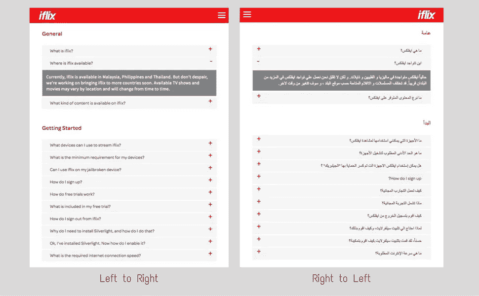

# 有效的开发者沟通

> 原文：<https://medium.com/hackernoon/effective-developers-communication-adfcf46b36f6>

> 在技术部门工作了 8 年，扮演了不同的角色。从软件工程师、分析师、顾问到经理，最近又回到了开发者的角色。这是我最近参与的一个项目的故事和我的想法。

作为一名[开发者](https://hackernoon.com/tagged/developer)，你做了伟大的工作。你解决问题，提出新的解决方案来满足业务需求。

但是你不喜欢文档。因为你认为，作为一个像你这样的优秀开发者，人们应该只是阅读代码！代码会告诉你一切。那是最可靠的文件。

嗯，这是最可靠和最真实的来源，但并不意味着阅读代码是最人类友好和最有效的。

我最近在做一个有趣的项目——从右到左(RTL)我们的应用程序，支持阿拉伯语、希伯来语等语言。这个项目还包括重构当前处理翻译的方式。

下面是一个页面在 RTL 前后的截图。

sample screenshot

听起来简单吗？是也不是。

我们的团队在不同的国家和完全不同的时区工作。例如，我的晚上 11 点将是另一边的凌晨 4 点。

由于这些变化将影响所有的 ui，所有国家的团队都必须意识到这一点。

# 一些经验

## 伟大的解决方案只有在你分享的时候才是最棒的

作为公司的新人，我意识到这里的团队通常不会分享他们的架构和实现。

我的一些出色的同事已经为新的翻译实现打下了一些基础，但这些知识并没有真正与任何人分享，包括项目移交给我的时候。

## 你不知道你不知道什么

其他团队，无论是同一个国家的团队还是其他国家的团队，并不完全了解翻译和 RTL 的变化。因为他们不知道，因此，

*   当一些团队添加新的 ui 时，他们并不迎合 RTL 设计，而是使用旧的方式来实现翻译。
*   新的翻译实现方式，在某些特定情况下会导致 UI 上的某些翻译丢失，因为翻译是从同步调用转移到异步调用的。
*   进行的测试没有及时捕获那些丢失的翻译，这阻碍了其他团队的变更。
*   由于其他团队不知道问题的确切原因，因此，有些人感到恐慌。有些人试图用一些其他的变通方法来解决这个问题。

# 问题的主要原因:沟通

问题的主要来源是[通讯](https://hackernoon.com/tagged/communication)故障。

*   翻译的架构没有被恰当地移交给后继团队和整个工程团队。
*   翻译和 RTL 实现细节没有级联到所有人，导致不必要的时间花费在调查和修复错误的方式上。

# 解决它:告诉世界

告诉每个人你的改变和他们需要做什么。电子邮件、Slack、Skype 等渠道。就我的情况而言，电子邮件是最有效的方式，而懈怠在我们的工程渠道中又压住了它。

## 通信格式

以下是我对电子邮件格式的看法。永远短总结先来，然后 TL；博士，没有人会在不需要的时候有时间看长邮件。

1.  总结——最好少于 50 个字。尽可能保持简短。
2.  目标——我们为什么要这样做，我们想达到什么目的，基本上是总结的延伸。
3.  需要采取的行动和细节——你需要人们参与什么以及如何参与？如果有的话，放一个链接到一些详细的文档。

这里有一个例子:

> **总结**
> 
> 今后，我们将在翻译管理工具 *X* 中保留所有翻译。
> 
> 开始使用 X 来表示您正在处理的任何当前或未来的功能。
> 
> **为什么搬到 X**
> 
> 我们有雄心勃勃的计划要走向世界。这意味着我们需要能够更快地在新国家推出产品。
> 
> 作为这项工作的一部分，我们需要
> 
> -实行集中翻译管理。翻译人员可以更轻松、更快速地为国家发布添加新语言。
> 
> -很少或没有开发人员参与添加翻译。开发人员可以更专注于构建功能，而不是添加翻译。
> 
> **你需要做什么**
> 
> 迁移正在进行中。你是它的一部分。
> 
> 我在 README( *链接此处*)中添加了一个关于所需代码更改的部分。
> 
> 看一看。如果您对此有任何疑问，请查找*核心团队名称*。
> 
> 开始使用 X 来表示您正在处理的任何当前或未来的功能。

## 文档格式

直截了当地说，可以把它分成较小的画面(实现)和较大的画面(TLDR，架构变化)。在你的分享网站上维护它，无论是 Share points、Confluence 还是 Github markdown。

较小的图片

1.  摘要—可以复制粘贴电子邮件摘要或将其修改为更具技术性，因为电子邮件可能包括一些利益相关方(交付经理、产品负责人)，但文档仅关注开发人员。
2.  旧代码是什么样的——举一个旧代码的例子
3.  新代码是什么样的——举一个新代码的例子
4.  开发过程中的验证码和注释——需要注意的事项。
5.  TLDR —链接到更大的图片、架构文档(如果有)或任何外部资源。

## 知识分享会

必要时进行操作。给需要更多细节的团队。

# 为什么重要？

## 自信并关注变化

不要让任何人害怕接触你的代码。

当与变更相关的错误发生时，在您的办公时间之外，地球另一端的开发人员可以发现它。

## 你不想一遍又一遍地做同样的事情

当有新的 UI 开发或由其他团队开发时，你不希望 RTL 或翻译给他们。

确保他们有足够的知识

# 什么时候沟通？

应该在你完成项目后完成吗？或者当你有解决方法的时候？看情况。

就我而言，当我们有了具体稳定的解决方案，并且有大约 70%的页面是 RTL 编辑的时候，我们会和团队分享。

但我认为沟通可以更早，当我们有大约 30%的页面转换，因为在这一点上，我们已经有了具体的解决方案。

沟通要尽早。

## 你应该和谁沟通？

如果你知道目标团队，发给他们。在我的情况下，电子邮件发送给所有开发人员，因为翻译和 RTL 是应用广泛。

## 谁应该开始沟通？

如果公司里没人这么做，也不用怕。你可以成为开始这一切的人。

不要有“我只是一个开发者”的心态，因为这些事关你。当你认为需要的时候就去做。

和你的领导谈谈，和你的经理谈谈。我很高兴我有一个乐于听取反馈的有用且开放的领导。我们做到了。用电子邮件发送出去，放松一下。我认为结果相当令人鼓舞。

我们让其他团队成员开始询问关于实现的问题；我们有一位完成原始 POC 的同事写了一份详细的 TLDR 部分(其中一些我不知道)。

这很好。开始吧！

# 结束了

我不喜欢冗长的电子邮件。如果我对冗长的文档不感兴趣或者不做，我不会一头扎进去。但是，我想知道我应该记些什么。

文档也很无聊，所以保持简短，用你喜欢的方式写。

从高层次了解变化是什么，我应该做什么，并在以后需要时深入了解细节。

> 沟通很重要。有效地级联信息是很重要的，尤其是你有这样一个大团队。选择任何对你有用的方法。

> [黑客中午](http://bit.ly/Hackernoon)是黑客如何开始他们的下午。我们是 [@AMI](http://bit.ly/atAMIatAMI) 家庭的一员。我们现在[接受投稿](http://bit.ly/hackernoonsubmission)，并乐意[讨论广告&赞助](mailto:partners@amipublications.com)机会。
> 
> 如果你喜欢这个故事，我们推荐你阅读我们的[最新科技故事](http://bit.ly/hackernoonlatestt)和[趋势科技故事](https://hackernoon.com/trending)。直到下一次，不要把世界的现实想当然！

