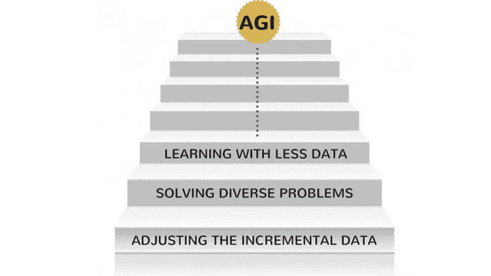
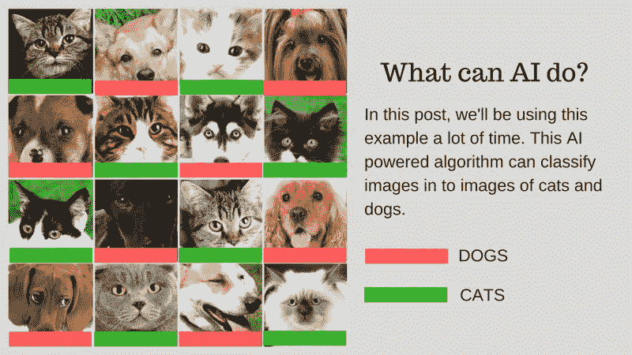
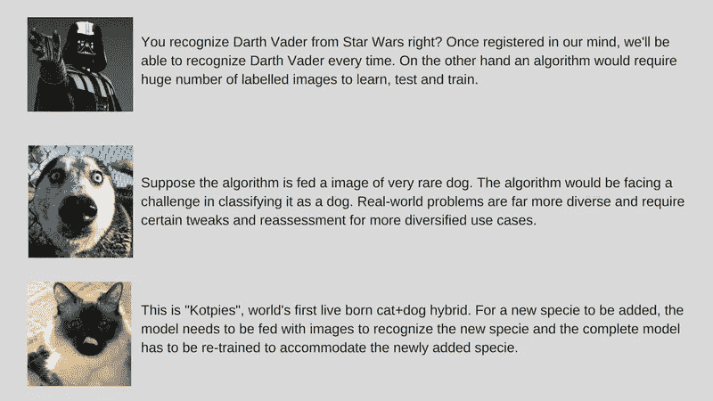
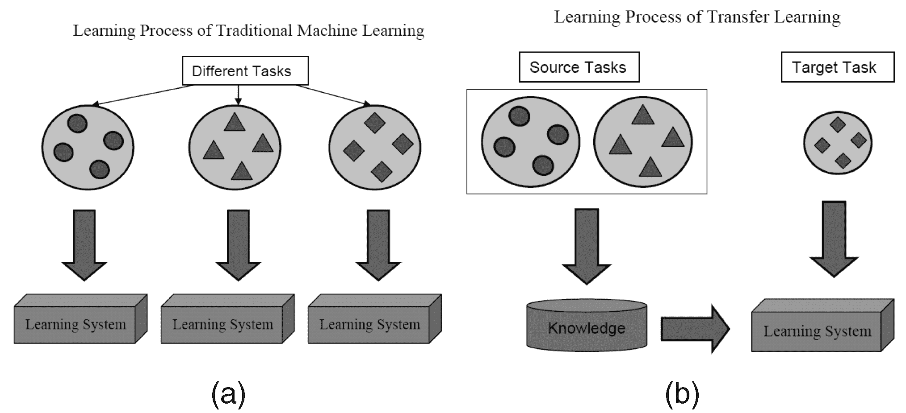
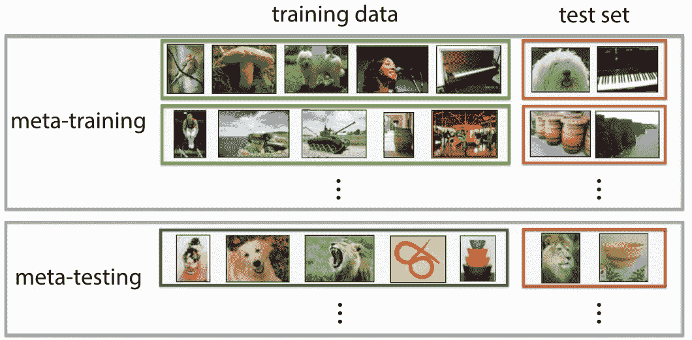
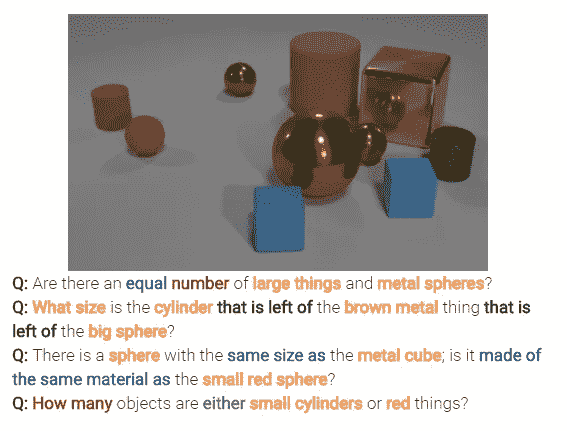
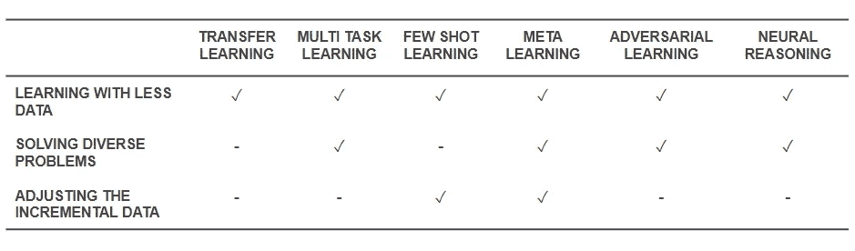

# 有效学习:人工智能的未来

> 原文：<https://medium.com/hackernoon/effective-learning-the-near-future-of-ai-9bb671211d96>

毫无疑问，人工智能的最终未来是达到并超越人类的智能。但这是一个遥不可及的壮举。即使是我们当中最乐观的人也打赌，人类水平的人工智能(AGI 或 ASI)将在 10-15 年后出现，而怀疑论者甚至愿意打赌，即使有可能，也需要几个世纪。好吧，这不是这篇文章的内容(如果你对学习超级智能感兴趣，你应该读读这篇[文章](https://waitbutwhy.com/2015/01/artificial-intelligence-revolution-1.html))。在这里，我们将谈论一个更有形、更近的未来，并讨论新兴和强大的人工智能算法和技术，在我们看来，这些算法和技术将塑造人工智能的未来。

人工智能已经开始在一些特定的任务中超越人类。比如，[在诊断皮肤癌上打败医生](https://www.nature.com/nature/journal/v542/n7639/full/nature21056.html)，[在世界锦标赛上打败围棋手](https://en.wikipedia.org/wiki/AlphaGo_Zero)。但是同样的系统和模型在执行不同于他们被训练去解决的任务时会失败。这就是为什么从长远来看，一个不需要重新评估就能有效执行一系列任务的智能系统被称为人工智能的未来。但是，在人工智能的不远的将来，在 AGI 到来之前，科学家们如何才能让人工智能驱动的算法克服他们今天面临的问题，走出实验室，成为日常用品？

当你环顾四周，人工智能正在一次赢得一座城堡(阅读我们关于人工智能如何超过人类的帖子，[第一部分](http://blog.paralleldots.com/technology/artificial-intelligence/artificial-intelligence-outpacing-humans/)和[第二部分](http://blog.paralleldots.com/technology/artificial-intelligence/artificial-intelligence-outpacing-humans-part-ii/))。在这样一个双赢的游戏中，还会出什么差错呢？随着时间的推移，人类正在产生越来越多的数据(这是人工智能消耗的饲料)，我们的硬件能力也在变得越来越好。毕竟，数据和更好的计算是深度学习革命在 2012 年开始的原因，对吗？事实是，比数据和计算增长更快的是人类期望的增长。数据科学家将不得不考虑超越现有的解决方案来解决现实世界的问题。例如，大多数人会认为图像分类在科学上是一个[解决的问题](http://blog.paralleldots.com/technology/deep-learning/must-read-path-breaking-papers-about-image-classification/)(如果我们忍住不说 100%准确率或 GTFO 的冲动)。我们可以使用人工智能将图像分类(比如说猫图像或狗图像)以匹配人类的能力。但是这已经可以用于现实世界的用例了吗？人工智能能否为人类面临的更多实际问题提供解决方案？在某些情况下，是的，但在很多情况下，我们还没有到那一步。

我们将带你经历挑战，这些挑战是使用人工智能开发现实世界解决方案的主要障碍。假设您想要对猫和狗的图像进行分类。我们将在整篇文章中使用这个例子。

*Our example algorithm: Classifying the images of cats and dogs*

下图总结了这些挑战:

*Challenges involved in developing a real-world AI*

让我们详细讨论一下这些挑战:

**用较少的数据学习:**

*   大多数成功的深度学习算法消耗的训练数据要求根据其包含的内容/特征对其进行标记。这个过程叫做注释。
*   算法不能使用你周围自然发现的数据。注释几百个(或几千个数据点)很容易，但是我们的人类级图像分类算法需要一百万个带注释的图像才能很好地学习。
*   所以问题是，注释一百万张图片是否可能？如果不是，那么人工智能如何用更少的标注数据进行扩展呢？

**解决不同的现实世界问题:**

*   虽然数据集是固定的，但真实世界的用途更加多样(比如说，在彩色图像上训练的算法可能会像人类一样在灰度图像上严重失败)。
*   虽然我们已经改进了计算机视觉算法来检测物体以匹配人类。但如前所述，与人类智能相比，这些算法解决了一个非常特殊的问题，而人类智能在许多意义上更加通用。
*   我们的示例 AI 算法对猫和狗进行分类，如果没有该物种的图像，将无法识别稀有的狗物种。

**调整增量数据:**

*   另一个主要挑战是增量数据。在我们的例子中，如果我们试图识别猫和狗，我们可能会在首次部署时针对不同物种的大量猫和狗图像训练我们的 AI。但是在发现一个新物种时，我们需要训练算法来识别“Kotpies”和以前的物种。
*   虽然新物种可能比我们想象的更类似于其他物种，并且可以很容易地训练以适应算法，但有些地方这很难，需要完全的重新训练和重新评估。
*   问题是我们能让人工智能至少适应这些小变化吗？

为了使 AI 立即可用，其想法是通过一套称为有效学习的方法来解决前述挑战(请注意，这不是一个官方术语，我只是为了避免每次都编写元学习、迁移学习、少数镜头学习、对抗学习和多任务学习而编造的)。我们在 [ParallelDots](http://www.paralleldots.xyz/) ，现在正在使用这些方法解决人工智能的狭隘问题，赢得小规模战斗，同时为更全面的人工智能征服更大的战争做准备。让我们一次一个地向您介绍这些技术。

值得注意的是，大多数有效学习的技巧并不新鲜。他们现在只是看到了复苏。SVM(支持向量机)的研究人员已经使用这些技术很长时间了。另一方面，对抗性学习是来自[古德菲勒最近在 GANs](https://arxiv.org/abs/1406.2661) 的工作，神经推理是一套新的技术，其数据集最近才变得可用。让我们深入探讨这些技术将如何帮助塑造人工智能的未来。

# 迁移学习

## 这是什么？

顾名思义，在迁移学习中，学习是在同一算法内从一个任务迁移到另一个任务。在具有较大数据集的一个任务(源任务)上训练的算法可以在修改或不修改的情况下被转移，作为试图在(相对)较小数据集上学习不同任务(目标任务)的算法的一部分。

*Traditional Learning vs Transfer Learning. Credits: Credits:* [*IEEE Computer Society*](https://www.computer.org/csdl/trans/tk/2010/10/ttk2010101345-abs.html)

## 一些例子

使用图像分类算法的参数作为不同任务(如对象检测)中的特征提取器是迁移学习的简单应用。相比之下，它也可以用来执行复杂的任务。谷歌不久前开发的比医生更好地对糖尿病视网膜病变进行分类的[算法](https://jamanetwork.com/journals/jama/fullarticle/2588763)是利用迁移学习实现的。令人惊讶的是，糖尿病视网膜病变检测器实际上是一个现实世界的图像分类器(狗/猫图像分类器),通过转移学习来对眼睛扫描进行分类。

## 多给我讲讲！

你会发现数据科学家将这种从源到目标任务的神经网络转移部分称为深度学习文献中的预训练网络。微调是当目标任务的误差被适度地反向传播到预训练的网络中，而不是不加修改地使用预训练的网络。一个很好的关于计算机视觉中迁移学习的技术介绍可以看[这里](http://cs231n.github.io/transfer-learning/)。迁移学习这个简单的概念在我们一套有效的学习方法中非常重要。

# 多任务学习

## 这是什么？

在多任务学习中，同时解决多个学习任务，同时利用任务之间的共性和差异。这很令人惊讶，但有时一起学习两个或更多的任务(也称为主要任务和辅助任务)可以使任务的结果更好。请注意，并不是每一对、三对或四对任务都可以被认为是辅助性的。但当它起作用时，它是精确度的一个自由增量。

*Performing three tasks with MTL. Credits:* [*Sebastian Ruder*](http://ruder.io/multi-task/)

## 一些例子

例如，在 ParallelDots，我们的情感、意图和情感检测分类器被训练为多任务学习，与我们单独训练它们相比，这增加了它们的准确性。我们所知道的 NLP 中最好的语义角色标注和词性标注[系统](https://arxiv.org/abs/1611.01587)是一个多任务学习系统，因此也是计算机视觉中语义和实例分割最好的[系统](https://arxiv.org/abs/1705.07115)之一。谷歌提出了[多模态多任务学习器](https://arxiv.org/abs/1706.05137)(一个模型来统治他们)，可以在同一个镜头中从视觉和文本数据集学习。

## 多给我讲讲！

在现实应用中，多任务学习的一个非常重要的方面是训练任何任务成为防弹的，我们需要尊重数据来自的许多领域(也称为领域适应)。我们的猫和狗用例中的一个例子将是一种可以识别不同来源图像的算法(比如 VGA 摄像机和高清摄像机，甚至是红外摄像机)。在这种情况下，域分类的辅助损失(图像来自哪里)可以被添加到任何任务，然后机器学习，使得算法在主任务(将图像分类为猫或狗图像)中变得更好，但在辅助任务中故意变得更差(这是通过从域分类任务反向传播反向误差梯度来完成的)。这个想法是，算法学习主要任务的区别特征，但忘记区分域的特征，这将使它变得更好。多任务学习及其领域适应表兄弟是我们所知道的最成功有效的学习技术之一，在塑造人工智能的未来方面发挥着重要作用。

# 对抗性学习

## 这是什么？

对抗性学习作为一个领域是从伊恩·古德费勒的研究工作发展而来的。尽管对抗性学习最受欢迎的应用无疑是生成性对抗性网络(GANs ),它可以用来生成令人惊叹的图像，但这套技术还有其他多种方式。通常这种受博弈论启发的技术有两个算法一个生成器和一个区分器，它们的目的是在训练时愚弄对方。如我们所讨论的，生成器可以用于生成新的新颖图像，但是也可以生成任何其他数据的表示，以对鉴别器隐藏细节。后者是我们对这个概念如此感兴趣的原因。

*Generative Adversarial Networks. Credits:* [*O’Reilly*](https://www.oreilly.com/learning/generative-adversarial-networks-for-beginners)

## 一些例子

这是一个新的领域，图像生成能力可能是像天文学家这样最感兴趣的人所关注的。但是我们相信这也将演化出更新的用例，我们稍后会讲到。

## 多给我讲讲！

使用 GAN 损耗可以改进域适应游戏。这里的辅助损失是 GAN 系统而不是纯域分类，其中鉴别器试图对数据来自哪个域进行分类，而生成器组件试图通过将随机噪声呈现为数据来欺骗它。根据我们的经验，这比简单的领域适应更有效(对代码来说也更不稳定)。

# 少数镜头学习

## 这是什么？

少数镜头学习是一项技术研究，与传统算法相比，该技术使深度学习(或任何机器学习算法)算法可以用更少的示例进行学习。一次性学习基本上是用一个类别的一个例子学习，归纳 k-shot 学习意味着用每个类别的 k 个例子学习。

*One Shot Learning using few examples of a class. Credits:* [*Google DeepMind*](https://arxiv.org/pdf/1606.04080v1.pdf)

## 举几个例子？

作为一个领域，很少有机会在所有主要的深度学习会议上看到论文的涌入，现在有了[特定的数据集](https://github.com/brendenlake/omniglot)来基准测试结果，就像 MNIST 和 CIFAR 用于正常的机器学习一样。一次性学习在某些图像分类任务中有许多应用，例如特征检测和表示。

## 多给我讲讲！

有多种方法可用于少量学习，包括迁移学习、多任务学习以及元学习，作为算法的全部或部分。还有其他的方法，比如使用[巧妙的损失函数](https://deepmind.com/research/publications/matching-networks-one-shot-learning/)，使用[动态架构](https://arxiv.org/abs/1605.06065)或者使用优化技巧。Zero Shot Learning 是一类声称可以预测算法从未见过的类别的答案的算法，基本上是可以随着新类型的数据而扩展的算法。

# 元学习

## 这是什么？

元学习就像它听起来的那样，是一种训练算法，在看到数据集时，它会为该特定数据集生成一个新的机器学习预测器。如果你第一眼看到这个定义，它是非常超前的。你会觉得“哇！这就是数据科学家所做的”，而且它正在使“21 世纪最性感的工作”自动化，在某种意义上，元学习者已经开始这样做了(参考谷歌的这篇[博客文章](https://research.googleblog.com/2017/05/using-machine-learning-to-explore.html)和这篇[研究论文](https://arxiv.org/abs/1708.05344))。

*Example Meta-Learning set-up for few-shot image classification. Credits:* [*Ravi et.al*](https://openreview.net/forum?id=rJY0-Kcll).

## 一些例子

元学习最近已经成为深度学习的一个热门话题，出现了大量的研究论文，最常见的是使用超参数和神经网络优化技术，寻找良好的网络架构，少量图像识别和快速强化学习。你可以在这里找到关于用例[的更全面的文章。](http://bair.berkeley.edu/blog/2017/07/18/learning-to-learn/)

## 多给我讲讲！

有些人将这种决定参数和超参数(如网络架构)的完全自动化称为 AutoML，您可能会发现有人将元学习和 autoML 称为不同的领域。尽管围绕它们进行了大肆宣传，但事实是，随着数据的复杂性和多样性的增加，元学习器仍然是扩展机器学习的算法和途径。

大多数元学习论文都是聪明的黑客，根据维基百科，它们具有以下特性:

*   该系统必须包括一个学习子系统，它可以根据经验进行调整。
*   *通过利用从单个数据集的先前学习事件中提取的元知识，或者从不同的领域或问题中提取的元知识，可以获得经验。*
*   *学习偏差必须动态选择。*

该子系统基本上是一种设置，当一个域(或一个全新的域)的元数据被引入其中时，该设置进行适应。这些元数据可以告诉我们类的数量、复杂性、颜色、纹理和对象(在图像中)的变化、风格、语言模式(自然语言)和其他类似的特征。在这里查看一些超级酷的论文:[元学习共享层次](https://arxiv.org/abs/1710.09767)和[使用时间卷积的元学习。您也可以使用元学习架构构建少量或零触发算法。元学习是最有前途的技术之一，将有助于塑造人工智能的未来。](https://arxiv.org/abs/1707.03141)

# 神经推理

## 这是什么？

神经推理是图像分类问题中的下一件大事。神经推理是模式识别之上的一步，其中算法超越了简单识别和分类文本或图像的想法。神经推理是在文本分析或视觉分析中解决更一般的问题。例如，下图表示神经推理可以从图像中回答的一组问题。

*Example Neural Reasoning questions. Credits:* [*CLEVR*](http://cs.stanford.edu/people/jcjohns/clevr/)

## 多给我讲讲！

这套新技术是在脸书的 bAbi 数据集或最近的 [CLEVR 数据集](http://cs.stanford.edu/people/jcjohns/clevr/)发布之后出现的。破译关系而不仅仅是模式的技术有巨大的潜力，不仅可以解决神经推理，还可以解决包括少量学习问题在内的许多其他难题。

现在我们知道了这些技术，让我们回头看看它们是如何解决我们开始时的基础问题的。下表简要介绍了有效学习技巧应对挑战的能力:

*Capabilities of Effective Learning techniques*

*   上面提到的所有技术都有助于以某种方式用较少的数据解决训练问题。虽然元学习将给出仅用数据建模的架构，但迁移学习正在使来自其他领域的知识对弥补更少的数据有用。作为一门科学学科，很少有人专门研究这个问题。对抗性学习可以帮助增强数据集。
*   领域适应(一种多任务学习)、对抗学习和(有时)元学习架构有助于解决数据多样性带来的问题。
*   元学习和少镜头学习有助于解决增量数据问题。
*   神经推理算法在作为元学习者或少数元学习者整合时，具有解决现实世界问题的巨大潜力。

请注意，这些有效的学习技术不是新的深度学习/机器学习技术，而是作为黑客补充现有技术，使它们更加物有所值。因此，您仍然会看到我们的常规工具，如卷积神经网络和 LSTMs，但是有所增加。这些有效的学习技术可以用更少的数据工作，并一次执行许多任务，可以帮助更容易地生产和商业化人工智能产品和服务。与此同时，我们正在认识到有效学习的力量，并将其作为我们研究理念的主要特征之一。

> 我为应用人工智能研究小组 [Paralleldots](https://www.paralleldots.com/) 工作。我们为现实世界的问题开发人工智能解决方案。文章最初发表于[这里](http://blog.paralleldots.com/technology/deep-learning/effective-learning-near-future-ai/)。
> 
> 如果你喜欢读这篇文章，请鼓掌，分享或评论下面的进一步讨论。