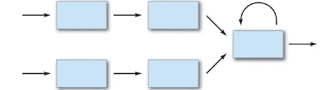
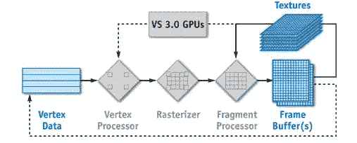
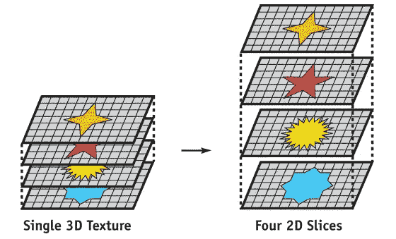
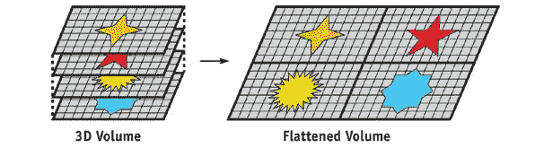
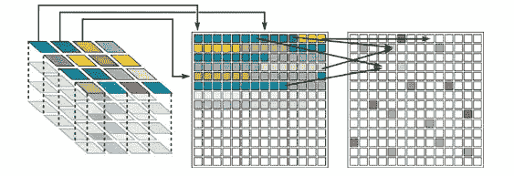

# 有效的并行计算

> 原文：<https://medium.com/hackernoon/effective-parallel-computing-bc8832114b7b>

> “十多年来，先知们一直在说……单台计算机已经达到了极限，只有通过多台计算机的互连才能取得真正重大的进步。”—**1967 年的吉恩·阿姆达尔**

这句话是 49 年前说的！因此，近半个世纪以来，人们已经意识到串行计算不会给我们带来任何好处。

所以序列号就像 70 年代的衣服，是的，那时候很好，但现在不是了，看在上帝的份上！

直到最近还没有很多应用程序使用并行处理，事实上他们并不需要它。是电子游戏激发了 GPU(当着你父母的面！).

现在，随着机器[学习](https://hackernoon.com/tagged/learning)的引入，对于 GPU 来说，没有比这更有用的应用了。为什么？

机器学习有效地一遍又一遍地应用相同的计算步骤，数百万或数十亿次！这些任务本质上并不复杂，但仍然需要一些时间。[最小化](https://hackernoon.com/tagged/minimising)那段时间很艰难。幸运的是，这些计算是相互独立的。

现在与通常有 4 个物理核心或 8 个虚拟核心的 CPU 相比(你可能会选择 E7 Xeons，但你必须是一个百万富翁！)，像 Nvidia 1080 这样的 GPU 有 2560 个核心！同样的价格超过 160 倍！

那么我们怎么做才能加快速度呢？我们并行运行几千次计算！

示例:

一个男孩受到了惩罚，他不得不写“我再也不在上课时睡觉了”一百万次，也就是一百万次(这个老师会很可怕！).

一般来说，他花 14 秒写一行，如果他加快速度，他可能在 10 秒内完成。现在写 100 万次，他会要求:

```
10 * 1,000,000 sec = 166667 mins = 2777 hours = 116 days = 4 months
```

所以他会连续写 4 个月！没有意义！

现在如果他可以让 1000 个人帮他写同样的东西，但是每个人花 20 秒写一个句子:

```
(20 * 1,000,000) / 1,000 secs = 167 mins = 2.777 hours
```

尽管每个人都以一半的速度写作，但速度的提升是疯狂的！

差不多 4 个月的工作量，3 个小时之内就做完了！！

## **怎么发生的，深入！**

**第一个 GPU vs CPU**

GPU:

1.  高流通量
2.  不太复杂的计算
3.  工作不太灵活
4.  以低得多的时钟速度计时

CPU:

1.  低延迟
2.  非常复杂的计算
3.  在工作方面非常灵活
4.  以更高的时钟速度计时

现在 GPU 就像一群努力工作的实习生，他们不能做出非常关键的决定，但如果有工作，他们会全力以赴。

> 所以 GPU 的行为就像一个协处理器，而不像主处理器。在主从计算方面，GPU 是从属于 CPU 的命令。

现在，让我们更深入地了解这些步骤:

1.  CPU 在设备上启动内核(内核是一个串行代码，是原始代码的一小部分。)
2.  CPU 在 GPU 上分配内存
3.  CPU 将输入数据复制到 GPU
4.  CPU 启动 GPU 上的内核来处理输入数据
5.  CPU 将输出结果复制到自身

那么我们如何在 GPU 中定义并行性呢

```
GPU Parallelism = No. of blocks * Threads per block
```

典型的内核调用是什么样子的？

```
<< Grid of Blocks , Block of Threads , Shared Memory per Block >>
```

> 调用 SyncThread 时，它会一直等待，直到同一个块中的所有线程都执行完。等待其他线程完成的指令称为隐式障碍。

# 计算

***使计算成为可能的基本指令是什么，它们是如何实现的？***

从基础开始:

## 向量运算

向量运算对向量(一维或多维)的相应元素执行逐个元素的运算。如果操作数具有相同的大小，那么第一个操作数中的每个元素都与第二个操作数中相同位置的元素匹配。如果操作数具有兼容的大小，那么每个输入都会根据需要隐式扩展，以匹配另一个输入的大小。

示例:添加两个不同大小的向量

```
[ [1,2] , [3,4] ] + [5,6] <- Will give an Error
```

所以我们展开第二个矩阵

```
[ [1 , 2] , [3 , 4] ] + [ [5 , 6] , [0 , 0] ]
```

让我们试试元素式乘法

```
[ [1*5 , 2*6] , [3*0 , 4*0] ] = [ [5 , 12] , [0 , 0] ]
```

## 矩阵运算

矩阵运算遵循线性代数的规则，与多维数组不兼容。彼此相关的输入所需的尺寸和形状取决于操作。对于非标量输入，矩阵运算符通常会计算出与数组运算符不同的答案。

示例:

使用矩阵运算将两个矩阵相乘将导致

```
[ [(1*5)+(2*0) , (6*1)+(2*0)] , [(3*5)+(4*0) , (3*6)+(4*0)] ]
```

这相当于:

```
[ [5 ,   6] ,    [15 , 18] ]
```

> **关键词**
> 
> Memops:内存操作。向内存写入或读取数据。
> 
> Flops:计算操作。计算一条指令所需的时间。

## 基本线性代数子程序

> 密集的线性代数运算通常是科学计算的核心，即使是最快的计算机也会面临压力。因此，重要的是，计算这些操作的例程获得高性能，因为它们执行最少的操作，并获得尽可能高的执行速率。

## 一级:AXPY

表示以下形式的向量-向量运算

```
y <- αx + y
```

或者 y 等于 ax+y，这里

```
α ∈ R 
```

和

```
x,y ∈ R^n
```

这里' a '，' x '和' y '存放在主存中。axpy 的有效实现会将“a”从内存加载到寄存器中，然后用“x”和“y”进行计算，这两个值也必须从内存中提取。更新的结果“y”也必须被存储，对于执行的 2n 个触发器总共大约 3n 个 memops。因此，每两个触发器需要三个 memops。如果 memops 比 flops 贵(通常是这样)，那么限制 axpy 性能的就是 memops。

即将内容加载到存储器和从存储器加载内容的速度形成了瓶颈。

## 第二级:GEMV

表示以下形式的一般矩阵向量运算

```
y <- Ax + y
```

这里的 x 和 y 是矢量，而 A 是矩阵。

```
x ,  y ∈ R^nA ∈ R^(nXn)
```

该操作大致涉及最初存储在存储器中的 n^2 数据(用于矩阵)和 2n^2 触发器。因此，一个最佳的实现将恰好一次提取‘A’的每个元素，产生每两个触发器一个 memop 的比率。尽管这比 axpy 的比率好，但如果 memops 比 flops 慢得多，它仍然是算法成本的主要部分。

## 第三级:GEMM

表示以下形式的通用矩阵矩阵运算

```
C <- α op(A) op(B) + βC
```

这里

```
α , β ∈ Rop(A) ∈ R^m×k op(B) ∈ R^k×n C ∈ R^m×n
```

术语“op(X)”在这里表示矩阵可以是 x 或 X^T(转置)。

因此，该等式的基本含义是，上述等式可以采用以下形式:

```
C <- α (A B) + βC
C <- α (A^T B) + βC
C <- α A B^T + βC
C <- α (A^T B^T) + βC
```

考虑乘积 C := AB + C，其中所有三个矩阵都是 n 阶的平方。该运算涉及 4n^2 memops (A 和 b 必须从存储器中取出，而 c 必须同时取出和存储),并且需要 2n^3 触发器，4n^2 /2n^3 = 2/n memops/flops。因此，如果 n 足够大，则执行 memops 的成本相对于使用数据执行有用计算的成本来说是小的，并且有机会在许多计算中分摊将数据提取到高速缓存中的成本。

现在有许多基于 m，n，k(矩阵维数)的 GEMM 实现

示例:

```
C <- A^(m X k) B^(k X n) + C^(m^n)
```

以下是执行它的方法


Algorithms for GEMM

GEMM 仍然是最优化的计算方式之一，唯一的问题是，它在内存中加载了大量的信息。所以我们把矩阵分解成更小的矩阵，批量相乘。

基于高斯估计的方法，如 LU 分解法，通常用于解决 MatMul 问题。在适用的情况下，Cholesky 分解的效率几乎是 LU 因式分解的三倍。

如果你不熟悉高斯估计，那么这个视频会很有帮助

示例:

因此，像 CNN(卷积神经网络)这样的一些深度学习器可以在本质上比像 T2·RNN(递归神经网络)这样的其他深度学习器更大程度地并行化。

在 CNN 的情况下，让我们以一个 4096*4096 大小的图像为例进行分析。这意味着基本上有 16，777，216 个像素需要分析。在这里的[池层](http://cs231n.github.io/convolutional-networks/#pool)中，每个块都可以看作是独立的计算。因此，可以独立地求解每个块，并且可以组合结果。因此可以实现高度并行。

这也意味着，如果不是所有的 1600 万像素都适合内存，它可以很容易地分成几批。因此，我们可以在内存中加载这 1600 万像素的小块，并优化它们和应用 GEMM。

让我们假设这是一个图像

```
[[1,2,3],[4,5,6],[7,8,9]]
```

这个块将被分解成更小的矩阵

```
[[1,2],[3,4]][[2,3],[5,6]][[4,5],[7,8]][[5,6],[8,9]]
```

# GPU 计算

***GPU 计算的架构是怎样的？***

## **GPGPU**

它代表**图形处理单元上的通用计算**，基本上意味着使用 GPU 进行计算。

> 从本质上讲，GPGPU 管道是一种在一个或多个 GPU 和 CPU 之间的并行处理，它分析数据，就像它是图像或其他图形形式一样。将数据迁移到图形形式，然后使用 GPU 扫描和分析它，可以大大加快速度。
> 
> —维基百科

# 基于 GPU 的例程

***GPU 上的计算是如何在基础层面完成的？而且为什么这么有效？***

## 地图

map 操作简单地将给定的函数(内核)应用于流中的每个元素。一个简单的例子是将流中的每个值乘以一个常数。CPU 为屏幕上的每个像素生成一个片段，并对每个像素应用一个片段程序。相同大小的结果流存储在输出缓冲区中。

## 减少

一些计算需要从较大的流中计算较小的流(可能只有 1 个元素的流)。这被称为流的缩减。通常，还原可以分多个步骤进行。来自前一步骤的结果被用作当前步骤的输入，并且应用该操作的范围被减小，直到只剩下一个流元素。

## 流过滤

流过滤本质上是一种非均匀归约。过滤包括根据某些标准从流中删除项目。

## 扫描

扫描操作，也称为*并行前缀求和*，接收数据元素的向量(流)和带有单位元素‘I’的(任意)关联二元函数’+’。

> 如果输入为[a0，a1，a2，a3，...]，则*独占扫描*产生输出[i，a0，a0 + a1，a0 + a1 + a2，...]，而*包含扫描*产生输出[a0，a0 + a1，a0 + a1 + a2，a0 + a1 + a2 + a3，...]。虽然乍一看，该操作似乎固有地是串行的，但是有效的并行扫描算法是可能的，并且已经在图形处理单元上实现。扫描操作用于例如快速排序和稀疏矩阵向量乘法。

## 分散

分散操作最自然地在顶点处理器上定义。顶点处理器能够调整顶点的位置，这使得程序能够控制信息在网格上的存放位置。

> 顶点处理器:图形系统组件，接收一组 3D 顶点作为输入，并处理它们以获得 2D 屏幕位置。目前的 GPU 具有多个并行工作的顶点处理器，并且可以使用顶点程序进行编程。
> 
> 片段处理器(非顶点处理器)不能执行直接分散操作，因为网格上每个片段的位置在片段创建时是固定的，程序员不能更改。但是，逻辑分散操作有时可能会通过另一个聚集步骤进行重新转换或实现。分散实现将首先发出输出值和输出地址。紧接着的收集操作使用地址比较来查看输出值是否映射到当前输出槽。

## 聚集

聚集与分散相反，在分散根据贴图对元素重新排序后，聚集可以根据使用的贴图分散恢复元素的顺序。

## 分类

排序操作将无序的元素集转换为有序的元素集。GPU 上最常见的实现是对整数和浮点数据使用基数排序，对一般可比数据使用粗粒度合并排序和细粒度排序网络。

## 搜索

搜索操作允许程序员在流中找到给定的元素，或者可能找到指定元素的邻居。GPU 不是用来加速单个元素的搜索，而是用来并行运行多个搜索。最常用的搜索方法是排序元素的二分搜索法。

# 流式计算

***那么什么是蒸汽计算呢？而且为什么这么有效？***

将 GPU 用于实时渲染之外的目的的关键是将其视为一台*流*、*数据并行*计算机。

GPU 等流处理器的编程方式与如今的 CPU 等串行处理器完全不同。CPU 可以在程序中的任何时候写入内存中的任何位置。相反，流处理器可以以更加结构化的方式访问存储器。在流模型中，程序被表示为对数据流的一系列操作。*流*中的元素(即数据的有序数组)由*内核*中的指令处理。内核对流中的每个元素进行操作，并将结果写入输出流。

***工作:*** *流编程模型限制允许 GPU 并行执行内核，因此可以同时处理许多数据元素。通过确保一个流元素上的计算不会影响同一流中另一个元素上的计算，这种数据并行性成为可能。因此，在内核计算中唯一可以使用的值是内核和全局内存读取的输入。此外，GPU 要求内核的输出是独立的:内核不能随机写入全局内存(换句话说，它们只能写入输出流的单个流元素位置)。该模型提供的数据并行性是 GPU 在串行处理器上提供加速的基础。*



Stream of Data

***另外:*** *目前的 GPU 片段处理器都是* [*单指令、多数据(SIMD)*](https://en.wikipedia.org/wiki/SIMD) *并行处理器。当前的顶点处理器是* [*【多指令】【MIMD】*](https://en.wikipedia.org/wiki/MIMD)*机器。*



Stream Flow

# GPU 数据结构

***GPU 计算实现了哪些数据结构？为什么以及何时使用它们？***

## 通常

各种数据结构可以在 GPU 上表示:

*   **密集阵列**
*   **稀疏矩阵**(稀疏阵列)【静态或动态】
*   **自适应结构**(联合型)

## **英伟达 GPU 架构**

## **1。多维数组**

当前的 GPU 仅提供 2D 光栅化和 2D 帧缓冲。即当前的 GPU 不支持具有超过 4096 个元素的 1D 纹理。

因此，当前的 GPU 可以表示包含多达 16，777，216 (4，096×4，096)个元素的 1D 数组，因为每次从片段或顶点程序访问这个打包的数组时，1D 地址都被转换为 2D 坐标。

而三维数组可以以两种方式之一存储:

*   *3D 纹理，每个切片存储在单独的 2D 纹理中*



Storing a 3D Texture with Separate 2D Slices

*   *打包成单个 2D 纹理(Harris 等人，2003 年，Lefohn 等人，2003 年，Goodnight 等人，2003 年)*



3D Arrays Flattened into a Single 2D Texture

更高维的数组可以用一种通用的形式打包成 2D 纹理*(巴克等人 2004)* 。

## 2.结构

“结构流”必须被定义为“流的结构”。在这个构造中，为每个结构成员创建一个单独的流。此外，这些结构包含的数据可能不会超过 GPU 对每个片段输出的数据。这些限制是由于片段程序不能指定它们的帧缓冲结果被写入的地址(也就是说，它们不能执行*分散*操作)。通过将结构指定为“流的结构”，每个结构成员具有相同的流索引，因此所有成员可以由单个片段程序更新。

## 3.稀疏数据结构

阵列和结构是*密集*结构。换句话说，数组地址空间中的所有元素都包含有效数据。然而，有许多问题需要稀疏的数据结构(如列表、树或稀疏矩阵)才能有效解决。稀疏数据结构是许多基于 CPU 的优化算法的重要组成部分；使用密集数据结构的强力 GPU 实现通常比优化的 CPU 实现要慢。此外，稀疏数据结构可以减少算法的内存需求——鉴于可用 GPU 内存量有限，这是一个重要的考虑因素。

**3.1 静态稀疏结构:**在这些结构中，稀疏元素的位置和数量在整个 GPU 计算中是固定的。例如，光线跟踪场景中三角形的位置和数量不会改变。因为这些结构是静态的，所以它们不必写入计算出的内存地址。

所有这些结构都使用一个或多个间接层来表示内存中的稀疏结构。例如，Purcell 的光线加速结构从三角形列表指针的规则 3D 网格开始。3D 网格纹理包含一个指针，指向该网格单元的三角形列表(存储在第二个纹理中)的起点。三角形列表中的每个条目又包含指向存储在第三个纹理中的顶点数据的指针。类似地，稀疏矩阵结构使用固定数量的间接层来寻找非零矩阵元素。



Purcell’s Sparse Ray-Tracing Data Structure

**3.2 动态稀疏结构:**在 GPU 计算期间更新的基于 GPU 的稀疏数据结构是一个活跃的研究领域。两个值得注意的例子是 Purcell 等人 2003 年中的*光子图和 Lefohn 等人 2003 年、2004 年*中的*可变形隐式表面表示。*

光子贴图是一种稀疏的自适应数据结构。Purcell 等人(2003)描述了一个完全基于 GPU 的光子贴图渲染器。为了在 GPU 上创建光子图，他们设计了两种方案来将数据写入当前 GPU 上计算的内存地址(即*分散*)

1.  计算内存地址和存储在这些地址的数据。然后，它通过对这些缓冲区执行数据并行排序操作来执行分散。
2.  *模板布线*，使用顶点处理器在计算出的内存地址定义的位置绘制大点。如果你想详细研究这个，这里是[链接](http://developer.download.nvidia.com/presentations/2007/siggraph/stencil_routed_a-Buffer_sigg07.ppt)。

> 另一种基于 GPU 的动态稀疏数据结构是 Lefohn 等人(2003，2004)用于隐式表面变形的稀疏体结构。

该系统的一个关键组件是 GPU 请求 CPU 分配或释放图块的方式。总之，当 GPU 数据结构需要更新时，这种动态稀疏数据结构通过向 CPU 发送小消息来解决需要分散功能的问题。该结构使用有效的阻塞策略，原因如下:

1.  通过使用压缩的位向量消息格式，GPU-CPU 通信的数量被最小化。
2.  CPU 仅充当内存管理器，让 GPU 执行所有“繁重”的计算。请注意，在整个变形过程中，隐式曲面数据仅驻留在 GPU 上。
3.  动态稀疏表示使得计算和存储器需求能够随隐式表面的表面积而不是其边界框的体积而缩放。这是一个重要的优化，如果忽略这一点，基于 CPU 的实现将很容易超过 GPU 版本。

# 库达

CUDA 是 NVIDIA 发明的并行计算平台和编程模型。它通过利用图形处理单元(GPU)的能力，大幅提高了计算性能。

CUDA 8.0 附带了以下库:

*   CUBLAS — CUDA 基本线性代数子程序库
*   CUDART — CUDA 运行时库
*   CUFFT — CUDA 快速傅立叶变换库
*   CURAND — CUDA 随机数生成库
*   CUSOLVER —基于 CUDA 的密集和稀疏直接解算器集合
*   CUSPARSE — CUDA 稀疏矩阵库
*   NPP — NVIDIA 性能原语库
*   NVGRAPH — NVIDIA 图形分析库
*   NVML — NVIDIA 管理库
*   NVRTC —用于 CUDA C++的 NVRTC 运行时编译库

# 结论

*   计算世界正在发生范式转变。
*   这种转变主要是当前水平的深度学习成为可能的原因。
*   对越来越有效的计算方法的渴望只会增加。
*   对 GPU 计算的投资正呈指数增长，因为 GPU 做同样的工作只需要 CPU 成本的一小部分。

这个博客有最少的数学。如果你想详细研究有效的计算方法，那么罗伯特·a·范·德·盖因的《编程矩阵计算的科学》

要阅读更多关于 NVIDIA GPU 的信息，这个[链接](http://http.developer.nvidia.com/GPUGems2/gpugems2_part01.html)会很有帮助。关于 CUDA 的详细信息，这是[索引链接](http://docs.nvidia.com/cuda/index.html#axzz4SbuzU6I7)。