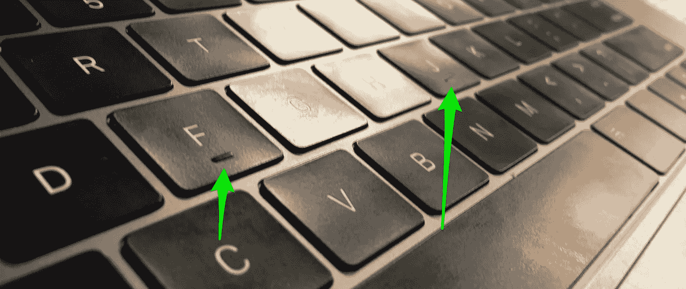
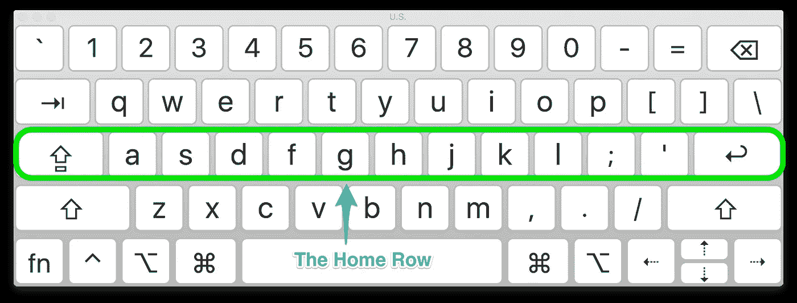
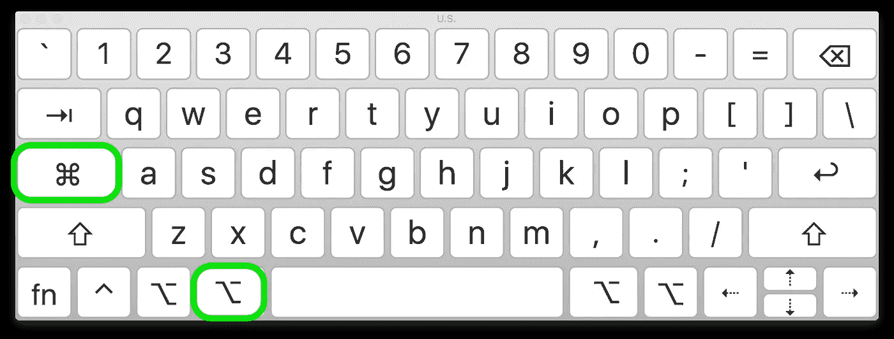
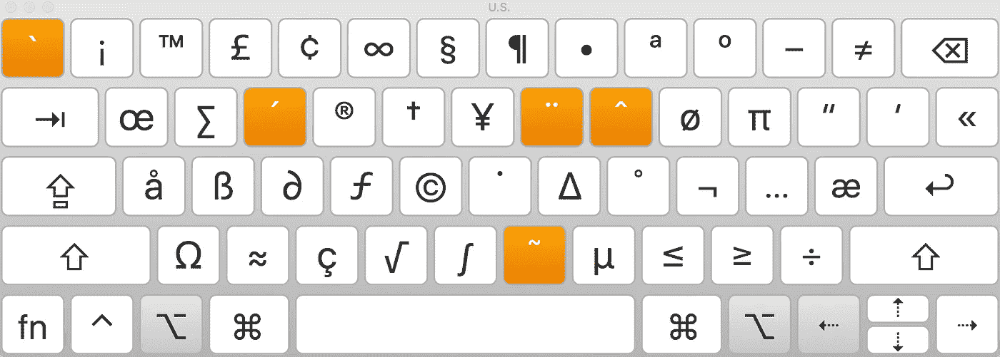
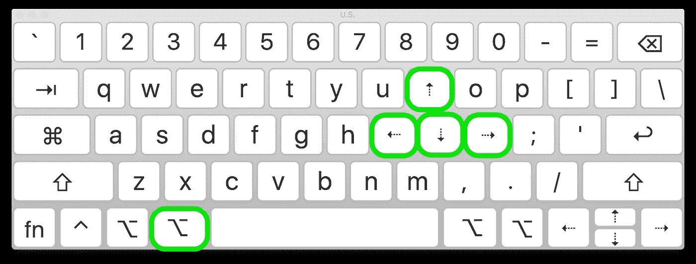
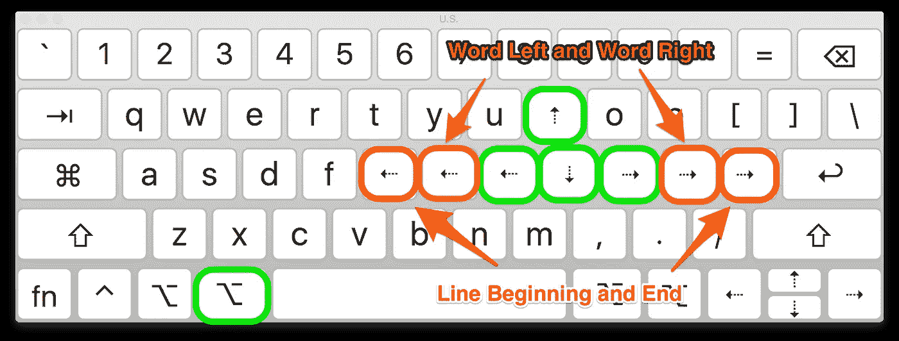
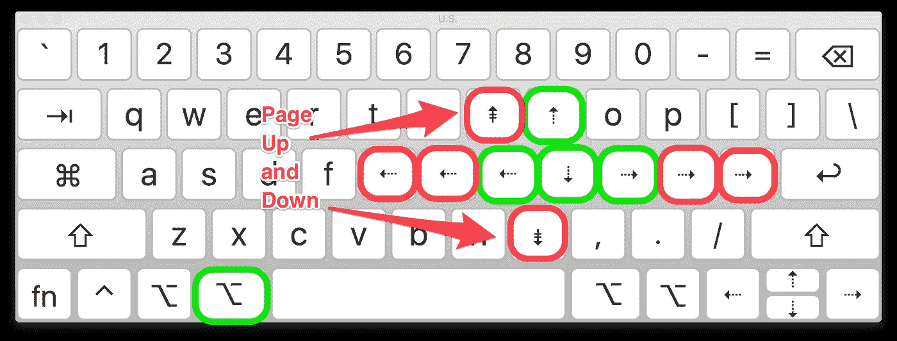
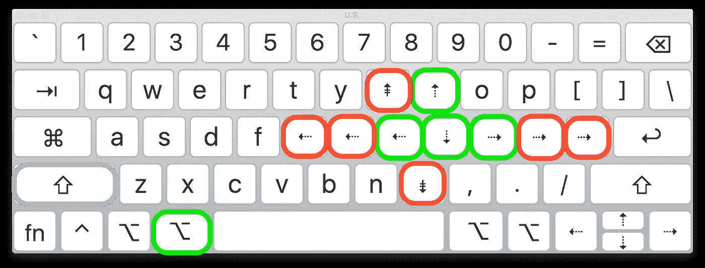

# 高效的思维到屏幕的过程:我的键盘优化

> 原文：<https://medium.com/hackernoon/efficient-thought-to-screen-process-my-keyboard-optimization-933836628e8e>

大约 15 年前，我开始意识到计算机是我的职业。在我所能想象的未来，我将以某种方式与计算机亲密合作。因此，让思维到屏幕的过程尽可能无缝、尽可能轻松是有意义的。我现在是你可能遇到的那些德沃夏克[键盘](https://hackernoon.com/tagged/keyboard)人之一。但这只是我投资的一点点效率。我还想出了一个个人键盘布局优化。一段时间以来，我一直想在一篇文章或博客中分享我的键盘导航设置。我认为我已经从我的设置中受益，我想分享它，希望它可以帮助别人。



The little nubs on the F and J keys on the Home Row

我从 [vi](https://en.wikipedia.org/wiki/Vi) 和[德沃夏克](https://en.wikipedia.org/wiki/Dvorak_Simplified_Keyboard)人群中学到的一件有价值的事情是，将你的手指从键盘上自然静止的姿势移开是多么的破坏性和低效。我指的自然姿势是 F 键和 J 键上的那些小点是做什么用的。你把两个手腕都放在键盘上，用食指触摸两个小块。你的其他手指自然地放在被称为“主行”的那一排按键上。任何要求你脱离那个姿势的动作都会破坏你的思维到屏幕的过程，因此会适得其反。如果你想向上、向下、向左或向右移动光标，你必须停止思考你正在键入的内容，将注意力转移到将你的右手放在箭头键上，进行移动，然后将你的手重新放回“主行”,并尝试从你离开的地方重新开始。



The ‘home row’ on a keyboard

当我被介绍到 [Dvorak](https://en.wikipedia.org/wiki/Dvorak_Simplified_Keyboard) 键盘布局时，我了解了“home row”。但真正让我闭环的是 vi 的 HJKL 导航。我不是 vi 用户，但是我发现你可以暂时使用 home 行键在文本中导航的想法很棒。打破我的姿势，去按箭头键，对我的思维到屏幕的过程来说，类似于严重的睡眠呼吸暂停；仅仅为了移动光标，我就经常被拉得无法集中注意力。然后我会重新定位我的手指，心里想着“现在，我们说到哪里了？…"

我开始在 Linux 和 Gnome 桌面上尝试不同的想法。我必须给 GTK+打补丁，以获得正确的键来触发正确的事件，这在一段时间内有效。但是我已经开始使用 OS X(现在是 macOS)了，所以下面的设置是针对 Mac 的，请随意分享你是如何在你最喜欢的操作系统上完成的。



Caps Lock to Command and Command to Option

首先，我不确定为什么我们键盘上最大的键通常是大写锁定键。我不认为我们足够频繁地使用它来证明它的相对大小。我们使用频率更高的一个键是 Command 键。幸运的是，我认为苹果知道这一点已经有一段时间了，所以他们很容易就可以轻松地切换这些按键。我的大写锁定是命令键。而实际的命令现在是另一个选项键。没什么特别的，但是它的效用很快就会显现出来。

现在是有趣的部分。虽然我是一名[德沃夏克](https://en.wikipedia.org/wiki/Dvorak_Simplified_Keyboard)用户，但我会根据通常的 Qwerty 布局来解释，因为[德沃夏克](https://en.wikipedia.org/wiki/Dvorak_Simplified_Keyboard)是一种大多数人通常不会这么容易接受的投资(如果你对德沃夏克感兴趣，我强烈建议查看 [Dvzine](http://www.dvzine.org) )。当我的右手放在最后一排时，我开始想象当我想要屏幕上的光标移动时，我的本能反应是什么。我觉得我只是想用 IK 键来上下移动，用 JL 键来左右移动。但是我需要一个触发器来把这些键转换成导航模式。这就是 Option 键的用武之地。我不能使用 Command 键，它已经被许多应用程序用作功能快捷键。



What you can type with the Option key

然而，Option 键是二等公民，尤其是那些键盘中间的键。它只是吐出不常用的符号。但是最有说服力的原因是我的左手拇指正好在它上面。只是坐在那里没用，没被充分利用。经过反复试验，很明显，新创建的选项键是我的新导航布局的最佳触发器。



Option with IK for Up and Down arrows and JL for Left and Right

这是一个如此自然的设置，我立刻就被吸引住了。眼睛盯着光标，我会用左手拇指按下 Option 键，右手会上下左右移动，平滑无缝地从输入切换到导航。感觉就像我认为一个光标移动，它神奇地做到了。

接下来是选择。左小指按换档键，完成。但是缺少了一些东西。对于编码人员来说，一次移动一个字母位置或一行就像被勒死一样。文本编辑器有办法按单词移动，或者至少移动到当前行的末尾或开头。我再次坐在那里，观察我的自然倾向，将光标向左或向右移动到单词旁边。这很容易做到，只要把我右手手指的范围向左和向右扩大一点。



Moving by Word and by Line

所以 H 会把光标向左移动这个单词，然后；会将光标向右移动一个单词。更进一步，G 会将光标移动到行首，而"会将光标移动到行尾。



Paging Up and Down

最后一点是处理上下翻页。我试着用了 8 和，但不知为什么就是感觉不对。我觉得我的右手走得太远了。我分别用 U 和 M 表示向上翻页和向下翻页，结果成功了。



The final layout with Shift key for selection

所以你有它。我已经喜欢这个设置很长时间了，我希望它也能帮助你。为了让这个设置工作，我经历了一些产品和技巧。我一直依赖于自定义键盘布局和默认键盘绑定的组合，然后是几年来的[键盘大师](http://www.keyboardmaestro.com)，然后是[铁锁](https://pqrs.org/osx/karabiner/)，直到塞拉最终打破它。现在我很高兴地说，我发现 [SKHD](https://github.com/koekeishiya/skhd) 是最优雅和有效的解决方案。

安装[家酿](http://brew.sh)如果你还没有，然后安装 SKHD。

```
brew install koekeishiya/formulae/skhd
```

这里是我的 [SKHD Dvorak](https://gist.github.com/ahmadster/6aa22f07345bb5c477749d28dd4d40b7) 配置文件。它支持我在这里描述的设置。只需将其中一个文件作为**放在您的主目录中。skhdrc** 并启动/重启 SKHD。

```
brew services start skhd
```

更新:

如果 SKHD 对你来说很慢，很可能是因为你默认的 shell 功能丰富(慢？).一个简单的解决方法是将缺省 shell 设置为类似/bin/sh 这样的简单值

下面是怎么做的。编辑服务文件以设置 SHELL 环境变量。

```
brew edit skhd
```

这将打开服务文件供您编辑。找到 EnvironmentVariables dict 并添加一个 SHELL 键和字符串值:

```
<key>EnvironmentVariables</key>
<dict>
  <key>PATH</key>
  <string>#{HOMEBREW_PREFIX}/bin:/usr/bin</string>
  **<key>SHELL</key>
  <string>/bin/sh</string>**
</dict>
```

> 旧 KHD 信息，留在这里供参考
> 
> `brew install koekeishiya/formulae/khd`
> 
> 这里是我的 [KHD 德沃夏克](https://gist.github.com/ahmadster/94d56a392c3da4df1672e8afb712ac3b)配置文件，以及一个 [Qwerty](https://gist.github.com/ahmadster/a8c78376987e32a91b136bb75c3bc2c1) 版本，使我在这里描述的设置。只需将其中一个文件作为**放在您的主目录中。khdrc** 并启动/重启 KHD。
> 
> `brew services start khd`

它适用于我用过的几乎所有 Mac 应用程序，一些终端应用程序是罕见的例外。

[](http://bit.ly/HackernoonFB)[](https://goo.gl/k7XYbx)[](https://goo.gl/4ofytp)

> [黑客中午](http://bit.ly/Hackernoon)是黑客如何开始他们的下午。我们是 [@AMI](http://bit.ly/atAMIatAMI) 家庭的一员。我们现在[接受投稿](http://bit.ly/hackernoonsubmission)并乐意[讨论广告&赞助](mailto:partners@amipublications.com)机会。
> 
> 如果你喜欢这个故事，我们推荐你阅读我们的[最新科技故事](http://bit.ly/hackernoonlatestt)和[趋势科技故事](https://hackernoon.com/trending)。直到下一次，不要把世界的现实想当然！

