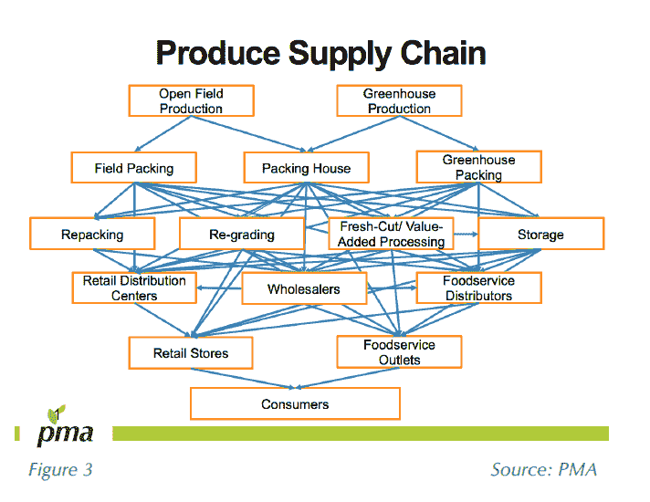
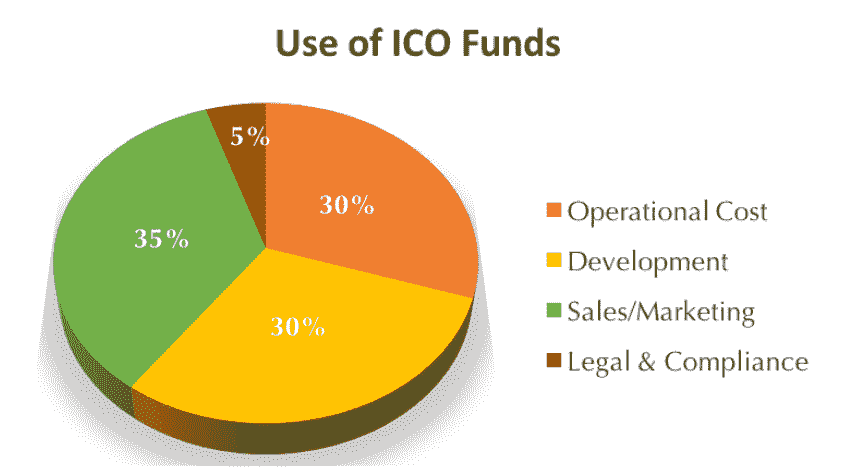
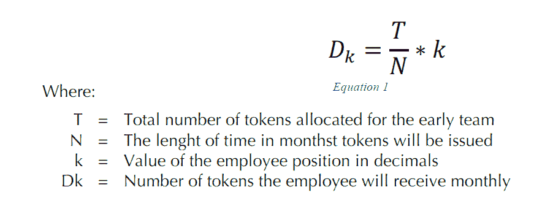

# eHarvestHub 评论

> 原文：<https://medium.com/hackernoon/eharvesthub-review-61dd04ba8cc4>

Before reading this article, please read our full disclaimer found [here](https://thebestoficos.com/disclaimer.html) and at the bottom of this page. This Paid Story is brought to you by eHarvestHub.

## 农产品分销平台

# 介绍

eHarvestHub 是一家总部位于加州的公司，它使小农场主能够将他们的产品直接卖给杂货商，并雇佣卡车司机在开放的市场上运输。这将使他们能够立即出售他们的产品，无需中间人。该公司已经采访了 100 多名农民，并为他们开发了 3 年多的平台。

他们的 pre-ICO 希望在 8 天内以 12，960 ETH(428 万美元)的价格出售 6480 万枚自己的 EHH 代币。收益将用于启动他们的区块链协议，雇佣开发人员，在尼加拉瓜，墨西哥，哥伦比亚启动项目，并继续扩大他们在美国的足迹。他们的代币被用作他们市场的货币。

eHarvestHub 将于世界协调时 11 月 21 日上午 12 点进行 ICO 预演。

# 这个想法

eHarvestHub 旨在通过开放的市场消除食品供应链中的中间商。农民需要中间人的最大原因，是帮助他们在多个地区的数百家杂货商之间分销他们的产品。为了解决运输问题，该平台还为卡车司机整合了一个奖励系统，以运送农产品。

它的工作方式很简单，农民可以列出他们的产品，一旦路线建立，杂货商就可以购买。双方都可以看看可用的卡车司机，并选择一个合理的运输价格。种植者和卡车司机都制定自己的价格，建立自由市场，并给予他们独立性。

该系统对每一笔交易进行评级，以保持每个人的诚实。他们还雇佣政府官员检查食品，确保食品符合食品安全法规。

问题的现实是，正如他们的白皮书所描述的那样，分销产品所需的网络极其复杂。巨大互动网络上的每一步都降低了农民的产品利润，提高了消费者的价格。

Produce Supply Chain, image from page 8 of eHarvestHub whitepaper

这个想法的有趣之处在于，如果他们成功了，消费者和农民都将能够获得更好的价格和利润。消费者也将确切地知道他们的食物来自哪里，他们支持谁。透明度和知识在当今的购买决策中非常重要。

# 令牌

该令牌被称为 EHH 令牌(eHarvestHub 令牌)，但是在白皮书本身中关于该令牌的实现方面的信息很少。该团队后来澄清说，这将是作为 ERC20 令牌的标准实现。它最初将被用作支付令牌，这是一个简单的以太坊合同。

在下一阶段，如果他们不希望支付转账时间变慢(类似于基于雷电的支付)，他们将不得不投资于正确实施 P2P 支付渠道，因为这是目前区块链生态系统中的一个相当大的问题。

白皮书中还指出，由于跨国监管等原因，这种令牌可用于比银行途径更快地结算资金。这肯定是真的，是加密货币的一个非常好的用途。

# 资金用途

eHarvestHub 的白皮书在其白皮书的第 27 页提供了一些关于资金将如何使用的信息。关于发展和招聘的陈述非常笼统，没有解释为什么他们需要在 Pre-ICO 期间筹集 400 多万美元，在 ICO 期间筹集 1500 多万美元。

他们的目的是在 ICO 前收集信息，以便能够对 ICO 的资金使用情况进行更彻底的细分。eHarvestHub 的首席执行官阿尔瓦罗·拉米雷斯提到，从现在到 2018 年 5 月，将提供更多细节。目前，关于资金使用的唯一信息是第 29 页的下图。

# 令牌分发

该公司将制造 9 亿枚代币，分配如下:

*   48%在 ICO 期间售出
*   20%由公司保管
*   15%作为客户奖励
*   **12%在 ICO 前售出**
*   5%给顾问

这意味着 60%的货币将由用户通过他们的预 ICO 和 ICO 活动以折扣价购买。这种货币将用于取代平台中的法定货币。这个想法是，货币将以折扣价购买，因此代币持有者将在市场和交易所以更高的价格交易代币。

令牌分发中最复杂的部分是他们如何在公司内部分发令牌。他们遵循公式，根据排名和其他衡量标准来确定每个成员的价值。该公司这样做是为了模仿股东协议中的股票期权，但我们发现这很难快速评估回报。

此外，他们确实有托管持股(任何好的 ICO 都应该有)，只有当投资者看到公司按要求发展时，他们才会释放资金。

Image: Taken from eHarvestHub white paper, page 19

# 前 ICO

在预 ICO 期间，该公司将每 1 个 ETH 出售 5000 个 EHH 代币。

允许参与的最低金额是 0.166667 ETH，在撰写本文时大约相当于 55 美元。第一天购买代币的参与者将获得超过 50%的奖励。

# 区块链测试

虽然透明度被认为是使用区块链的主要动力，但在实施如何才能真正实现真正的透明度方面，还有许多未解的问题。

是的，带时间戳的交易可以显示采购订单是何时生成的，并且可以对供应链中的各种交易何时进行货币交换保持一定的问责制。

白皮书中没有包括但该团队澄清的是，审计由 EHH 员工执行，以确保输入区块链的数据是准确的。此外，他们还与第三方如 PrimusLab 进行审核，以确保食品安全数据的准确性。这仍然可以通过由公司托管的软件服务的非去中心化的传统系统轻松完成，因此对于他们用例的这一特定部分使用区块链没有真正的优势。然而，这确实证明了该团队在调解任何买方-卖方纠纷方面的专业知识，并且他们有健全的业务战略来审计和解决任何此类问题。

# 牵引力

这个 ICO 最有趣的一点是，自 2011 年 11 月以来，该团队一直致力于这个想法的多个方面。这使得它成为我们见过的为数不多的测试、实现和体验都非常详细的 ico 之一。该平台作为一个管理系统自 2014 年就已存在。截至 2015 年 1 月，他们已经追踪了超过 400 万箱新鲜农产品。

2016 年 3 月，eHarvestHub 还获得了 100 万美元的风险投资。这一轮由蒂姆·德雷珀(Tim Draper)牵头，他是著名的风险投资人，购买了美国政府在 2016 年查封的[比特币。市场库存和管理系统于 2016 年 12 月完成，运输系统也于 2017 年 2 月完成，名称为“eHarvestHaul”。在采访中，我们发现自 2017 年 1 月以来，该公司已经能够跟踪超过 2700 万美元的产品。](https://www.cryptocoinsnews.com/final-silk-road-auction-1-6-million-value-draws-only-5-bidders/)

# 组

eHarvestHub 的团队已经涉足农业和卡车运输行业好几年了。他们的首席执行官阿尔瓦罗·拉米雷斯拥有建立公司的经验，并成功地为 eHarvestHub 筹集了 100 万美元的资金。Alvaro 也见证并经历了卡车司机和农民所经历的困难，并亲身受到了这个问题的影响。他们还有两位拥有 20 年经验的高管，他们的技术团队主要位于尼加拉瓜。

# 透明度

我们认为，该公司使用区块链使该平台成为一个透明的市场，可以透明地跟踪价格、关税和奖励，而不可能篡改已经记录的数据。

该平台的另一个重要方面是他们展示所售产品原产地的能力。初始验证过程由 eHarvestHub 团队自己执行。该解决方案无法扩展，因为他们计划扩展到多个市场。他们的计划是利用他们在不同市场的政党，以跟上供应。

该公司还计划跟踪农民产生的供应量，并在供应量突然变化时进行调查。我们问他们如何保证食品安全，他们的首席执行官回答说:

> “最终，我们的市场参与者会相互评分，任何不符合食品安全法规和良好农业规范(GAP)和/或表现不佳且不愿改进的人都将被禁止进入我们的市场。”
> —eharves hub 首席执行官阿尔瓦罗·拉米雷斯

# 结论

eHarvestHub 是一个历时 5 年的故事，其联合创始人对农业、运输和杂货行业有着深刻的理解。这种类型的知识是建立三方市场所必需的。

该公司承诺通过建立一个信任体系，并通过分散商品和服务来消除中间商，从而降低食品成本并增加利润。该平台有很大的潜力，但也有很多问题，我们希望通过白皮书得到解答。该团队已经澄清了许多此类问题，我们在本次审查中包括了这些答案，但是我们仍然建议在 ICO 之前的白皮书中包括大多数(如果不是全部)这些详细信息。

虽然他们选择基于区块链的平台的一些方面很清楚(例如允许快速的初始跨国支付)，但其他方面，例如实现透明度，并没有真正受益于使用区块链，可以通过验证时间更快的集中式堆栈来模拟。

eHarvestHub 的团队似乎对他们的市场有很好的理解，他们展示了领域专长和积极的牵引力。他们的首席执行官此前也筹集了 100 万美元，这证明了他们说服投资者和管理预期的能力。

我们期待着看到发展，因为这家公司在五月。

想帮忙吗？
**在 Bountey 上支持我们！**

**想在 ICOs 中保持最新？
**访问我们在**[**https://thebestoficos.com**](http://thebestoficos.com/)**

**有一个有趣的故事？
**写我们在 info@bestoficos.com****

# ****免责声明****

**本网站由加拿大公司 Durata Inc .(" Durata " " Best of ICOs " " we " " us " " our ")运营，该公司在安大略省注册成立。通过阅读并继续使用我们的网站和博客(统称和单独称为“网站”)，您保证您已经阅读、理解并同意我们的免责声明。**

**我们对免责声明所做的任何更改将在我们在网站上发布修改后的免责声明后立即生效。**

## **做你的研究**

**本网站的内容旨在用于且必须仅用于一般信息目的。这是非常重要的，你要考虑到你的个人情况，并进行自己的分析，然后再进行任何投资。此外，在进行金融投资或决策之前，您应该向合格的专业人士寻求独立的金融建议。您或您的合格金融专业人士应采取措施，在做出任何投资决定或其他决定之前，独立研究和核实您在我们网站上发现的或希望依赖的任何信息。**

## **没有投资建议**

**该网站是一个金融数据和新闻门户、博客和内容聚合器。最好的 ICOs 不是一个经纪人/交易商，我们不是一个投资顾问，我们不能访问公开上市公司的非公开信息。本网站不是一个给予或接受金融建议或投资决策建议的地方。我们不受安大略省证券委员会、美国证券交易委员会或任何其他类型的监管金融机构或当局的监管。**

**我们是一个教育论坛，用于分析、学习和讨论与加密货币、加密货币投资和投资策略相关的一般信息。本网站上的任何内容均不构成(或不应被理解为构成)投资建议，也不作为进行任何证券交易或参与任何投资策略的建议。对于 ICO 或任何特定投资方法是否适合特定个人的金融需求，我们不提供个性化的建议或观点。**

## **不是法律或税务建议**

**我们不是会计师。我们不是律师。本网站上的任何内容或信息都不构成或不应被理解为构成法律或税务建议。你应该聘请有执照的专业人士来提供这些方面的建议。**

## **个人赋权**

**虽然我们展示了我们已经筛选和研究过的投资，但研究结果只能作为进一步研究的候选，而不能作为“买入”名单或一组建议。筛选可能有助于缩小基于预定义标准的搜索范围，但它不能替代反映您个人投资/交易标准的独立研究和验证。**

**在我们提供估价工具的地方，这些工具仅用于信息和教育目的，以便用户可以轻松地运行他们自己的估价。任何预定义的值都只是基于我们在整个市场应用的全球假设的一个起点，用户应该修改他们认为合适的数字，而不是将其视为自己判断或自己研究和验证的替代品。任何由此产生的估价结果都必须是通用的，并没有得到 Best of ICOs 对给定股票的认可。**

## **投资警告**

**加密货币的价值、加密货币投资以及从中获得的收入可以下降，也可以上升。新商业模式的出现可以为用户和投资者创造机会，但由于缺乏新项目的质量评估标准、可靠性和透明度，任何年轻的市场都对其所有参与者带来重大风险。过去的业绩不是未来业绩的可靠指标，投资者可能无法收回全部投资。**

## **不依赖**

**无论是在合同、侵权行为(包括疏忽)还是其他方面，对于您因访问本网站上的信息或材料或您可能依赖此类信息或材料而遭受的任何损害、费用或其他损失，我们都不承担责任。我们不对任何错误或遗漏负责，也不对使用本网站中的任何信息、内容或材料所产生的结果负责。本网站中的所有信息均按“原样”提供，不保证完整性、准确性或及时性。虽然我们努力保持我们的信息没有错误和完整，但并不保证它会如此，我们可以，但没有义务，纠正任何此类错误或补充任何不完整的信息。**

## **对第三方网站不承担责任**

**本网站可能包含其他网站的链接。这些链接网站不受 Best of ICOs 的控制，我们不对任何链接网站的内容负责，包括但不限于链接网站中包含的任何链接，或链接网站的任何更改或更新。我们向您提供这些链接只是为了方便，包含任何链接并不意味着认可链接的网站或与其运营商有任何关联。**