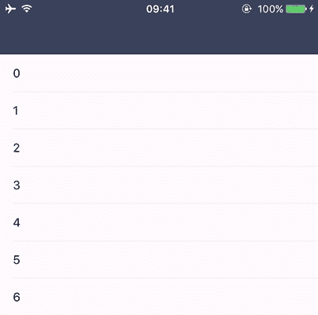
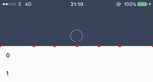
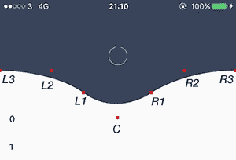
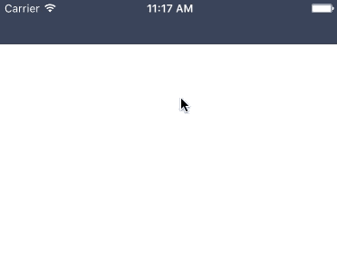
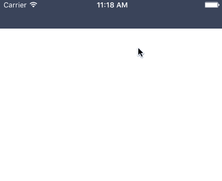
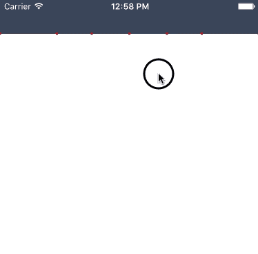
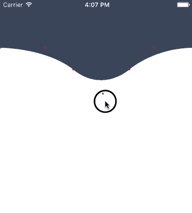
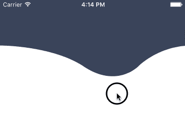

# 弹性视图动画，或我如何构建 DGElasticPullToRefresh

> 原文：<https://medium.com/hackernoon/elastic-view-animation-or-how-i-built-dgelasticpulltorefresh-269a3ba8636e>

嘿！我已经很久没有在媒体上发布任何东西了。

这篇文章教程已经发表在了 [iostuts.io](http://iostuts.io/2015/10/17/elastic-bounce-using-uibezierpath-and-pan-gesture/) 上。但是我喜欢把所有的东西都放在同一个地方，所以我决定找个时间，调整一下这篇文章，也把它发表在这里。

本教程主要讲解我前阵子发表的 [DGElasticPullToRefresh](https://github.com/gontovnik/DGElasticPullToRefresh) 中弹性反弹效果是如何实现的:



## 先决条件/要求

1.  [Xcode](https://hackernoon.com/tagged/xcode) 7
2.  Swift 2.0
3.  至少对 [UIBezierPath](https://hackernoon.com/tagged/uibezierpath) 和 UIGestureRecognizer 有基本的了解和认识

## 理解逻辑

UIBezierPath 是这个反弹动画的核心——它允许我们使用控制点创建曲线。为了在屏幕上显示创建的路径，我决定使用 CAShapeLayer *(另一种方法是覆盖 drawRect)* 。贝塞尔路径的每个控制点应该表示为一个不可见的 UIView。当手指移动时，所有控制点视图都应移动，曲线应更新，CAShapeLayer 路径应设置为新值。当释放手指时，所有视图都使用弹簧动画动画到它们的初始位置。当视图被动画化时，我们需要观察它们的中心并更新我们的 cashaplayer——这就是 CADisplayLink 的由来。

下面是一个例子，如果我将所有控制点视图都设为红色，会是什么样子:



*See second screenshot for control point views variable names*

**我相信你一定很想尝试一下！**

创建一个单一视图应用程序，并将此代码粘贴到类声明内的 **ViewController.swift** 文件中:

```
// MARK: -
// MARK: Varsprivate let minimalHeight: CGFloat = 50.0
private let shapeLayer = CAShapeLayer()// MARK: -override func loadView() {
  super.loadView()

  shapeLayer.frame = CGRect(x: 0.0, y: 0.0, width: view.bounds.width, height: minimalHeight)
  shapeLayer.backgroundColor = UIColor(red: 57/255.0, green: 67/255.0, blue: 89/255.0, alpha: 1.0)
  view.layer.addSublayer(shapeLayer)

  view.addGestureRecognizer(UIPanGestureRecognizer(target: self, action: "panGestureDidMove:"))
}

// MARK: -
// MARK: Methods

func panGestureDidMove(gesture: UIPanGestureRecognizer) {
  if gesture.state == .Ended || gesture.state == .Failed || gesture.state == .Cancelled {

  } else {
    shapeLayer.frame.size.height = minimalHeight + max(gesture.translationInView(view).y, 0)
  }
}

override func preferredStatusBarStyle() -> UIStatusBarStyle {
  return .LightContent
}
```

我们在这里做的是:

1.  声明了两个变量: *shapeLayer* —图层，将用于显示贝塞尔路径；*最小高度* —定义最小形状层高度；
2.  向 view.layer 添加了形状层；
3.  向视图添加了平移手势；
4.  添加了 panGestureDidMove 方法，当手指移动时将调用该方法。目前，它只改变形状层的高度；
5.  重写 preferredStatusBarStyle 函数，使我们的 UI 看起来更好。

构建您的项目并检查它。它应该这样工作:



一切都按照我们预期的方式工作，除了一件事——它通过延迟/动画改变高度。它的发生是因为隐含的动画。我们绝对不希望出现这种情况。在将 shapeLayer 添加到子层之前添加这行代码，以禁用*位置*、*边界*和*路径*的隐式动画:

```
shapeLayer.actions = [“position” : NSNull(), “bounds” : NSNull(), “path” : NSNull()]
```

运行 project 并重试:



**修复！**

下一步是添加我们的控制点视图 *(L3，L2，L1，C，R1，R2，R3，如上所示)*并应用所有必要的逻辑。

让我们一步一步来:

*   声明 *maxWaveHeight* 变量:

```
private let maxWaveHeight: CGFloat = 100.0
```

我们定义和使用这个变量的唯一原因是让我们的波形看起来更好。如果我们不指定最大值，它可能会太大，看起来很糟糕。

*   为我们的控制点视图声明这些变量:

```
private let l3ControlPointView = UIView()   
private let l2ControlPointView = UIView()   
private let l1ControlPointView = UIView()   
private let cControlPointView = UIView()   
private let r1ControlPointView = UIView()   
private let r2ControlPointView = UIView()   
private let r3ControlPointView = UIView()
```

*   应用红色背景色和 3x3 大小*(我们需要它来查看我们的视图，在教程的最后我们将使它们不可见)*并添加到子视图中。将这段代码复制并粘贴到 *loadView* 方法的末尾:

```
l3ControlPointView.frame = CGRect(x: 0.0, y: 0.0, width: 3.0, height: 3.0)
l2ControlPointView.frame = CGRect(x: 0.0, y: 0.0, width: 3.0, height: 3.0)
l1ControlPointView.frame = CGRect(x: 0.0, y: 0.0, width: 3.0, height: 3.0)
cControlPointView.frame = CGRect(x: 0.0, y: 0.0, width: 3.0, height: 3.0)
r1ControlPointView.frame = CGRect(x: 0.0, y: 0.0, width: 3.0, height: 3.0)
r2ControlPointView.frame = CGRect(x: 0.0, y: 0.0, width: 3.0, height: 3.0)
r3ControlPointView.frame = CGRect(x: 0.0, y: 0.0, width: 3.0, height: 3.0)

l3ControlPointView.backgroundColor = .redColor()
l2ControlPointView.backgroundColor = .redColor()
l1ControlPointView.backgroundColor = .redColor()
cControlPointView.backgroundColor = .redColor()
r1ControlPointView.backgroundColor = .redColor()
r2ControlPointView.backgroundColor = .redColor()
r3ControlPointView.backgroundColor = .redColor()

view.addSubview(l3ControlPointView)
view.addSubview(l2ControlPointView)
view.addSubview(l1ControlPointView)
view.addSubview(cControlPointView)
view.addSubview(r1ControlPointView)
view.addSubview(r2ControlPointView)
view.addSubview(r3ControlPointView)
```

*   用这段代码创建 UIView 扩展，并将其放在 *ViewController* 声明之上:

```
extension UIView {
  func dg_center(usePresentationLayerIfPossible: Bool) -> CGPoint {
    if usePresentationLayerIfPossible, let presentationLayer = layer.presentationLayer() as? CALayer {
      return presentationLayer.position
    }         
    return center     
  } 
}
```

当您将 UIView 从一帧动画到另一帧，并且您试图访问 UIView.frame，UIView.center 时，它将为您提供最终动画值，而不是当前值。为此，我们创建了一个扩展，当我们请求时，它将给出 UIView.layer.presentationLayer 的位置。关于 presentationLayer 的信息可以在这里找到[。](https://developer.apple.com/library/ios/documentation/GraphicsImaging/Reference/CALayer_class/#//apple_ref/occ/instm/CALayer/presentationLayer)

*   声明*当前路径*函数:

```
private func currentPath() -> CGPath {
  let width = view.bounds.width
  let bezierPath = UIBezierPath()

  bezierPath.moveToPoint(CGPoint(x: 0.0, y: 0.0))
  bezierPath.addLineToPoint(CGPoint(x: 0.0, y: l3ControlPointView.dg_center(false).y))
  bezierPath.addCurveToPoint(l1ControlPointView.dg_center(false), controlPoint1: l3ControlPointView.dg_center(false), controlPoint2: l2ControlPointView.dg_center(false))
  bezierPath.addCurveToPoint(r1ControlPointView.dg_center(false), controlPoint1: cControlPointView.dg_center(false), controlPoint2: r1ControlPointView.dg_center(false))
  bezierPath.addCurveToPoint(r3ControlPointView.dg_center(false), controlPoint1: r1ControlPointView.dg_center(false), controlPoint2: r2ControlPointView.dg_center(false))
  bezierPath.addLineToPoint(CGPoint(x: width, y: 0.0))

  bezierPath.closePath()

  return bezierPath.CGPath 
}
```

此函数返回 shapeLayer 的当前 CGPath。它使用我们之前创建和讨论过的控制点。

*   声明 *updateShapeLayer* 函数:

```
func updateShapeLayer() {
  shapeLayer.path = currentPath()
}
```

当我们需要更新 shapeLayer 时，就会调用这个函数。它不是一个私有函数，因为我们将为 CADisplayLink 使用 Selector()。

*   声明*布局控制点*功能:

```
private func layoutControlPoints(baseHeight baseHeight: CGFloat, waveHeight: CGFloat, locationX: CGFloat) {
  let width = view.bounds.width
  let minLeftX = min((locationX - width / 2.0) * 0.28, 0.0)
  let maxRightX = max(width + (locationX - width / 2.0) * 0.28, width)

  let leftPartWidth = locationX - minLeftX
  let rightPartWidth = maxRightX - locationX

  l3ControlPointView.center = CGPoint(x: minLeftX, y: baseHeight)
  l2ControlPointView.center = CGPoint(x: minLeftX + leftPartWidth * 0.44, y: baseHeight)
  l1ControlPointView.center = CGPoint(x: minLeftX + leftPartWidth * 0.71, y: baseHeight + waveHeight * 0.64)
  cControlPointView.center = CGPoint(x: locationX , y: baseHeight + waveHeight * 1.36)
  r1ControlPointView.center = CGPoint(x: maxRightX - rightPartWidth * 0.71, y: baseHeight + waveHeight * 0.64)
  r2ControlPointView.center = CGPoint(x: maxRightX - (rightPartWidth * 0.44), y: baseHeight)
  r3ControlPointView.center = CGPoint(x: maxRightX, y: baseHeight)
}
```

这一部分可能需要解释一下每个变量的含义。给你:

1.  **baseHeight** —“底座”的高度。baseHeight + waveHeight =我们的全高；
2.  **波高** —我们曲线的高度，我们希望它具有我们之前定义的最大值。如果没有最大值，看起来可能会很奇怪。我在玩弄价值观，寻找最合适的；
3.  **locationX** —手指在视图中的 X 位置*(我们波的顶点)*；
4.  **宽度**——正如你可能理解的，我们视野的宽度；
5.  **minLeftX** —定义 L3 控制点视图的最小位置 X。这个值可以小于零，所以它在视觉上看起来既漂亮又干净。我在玩价值观，你也可以玩玩；
6.  **maxRightX** —与 minLeftX 相同，但为 r3ControlPointView 定义了最大位置 X；
7.  **left part width**-定义 minLeftX 和 locationX 之间的距离；
8.  **right part width**-定义 locationX 和 maxRightX 之间的距离。

你可能会问为什么我们用这些值以这种方式布置控制点。答案很简单:我使用了 PaintCode 和 bezier 路径。在我找到我喜欢的值后，我把它们都放在代码中，并进行更多的操作以找到最合适的值。

*   更新我们的 *panGestureDidMove* 方法，这样当手指移动时所有的控制点都会移动。用以下代码替换所有 *panGestureDidMove* 函数:

```
func panGestureDidMove(gesture: UIPanGestureRecognizer) {
  if gesture.state == .Ended || gesture.state == .Failed || gesture.state == .Cancelled {
  } else {
    let additionalHeight = max(gesture.translationInView(view).y, 0)
    let waveHeight = min(additionalHeight * 0.6, maxWaveHeight)
    let baseHeight = minimalHeight + additionalHeight - waveHeight
    let locationX = gesture.locationInView(gesture.view).x

    layoutControlPoints(baseHeight: baseHeight, waveHeight: waveHeight, locationX: locationX)

    updateShapeLayer()
  }
}
```

我们所做的是计算波高，底部高度，手指的位置，并调用我们的函数:layout control 指向布局控制点，updateShapeLayer 更新我们的形状层路径。

*   将这两行添加到 *loadView* 函数的末尾，这样当我们打开应用程序时，我们的形状层可以正确显示:

```
layoutControlPoints(baseHeight: minimalHeight, waveHeight: 0.0, locationX: view.bounds.width / 2.0)
updateShapeLayer()
```

*   更改此行:

```
shapeLayer.backgroundColor = UIColor(red: 57/255.0, green: 67/255.0, blue: 89/255.0, alpha: 1.0).CGColor
```

对此:

```
shapeLayer.fillColor = UIColor(red: 57/255.0, green: 67/255.0, blue: 89/255.0, alpha: 1.0).CGColor
```

运行您的项目并检查它是如何工作的。它应该这样工作:



剩下要做的最后一件事是当你释放手指时集成我们的弹跳动画。

让我们一步一步来。

*   声明**显示链接**变量:

```
private var displayLink: CADisplayLink!
```

并在 *loadView* 方法结束时对其进行初始化:

```
displayLink = CADisplayLink(target: self, selector: Selector("updateShapeLayer"))
displayLink.addToRunLoop(NSRunLoop.mainRunLoop(), forMode: NSDefaultRunLoopMode)
displayLink.paused = true
```

正如开始提到的，我们的 CADisplayLink 将在每一帧调用所需的函数 *updateShapeLayer* ，因此我们的 ShapeLayer 路径在 UIView 动画期间是最新的。

*   声明*动画*变量:

```
private var animating = false {
  didSet {
    view.userInteractionEnabled = !animating         displayLink.paused = !animating
  }
}
```

它将启用/禁用交互，并将暂停/取消暂停显示链接。

*   更新 *currentPath* 方法，因此使用之前定义的*动画*变量调用 *dg_center(Bool)* :

```
private func currentPath() -> CGPath {  
  let width = view.bounds.width

  let bezierPath = UIBezierPath()

  bezierPath.moveToPoint(CGPoint(x: 0.0, y: 0.0))
  bezierPath.addLineToPoint(CGPoint(x: 0.0, y: l3ControlPointView.dg_center(animating).y))

  bezierPath.addCurveToPoint(l1ControlPointView.dg_center(animating), controlPoint1: l3ControlPointView.dg_center(animating), controlPoint2: l2ControlPointView.dg_center(animating))

  bezierPath.addCurveToPoint(r1ControlPointView.dg_center(animating), controlPoint1: cControlPointView.dg_center(animating), controlPoint2: r1ControlPointView.dg_center(animating))

  bezierPath.addCurveToPoint(r3ControlPointView.dg_center(animating), controlPoint1: r1ControlPointView.dg_center(animating), controlPoint2: r2ControlPointView.dg_center(animating))
  bezierPath.addLineToPoint(CGPoint(x: width, y: 0.0))

  bezierPath.closePath()

  return bezierPath.CGPath
}
```

如果我们发送 *true* ，它将使用 *presentationLayer* *(如前所述)*的值。

*   最后一步是更新 *panGestureDidMove* 方法中的语句。将此函数中的所有代码替换为:

```
if gesture.state == .Ended || gesture.state == .Failed || gesture.state == .Cancelled {  
  let centerY = minimalHeight

  animating = true
  UIView.animateWithDuration(0.9, delay: 0.0, usingSpringWithDamping: 0.57, initialSpringVelocity: 0.0, options: [], animations: { () -> Void in
    self.l3ControlPointView.center.y = centerY
    self.l2ControlPointView.center.y = centerY
    self.l1ControlPointView.center.y = centerY
    self.cControlPointView.center.y = centerY
    self.r1ControlPointView.center.y = centerY
    self.r2ControlPointView.center.y = centerY
    self.r3ControlPointView.center.y = centerY
    }, completion: { _ in
      self.animating = false
  })
} else {
  let additionalHeight = max(gesture.translationInView(view).y, 0)

  let waveHeight = min(additionalHeight * 0.6, maxWaveHeight)
  let baseHeight = minimalHeight + additionalHeight - waveHeight

  let locationX = gesture.locationInView(gesture.view).x

  layoutControlPoints(baseHeight: baseHeight, waveHeight: waveHeight, locationX: locationX)
  updateShapeLayer()
}
```

我们添加了一个 UIView spring 动画，让我们的控制点视图以一个非常漂亮的弹跳回到它们原来的位置。用这些价值观来玩一玩，也许你会把动画做得更好！

在您的设备上构建项目，准备好大吃一惊吧..



我们可能不想看到这些点。删除负责在 loadView 中设置控制点视图 backgroundColor 和 frame 的所有代码行。

再次运行..



它工作得很完美，但是，有一件事我们在本教程中忘记了——我们没有改变 shapeLayer 的高度，我们只改变了路径。它不是很好，应该被修复。我认为这对你来说是很棒的作业。使用框架、路径和所有其他值:)

我希望你喜欢这个教程。请在下面留下你的评论和建议，让我知道你接下来想看哪个教程！

本教程的源代码可以在[这里找到](https://github.com/gontovnik/DGElasticBounceTutorial)T2**的源代码可以在[这里找到](https://github.com/gontovnik/DGElasticPullToRefresh)**

**下次见！**