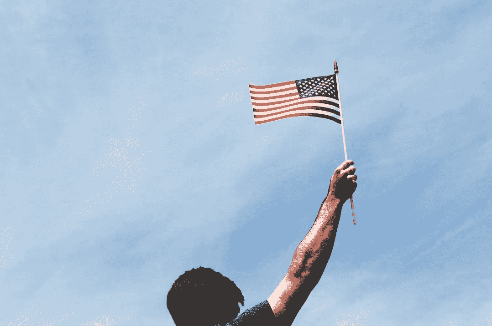

# 2016 年大选:社交媒体数字背后

> 原文：<https://medium.com/hackernoon/election-2016-behind-the-social-media-numbers-ac3a5dd5ed17>

## 谁统治了选举日？Twitter，脸书，Snapchat，还是？

选举日的第二天，《纽约时报》写道:

> 忘掉 Snapchat，把 YouTube、脸书和 Instagram 放在一边。尽管过去一年关于哪个社交媒体网络将主导选举的喧嚣，2016 年与过去几年没有什么不同:这是另一个 Twitter 时刻。

据该报报道，从 9 月份的第一场总统辩论到选举日的前一天早上，Twitter 不仅能够积累惊人的 10 亿多条与选举相关的帖子，而且其影响力“在嵌入服务外部和新闻网站的帖子数量上尤其惊人”。

根据 Twitter 和 Buzzfeed 的联合新闻稿，选举之夜是“有史以来最受关注的选举日，从投票开始前到当选总统唐纳德·川普(Donald Trump)东部时间凌晨 3 点的演讲结束后，全球有超过 7500 万条与选举相关的推文被发送。[。这是四年前整个选举日发送的 3100 万的两倍多。](http://www.prnewswire.com/news-releases/68-million-viewers-watch-twitter-live-stream-of-buzzfeed-news-election-night-special-300360415.html)

> 这是 Twitter 上观看次数最多的美国选举相关直播，超过了美国政治大会和总统辩论直播的唯一观众总数。

这两个平台合作制作了直播特别节目“选举之夜直播:我们做到了美国”，该节目有 680 万独立观众。“这已经准备了好几年，我们整个公司都投入了，”推特的高级合伙人布里奇特·科因告诉《纽约时报》。“你可能同意或不同意，但我相信今天是一个真正团结的机会。”

根据 Twitter 发布的统计数据，直播吸引了年轻的移动观众，83%的登录直播观众年龄在 35 岁以下，73%的观众使用移动设备。

在脸书，全球超过 1.15 亿人对周二的选举产生了超过 7.16 亿个赞、帖子、评论和分享。

[据美国有线电视新闻网](http://money.cnn.com/2016/11/09/technology/election-trump-social-media-records/index.html?iid=SF_LN)报道，从 2015 年 3 月 23 日特德·克鲁兹成为第一位宣布参选的政治家到 11 月 1 日，共有 88 亿条帖子、赞和评论被发布。该公司表示，10 月初举行的第二场总统辩论是竞选中最受关注的事件。它产生了近 2000 万用户超过 9200 万次的“互动”。

“关于选举的对话正在脸书发生——它真的变成了新的市政厅，”脸书全球政治和外联主任凯蒂·哈巴斯[告诉美国消费者新闻与商业频道](http://www.cnbc.com/2016/11/08/facebook-snapchat-and-twitter-played-a-bigger-role-than-ever-in-the-election.html)。“在这个平台上取得最大成功的竞选活动是那些真正利用这一优势，伸出手来与选民进行实际的双向对话的竞选活动。”

截至选举日下午 3 点，近 370 万人参与了脸书的投票。

[根据权威实验室](https://authoritylabs.com/blog/election-2016-the-role-social-media-played-in-the-elections/)的数据，今年有超过 2 . 18 亿人有资格投票，然而实际上只有 1 . 28 亿人投票。

> 尽管仍有大量的人选择不投票，并抗议投票，但那些投票的人在社交媒体上鼓励其他人投票。

这使得社交媒体上的“我投票了”贴纸成为了一个受欢迎的分享项目。

> 人们不仅仅使用贴纸，还上传了他们走进大楼投票或邮寄选票的照片和视频。多亏了社交媒体，人们有地方分享他们的投票，并鼓励他们的朋友和家人也这样做。名人也参与了鼓励，并分享帖子和照片，请他们的粉丝投票。

据《今日美国》报道，在 Snapchat 上，每天有 41%的 18 至 34 岁美国人使用 Snapchat，其年轻用户也沉浸在选举中，近三分之二的人密切关注它。Snapchat 通过持续不断的选举过滤器和由竞选老手制作的政治特写来满足这种兴趣。

这包括通过美联社提供的 feed 进行的动态选举结果过滤，类似于初选和党团会议期间使用的动态结果地理过滤器，有超过 1 亿用户看到；赞助的 geofilters 通常覆盖 40%到 60%的 Snapchatters 用户。

[据 Mashable](http://mashable.com/2016/11/09/snapchat-election/#fO2MZDophEqt) 报道，Snapchat 在选举中站稳了脚跟。对于候选人，该公司还提供了免费的竞选工具。此外，他们还招募了顶尖的政治广告销售人员。

> 去年春天，它建立了一个团队，致力于让政治家使用该平台，并聘请了一个制作人团队，他们随后参加全国范围的集会、辩论和其他活动。

> [黑客中午](http://bit.ly/Hackernoon)是黑客如何开始他们的下午。我们是 [@AMI](http://bit.ly/atAMIatAMI) 家庭的一员。我们现在[接受投稿](http://bit.ly/hackernoonsubmission)，并乐意[讨论广告&赞助](mailto:partners@amipublications.com)机会。
> 
> 如果你喜欢这个故事，我们推荐你阅读我们的[最新科技故事](http://bit.ly/hackernoonlatestt)和[趋势科技故事](https://hackernoon.com/trending)。直到下一次，不要把世界的现实想当然！

