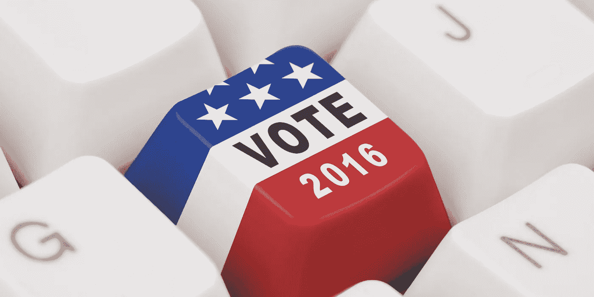
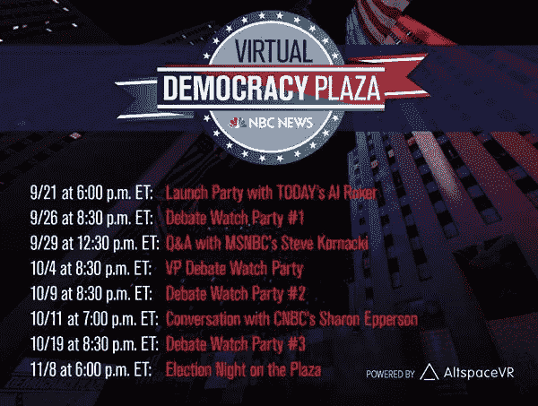
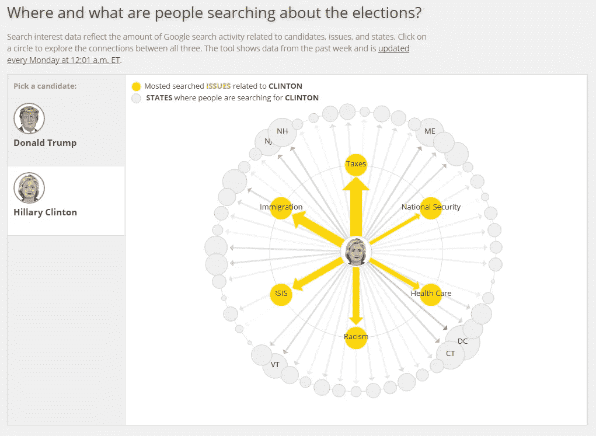
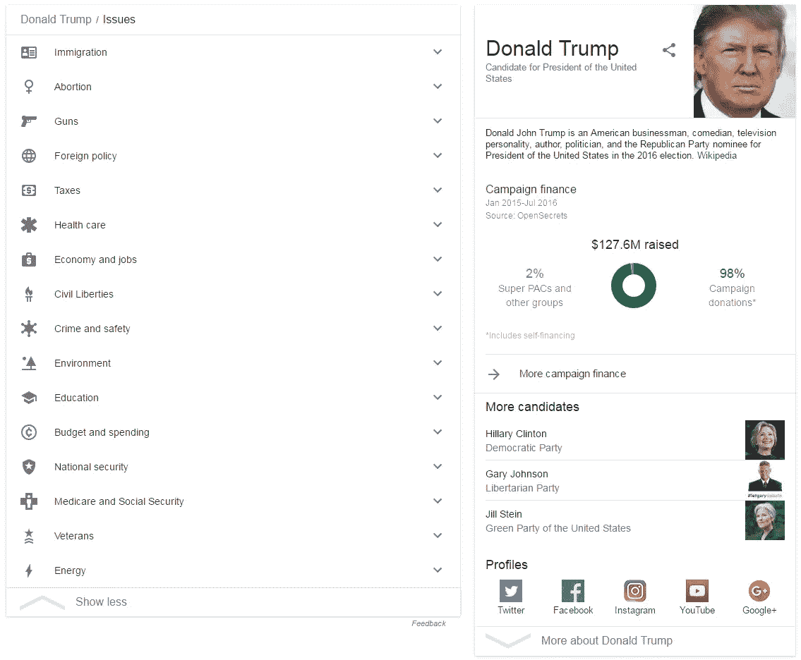
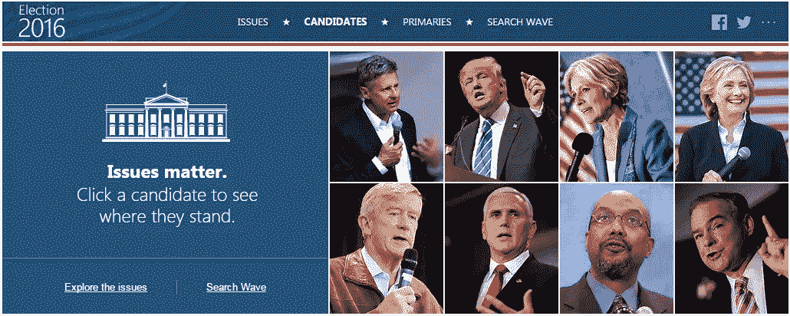

# 2016 年选举:技术、社交媒体和政治进程

> 原文：<https://medium.com/hackernoon/election-2016-technology-social-media-and-the-political-process-1ddf6101cc89>

## 硅谷提供的辩论和候选人立场指南。

总统辩论的狂热正在全面展开。硅谷为我们提供了许多解决方案，让我们可以在线观看辩论，更好地了解候选人在外交政策、移民等问题上的立场。

据《国会山报》报道，脸书最近开始推出一项新功能，允许政治候选人在他们的脸书页面上发布他们在一系列问题上的立场。他们的立场以简短的广告形式勾勒出来，将于 10 月份向用户公开。

脸书公民参与产品经理萨米德·查克拉巴蒂告诉《国会山报》，新功能是为了应对 2016 年选举前后网络兴趣和对话的增加，无论是在国家还是地方层面。

> 脸书新推出的政治页面议题标签是候选人与潜在选民联系的一个很好的方式，他们可以通过分享清晰直接的声明来表达自己的立场和信念。

脸书和许多其他技术和社交媒体公司，如 Twitter、Google、Snapchat 和[正如总统辩论委员会(CPD)所宣布的那样，Snapchat 还将通过 *Live Story、*提供来自辩论主办大学的学生、志愿者、媒体和许多其他人的许多不同观点，对辩论进行现场报道。“这些快照的汇编旨在鼓励每次辩论结束后很长时间的对话，”CPD 说。](https://medium.com/u/504c7870fdb6#voteIRL </em>活动的一部分，以鼓励人们注册投票并参加 2016 年的选举。

活动的一部分，以鼓励人们注册投票并参加 2016 年的选举。

活动的一部分，以鼓励人们注册投票并参加 2016 年的选举。

 从包括机器学习、自然语言处理和网络分析在内的计算机科学领域出发，我们探索了三种独立的力量——竞选新闻、候选人的信息和公众在数字领域的反应——如何汇聚起来，塑造总统选举最重要的叙事及其结果。

> [黑客中午](http://bit.ly/Hackernoon)是黑客如何开始他们的下午。我们是 [@AMI](http://bit.ly/atAMIatAMI) 家庭的一员。我们现在[接受投稿](http://bit.ly/hackernoonsubmission)并乐意[讨论广告&赞助](mailto:partners@amipublications.com)机会。
> 
> 如果你喜欢这个故事，我们推荐你阅读我们的[最新科技故事](http://bit.ly/hackernoonlatestt)和[趋势科技故事](https://hackernoon.com/trending)。直到下一次，不要把世界的现实想当然！

