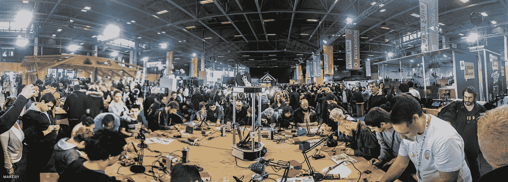
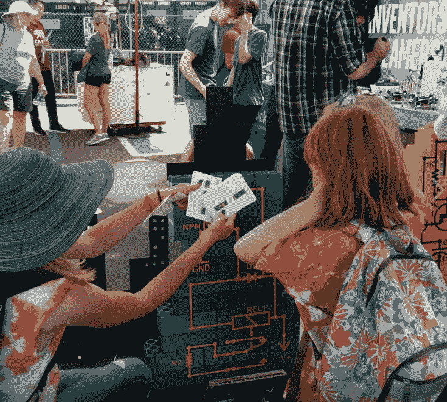

# 创业想法:你可以把电子乐高玩具导入视频游戏

> 原文：<https://medium.com/hackernoon/electronic-legos-that-you-can-import-into-video-games-efa9ba0634f4>

(photo [credit](http://www.makery.info/en/2015/05/04/35000-visiteurs-a-la-maker-faire-paris-un-record/))

我很乐意把这个想法卖给你，以换取你公司 50%的股份。*

**jk/LOL，我自己也在做一个* [*的创业点子*](https://hackernoon.com/webassembly-the-death-of-the-app-store-c9bc3f9557c8) *，很明显点子是容易的部分！*

我昨天去了加州圣马特奥的 Maker Faire，看到了一些很棒的项目，包括 Makerologist 的这个项目( [twitter](https://twitter.com/makerologist) ， [facebook](https://www.facebook.com/makerologist/) ):

这是一个大型乐高式教学工具，向孩子们解释如何做基本电路。它叫 JumboDuinos。

我喜欢这个项目，因为它让我和孩子们有了一个公平的竞争环境。我白天是一名软件工程师，但如果你问我电脑内部的实际电路是如何工作的，我会像这样面无表情地盯着你:

baby grizzly bear ([credit](https://www.pexels.com/photo/brown-and-white-grizzly-bear-148182/))

我真的很喜欢 JumboDuinos，我想我们很快就会在像[活体计算机博物馆](http://www.livingcomputers.org/)或[计算机历史博物馆](http://www.computerhistory.org/)这样的地方看到它。如果有人能做到这一点，那就是《Makerologist》的老板克拉丽莎·圣地亚哥。她是个坏蛋，她告诉我她正在和一些不同的博物馆和商店合作这个项目。

## 另一个鼓舞人心的产品

我最近还碰到一个 Kickstarter，叫做 [Brixo](https://www.kickstarter.com/projects/1068475467/brixo-building-blocks-meet-electricity-and-iot) 。电气化的乐高积木(律师称之为“积木”)可以“用电子传感器和马达让你的设计变得栩栩如生”。

这是 2014 年的一个视频:

我认为这些都是非常棒的，当它们出来的时候，我会很高兴得到一套！Brixo 的 kickstarter 目前已经关闭。也许他们接受博客文章贿赂？

## 但是如果…

我知道像《乐高星球大战》这样的游戏在 5-12 岁的年龄段非常流行:

Lego Star Wars

我实际上是一个乐高游戏的[程序员，但我只是短暂地玩过各种游戏。我确实知道这一点——一般来说，好处之一是随着游戏的进展，你可以通过一个简单的动画“构建”不同的模型。我觉得这很无聊，因为 98.7%的乐趣都是拼乐高。](https://www.amazon.com/Lego-Rock-Band-Nintendo-DS/dp/B001TOQ8VQ)

如果有像 JumboDuinos 或 Brixo 这样的电路乐高知道它们在 [meatspace](https://www.merriam-webster.com/words-at-play/what-is-meatspace) 中的相互关系会怎么样？然后，您可以构建您的乐高模型，并将其导入到您的游戏中。

孩子们(和像我一样的大孩子)会喜欢它，因为它把虚拟世界和现实世界联系在一起。

乐高会喜欢它，因为他们可以卖砖块和游戏(同时甚至？！)

从技术角度来说，我不知道这有多难做到…也许用电路就能做到？或者你用你的手机拍一张照片，它用[计算机视觉](https://en.wikipedia.org/wiki/Computer_vision)找出哪里是什么砖块？也许他们有热传感器？

money-me

我不知道，其他人，请做所有的艰苦工作&当你赚了十亿美元的时候给我一半的钱；-).

## 脚注

我正在做一个视频游戏领域的“大项目”项目。想成为第一个发现这是什么的人吗？加入我的“[大部分不是垃圾邮件](https://upscri.be/1c08e9/)”列表，当它接近时我会让你知道。

请💚或者跟随你今天学到的东西。这给了我很多动力继续写这样的文章。

> [黑客中午](http://bit.ly/Hackernoon)是黑客如何开始他们的下午。我们是 [@AMI](http://bit.ly/atAMIatAMI) 家庭的一员。我们现在[接受投稿](http://bit.ly/hackernoonsubmission)并乐意[讨论广告&赞助](mailto:partners@amipublications.com)机会。
> 
> 如果你喜欢这个故事，我们推荐你阅读我们的[最新科技故事](http://bit.ly/hackernoonlatestt)和[趋势科技故事](https://hackernoon.com/trending)。直到下一次，不要把世界的现实想当然！

