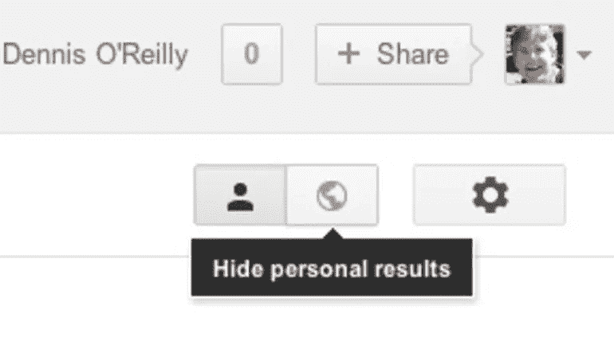

# 伊莱·帕里泽的过滤泡沫已经有 5 年历史了…我们戳破它了吗？

> 原文：<https://medium.com/hackernoon/eli-pariser-s-filter-bubble-is-now-5-years-old-have-we-popped-it-yet-2e4e5a3f677d>

无论是新闻、研究还是娱乐，我们求助的网站都会过滤我们的搜索结果，使它们与我们更相关。它被称为个性化搜索，现在它不仅是谷歌搜索结果的标准，也是亚马逊等购物网站、新闻网站如 [***【赫芬顿邮报】***](http://www.huffingtonpost.co.uk) ***【脸书】等的标准。***

其结果被称为“ ***过滤器*** [***气泡***](https://hackernoon.com/tagged/bubble)*”*如果你在过去的 5 年里曾在网上任何地方出现过，你就会听说过它。伊莱·帕里泽 2011 年的书提醒世界注意这个想法，从那以后我们就开始共同关注这个问题。

# 为什么人们想要戳破这个泡沫？

定制网页搜索结果的问题在于，我们得到的令人满意的结果越来越狭窄，这些结果是为了支持我们的个人现状而设计的。算法过滤掉你不太可能感兴趣的结果，这样做给你一个过滤后的世界观。

你最终会生活在帕里泽的“过滤泡沫”中。

相比之下，一个只吃博洛尼亚和蛋黄酱三明治长大的孩子，从来不知道有“牛角面包”和“巧克力蛋糕”。或者牛排。

或者把它比作一个在生存主义者的大院里生活了十年，只听到他的准备者同伴们的末日言论的人……这是一个没有不同意见的受保护的世界，它支持着可能不是经过深思熟虑的信念。

受保护的世界和过滤泡沫都滋生了顽固和无知。

# 我们如何摆脱这种可怕的算法驱动的偏狭？

如果你有兴趣在一个允许文明话语蓬勃发展的世界中保持一种开明的世界观，过滤泡沫应该会让你感到害怕。对一些人来说，这甚至标志着*的终结*已经开始:我们最终会沦为我们本不该成为的愚蠢生物。

然而，也有好消息。多亏了伊莱·帕里泽的书和他在 TED 演讲中对这一问题的关注([见上文](https://youtu.be/B8ofWFx525s)的视频)，人们正在为这个问题做些什么。

这里有一些人类希望的曙光给你:

## 数字驾照

[**卡尔-格雷格**](http://www.news.com.au/technology/online/how-google-distorts-your-view-of-the-world/news-story/d28584949dc861a75b3f08b23af40a5a) 博士曾与[谷歌](https://hackernoon.com/tagged/google)在这类问题上合作过，他建议一种 ***数字司机*** 执照。事实上，他已经与谷歌讨论过科技公司认识到他们在这一领域的责任。

要获得电子驾照，你必须正确回答网上关于你相信什么和不相信什么的问题。考生点击了什么以及他们在网上的表现也将被调查。这是一种确保他们知道如何管理网上难以置信的厚层废话的方法。

## 伊莱·帕里泽的主意

Eli Pariser 的修复建议与此类似。他呼吁像谷歌这样的公司采用道德标准。在他看来，谷歌应该让用户选择过滤的次数。最终用户应该能够邀请不同的观点进入他的搜索结果，这将挑战他的个人现状。

## 失误

另一个解决方案是以插件的形式出现。它是为 Chrome 浏览器设计的，顺便说一下，Chrome 浏览器是谷歌的产品。它去掉了个性化，这样你就可以看到其他人在谷歌中进行同样的搜索时会看到什么。

它不会对脸书、网飞、亚马逊或越来越多的其他使用个性化搜索的网站有所帮助，但它肯定是一个好的开始。

## 雅虎的推荐引擎

雅虎实验室的研究人员正在研究一种算法，这种算法会返回给你相反观点的结果。然而，这只是在研究阶段…你的浏览器还没有切换按钮！

## 达克达克戈

有一个替代的搜索引擎， [**声称不使用过滤**](http://dontbubble.us/) ，因为他们尊重最终用户的隐私。名为 DuckDuckGo，它是谷歌搜索引擎的可行替代品。

然而，这只能解决你的部分问题，因为不仅仅是搜索引擎被过滤。

# 谷歌的“私人结果”……不是！

谷歌声称已经帮助用户在使用谷歌搜索引擎时选择是否使用个性化搜索。有一个切换按钮(选择头部或选择球体)可以关闭个性化搜索。

然而，这里有一个关于“*”个性化搜索的新定义，它与通过搜索结果向用户提供更广阔的视角没有多大关系。谷歌将“ ***个性化搜索*** ”定义为在搜索结果中优先显示来自 [Google+](https://plus.google.com) 页面的内容。它还会搜索你的谷歌日历和联系人，并在你的搜索结果中显示出来。*

*通过切换按钮，您可以简单地从该算法的“ ***”超级个性化*** ”版本返回。现在你得到了我们一直在谈论的个性化搜索。感谢什么，谷歌！*

# *还没爆*

*虽然很明显我们还没有戳破过滤泡沫，但很高兴知道人们的意识在不断增强，而且在伊莱·帕里泽的开创性发现上市五年后，*我们中的一些人正在努力寻找解决方案。**

*更多信息请访问我的博客*

*我最近的帖子:*

*   *如果你想开始在家上学，科技可以帮助你*
*   *您的 IT 提供商在 UX 方面有帮助吗？嗯，应该是*
*   *[众包:对抗网速慢的聪明绝顶的方法](https://outofoffice.today/2016/01/19/crowdsourcing-the-brilliant-clever-way-to-combat-slow-internet-speeds/)*
*   *[机器人现在在做什么？](http://outofoffice.today/2016/01/14/robots-are-doing-what-now/)*
*   *[切断线缆 2.0:无线电话革命](http://outofoffice.today/2016/01/11/cutting-the-cord-2-0-the-wifi-phone-revolution/)*
*   *2016 年，企业主们又要担心一种新的网络犯罪了*

******

> *[黑客中午](http://bit.ly/Hackernoon)是黑客如何开始他们的下午。我们是 [@AMI](http://bit.ly/atAMIatAMI) 家庭的一员。我们现在[接受投稿](http://bit.ly/hackernoonsubmission)，并乐意[讨论广告&赞助](mailto:partners@amipublications.com)机会。*
> 
> *如果你喜欢这个故事，我们推荐你阅读我们的[最新科技故事](http://bit.ly/hackernoonlatestt)和[趋势科技故事](https://hackernoon.com/trending)。直到下一次，不要把世界的现实想当然！*

**