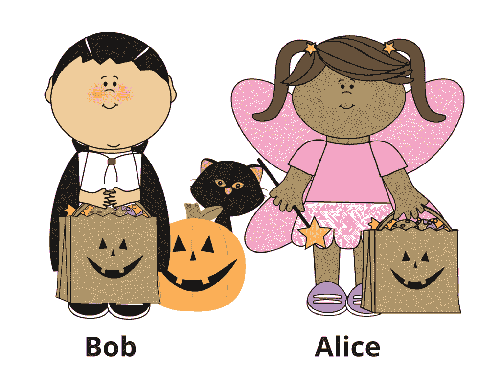
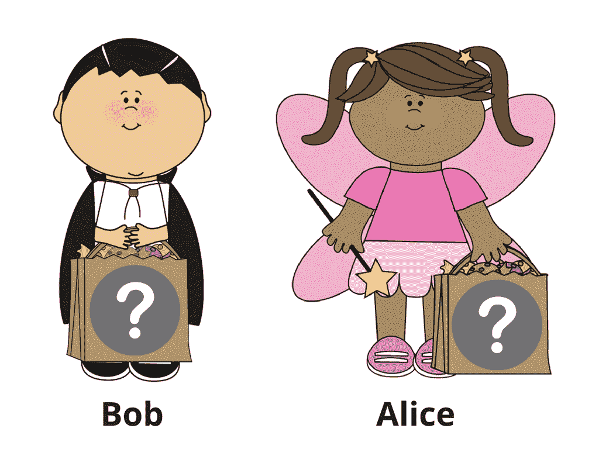
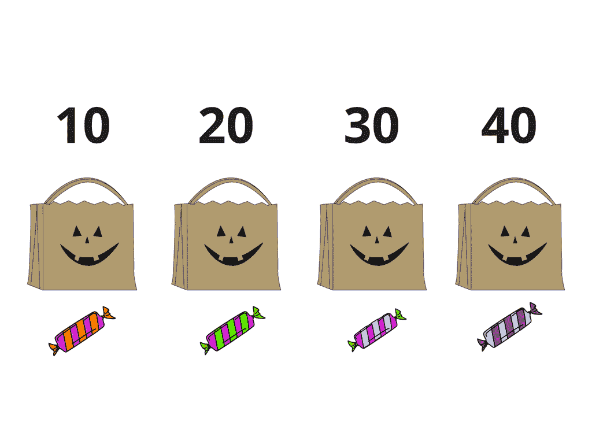
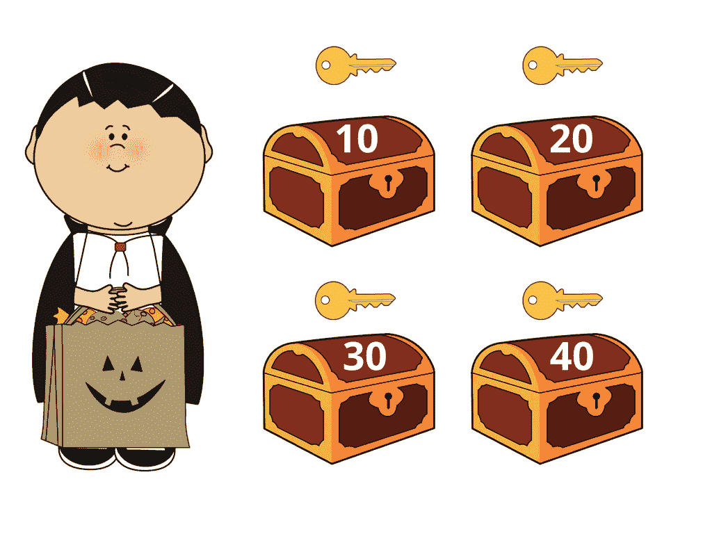
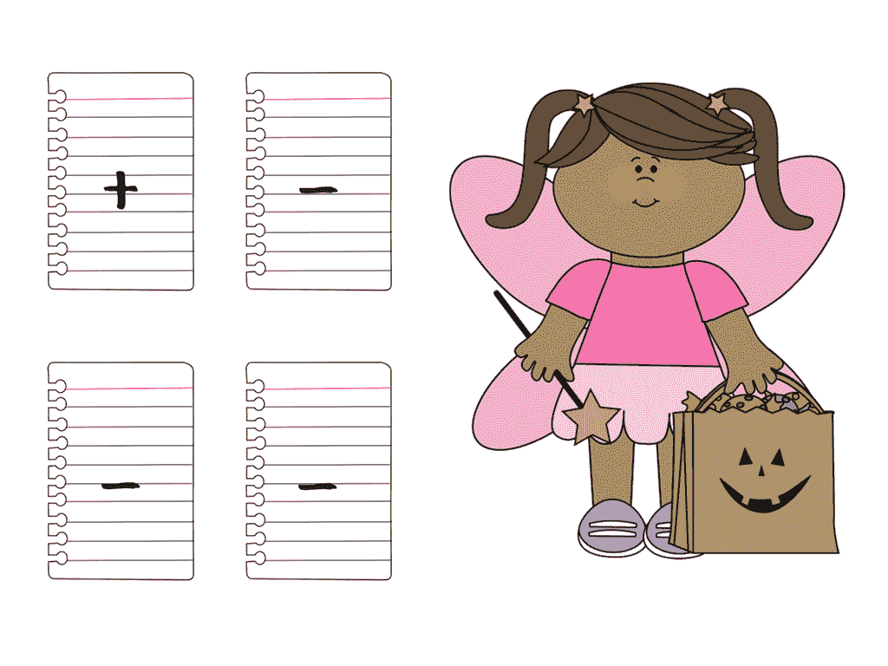
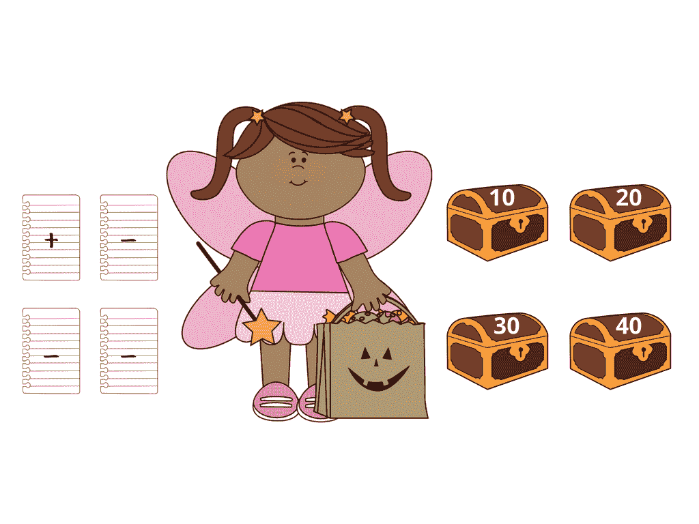
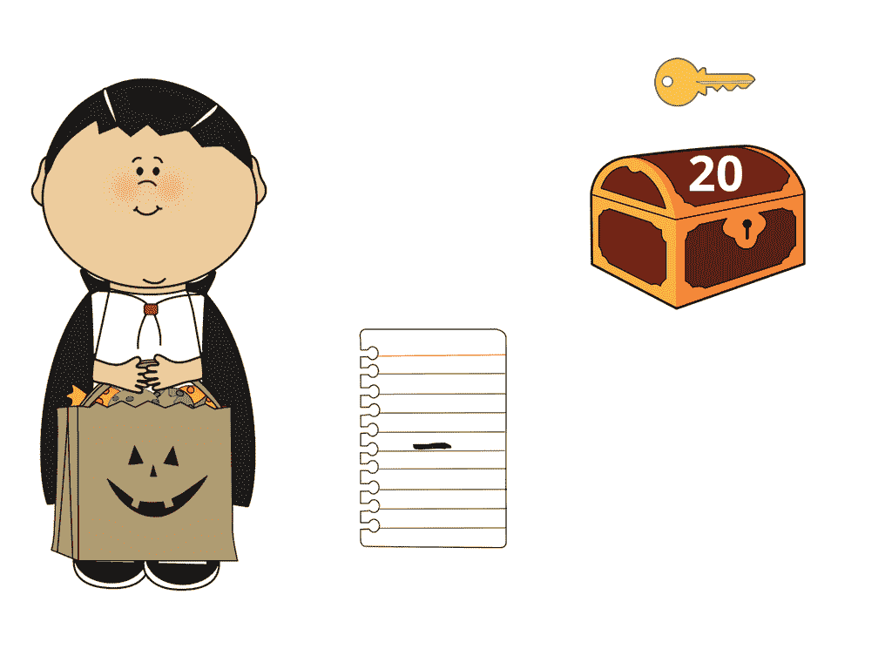
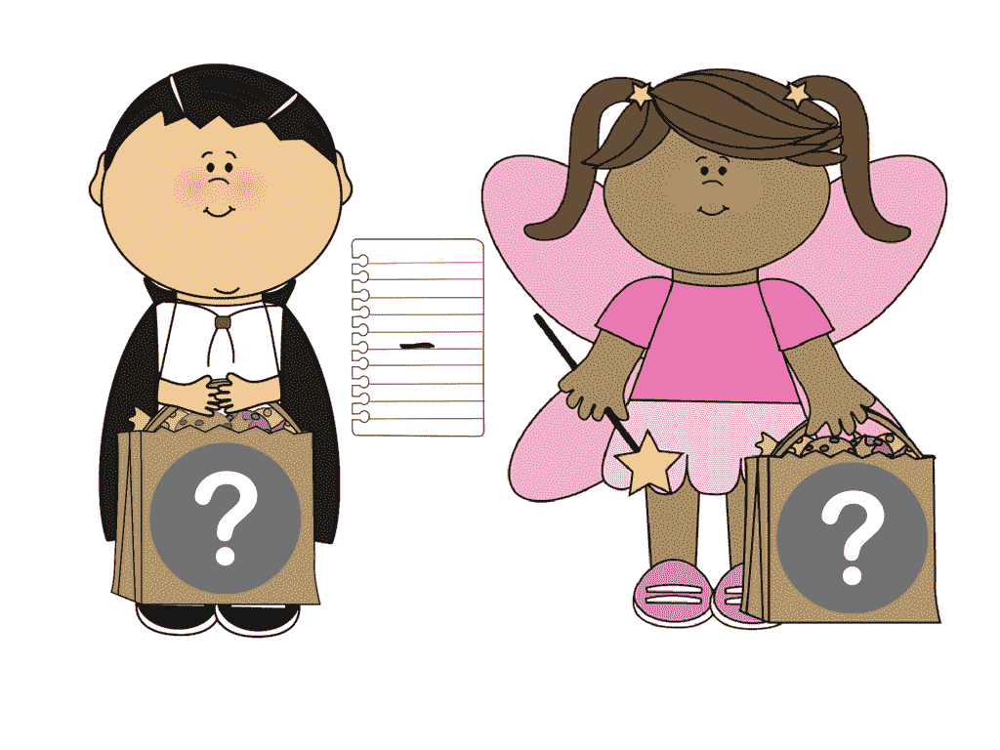

# 像我 5 岁一样解释:零知识证明(万圣节版)

> 原文：<https://medium.com/hackernoon/eli5-zero-knowledge-proof-78a276db9eff>

解释密码很难，用简单的语言解释更难。给一个孩子讲解零知识证明？轻松点。给你——ZKP 用一些万圣节糖果解释道。

**上一集:** [讲解像我 5:端到端加密](/@cossacklabs/eli5-end-to-end-encryption-ae46821db74f)

# ***零知识协议***

零知识协议(或零知识密码证明，ZKP)是一种不交换密码的认证方式，这意味着密码不会被窃取。这很酷，因为它使你们的交流如此安全和受保护，没有人能发现你们在交流什么或者你们在互相分享什么文件。

ZKP 允许你向交流另一端的人证明你知道一些秘密(或许多秘密),而不需要实际透露。术语“零知识”来源于这样的事实，即没有关于秘密的(“零”)信息被泄露，但是第二方(称为“验证者”)确信第一方(称为“证明者”)知道所讨论的秘密。为什么你需要证明你知道秘密而不告诉它呢？当你不信任对方，但仍需要说服他们你知道这一点。那么这个过程是什么样的呢？

# ***糖果条和百万富翁***

让我们在鲍勃和爱丽丝的帮助下举例说明，他们在万圣节得到了一些巧克力棒。

他们想知道他们是否收到了同样数量的糖果，但没有透露他们的巧克力数量，因为他们不想分享。

让我们假设他们可以在他们的“不给糖就捣蛋”的袋子里放 10、20、30 或 40 块巧克力。

为了在不透露实际数量的情况下比较他们得到的巧克力棒的数量，Bob 得到了 4 个可上锁的盒子，并在每个盒子上贴了一个标签，上面写着 10、20、30 或 40(巧克力棒)。

然后鲍勃扔掉了所有的钥匙，除了与他得到的巧克力棒数量相对应的盒子的钥匙(假设他有 20 块巧克力棒)并离开了。

爱丽丝拿出 4 张小纸，在其中一张上写下“+”，在其他所有的纸上写下“-”。

然后，她将“+”的纸条通过一个槽塞进盒子里，盒子上的数字对应于她得到的糖果的数量(假设她有 30 块糖)，并将写有“-”的纸条塞进其余的盒子里，然后也离开了。

Bob 回来打开了他仍然有钥匙的那个盒子——那个对应于他得到的糖果数量的盒子——并查看它是否包含“+”或“-”。

如果是“加号”，爱丽丝包里有同样数量的巧克力棒。如果纸条上写着“-”，说明他们有不同数量的糖果(但仍然不会互相分享)。

我们知道鲍勃的包里有 20 块巧克力，爱丽丝的包里有 30 块巧克力。打开盒子，找到一张写着“减”的纸，鲍勃知道他和爱丽丝有不同数量的糖果。但是他没有办法知道爱丽丝的巧克力棒是多了还是少了。

爱丽丝也回来了，看到鲍勃有一张写着“减号”的纸。所以他有不同数量的糖果。但是爱丽丝和鲍勃仍然不知道他们每个人有多少巧克力。他们只知道他们没有同样的数量。

这个例子，以一种稍微不同的形式，被广泛地称为[姚的百万富翁问题](https://en.wikipedia.org/wiki/Yao%27s_Millionaires%27_Problem)两个百万富翁想知道他们是否有同样多的钱，但不透露确切的数目。这是 ZKP 工作方式的一个简单例子。

*感谢阅读。对于零知识协议的成人密码解释，请访问我们的* [*博客*](https://www.cossacklabs.com/zero-knowledge-protocols-without-magic.html) *。*

*有什么要补充的？我们希望收到您的来信！请通过*[*info@cossacklabs.com*](http://info@cossacklabs.com/)*或*[*@ cossacklabs*](https://twitter.com/cossacklabs)*联系我们。*