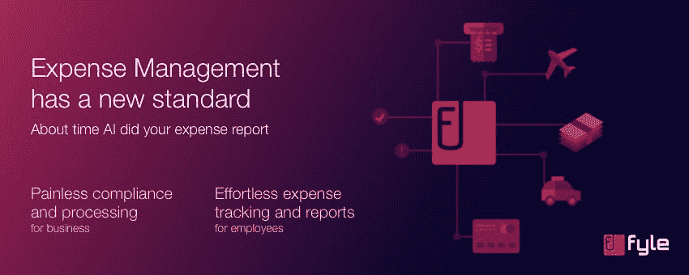
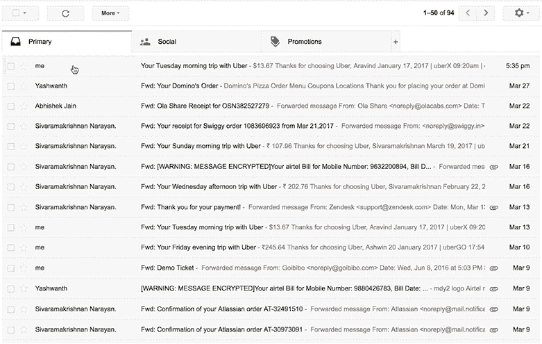
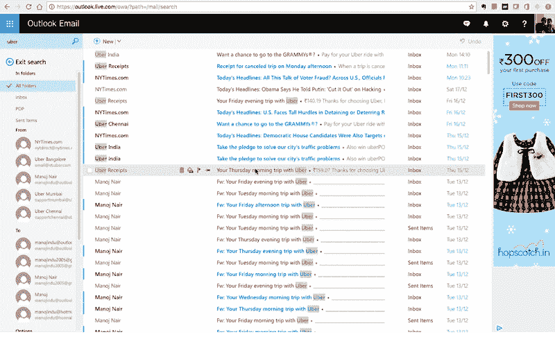

# 消除费用管理的挫折感

> 原文：<https://medium.com/hackernoon/eliminate-frustration-from-expense-management-e051f007800f>

商务人士不得不忍受的最令人沮丧的活动之一是提交报销申请。使用[**【Fyle】**](https://www.fyle.in/)，您只需轻轻一点，即可自动从电子发票中获取费用信息。Fyle 将电子邮件、消费者应用和其他平台联系起来，以简化组织内费用和发票的记录、共享和处理。有了 Fyle，用户只需点击一下鼠标，就可以在完成交易的那一刻获取他们的消费数据。

[**凯文·威廉·大卫**](https://twitter.com/kwdinc) 采访了 [**亚什万思·马德苏丹**](https://twitter.com/YashwantM) ，联合创始人 [**法伊尔**](https://siftery.com/fyle) 了解更多。

## 嗨，Yashwanth，你能告诉我们你正在做什么吗？

Fyle 是 SaaS 的产品，它使员工跟踪其业务费用和企业及时报销费用变得极其简单，同时保持合规，这是前所未有的。

Fyle 使用人工智能，为员工提交费用提供了单击体验，消除了数据输入、手动验证和挫折感。我们建立了世界上第一个人工智能数据提取系统，只需点击一个按钮，即可从收据(在线和纸质)中提取费用数据。

Fyle 自带智能插件，与 [**G Suite**](https://siftery.com/g-suite-formerly-google-apps-for-work) 和 [**微软 Outlook**](https://siftery.com/microsoft-outlook) 一起分发和集成，作为电子邮件插件。底层数据提取引擎还支持我们在 iOS 和 Android 上的移动应用程序，以扩展纸质收据的单击体验，让用户拍摄账单照片。因此，只需一次点击，Fyle 就可以提取费用信息、附上发票、检查重复项并实时识别违反政策的情况。

## 告诉我更多关于你为什么要建这个的信息？

它始于一个非常简单的问题。作为一名超过 14 年的专业销售人员，我大部分时间都在路上，对自己的个人和专业开支毫无头绪。有很多次，我选择不索赔，仅仅是因为向公司提交索赔的痛苦。当然，市场上有成千上万的应用程序(我也试过)，但有一个共同点。他们都希望我遵守纪律。如果我足够自律，我觉得没有必要使用工具。我的期望是使用不超过一秒钟的东西，类似于喜欢一个朋友的 [**【脸书】**](https://siftery.com/company/facebook) 帖子或在我的 [**Pinterest**](https://siftery.com/company/pinterest) 板上钉一张图片。我的现实是，留出一个周日下午翻遍堆积如山的发票来拿回我的钱。这让我很沮丧，感觉自己仿佛被传送回了过去。

两个角色都存在问题-

**支出者** —主要是销售/业务开发角色。他们讨厌数据录入，因此很少按时提交账单。

**处理者** —财务、管理和会计角色。费用管理/处理不是他们的核心工作，但最终却在这上面花费了大量时间。在较大的组织中，外包会导致非常高的处理成本(报销金额的 2 -3%)。

过去已经做了很多工作来解决这个问题，集中在问题的工作流程方面，完全忽略了[业务](https://hackernoon.com/tagged/business)用户的需求。很多时间花在与公司目标无关的活动上。

Fyle 帮助自动化这一流程，并帮助公司提供员工友好的流程，同时保留合规性控制和可见性。

## Fyle 与市场上已经存在的产品有何不同？

这是一个很好的问题，如果你将费用管理视为一个问题，每个人都会理解它，经历它，并对它有多糟糕有一个看法。在大中型企业中，我们与行业巨头竞争，如**，而在中小企业中，Expensify 非常受欢迎。**

**费用管理一直被视为一个工作流问题，让员工将数据输入特定的系统并优化工作流。这种方法的问题是，人们讨厌数据输入。几乎所有的费用管理应用都是如此。**

**我们认为费用管理是一个数据问题，我们正试图从这个角度解决这个问题，方法是使用人工智能从收据(物理和电子)中自动提取数据，同时为员工提供单击体验。**

****

**机器驱动的数据提取是准确的，从发票中捕获的数据比人工输入的数据多得多，并且收据中有许多有趣的信息，如果希望人工输入，这些信息通常会被忽略。**

**最后，我们建立了一个非常程序化的方法来为公司处理费用本身。因此，只需一次点击，Fyle 就可以提取费用信息、附上发票、检查重复项并实时识别违反政策的情况，并通过员工友好、用户至上的方法为公司提供全面的控制和可见性。**

**凭借我们独特的数据提取能力，我们在用户体验和公司投资回报率以及中小企业领域的其他现有企业的竞争中获得了高分。**

## **谁使用 Fyle？你能告诉我们一些关于使用 Fyle 的不同客户群的信息吗？**

**Siva 和我在 2016 年 2 月创立了 Fyle，我们的初始产品(MVP)在那年 10 月推出，拥有约 50 名员工的公司，主要在我们的网络中使用和提供反馈(并支付:-))**

**今天，我们有很多超过 3000 名员工的公司，分散在多个国家，有多个法人实体、货币和政策使用 Fyle。我们于 2017 年 1 月在印度开始销售，8 月在美国开始销售。**

**我们在印度的一些客户包括**[**capillary tech**](https://siftery.com/capillary)[**HeroFincorp**](https://siftery.com/company/hero-fin)[**Teach For India**](https://siftery.com/company/teachforindia)[**fresh works**](https://siftery.com/company/freshworks)等。****

****我们在美国有 30 多个客户，其中相当一部分在欧盟、新加坡和美国有跨国公司。****

****我们把人们分为三种主要角色。****

****您在商务旅行或任何其他商务目的中花费了金钱，并希望得到报销。许多 SaaS 应用程序都是用创始人/营销经理的信用卡购买的，直到花费超过几千美元。****

******批准者** —必须批准团队报告的支出者和/或管理者。****

******财务总监/行政**——公司财务、行政、会计团队——负责处理付款，使其保持在预算内，确保合规，并对公司的运营成本全面负责。****

****我们介绍的其他角色有****

******审核员/审核员** —他们可能是公司的一部分，也可能是与多家公司合作的共享服务专业人员。****

******差旅管理员、服务台代理** —这通常适用于拥有差旅服务台和为员工安排差旅的团队的大型公司。****

****我们帮助自动化和组织旅行前的工作流程，包括授权、方便预订和将费用分配给正确的成本中心/员工。****

****Fyle 是一款自助式 SaaS 产品，用户可以通过应用商店、评论网站和在线搜索在线发现我们。最初是销售/业务专业人员发现 Fyle，这成为我们的主要目标，因为他们可以在应用程序中创建并向他们的公司提交报告，通常他们在将我们与财务团队联系起来方面非常有帮助。****

## ****您的客户如何使用 Fyle？你能分享一些不同的使用案例吗？****

****我们的客户能够通过 Fyle 实现整个报销流程的自动化。大多数公司都存在员工不按时提交账单的问题。这影响了公司按时结账、合规和显示准确损益的能力。****

****通过 Fyle，我们证明了员工友好型系统可以大幅降低报销的时间和成本，同时提高合规性。现在，90%以上的交易都是数字化的，这要归功于**[**AirBnb**](https://siftery.com/company/airbnb)[**make my trip**](https://siftery.com/company/make-my-trip)[**Hotels.com**](https://siftery.com/company/hotelscom)以及几乎已经消费化的商旅。******

****员工通过电子邮件获得收据和发票。他们使用 Fyle 的 Gmail 或 Outlook 集成插件，只需点击一下就能支付费用。对于纸质收据，他们使用 Fyle 移动应用程序拍摄照片并提取所有相关数据。****

********

****公司在应用程序中配置他们的费用政策，员工甚至可以在提交费用之前实时了解费用是否违反政策。这反过来有助于保持检查。****

## ****有没有你没有想到或预料到的 Fyle 的独特用例？****

****我们制造这款产品时牢记两点:****

1.  ****不应该有任何雇员的数据输入****
2.  ****公司应该实时获得开支信息的完整可见性****

****虽然我们专注于解决员工费用用例，但我们也有一些客户通过 Fyle 管理供应商发票。****

****我们总是计划在适当的时候解决整个应付账款自动化的使用，但是我们的客户绕过了它，抢在了我们的前面。****

## ****有什么早期的“成长秘诀”或策略促成了你现在的成功吗？****

****我们仍在学习和发现有助于我们成长和扩展的东西。****

****我想迄今为止对我们有帮助的最大因素是，我们的客户和用户喜欢我们，每当他们周围的人抱怨费用管理有多痛苦时，他们都会谈论我们。****

****与谷歌邮件和 Outlook 整合，并构建第一个也是唯一一个真正有效的插件，显然帮助我们在解决费用管理的其他尝试中脱颖而出。****

## ****在早期构建产品时，最大的挑战是什么？你是如何解决的？****

****这个问题最好的一面是，几乎每个人都理解它或者有第一手的经验。另一方面，人们认为这个问题永远无法解决，或者这些年来一直以相同的方式解决。****

****最大的挑战是打破这种认知，而这通常发生在看到我们的产品演示不到 5 秒钟的时间内。****

****我们已经尝试通过在我们所有的交流中展示 4 秒钟的 GIF 来解决这个问题。网站，邮箱。我们大多数人都把 Gif 或视频储存在手机里。****

********

****大多数公司在早期阶段面临的另一个挑战是优先考虑建立什么和识别角色。****

****在我们的案例中，我们必须在消费者和财务和管理人员之间取得适当的平衡，提供更好的体验来提交费用，并引入所有功能，这也将使他们的生活变得轻松。****

## ****你加入的最有趣的整合是什么？有什么对你特别有影响的吗？****

****我们的电子邮件集成或电子邮件插件肯定。它是独一无二的，有很高的可发现性和很大的区别，正如你可以看到的评论和评级的数量，人们绝对喜欢它。****

****我们将很快推出 Outlook 手机插件，对此我们感到非常兴奋。****

****我们还集成了会计系统，如[**【Quickbooks online】**](https://siftery.com/quickbooks-online)[**Tally**](https://siftery.com/company/tally-solutions)(在印度)，并正在推出与[**Netsuite**](https://siftery.com/company/netsuite)[**Microsoft Dynamics**](https://siftery.com/microsoft-dynamics-nav)的集成。****

## ****在我们结束之前，你运营公司最依赖的 5-10 种产品是什么&你如何使用它们？****

*   ****[对讲机](https://medium.com/u/7ca8972daf76?source=post_page-----e051f007800f--------------------------------) —我们在对讲机上运行并捕获事件和使用数据，以实现基于触发器的用户登录。我们的知识库也在 intercom 上，喜欢新的操作员功能，它可以根据所提的问题建议文章。****
*   ****[完整故事](https://medium.com/u/9e9472b4520d?source=post_page-----e051f007800f--------------------------------) —让我们知道在用户体验方面哪里出错了。这是坐在我们的用户旁边，观察他们如何使用产品的下一个最好的事情。****
*   ****混合面板——营销仪表板，也帮助我们了解使用漏斗的概况，以及人们在哪里下车，帮助我们堵塞。****
*   ****[HubSpot](https://medium.com/u/8732e73183e5?source=post_page-----e051f007800f--------------------------------)——预注册漏斗，人们从哪里来，是什么把他们带到我们的网站，是什么让他们留下来注册。这是我们在 Hubspot 的早期。****
*   ****[**SEM rush**](https://siftery.com/semrush)——对所有事物 SEM。****
*   ****[**Linkedin 销售导航**](https://siftery.com/linkedin-sales-navigator) —用于潜在客户开发和建立目标列表。****
*   ****[Freshsales —销售 CRM](https://medium.com/u/fbd72cddcdf3?source=post_page-----e051f007800f--------------------------------) —我们的 CRM 以及我们的联系人、销售线索、交易、渠道和渠道的存储库。****
*   ****[条纹](https://medium.com/u/3ecae35d6d66?source=post_page-----e051f007800f--------------------------------) —收款。****
*   ****[**Zendesk**](https://siftery.com/zendesk) —支持和票务管理。****
*   ****[Slack](https://medium.com/u/26d90a99f605?source=post_page-----e051f007800f--------------------------------) —连接我们所有应用程序的眼睛和耳朵。****

*****最初发表于*[*siftery.com*](https://siftery.com/stories/eliminate-frustration-from-expense-management)*。*****