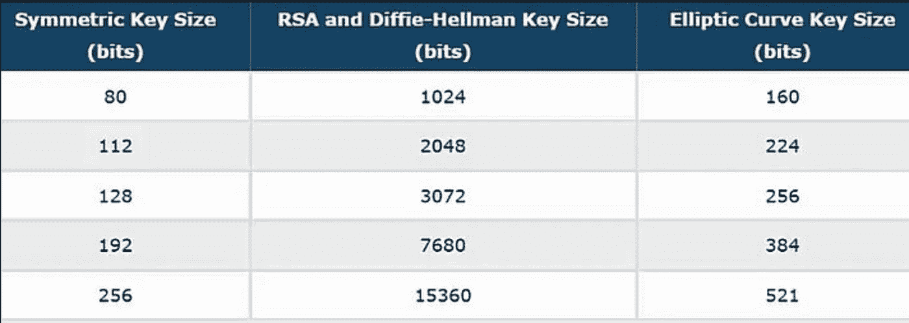
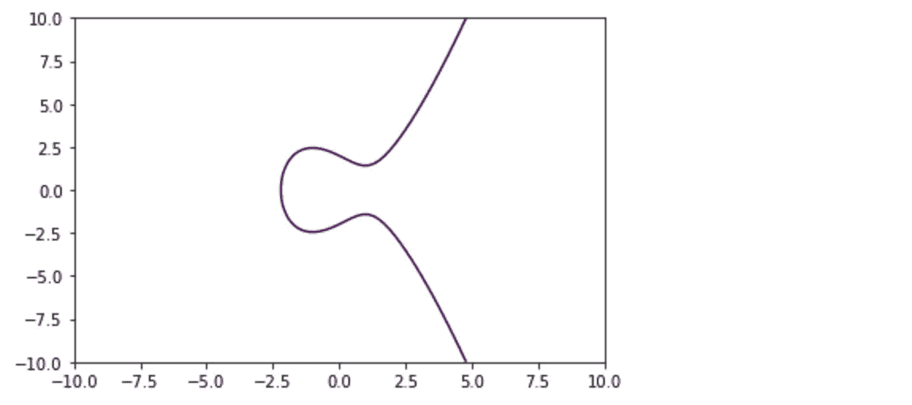
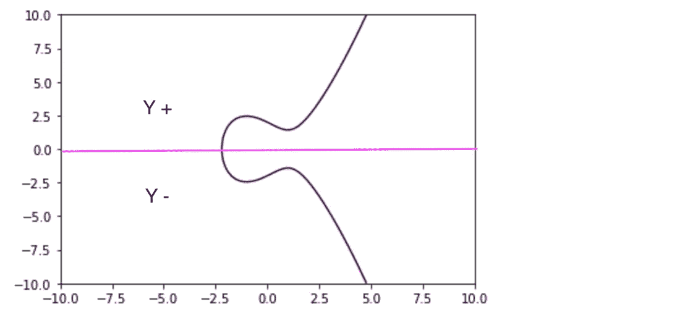
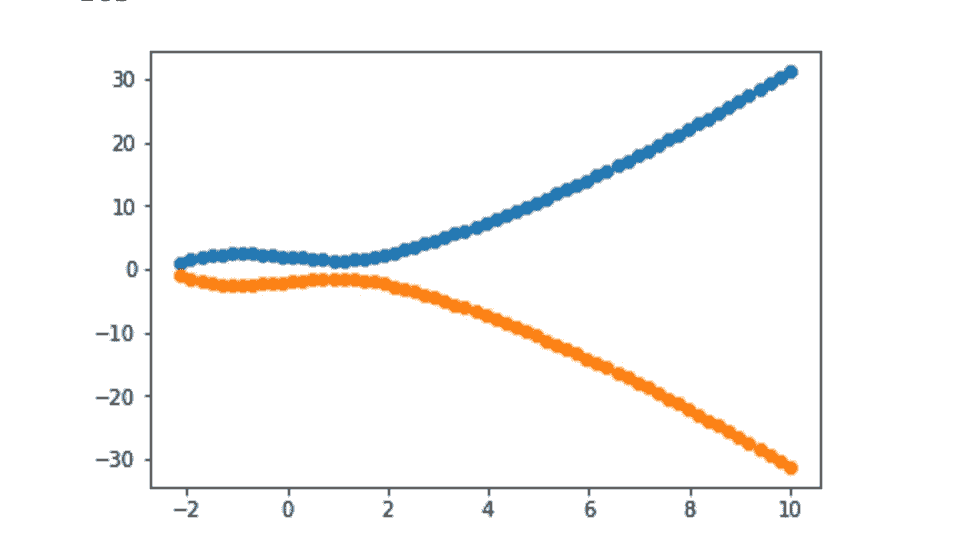
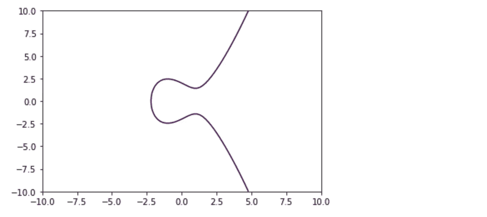
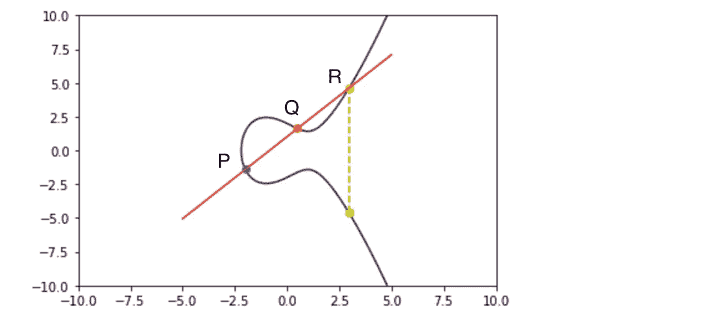

# 椭圆曲线加密，基础知识

> 原文：<https://medium.com/hackernoon/eliptic-curve-crypto-the-basics-e8eb1e934dc5>

好吧！我们已经讨论了 **D-H** 和 **RSA** ，这些我们都很容易理解，你不需要知道很多数学知识就能理解，我认为这是一个公平的说法。

嗯，当面对 **ECC** 时，事情变得有点陡峭，至少可以说，它有多种属性，其中有更多的数学知识。我想把这个系列分成三个部分，因为我是边走边发现的。

## **为什么是椭圆曲线？**

**ECC** 是基于**公钥**的，例如 **RSA** ，但它在某种程度上是以代数结构来表示的， **ECC** 提供了与 **RSA** 相同的安全性，但占用空间**更小**，而且占用的 cpu 也更少，因此它是移动设备和快速网络的理想选择。



RSA vs ECC

## 什么是椭圆曲线？

根据定义:

> 在数学中，**椭圆曲线**是由以下形式的方程定义的平面代数**曲线**。那是非单数的；也就是说，它没有尖点或自交。

所以它实际上是一条曲线，其中所有的**点** (x，y 坐标)满足一个**方程，**它真的那么简单，没那么简单。

**看起来怎么样，方程式是什么？**

好的表达方式是这样的:



这条曲线上的所有点应该满足的方程应该是这样的


```
y ** 2 = x ** 3 + ax +b
```

所以从理论上讲，如果你列出一系列“y”坐标(实数)并将这个方程应用于所有这些坐标，你应该会得到一条看起来像这样的曲线。

**现在，对于这项工作的大部分，我一直在使用:**

*   [https://matplotlib.org/](https://matplotlib.org/)
*   [http://jupyter.org/](http://jupyter.org/)

我强烈推荐这些。

## **我们来做个曲线吧！**

在我们绘制一系列符合该方程的**实数**的点之前，让我们澄清一下，当方程表示 **y 的平方**时，意味着曲线的**正负 Y 轴将是相同的**，也就是说，如果一个点存在于 **y:4** 中，它也将存在于 **y:-4，**中，你可以在上面的曲线中看到:



酷，现在让我们看看这是不是真的，下面的代码是我在 jupyter 中用来得到我在这里展示的图表的

我会一步一步来:

```
f(x) = x ** 3 + 3x + 4
```

这是最重要的部分，还记得定义曲线的方程吗？所以这是它的一个侧面，你可以看到**“a = 3”****“b = 4”**，这些参数被称为**域参数**，它们决定了曲线的各种属性。

此外，方程必须返回除 0 之外的值，所以我们可以用图表示出来:

```
if res > 0 
```

**还有一件事，注意等式的结果必须是平方根，因为 y 是平方，所以我们做了下面的**:

```
ys.append(np.sqrt(res))
```

那么这看起来像什么？



是的，它不是很好，但是它有点像我们之前看到的曲线。

Matplotlib 附带了一个名为 contour 的非常奇特的函数，它接受一个等式，因此我们可以执行以下操作:

这变成了这样:



## 这条曲线的最后一个特性是:

这可能是这条曲线最重要的性质，那就是如果一条线与曲线上的两点相交，它将总是与第三点相交。

这是非常重要的，因为第三点将是公钥的表示，请记住，所有这些麻烦都是从私钥创建公钥，这在这一点上是巨大的素数。



所以你看到一条穿过曲线中两点的线 **(P，Q)** 总是与另一条 **(R)相交。**

## **总结今天的文章**

*   曲线上的点满足一个方程
*   基于知道**“X”**的等式，你将最终知道**“Y”**
*   这条曲线在 Y 轴上是相同的
*   如果一条直线能与曲线上的两点相交，那么它也会与第三点相交
*   域参数影响给定曲线的各种属性
*   用 Jupyter！

## DH:

[](https://hackernoon.com/diffie-hellman-explained-sort-of-5efd0467584c) [## 迪菲-赫尔曼解释说。

### D-H 是一种密钥交换机制，一种通过公共通道交换加密密钥的方式，就是我要同意…

hackernoon.com](https://hackernoon.com/diffie-hellman-explained-sort-of-5efd0467584c) [](https://hackernoon.com/can-you-reverse-diffie-hellman-b26b2173c785) [## 你能逆转迪菲-赫尔曼吗？

### 大家好，在之前的一篇文章中，我试图解释 D-H 是如何工作的，我希望我做得很好，也希望…

hackernoon.com](https://hackernoon.com/can-you-reverse-diffie-hellman-b26b2173c785) 

## RSA:

[](https://hackernoon.com/how-does-rsa-work-f44918df914b) [## RSA 是如何工作的？

### 嘿伙计们，我想写一点关于 RSA 密码系统。

hackernoon.com](https://hackernoon.com/how-does-rsa-work-f44918df914b) [](http://bit.ly/HackernoonFB)[](https://goo.gl/k7XYbx)[](https://goo.gl/4ofytp)

> [黑客中午](http://bit.ly/Hackernoon)是黑客如何开始他们的下午。我们是这个家庭的一员。我们现在[接受投稿](http://bit.ly/hackernoonsubmission)并乐意[讨论广告&赞助](mailto:partners@amipublications.com)机会。
> 
> 如果你喜欢这个故事，我们推荐你阅读我们的[最新科技故事](http://bit.ly/hackernoonlatestt)和[趋势科技故事](https://hackernoon.com/trending)。直到下一次，不要把世界的现实想当然！

