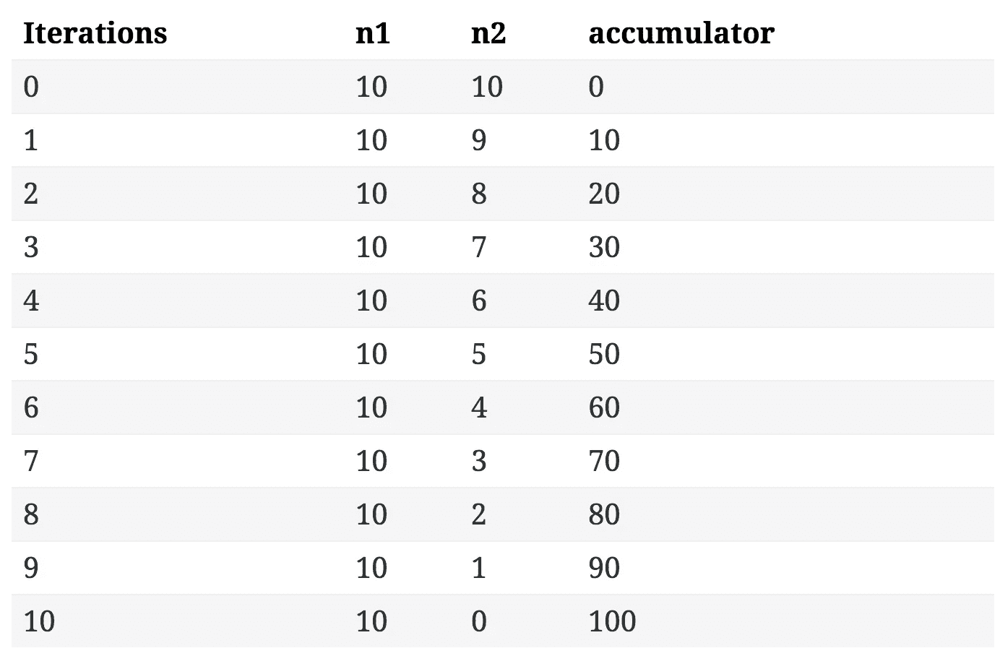

# Rubyists 的灵丹妙药:模式匹配和递归

> 原文：<https://medium.com/hackernoon/elixir-for-rubyists-pattern-matching-and-recursion-37a4416ba9c>

*注意:这是从我在 http://www.weeklycommit.com 的博客上截取的*

这个博客系列将为来自 Ruby [编程](https://hackernoon.com/tagged/programming)语言的人介绍[灵丹妙药](https://hackernoon.com/tagged/elixir)的基础知识。

为什么？

从外表上看，Elixir 和 Ruby 在语法上看起来非常相似。然而，这是他们真正的共同点。

当你开始使用 Elixir 时，你会意识到这两种语言是多么的不同，我的意思是对于初学者来说，Elixir 是一种函数式编程语言，而 Ruby 是面向对象的(虽然可以说 Elixir 是所有面向对象语言中最受反对的语言，但那是另一个时间的争论)。

本系列不打算探究为什么人们想要使用 Elixir 而不是 Ruby，但是如果你想得到一个想法，可以看看这些帖子:

*   [凤凰会摧毁 Rails — Quora](https://www.quora.com/Will-Elixir-Phoenix-destroy-Ruby-on-Rails)
*   [仙丹与凤凰——五碳](http://blog.carbonfive.com/2016/04/19/elixir-and-phoenix-the-future-of-web-apis-and-apps/)
*   [我为什么要赌灵药——灵媒](/@kenmazaika/why-im-betting-on-elixir-7c8f847b58#.p010tmtsx)

# 模式匹配

好了，现在让我们进入我最喜欢的仙丹特性之一——模式匹配。

如果你以前从未使用过模式匹配，警告你，一旦开始，你就不能回头了。

最简单的形式，模式匹配是一种解构复杂数据类型的方式。

但这意味着什么呢？

举个例子，假设你有一张地图(相当于 Ruby Hash `{key: "val"}`的灵丹妙药):

`%{age: 22, name: "Harry"}`

你将如何获取`:name`键的值？

在 ruby 中，您可能会这样做:

```
person = {name: "harry", age: 22}  
person[:name]  
# => "harry"
```

但是，在 Elixir 中，您可以这样做:

```
%{name: name} = %{age: 22, name: "Harry"}
name  
# => "Harry"
```

这样做的原因是因为 Elixir 中的`=`操作符并不意味着赋值，而是匹配。因此上面的声明是在说:

使`%{name: name}`匹配`%{age: 22, name: "Harry"}`。

那么它是如何做到这一点的呢？

过程大概是这样的:

1.  看起来左边和右边是相同的数据类型(地图)
2.  然后，它发现两个映射都有一个名为`:name`的键，所以它们匹配
3.  然后它注意到左边的地图没有`:name`键的值，但是右边的地图有值。因此，它一定意味着`name`和`"Harry"`是一样的。

另一种思考方式就像代数。例如

`1 + x = 1 + 2`

X 的值是多少？

`2`

但是你可以做得更多。假设有了上面的，我们想再要一个人，看看是不是和第二个一样。在 Ruby 中，您可能会这样做:

```
person = {name: "harry", age: 22}  
person2 = {name: "glen", age: 33}person[:name] == person2[:name]
```

有了长生不老药，你可以这样做:

```
%{name: name} = {age: 22, name: "harry"}
%{name: ^name} = {age: 33, name: "glen"}# => Error. No match on right hand side....
```

我们在这里使用的是“pin”操作符。这基本上就是说，我们之前将`name`的值与一个特定的值进行了匹配，所以使用那个值，而不是尝试匹配一个新值。

这样做的好处可能不会马上显现出来。然而，对我来说，模式匹配的威力在编写函数时大放异彩。

假设你有一个方法，它接受一个散列，然后把两个数相乘，**只有当它们相等的时候**。Ruby 中的一个实现可能是:

```
def multiply_equal(n1, n2)  
 raise "Not equal" if n1 != n2
 n1 * n2
end
```

很简单。

然而，我们可以做得更好。

在 Elixir 中，使用模式匹配，您可以这样做:

```
def multiply_equal(x,x) do  
  x * x
enddef multiply_equal(_,_) do  
  raise "Not Equal"
end# or in one linedef multiply_equal(x,x), do: x * x  
def multiply_eqaul(_,_), do: raise "Not Equal"
```

这是怎么回事？一开始可能不明显，但有一点要注意，在 elixir 中，你可以多次定义一个函数。

在上面的例子中，我们定义了两个双参数`multiply_equal`函数。第一个函数只有在两个参数都相同的情况下才会被调用，第二个函数将针对两个参数的每一个其他组合被调用。

由于一个变量只能有一个值，当我们用相同的两个参数定义一个函数头时，例如`(x,x)`，我们说这个函数只有在两个参数相同时才会被调用。它对传入的数据类型不做任何假设。

例如，这些都将由第一功能头调用

```
multiply_equal( [1,2,3,4], [1,2,3,4] )  
multiply_equal( "foo", "foo" )  
multiply_equal( 'N', [78] )
```

(点击[此处](http://elixir-lang.org/getting-started/binaries-strings-and-char-lists.html#char-lists)查看最后一个匹配的原因)

这样做的好处可能不会马上显现出来，但是相信我，当你越来越深入到长生不老药和凤凰城的时候，你会越来越喜欢它，而不是生活本身。

# 把所有的放在一起

为了说明如何结合使用模式匹配和递归，我们将创建自己的乘法函数。

基本上，我们将复制大多数语言中常见的`*`函数。

现在，我花了很长时间才意识到乘法就是加法，乘以倍数。

那么我们如何使用模式匹配和递归来创建它呢？

为此，我们将定义两个函数。在 elixir 中，如果一个函数有相同的名字但不同的 arity(即参数的数量，它们被认为是独立的函数)。

所以:

```
def func(a,b)  
  IO.puts a
end
```

是不同于的功能:

```
def func(a)  
  IO.puts a
end
```

为此，我们有两个函数。

`multiply/2`是一个被其他模块公开暴露和消费的模块，`mulitply/3`是由`multiply/2`函数调用的模块。

所以基本上我们需要首先创建一个函数，它接受两个要相乘的数字，并调用我们的第二个`multiply/3`函数，传入一个累加器。我们将使用累加器来跟踪函数的最终结果。

```
def multiply(n1,n2) do  
  mutliply(n1,n2,0)
end
```

(我们甚至可以把它写在一行上)

```
def multiply(n1,n2), do: multiply(n1,n2,0)
```

现在我们需要实际实现乘法器逻辑。

在 elixir 中处理递归时，最好先写 success 或 end 函数头，这样函数实际上就有了一个退出点(例如，不会运行到无穷大)。

我们的递归函数的工作方式是，对于`n2`的每个值，我们将把`n1`加到累加器(从 0 开始)上，并从`n2`中减去 1，直到我们达到 0。

所以基本上:

10 * 10 看起来像是:



由此，我们可以知道我们的成功或结束案例是在`n2`等于 0 时。

因此，该函数将如下所示:

```
def multiply(n1,n2), do: multiply(n1,n2,0)defp multiply(_n1, 0, acc), do: acc
```

(记得`defp`让它成为私有方法)。

所以这里我们是说如果调用了`multiply/3`并且`n2`的值等于`0`，那么就不要再迭代了，取而代之的只是返回累加器的当前值。

这是我们的最终结果。现在我们需要实现迭代逻辑。

现在记住我们需要将`n1`的值加到`acc`上，并将`n2`的值减 1。

看起来像这样:

```
def multiply(n1,n2,acc) do  
  new_acc = n1 + acc
  new_n2 = n2 - 1 #recursive call
  multiply(n1, new_n2, new_acc)
end
```

最后一行用新的值`n2`和`acc`再次调用相同的函数。

然而，这看起来相当混乱..让我们稍微重构一下，看起来更合适。

```
def multiply(n1,n2,acc) do  
  multiply(n1, n2 - 1, acc + n1)
end
```

我们甚至可以用一行代码来说明这一点:

```
def multiply(n1,n2,acc), do: multiply(n1, n2 - 1, acc + n1)
```

就这样，我们现在可以用三行长生不老药将两个数相乘。

最终的实现看起来像这样:

```
def multiply(n1,n2), do: multiply(n1,n2,0)  
defp multiply(_n1, 0, acc), do: acc  
defp multiply(n1,n2,acc), do: multiply(n1, n2 - 1, acc + n1)
```

很漂亮吧？

很明显这不能处理负数，但是也很容易处理。

同样，这里不需要使用 if 语句，相反我们可以使用[*guard _ clauses*](http://elixir-lang.org/getting-started/case-cond-and-if.html#expressions-in-guard-clauses)。

保护子句本质上是函数头的一部分，它向传入的参数添加条件。这基本上是另一种模式匹配的方式。

在我们的例子中，这可以通过检查`n2`的值是否小于 0 来实现。如果是，我们只需颠倒`n2`和`acc`上的操作(例如，我们给`n2`加 1，从`acc`减去`n1`)。

这是头部看起来样子:

```
def multiply(n1,n2,acc) when n2 < 0 do  
  multiply(n1, n2 + 1, acc - n1)
end# or on one linedef multiply(n1,n2,acc) when n2 < 0, do: multiply(n1, n2 + 1, acc - n1)
```

那部分是保护条款。我们在这里说，如果参数可以匹配到`n1,n2,acc`(它们可以匹配)**和**(如果`n2`小于 0 ),那么首先只调用这个函数头。

因为这是递归的，所以 Elixir 中的函数按照定义的顺序进行检查。例如，如果我们在原来的方法下面有这个方法，它永远不会被调用:

```
def multiply(n1,n2), do: multiply(n1,n2,0) # 1 defp multiply(_n1,0,acc), do: acc # 2
  defp multiply(n1,n2,acc), do: multiply(n1,n2 - 1, acc + n1) #3
  defp multiply(n1,n2,acc) when n2 < 0, do: multiply(n1,n2 + 1, acc - n1) #4 - Never called
```

这是因为函数头`#3`将总是匹配参数(假设它通过函数头`#2`)。因此，我们需要做的就是将`#4`移动到`#3`上方，例如

```
def multiply(n1,n2), do: multiply(n1,n2,0)   defp multiply(_n1,0,acc), do: acc
  defp multiply(n1,n2,acc) when n2 < 0, do: multiply(n1,n2 + 1, acc - n1)
  defp multiply(n1,n2,acc), do: multiply(n1,n2 - 1, acc + n1)
```

现在，我们已经使用模式匹配和递归从头开始编写了一个完整的多功能函数。

下面是一些示例输出(注意该方法是在一个名为`Recurse`的模块下定义的):

```
iex(1)> Recurse.multiply(2,-3)  
#=> -6
iex(2)> Recurse.multiply(-2,-3)  
#=> 6
iex(3)> Recurse.multiply(2, 3)  
#=> 6
iex(4)> Recurse.multiply(-2, 3)  
#=> -6
```

如果你喜欢这个小指南或者有任何问题，请在下面的评论中告诉我。我很乐意帮助你！

> 黑客中午是黑客如何开始他们的下午。我们是这个家庭的一员。我们现在[接受投稿](http://bit.ly/hackernoonsubmission)并乐意[讨论广告&赞助](mailto:partners@amipublications.com)机会。
> 
> 要了解更多信息，[请阅读我们的“关于”页面](https://goo.gl/4ofytp) , [喜欢/在脸书给我们发消息](http://bit.ly/HackernoonFB)，或者简单地，[发推文/DM @HackerNoon。](https://goo.gl/k7XYbx)
> 
> 如果你喜欢这个故事，我们推荐你阅读我们的[最新科技故事](http://bit.ly/hackernoonlatestt)和[趋势科技故事](https://hackernoon.com/trending)。直到下一次，不要把世界的现实想当然！