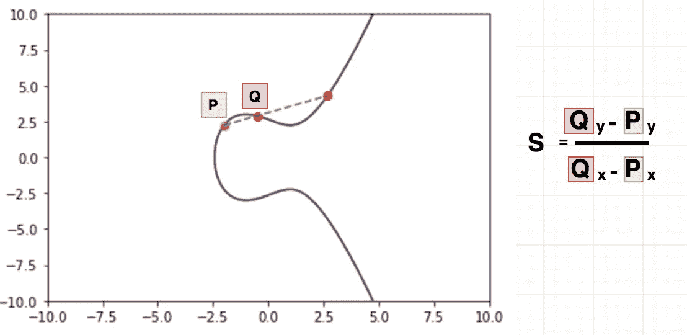
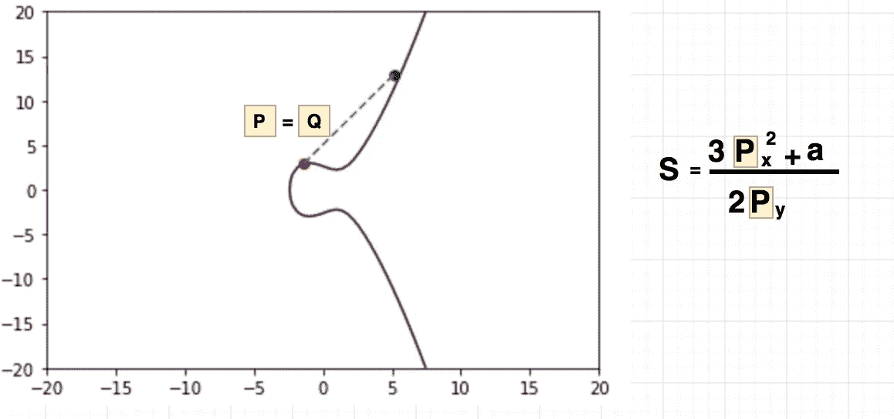
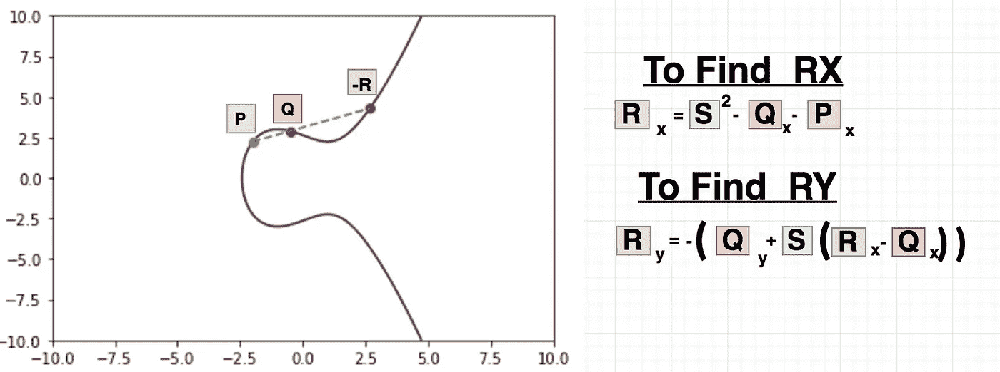
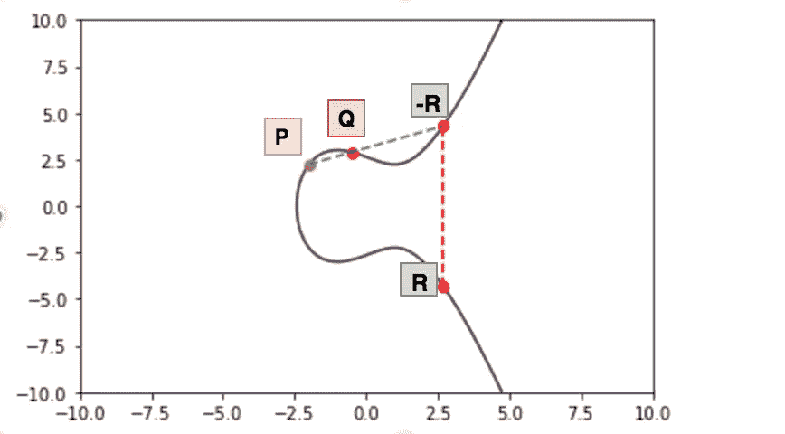
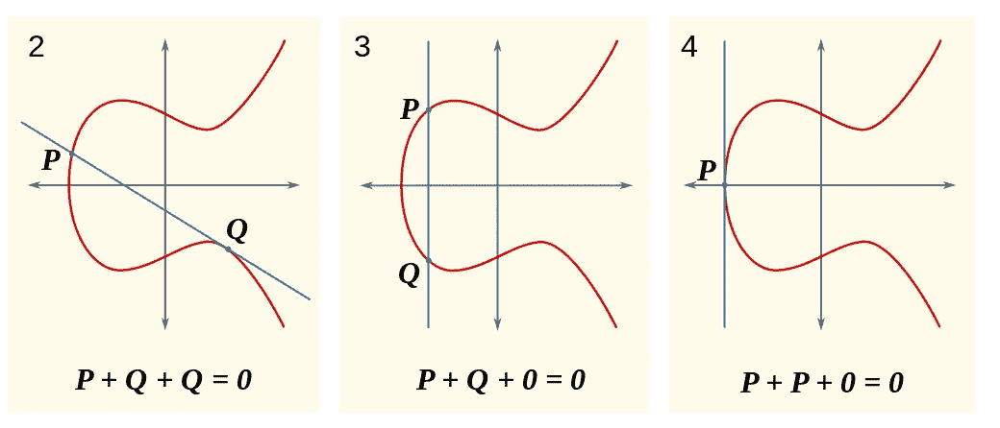

# 椭圆曲线加密，加法

> 原文：<https://medium.com/hackernoon/elliptic-curve-crypto-addition-42f6cb9916d7>

你好！，这将是的续集:

[](https://hackernoon.com/eliptic-curve-crypto-the-basics-e8eb1e934dc5) [## 椭圆曲线加密，基础知识

### 好吧！我们已经讨论了 D-H 和 RSA，这些很容易理解，您不需要了解太多…

hackernoon.com](https://hackernoon.com/eliptic-curve-crypto-the-basics-e8eb1e934dc5) 

今天，让我们试着把**运算**作为加法和乘法来处理，记住这些是“发明”的运算，它被称为加法只是一个巧合，它们应该被称为不同的东西，但这就是生活。

我将把它分成几个概念，然后写一些例外情况。

## 斜坡

根据 **P** 和 **Q** (曲线上的两个点)的位置，计算两个**点**之间的斜率，并有自己的公式。

让我们看看这些公式:



Slope 也叫 **λ** (lambda)，但我觉得 slope 对我来说更有意义。

如果 **P** = **Q** ，斜率的计算方式会有所不同，让我们来看看这个例子:



好的，这很简单， **S** 或 **λ，**是进行点加倍和点相加的关键。

## 点加法:

因此，这是最基本的椭圆曲线运算之一，请记住，当我们说加法**时，我们不是在说加法**为 **1+1** ，它是一种不同的运算，也是一种不同的算法。

让我们看看这个公式或数学恒等式，它是这样的:



**R** 将是问题中的第三点，是 **P** 和 **Q:** 相加的结果

```
RX = S ** 2 - QX - PX
RY = -( QY + S * ( RX - QX))
```

如果你注意的话，你会注意到上图中相加的结果叫做 **-R，**，这就是原因 **R** ，我们想要的结果是在 **-R，**的 **X** 轴上的反射:



下面是一个小代码示例，说明这应该如何工作:

今天就到这里，还有一个非常重要的操作叫做点加倍，我们需要看看，可能在下一篇文章中。

关于**例外**有一些**问题**，一条线会穿过两点但不会穿过第三点的情况，违背了我们在第一篇文章中提到的规则:



你可以看到，这两种可能性都不会跨越第三点，我们将在下一篇文章中涵盖所有这些，但如果你迫不及待地在维基百科中查看"**群论**"

非常感谢大量的阅读和评论！

[](http://bit.ly/HackernoonFB)[](https://goo.gl/k7XYbx)[](https://goo.gl/4ofytp)

> [黑客中午](http://bit.ly/Hackernoon)是黑客如何开始他们的下午。我们是 [@AMI](http://bit.ly/atAMIatAMI) 家庭的一员。我们现在[接受投稿](http://bit.ly/hackernoonsubmission)，并乐意[讨论广告&赞助](mailto:partners@amipublications.com)机会。
> 
> 如果你喜欢这个故事，我们推荐你阅读我们的[最新科技故事](http://bit.ly/hackernoonlatestt)和[趋势科技故事](https://hackernoon.com/trending)。直到下一次，不要把世界的现实想当然！

