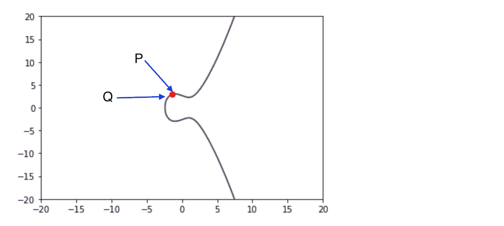
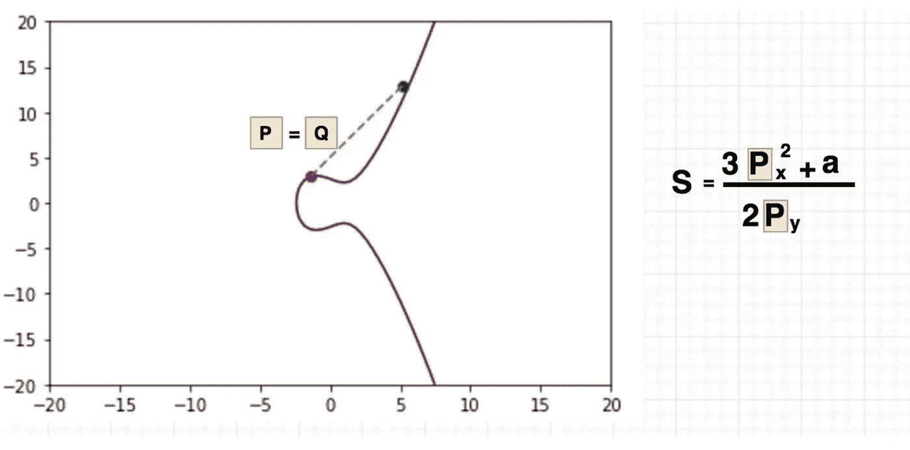
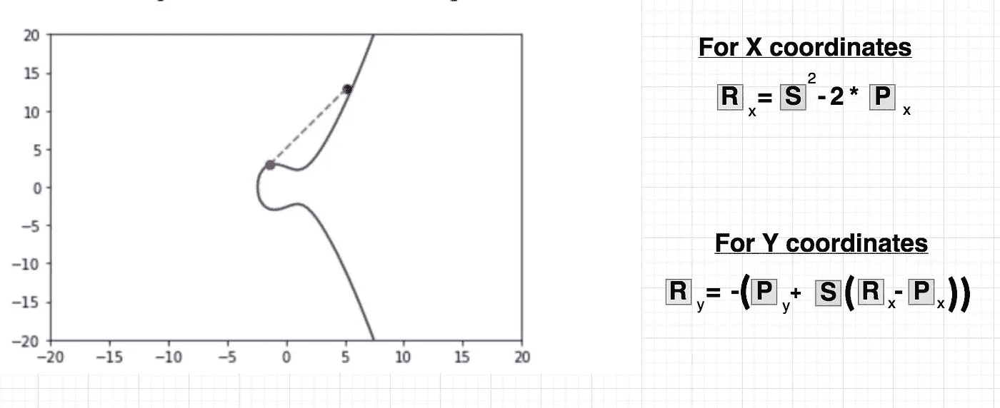
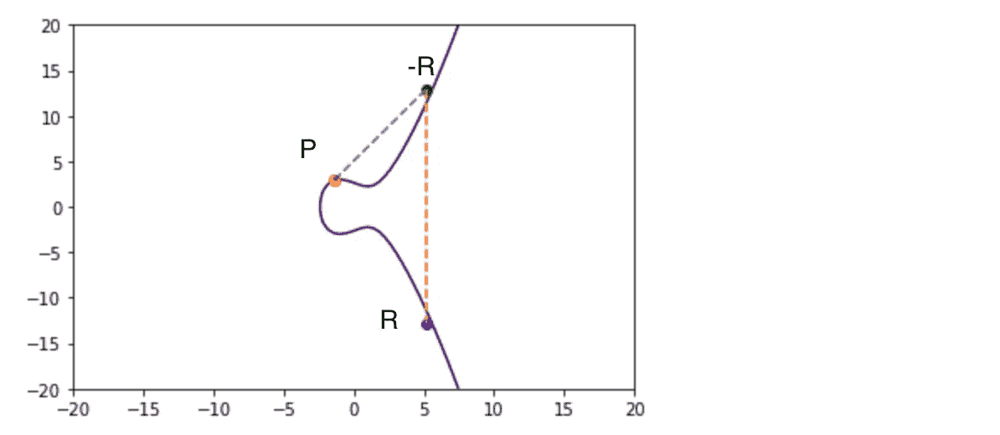

# 椭圆曲线加密，点加倍

> 原文：<https://medium.com/hackernoon/elliptic-curve-crypto-point-doubling-b98508d40a88>

大家好，上一篇文章我们谈到了加法，这是椭圆曲线算术中最重要的"**发明的**运算之一。有很大的反馈强调，规则**“如果一条线穿过两点，它将穿过第三点”**可能不是绝对的**。**

**这是真的，有一些例外，今天我将尝试解释一个，如果点 **P** 和 **Q** 共享相同的位置(x 和 y 方向)会发生什么:**

****

**P and Q sharing position**

****那么如何将共享同一位置的两个点(P 和 Q)相加呢？**，这被称为“点加倍”,也称为给自身增加一个点。**

**这只不过是另一个发明的运算，正如我们在 EC addition 中看到的，它由另一个数学恒等式以及不同的“**斜率**”方程表示。**

## **点加倍斜率:**

**为了计算 **P == Q** 时的斜率，我们应用以下等式:**

```
s = (3 * Px ** 2 +a ) / (2 * Py)
```

****

**Slope in point doubling**

**这将给出斜率的值，请记住，斜率加上一些其他域参数是计算加法或本例中点加倍的关键。**

## **点加倍:**

**点加倍或“向自身添加一个点”遵循一个非常简单的等式，当然它需要我们在以前的文章中看到的斜率和域参数。**

**但基本上是这样的:**

****

**Point Doubling in action**

```
RX = S ** 2 - 2 * PX
RY = -1 * (PY + S * ( RX - PX))
```

**同样的捕捉，R 变成了 R 的负反射，看起来像这样:**

****

**Reflection of R**

## **结论:**

**所以点加倍是我们谈到椭圆曲线时第二个发明的算术运算，有些规则适用于加法:**

*   **通过知道 X，你就知道 Y**
*   **R 是-R 在 X 轴上的反射**

**一些合法的代码，这样你就可以玩了:**

## **PS:感谢所有的评论和问题**

**[](http://bit.ly/HackernoonFB)****[](https://goo.gl/k7XYbx)****[](https://goo.gl/4ofytp)**

> **[黑客中午](http://bit.ly/Hackernoon)是黑客如何开始他们的下午。我们是 AMI 家庭的一员。我们现在[接受投稿](http://bit.ly/hackernoonsubmission)并乐意[讨论广告&赞助](mailto:partners@amipublications.com)机会。**
> 
> **如果你喜欢这个故事，我们推荐你阅读我们的[最新科技故事](http://bit.ly/hackernoonlatestt)和[趋势科技故事](https://hackernoon.com/trending)。直到下一次，不要把世界的现实想当然！**

****