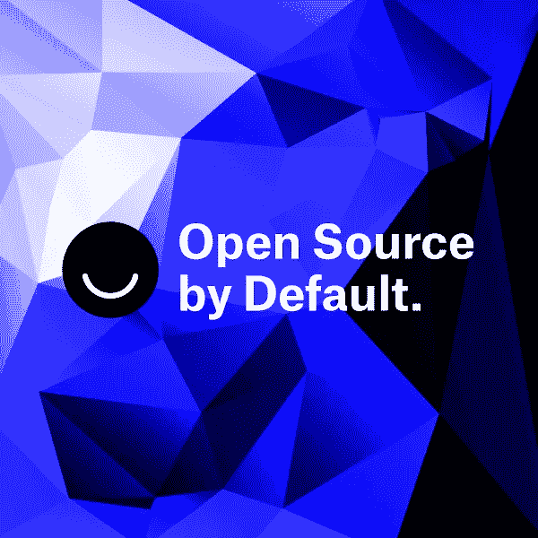

# Ello 现在默认是开源的。

> 原文：<https://medium.com/hackernoon/ello-is-now-open-source-by-default-88aabb0d2a7>

([从 Ello](https://ello.co/jayzes/post/tqLL-Z8U8GfbDySRk6wbKg) 交叉过账)

从一开始，Ello 的指导原则之一就是*开放*:我们努力在我们所做的一切中保持透明精神。

这体现在 Ello 运营的各个方面:我们如何进行内部沟通，我们如何在网络上征求人们的反馈，我们如何规划和实施产品决策，我们如何更新政策和条款，等等。

到目前为止，我们还没有做好的一件事是公开构建和维护运行 [Ello](https://hackernoon.com/tagged/ello) 的软件的工作。这里有许多惊人的工程在幕后进行。工程团队由我有机会与之共事的一些最有才华的人组成( [@mk](https://ello.co/mk) ， [@666](https://ello.co/666) ， [@sean](https://ello.co/sean) ， [@colinta](https://ello.co/colinta) ， [@holmezi](https://ello.co/holmezi) ， [@alanpeabody](https://ello.co/alanpeabody) ，以及 [@totallymike](https://ello.co/totallymike) )。我们面临的许多挑战绝不是我们的产品或团队所特有的。开诚布公地谈论这些事情不仅是我们分享所学知识的好方法，也是坦率地谈论过程中出现的挑战和问题的好方法。

我们自己的工程努力正站在巨人的肩膀上，因为 Ello 的大部分是建立在开源软件的基础上的。从我们的 webapp(内置于 [Ruby](https://www.ruby-lang.org/) / [Rails](http://www.rubyonrails.org/) )，到我们的 iOS app(用 [Swift](https://developer.apple.com/swift/) 编写，在架构方面受到 Artsy 的 [Eidolon](https://github.com/artsy/eidolon) 的极大启发)，到我们的基础设施(部署在 Linux 和 Heroku 上)，再到我们用于各种其他功能的数十个其他库，都使用了[开源](https://hackernoon.com/tagged/open-source)组件，这些组件是通过 Ello 以外的人数千小时的努力而形成的。我们尽最大努力成为该生态系统中的好公民，在修复或改进我们使用的依赖关系时向上游做出贡献，并开放可重用的库(迄今为止，主要是基础设施工具和类似 Rails 的 time_ago_in_words 到 Swift 的端口等)。然而，在我们看来，这些都是桌面赌注，我们可以做得更好。

[Artsy](http://code.dblock.org/2015/02/09/becoming-open-source-by-default.html) 、 [18F](https://github.com/18F/open-source-policy/blob/master/policy.md) 和 [Buffer](https://buffer.com/transparency) 已经编纂了一些方法，这些方法涉及到在默认情况下使他们的工程团队的工作开源。他们都广泛地写下了他们的经历，事实上，几周前我们与来自 Artsy 的 Ash 和 Orta 进行了一次很好的交谈，这使我们对自己的方法有了很多想法。在过去几个月与我们团队的交谈中，很明显我们的收益远远大于任何缺点，老实说，这些讨论引发的兴奋程度是一个很好的积极指标，表明我们正在做一些事情！

**所以——从今天起，我们开始冒险，Ello 将默认开源。**

这意味着我们将开始分享越来越多我们所做的事情，无论是在 Ello 上还是通过 [Github](https://github.com/ello) 。我们的目标是让尽可能多的 Ello 从幕后走出来，尽管有些部分需要比其他部分多花一点时间和精力来整理。当然，有一些组件可能永远不会开放，不是因为缺乏意愿，而是因为这样做所需的努力将远远大于任何潜在的好处。但幸运的是，我们所做的大部分事情都不是这样。

今天，我们从开放两个组件开始:

*   [WTF](https://github.com/ello/wtf) 是一个 Jekyll 应用程序，支持我们的帮助和关于页面中的所有静态内容。最初是由 [@gb](https://ello.co/gb) 为我们打造的，其工作流程和工具灵感来自于[Github 管理其文档的方法](https://github.com/blog/1939-how-github-uses-github-to-document-github)，这是一个可独立部署的应用程序，通过 Nginx 代理到主 Ello 应用程序中。我们的工程团队维护网站的代码， [@anna](https://ello.co/anna) 和她的客服团队管理内容。
*   [Streams](https://github.com/ello/streams) 是一个 RESTful Go 包装器和 Ruby 客户端库，用于与 Soundcloud 的老紫 CRDT 服务接口。我们正在慢慢地将 Ello 中基于时间的活动源从我们的分片 PostgreSQL 集群迁移到 Streams/老紫。虽然这是一个值得自己发表一篇文章的主题(正在进行中)，但是 TL；与我们当前的方法相比，CRDT 方法在成本和运营方面有很大的优势，我们很高兴能继续推广这种方法。大多数在溪流上的繁重工作都是由 [@rtyer](https://ello.co/rtyer) 完成的。

我们强烈认为，就我们对此的期望以及我们希望如何与潜在贡献者互动制定明确的基本规则非常重要:

我们开放了两类不同的代码，每一类都有自己对社区和贡献的期望。

一方面，我们有库和基础设施代码——更通用和可重用的东西。这些是我们可以更容易想象的开始发展社区的事情，尽管是小的。

另一方面，我们有定制的应用程序，由于尺寸和与 Ello 基础架构其他部分的耦合，这些应用程序在当前用途之外的效用可能有限(例如 Ello API)。我们不认为这些应用程序会像大多数开源工具和库那样围绕自己构建一个社区，也不认为开放它们的主要价值在于透明度的提高。话虽如此，我们当然会接受符合我们的产品路线图和工程标准的拉式请求，如果有人想加入并做出贡献的话！

我们选择在麻省理工学院许可下发布这两个项目。考虑到我们公司所处的阶段和目标，我们在内部讨论了麻省理工学院和 T2 阿帕奇 T3 哪个更适合我们。麻省理工学院更容易管理(例如，不需要管理[类](https://en.wikipedia.org/wiki/Contributor_License_Agreement)，所以现在我们走这条路，但是在未来，Apache 可能是值得探索的东西。

我们并不打算夺取任何其他人对 Ello 所做贡献的所有权，但对我们来说，确保我们有权使用任何整合到 Ello 中的代码是很重要的，否则这些贡献对 Ello 社区就没有任何用处！在麻省理工学院，这是可能的，但 CLA 确实让它变得更明确，这不一定是件坏事。在我们目前的年龄和阶段，我们觉得减少与非 CLA MIT 许可的代码库相关的摩擦更符合 Ello 所代表的以及我们希望建立的社区类型。

我们非常重视安全问题，并尽最大努力负责、及时地处理任何与安全相关的问题。这一举动并没有改变这种方法。更多信息，请参考 Ello 的[安全政策](https://ello.co/wtf/policies/security-policy/)。

Ello 是由理想主义者创建的，他们认为所有人的本质都是善良、体贴、乐于助人、聪明、负责和尊重他人，我们希望将这种精神带入开源领域。为此，我们将在所有开源项目中执行 Ello 规则。如果你不遵守规则，你就有被忽视、禁止或被举报滥用的风险。

我们将继续在这里提供更新，因为我们开放了更多 Ello 背后的代码，并有更多关于我们的工程方法的分享。

整个 Ello 团队都对这一全新的、更加透明的运营模式感到兴奋，我们迫不及待地想与您分享这一旅程。这两个组件的代码现在可以在 https://github.com/ello 获得。

非常欢迎反馈和/或拉动请求！

杰伊·泽欣
首席建筑师&埃洛
[@杰斯](https://ello.co/jayzes)的联合创始人

> [黑客中午](http://bit.ly/Hackernoon)是黑客如何开始他们的下午。我们是 [@AMI](http://bit.ly/atAMIatAMI) 家庭的一员。我们现在[接受投稿](http://bit.ly/hackernoonsubmission)并乐意[讨论广告&赞助](mailto:partners@amipublications.com)机会。
> 
> 如果你喜欢这个故事，我们推荐你阅读我们的[最新科技故事](http://bit.ly/hackernoonlatestt)和[趋势科技故事](https://hackernoon.com/trending)。直到下一次，不要把世界的现实想当然！

