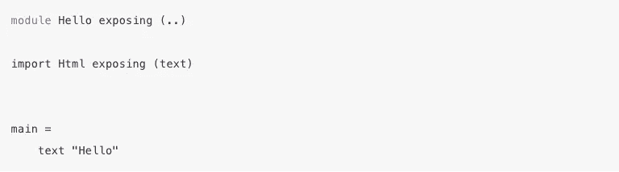
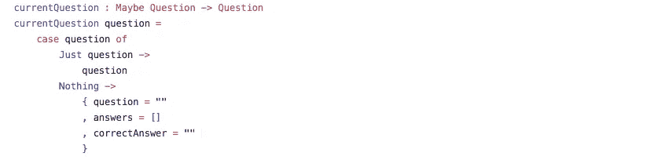
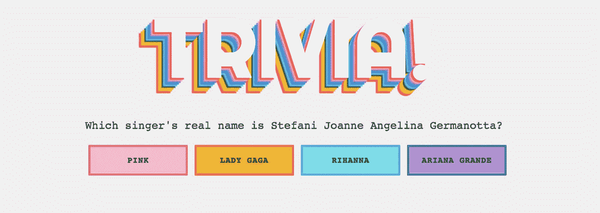

# 榆树倒影

> 原文：<https://medium.com/hackernoon/elm-528b04f6de0c>

两年前，我工作的一家公司要求我学习[Elm](http://elm-lang.org/)——一种函数式前端编程语言。我发现语法很奇怪，函数式编程范式很难。我们最终转向了其他前端框架，并且最终几乎忘记了 Elm。

我最近教了一堂关于 Redux 的课，学生们问了我一些关于 Elm 的问题。这促使我思考 Elm，看看现在，在我的编程生涯的两年后，这些部分是否会到位，我是否能弄清楚。

# 学习过程

我决定从文档开始。Elm 以其文档而闻名，许多具有较高准入门槛的技术不得不如此，以便人们使用他们的工具。我从零开始学习他们网站上的教程，并很快学习了这门语言的更多标准部分。有一些有趣的语法选择——比如改变记录属性的管道。我还发现有趣的是，他们的标准集合是一个链表而不是数组。用前端语言多少有点道理；然而，这让我的最终项目变得更加棘手！

Elm Hello World

从那以后，我开始学习教程的“榆树架构”部分。在这一部分，我感觉它从 0 到 100 跳得非常快。我确实有点迷路了。不过，总的来说，模型、更新、视图和订阅的设计模式是有意义的。我喜欢知道所有东西在哪里的能力。

在整个学习过程中，我不断地回到 elm-architecture-tutorial 中的示例代码。

 [## evancz/elm-建筑-教程

### elm-架构-教程-如何创建模块化的 Elm 代码，使其能够很好地与您的应用程序相适应

github.com](https://github.com/evancz/elm-architecture-tutorial/blob/master/examples/01-button.elm) 

其他真正好的特性包括错误消息和时间旅行。在 Elm 的编译过程中，它确保不会有任何运行时错误。这个过程意味着在你的代码运行之前，你有非常好的，清晰的错误信息。我还非常喜欢“时间旅行”功能，在这里你可以看到你的应用程序在不同时间点的状态。开发体验的这些部分非常棒，我可以理解为什么其他工具(比如 Redux)基于这些想法。

在浏览完教程的“Elm 架构”部分后，我能够一步一步地浏览代码，但是我仍然很难从头开始编写自己的 Elm 代码。我最后查看了我在 Github 上找到的一些其他项目，如 [Flatris](https://github.com/w0rm/elm-flatris) 和 [Elm Hanoi](https://github.com/dstoeckel/hanoi/blob/master/Hanoi.elm) 。从那里我找到了 [Tensor Programming 的](https://www.youtube.com/watch?v=Rf2CkojtxFw) Elm 教程，它最终帮了我大忙。我真的很喜欢跟随式的学习方式，所以这个教程真的很有帮助。

# 最终项目

我最初想在 Elm 中建造河内塔，因为这是一个非常容易编写的 JavaScript 游戏；然而，我发现它仍然有点超出了我在榆树联盟。相反，我缩小了规模，写了一个琐事应用程序，这仍然很棘手。

我最终使用了 [create-elm-app](https://github.com/halfzebra/create-elm-app) ，它与 create-react-app 非常相似。这对开发和部署都非常有帮助。在我的代码中仍然有一些事情需要解决。首先是链表和数组的问题。我最终使用链表并遍历它来检索不同的问题。在其他语言中，我会保存一个索引值，并使用它从一个问题转移到另一个问题。在 Elm 中，程序的架构有点不同。

我也发现和“可能”打交道很困难。Maybes 是 Elm 中的一种数据类型，类似于字符串、整数或列表，可以是“Nothing”(类似于其他语言中的 null 或 None)或有值。为了使用这个值，如果它存在，你必须把它从可能中去掉。从严格类型的角度和功能的角度来看，这是有意义的，但它使代码有些笨拙。

Example Maybe Handling

最终，我开发了一个 MVP 琐事应用程序，它可以提问，让用户点击有不同答案的按钮，然后记录有多少问题被正确回答。部署应用程序非常简单——我只需运行`elm-make`并将构建子目录推到我的远程存储库的 gh-pages 分支。这里的代码是[这里是](https://github.com/aspittel/elm-trivia-app/tree/master/src)app 部署是[这里是](https://aspittel.github.io/elm-trivia-app/)。

# 接下来是什么

事实证明，在过去的几年里，Elm 并没有变得更容易——Elm 仍然是一种完全不同的思维方式。即使我制作了一个 MVP，要达到这个目标也比用我更熟悉的语言来开发要困难 100 倍。设计模式仍然很难，处理数据似乎比它应该的要困难得多。我仍然不会选择使用 Elm，尽管我确实看到了它的一些好处——比如静态类型和棘手的错误捕获。如果我在前端使用函数式编程，我会更愿意使用 React 和 Redux，因为它们仍然是 JavaScript。总的来说，我认为 Elm 是一个好主意，但是一些语法和实现仍然有点困难。