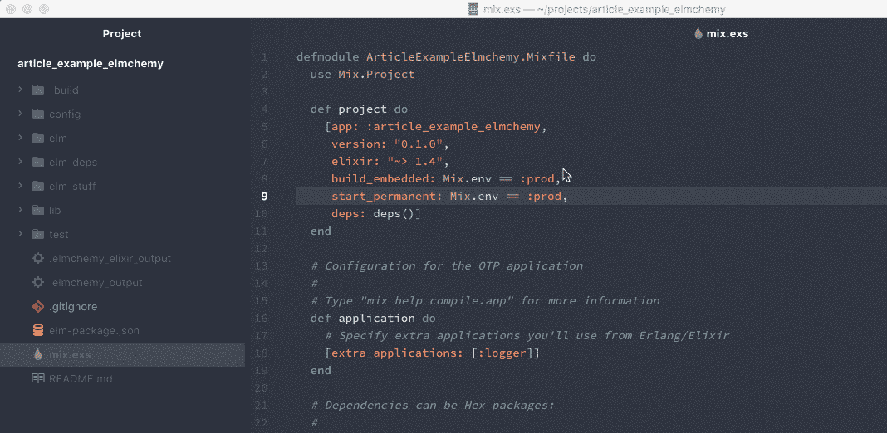
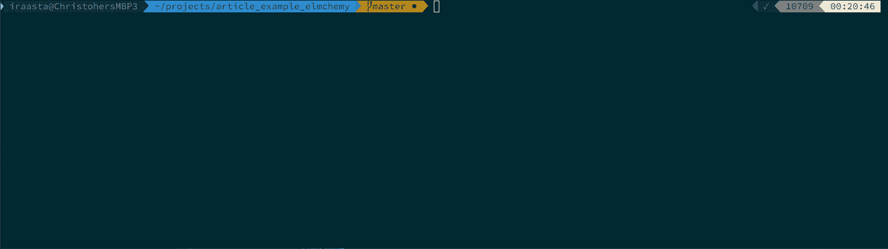
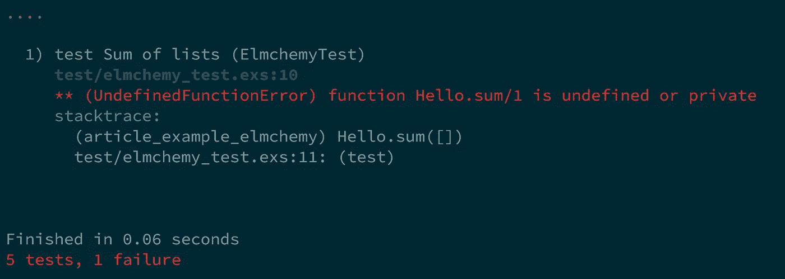
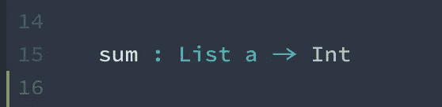
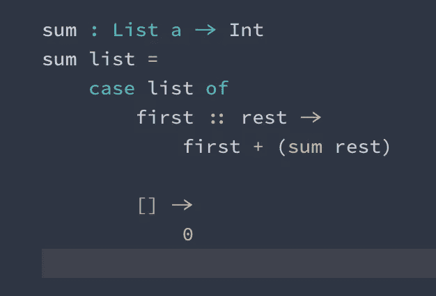
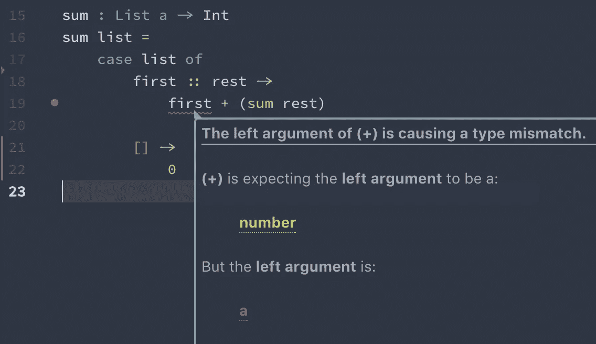
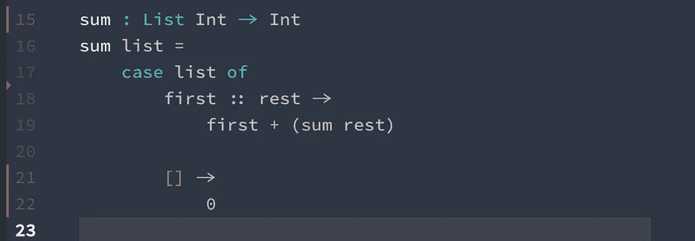
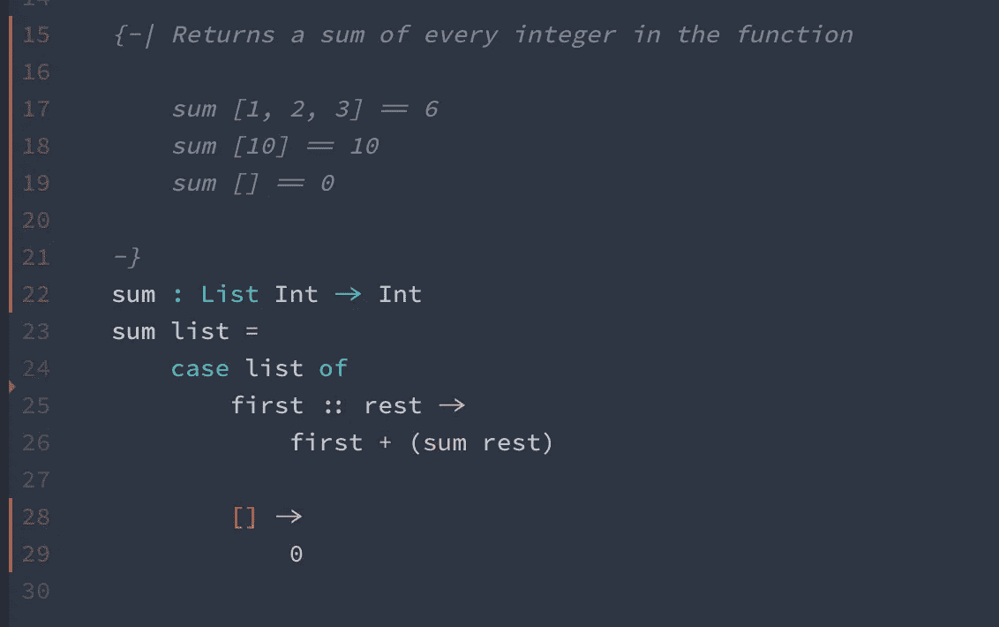
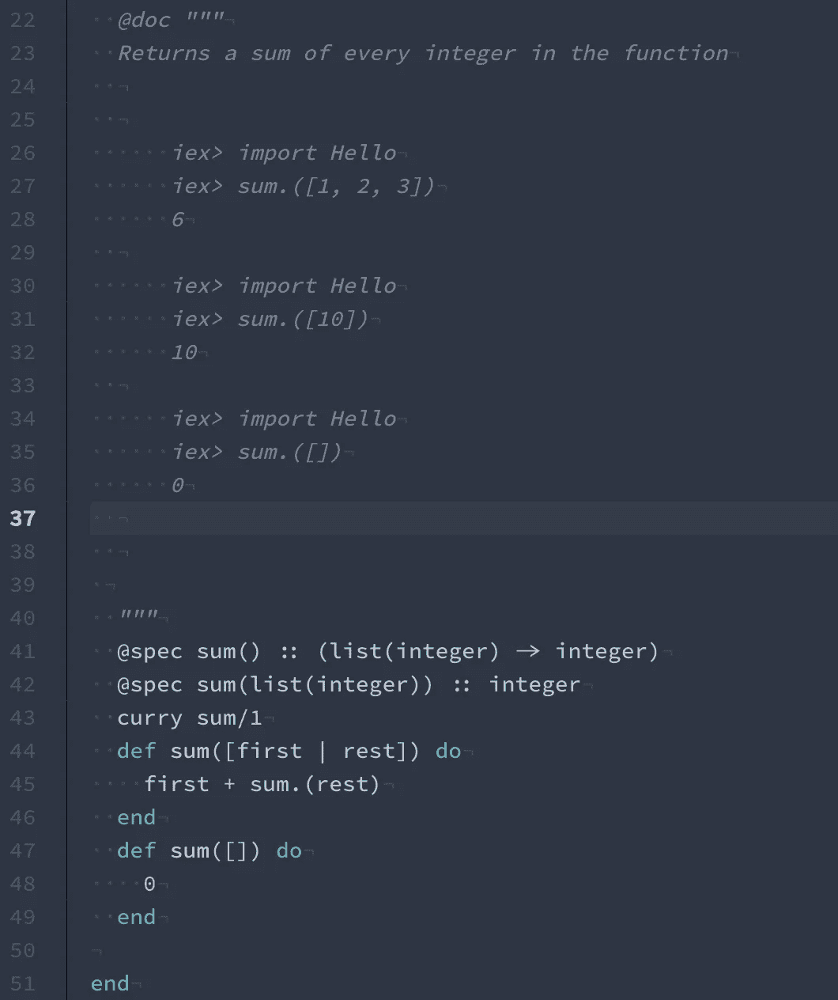

# Elchemy —使用 Elm 语法编写类型安全的 Elixir 代码—第 1 部分—简介

> 原文：<https://medium.com/hackernoon/elmchemy-write-type-safe-elixir-code-with-elms-syntax-part-1-introduction-8968b76d721d>

# 几句开场白

我们都爱长生不老药。它富于表现力，可读性极强，而且最重要的是，它运行在 BEAM 上，这是一个不可思议的虚拟机，它将并发性变成了 Java 7 中的 NullPointerExceptions 那样自然和可预期的东西。

但是正如每一种语言一样，它也有缺陷。有些是与生俱来的，有些只是必须以某种方式做出的宗教选择；随着用户(或者说粉丝)基数的增长，表达自己喜好的需求也在增长。可以用简单的宏来引入像管道到最后一个参数而不是第一个参数这样的变化。一些渴望更先进的意识形态的人创造了扩展语言的完整工具集(像[面向铁路的编程](http://www.zohaib.me/railway-programming-pattern-in-elixir/)或[SAA juri 的 Exactor](https://github.com/sasa1977/exactor) )。其他一些人致力于开始看起来像 DSL 的整个框架([巫术](https://github.com/expede/witchcraft/))。
但即使是最聪明的宏，如果不超越元程序员最大的限制:语法，也不能解决一切。这就是我们所改变的。

可以说，最响亮的宗教选择之一是打字。像“坚强的打字是为意志薄弱的人准备的”和“如果你打中了自己的脚，小心不要把枪对准你的脚比让枪不指向下更容易解决问题”这样的私人笑话在社区里游荡。类型是否热门，超出了本文的范围。我喜欢强壮的类型。我喜欢长生不老药。
这也是 **Elchemy** 诞生的原因。

# 强打字到底给了我们什么？

一般强打字注意所以不用。
你在函数参数里打错了？
编译器会告诉
你的参数顺序不对。
编译器会告诉
你错误地对待了一列`{:ok, value}`元组，好像它们只是`value`的。

因此，无论您的应用程序在复杂的嵌套结构上工作，您喜欢额外的安全性，或者您只是注意力持续时间短，静态类型都可能很好地为您服务。

# 埃尔克米来救援了！

考虑到所有这些价值，我们得出了 **Elchemy:**

[](https://github.com/wende/elmchemy) [## 文德/埃尔克米

### elchemy——使用 Elm 启发的语法编写药剂代码(elm-make compatible)

github.com](https://github.com/wende/elmchemy) 

没有进一步和不必要的描述。埃尔克米完全是为了把这个:

变成这样:

有用吗？[自己检查。](https://wende.github.io/elchemy/stable/)

> “但是等等。我刚刚打字了
> 
> a : String
> a = 1
> 
> 它完全通过了。整个类型的安全性在哪里呢？你真差劲！"

别担心。类型安全在那里。只是不在浏览器中，而是安全地生活在整个工具包的深处，将 Elchemy 与您现有的 Elixir 项目集成。

为了证明和学习它的基础知识，下面我们将从头开始编写一个简单的示例程序。

我们没有任何项目，因此我们将开始一个新项目:

```
$ mix new article_example_elchemy
$ cd article_example_elchemy
```

现在我们还需要安装 Elchemy 并在我们的项目
中初始化它，所以让我们这样做并尝试我们的类型安全做得如何。

```
$ npm install -g elchemy
$ elchemy init
```

终端回复我们:

```
Elchemy initialised. Make sure to add:compilers: [:elchemy, :yecc, :leex, :erlang, :elixir, :app],
 elixirc_paths: ["lib", "elm-deps"],
 elchemy_path: "elm",to your mix.exs file
Then run mix test to check if everything went fine
```

所以我打开了我选择的编辑器

```
$ atom mix.exs
```

并添加缺失的行



太好了！我们准备好了。让我们键入`mix test`以确保我们都准备好了。

我们应该会看到大量的日志和警告。但是不要担心——只要测试通过，一切都很好！



检查。所以现在让我们打开`elm/Hello.elm`并实现我们的第一个例子。

**如果你的编辑器中没有任何 Elm 语言插件/扩展/层，你应该现在就安装一个**

我们将实现一个功能性的[编程](https://hackernoon.com/tagged/programming)‘hello world’——一个列表的总和！
由于大多数编辑器都是基于 git 存储库文件来组织文件的——作为最低设置，让我们首先进行一次初始提交。

```
git init && git add . && git commit -am "init"
```

我们走吧！

好的。因此，随着我们成为成熟的开发人员，我们将开始为我们的[未来](https://hackernoon.com/tagged/future)代码开发单元测试套件。让我们写一个简单的测试用例，确保我们的整数和是它想要的。

**如果你还不熟悉 ExUnit 测试的语法，你可能应该读读* [*这篇文章*](https://elixirschool.com/lessons/basics/testing/) *而不是**

在你的项目中，打开`test/elchemy_test.exs`并粘贴这段代码

再次运行`mix test`，我们应该会看到这个结果:



太好了！

回到`elm/Hello.elm`，让我们实现求和函数。

我们将从类型签名开始。我们的`sum`函数显然接受一个列表并返回一个总和。大概是整数。所以我们来打字吧！



The type signature for our new sum function

好的。现在是我们实施的时候了。



传统上，我们将把一个 sum 写成一个递归，其中我们取一个列表的头部，并把它加到尾部的同一个函数的应用中，如果列表为空，则只返回`0`。应该是这样的

保存我们的文件并…等一下。有一个错误。



哦…没错！既然我们不再处于动态类型的世界，我们就不能把任何两个东西加在一起。加法是只用于数字的运算符。这意味着我们的类型签名不正确。
让我们改为`sum : List Int -> Int`来解决这个问题



完美！
让我们再次运行我们的测试用例，看看效果如何


好吧！我们有了第一个函数程序。现在让我们给它添加一些铃铛和哨子。我们将从移除刚刚编写的测试开始。对于一个简单的 sum 函数，我们不需要整个测试用例。让我们把它变成一个 doctest！

删除测试用例，为我们新诞生的函数写一个漂亮的文档。
和在 Elm 中一样，我们使用`{-| -}`注释块编写一个 docstring。所以让我们就这么做吧



那应该刚刚好。让我们再次运行我们的`mix test`。

如果我们删除了之前的测试用例，我们现在应该有来自测试套件的
`7 tests 0 failures`报告；我们的每一个 doctest 行都是一个单独的测试用例。

# 但是我们到底写了什么？

虽然 Elchemy 代码本身就足够了，并且不需要查看生成的输出，但是进行健全性检查是很好的，这样我们就知道编写的代码对我们代码库的其余部分做了什么。

为此，我们可以在输出`lib/`文件夹中查看生成的`Main.ex`文件。



这是与我们刚刚写的内容相关的部分。

我们来分解一下。

在 **#23** 中，我们从一个`@doc`字符串开始，它作为我们函数的文档。
然后在**# 26–36**之间，我们生成了三个 Elixir doctest 格式的示例。
在**第 41 行**我们可以看到我们函数的一个简化版本的 typespec 签名——这就是从 Elchemy 内部调用我们函数的方式。
**第 42 行**是一个常规的类型规范，只为 Elchemy 之外的函数使用而生成—直接来自于灵丹妙药代码
**第 43 行**是一点 Elchemy 的魔法，它使我们的函数可以以可定制的形式访问
**第**行**# 44–49**正是我们手动编写函数时所做的，除了`sum.(rest)`中的一个神秘点之外，这个点现在还无法解释。一般来说，这是因为在埃尔克米，一切都是咖喱。

第一部分到此为止。
在下一部分，我们将学习如何创建一个完整的库，使用 [elchemy-core 的
模块，](http://package.elm-lang.org/packages/wende/elmchemy-core/latest)定义你自己的类型、类型别名和操作符。

|更新名称已从 Elmchemy 更改为 elm chemy

## [转到第二部分](/@krzysztof.wende/elmchemy-write-type-safe-elixir-code-with-elms-syntax-part-2-our-own-rpg-character-module-cedbf7da138d)

[](http://bit.ly/HackernoonFB)[](https://goo.gl/k7XYbx)[](https://goo.gl/4ofytp)

> [黑客中午](http://bit.ly/Hackernoon)是黑客如何开始他们的下午。我们是 [@AMI](http://bit.ly/atAMIatAMI) 家庭的一员。我们现在[接受投稿](http://bit.ly/hackernoonsubmission)并乐意[讨论广告&赞助](mailto:partners@amipublications.com)机会。
> 
> 如果你喜欢这个故事，我们推荐你阅读我们的[最新科技故事](http://bit.ly/hackernoonlatestt)和[趋势科技故事](https://hackernoon.com/trending)。直到下一次，不要把世界的现实想当然！

